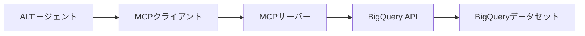

## 概要

Model Context Protocol（MCP）は、AIエージェントが外部システムと安全に対話するための標準化されたプロトコルです。本記事では、BigQueryと連携するMCPサーバーを構築し、特定のプレフィックスを持つデータセットのみをフィルタリングする実装方法を解説します。

### なぜDatasetプレフィックスフィルタリングが必要なのか

大規模な組織では、BigQueryプロジェクトに数百〜数千のデータセットが存在することがあります。以下のような課題があります：

- <strong>セキュリティ</strong>：AIエージェントに全データセットへのアクセスを許可したくない
- <strong>パフォーマンス</strong>：関連するデータセットのみを表示することで応答速度を向上
- <strong>コンテキスト管理</strong>：特定のプロジェクトやチームに関連するデータセットのみを提供

プレフィックスフィルタリングにより、`prod_`, `dev_`, `analytics_`などの命名規則に基づいて、AIエージェントが操作できるデータセットを制限できます。

## MCPサーバーの基本構造

MCPアーキテクチャは、クライアント・サーバーモデルに基づいています：



### 主要コンポーネント

1. <strong>MCPサーバー</strong>：ツールを公開し、リクエストを処理
2. <strong>ツール定義</strong>：AIエージェントが利用可能な操作を記述
3. <strong>ハンドラー</strong>：実際のビジネスロジックを実装
4. <strong>トランスポート層</strong>：標準入出力（stdio）またはHTTP経由の通信

### MCPプロトコルの基本フロー

````mermaid
sequenceDiagram
    participant Agent as AIエージェント
    participant MCP as MCPサーバー
    participant BQ as BigQuery API

    Agent->>MCP: initialize()
    MCP-->>Agent: capabilities

    Agent->>MCP: tools/list
    MCP-->>Agent: 利用可能なツールリスト

    Agent->>MCP: tools/call(list_datasets)
    MCP->>BQ: listDatasets(prefix: "prod_")
    BQ-->>MCP: フィルタリングされたデータセット
    MCP-->>Agent: 結果を返却
````

## BigQueryクライアント連携

### 認証設定

BigQuery APIを使用するには、Google Cloud認証が必要です：

```typescript
import { BigQuery } from '@google-cloud/bigquery';

// Application Default Credentials (ADC) を使用
const bigquery = new BigQuery({
  projectId: process.env.GCP_PROJECT_ID,
  // keyFilename: 'path/to/service-account-key.json' // 本番環境では推奨されません
});
```

<strong>ベストプラクティス</strong>：

- ローカル開発：`gcloud auth application-default login`を使用
- 本番環境：Workload IdentityまたはService Account Impersonation
- サービスアカウントキーファイルは避ける（セキュリティリスク）

### 基本的なBigQuery操作

```typescript
// データセット一覧取得
async function listAllDatasets(): Promise<string[]> {
  const [datasets] = await bigquery.getDatasets();
  return datasets.map(dataset => dataset.id || '');
}

// テーブルスキーマ取得
async function getTableSchema(
  datasetId: string,
  tableId: string
): Promise<any> {
  const dataset = bigquery.dataset(datasetId);
  const table = dataset.table(tableId);
  const [metadata] = await table.getMetadata();
  return metadata.schema;
}
```

## Datasetプレフィックスフィルタリング実装

### フィルタリングロジック

プレフィックスフィルタリングは、データセット名の先頭部分をマッチングすることで実現します：

```typescript
interface FilterOptions {
  prefixes: string[];  // 許可するプレフィックスのリスト
  caseSensitive?: boolean;  // デフォルト: true
}

function filterDatasetsByPrefix(
  datasets: string[],
  options: FilterOptions
): string[] {
  const { prefixes, caseSensitive = true } = options;

  return datasets.filter(datasetId => {
    const targetId = caseSensitive ? datasetId : datasetId.toLowerCase();

    return prefixes.some(prefix => {
      const targetPrefix = caseSensitive ? prefix : prefix.toLowerCase();
      return targetId.startsWith(targetPrefix);
    });
  });
}

// 使用例
const allDatasets = ['prod_sales', 'prod_inventory', 'dev_test', 'analytics_reports'];
const filtered = filterDatasetsByPrefix(allDatasets, {
  prefixes: ['prod_', 'analytics_'],
  caseSensitive: true
});
// 結果: ['prod_sales', 'prod_inventory', 'analytics_reports']
```

### 環境変数による設定

プレフィックスを環境変数で管理することで、柔軟な設定が可能です：

```typescript
// .env ファイル
// DATASET_PREFIXES=prod_,analytics_,staging_

const allowedPrefixes = process.env.DATASET_PREFIXES?.split(',') || [];

async function getFilteredDatasets(): Promise<string[]> {
  const [datasets] = await bigquery.getDatasets();
  const datasetIds = datasets.map(d => d.id || '');

  if (allowedPrefixes.length === 0) {
    return datasetIds;  // フィルタリングなし
  }

  return filterDatasetsByPrefix(datasetIds, {
    prefixes: allowedPrefixes
  });
}
```

## MCPツール設計

MCPサーバーでは、以下の4つの主要ツールを定義します：

### 1. list_datasets

プレフィックスでフィルタリングされたデータセット一覧を取得：

```typescript
{
  name: "list_datasets",
  description: "指定されたプレフィックスに一致するBigQueryデータセットを一覧表示します",
  inputSchema: {
    type: "object",
    properties: {
      prefix: {
        type: "string",
        description: "データセット名のプレフィックス（オプション）。指定すると、さらに絞り込みが可能"
      }
    }
  }
}
```

### 2. get_schema

テーブルのスキーマ情報を取得：

```typescript
{
  name: "get_schema",
  description: "指定されたテーブルのスキーマ情報（カラム名、型、説明）を取得します",
  inputSchema: {
    type: "object",
    properties: {
      dataset: {
        type: "string",
        description: "データセットID"
      },
      table: {
        type: "string",
        description: "テーブルID"
      }
    },
    required: ["dataset", "table"]
  }
}
```

### 3. list_tables

データセット内のテーブル一覧を取得：

```typescript
{
  name: "list_tables",
  description: "指定されたデータセット内の全テーブルを一覧表示します",
  inputSchema: {
    type: "object",
    properties: {
      dataset: {
        type: "string",
        description: "データセットID"
      }
    },
    required: ["dataset"]
  }
}
```

### 4. execute_query

SQLクエリを実行（読み取り専用）：

```typescript
{
  name: "execute_query",
  description: "BigQueryでSELECTクエリを実行します（読み取り専用、最大1000行）",
  inputSchema: {
    type: "object",
    properties: {
      query: {
        type: "string",
        description: "実行するSQLクエリ（SELECT文のみ）"
      },
      maxResults: {
        type: "number",
        description: "返却する最大行数（デフォルト: 100、最大: 1000）",
        default: 100
      }
    },
    required: ["query"]
  }
}
```

## 実践実装

### プロジェクト構成

```bash
bigquery-mcp-server/
├── src/
│   ├── index.ts          # メインサーバーエントリーポイント
│   ├── tools.ts          # ツール定義
│   ├── handlers.ts       # ツールハンドラー実装
│   └── bigquery.ts       # BigQueryクライアントラッパー
├── package.json
├── tsconfig.json
└── .env.example
```

### メインサーバー実装

```typescript
// src/index.ts
import { Server } from "@modelcontextprotocol/sdk/server/index.js";
import { StdioServerTransport } from "@modelcontextprotocol/sdk/server/stdio.js";
import {
  CallToolRequestSchema,
  ListToolsRequestSchema,
} from "@modelcontextprotocol/sdk/types.js";
import { tools } from "./tools.js";
import { handleToolCall } from "./handlers.js";

// MCPサーバーインスタンス作成
const server = new Server(
  {
    name: "bigquery-mcp-server",
    version: "1.0.0",
  },
  {
    capabilities: {
      tools: {},  // ツール機能を有効化
    },
  }
);

// ツール一覧リクエストのハンドラー
server.setRequestHandler(ListToolsRequestSchema, async () => {
  return {
    tools: tools,
  };
});

// ツール呼び出しリクエストのハンドラー
server.setRequestHandler(CallToolRequestSchema, async (request) => {
  try {
    const result = await handleToolCall(request.params.name, request.params.arguments);

    return {
      content: [
        {
          type: "text",
          text: JSON.stringify(result, null, 2),
        },
      ],
    };
  } catch (error) {
    return {
      content: [
        {
          type: "text",
          text: `エラーが発生しました: ${error instanceof Error ? error.message : String(error)}`,
        },
      ],
      isError: true,
    };
  }
});

// サーバー起動
async function main() {
  const transport = new StdioServerTransport();
  await server.connect(transport);
  console.error("BigQuery MCP Server running on stdio");
}

main().catch((error) => {
  console.error("Fatal error:", error);
  process.exit(1);
});
```

### ツールハンドラー実装

```typescript
// src/handlers.ts
import { BigQuery } from '@google-cloud/bigquery';

const bigquery = new BigQuery({
  projectId: process.env.GCP_PROJECT_ID,
});

const ALLOWED_PREFIXES = process.env.DATASET_PREFIXES?.split(',') || [];

export async function handleToolCall(
  toolName: string,
  args: any
): Promise<any> {
  switch (toolName) {
    case "list_datasets":
      return await handleListDatasets(args);
    case "get_schema":
      return await handleGetSchema(args);
    case "list_tables":
      return await handleListTables(args);
    case "execute_query":
      return await handleExecuteQuery(args);
    default:
      throw new Error(`Unknown tool: ${toolName}`);
  }
}

async function handleListDatasets(args: { prefix?: string }): Promise<any> {
  const [datasets] = await bigquery.getDatasets();
  let datasetIds = datasets.map(d => d.id || '');

  // 環境変数によるプレフィックスフィルタリング
  if (ALLOWED_PREFIXES.length > 0) {
    datasetIds = datasetIds.filter(id =>
      ALLOWED_PREFIXES.some(prefix => id.startsWith(prefix))
    );
  }

  // 追加のプレフィックスフィルタリング（オプション）
  if (args.prefix) {
    datasetIds = datasetIds.filter(id => id.startsWith(args.prefix));
  }

  return {
    datasets: datasetIds,
    count: datasetIds.length,
    filteredBy: ALLOWED_PREFIXES.length > 0 ? ALLOWED_PREFIXES : null,
  };
}

async function handleGetSchema(args: {
  dataset: string;
  table: string;
}): Promise<any> {
  // プレフィックスチェック
  if (ALLOWED_PREFIXES.length > 0) {
    const hasValidPrefix = ALLOWED_PREFIXES.some(prefix =>
      args.dataset.startsWith(prefix)
    );

    if (!hasValidPrefix) {
      throw new Error(
        `アクセス拒否: データセット '${args.dataset}' は許可されたプレフィックスに一致しません`
      );
    }
  }

  const dataset = bigquery.dataset(args.dataset);
  const table = dataset.table(args.table);
  const [metadata] = await table.getMetadata();

  return {
    dataset: args.dataset,
    table: args.table,
    schema: metadata.schema,
    numRows: metadata.numRows,
    numBytes: metadata.numBytes,
  };
}

async function handleListTables(args: { dataset: string }): Promise<any> {
  // プレフィックスチェック
  if (ALLOWED_PREFIXES.length > 0) {
    const hasValidPrefix = ALLOWED_PREFIXES.some(prefix =>
      args.dataset.startsWith(prefix)
    );

    if (!hasValidPrefix) {
      throw new Error(
        `アクセス拒否: データセット '${args.dataset}' は許可されたプレフィックスに一致しません`
      );
    }
  }

  const dataset = bigquery.dataset(args.dataset);
  const [tables] = await dataset.getTables();

  return {
    dataset: args.dataset,
    tables: tables.map(t => ({
      id: t.id,
      type: t.metadata?.type || 'TABLE',
    })),
    count: tables.length,
  };
}

async function handleExecuteQuery(args: {
  query: string;
  maxResults?: number;
}): Promise<any> {
  // SELECTクエリのみ許可（セキュリティ）
  const trimmedQuery = args.query.trim().toLowerCase();
  if (!trimmedQuery.startsWith('select')) {
    throw new Error('SELECT文のみ実行可能です');
  }

  const maxResults = Math.min(args.maxResults || 100, 1000);

  const [job] = await bigquery.createQueryJob({
    query: args.query,
    maxResults: maxResults,
  });

  const [rows] = await job.getQueryResults();

  return {
    rows: rows,
    totalRows: rows.length,
    query: args.query,
  };
}
```

### BigQueryクライアントラッパー

```typescript
// src/bigquery.ts
import { BigQuery, Dataset, Table } from '@google-cloud/bigquery';

export class BigQueryClient {
  private client: BigQuery;
  private allowedPrefixes: string[];

  constructor(projectId: string, allowedPrefixes: string[] = []) {
    this.client = new BigQuery({ projectId });
    this.allowedPrefixes = allowedPrefixes;
  }

  /**
   * プレフィックスによるアクセス制御チェック
   */
  private validateDatasetAccess(datasetId: string): void {
    if (this.allowedPrefixes.length === 0) {
      return;  // フィルタリング無効
    }

    const hasValidPrefix = this.allowedPrefixes.some(prefix =>
      datasetId.startsWith(prefix)
    );

    if (!hasValidPrefix) {
      throw new Error(
        `Access denied: Dataset '${datasetId}' does not match allowed prefixes: ${this.allowedPrefixes.join(', ')}`
      );
    }
  }

  /**
   * フィルタリングされたデータセット一覧を取得
   */
  async getFilteredDatasets(additionalPrefix?: string): Promise<Dataset[]> {
    const [datasets] = await this.client.getDatasets();

    return datasets.filter(dataset => {
      const id = dataset.id || '';

      // 基本プレフィックスフィルタリング
      if (this.allowedPrefixes.length > 0) {
        const matchesAllowed = this.allowedPrefixes.some(prefix =>
          id.startsWith(prefix)
        );
        if (!matchesAllowed) return false;
      }

      // 追加プレフィックスフィルタリング
      if (additionalPrefix) {
        return id.startsWith(additionalPrefix);
      }

      return true;
    });
  }

  /**
   * テーブル一覧を取得（アクセス制御付き）
   */
  async getTables(datasetId: string): Promise<Table[]> {
    this.validateDatasetAccess(datasetId);

    const dataset = this.client.dataset(datasetId);
    const [tables] = await dataset.getTables();

    return tables;
  }

  /**
   * テーブルスキーマを取得（アクセス制御付き）
   */
  async getTableMetadata(datasetId: string, tableId: string): Promise<any> {
    this.validateDatasetAccess(datasetId);

    const dataset = this.client.dataset(datasetId);
    const table = dataset.table(tableId);
    const [metadata] = await table.getMetadata();

    return metadata;
  }

  /**
   * クエリを実行（読み取り専用）
   */
  async executeQuery(query: string, maxResults: number = 100): Promise<any[]> {
    // SELECT文のみ許可
    if (!query.trim().toLowerCase().startsWith('select')) {
      throw new Error('Only SELECT queries are allowed');
    }

    const [job] = await this.client.createQueryJob({
      query,
      maxResults: Math.min(maxResults, 1000),
    });

    const [rows] = await job.getQueryResults();
    return rows;
  }
}
```

## セキュリティと最適化

### セキュリティベストプラクティス

#### 1. 読み取り専用アクセス

```typescript
function validateQuerySafety(query: string): void {
  const dangerous = [
    'insert', 'update', 'delete', 'drop', 'create',
    'alter', 'truncate', 'grant', 'revoke'
  ];

  const lowerQuery = query.toLowerCase();

  for (const keyword of dangerous) {
    if (lowerQuery.includes(keyword)) {
      throw new Error(
        `セキュリティ違反: クエリに '${keyword}' が含まれています`
      );
    }
  }
}
```

#### 2. レート制限

```typescript
import rateLimit from 'express-rate-limit';

const queryLimiter = rateLimit({
  windowMs: 60 * 1000,  // 1分
  max: 10,  // 1分あたり最大10クエリ
  message: 'クエリ実行回数が制限を超えました。しばらくお待ちください。',
});
```

#### 3. クエリタイムアウト

```typescript
async function executeQueryWithTimeout(
  query: string,
  timeoutMs: number = 30000
): Promise<any[]> {
  const [job] = await bigquery.createQueryJob({
    query,
    timeoutMs,
  });

  const [rows] = await job.getQueryResults();
  return rows;
}
```

### パフォーマンス最適化

#### 1. データセットリストのキャッシング

```typescript
import NodeCache from 'node-cache';

const cache = new NodeCache({ stdTTL: 300 });  // 5分間キャッシュ

async function getCachedDatasets(): Promise<string[]> {
  const cacheKey = 'filtered_datasets';

  let datasets = cache.get<string[]>(cacheKey);

  if (!datasets) {
    const [rawDatasets] = await bigquery.getDatasets();
    datasets = rawDatasets.map(d => d.id || '');

    // プレフィックスフィルタリング
    if (ALLOWED_PREFIXES.length > 0) {
      datasets = datasets.filter(id =>
        ALLOWED_PREFIXES.some(prefix => id.startsWith(prefix))
      );
    }

    cache.set(cacheKey, datasets);
  }

  return datasets;
}
```

#### 2. 並列処理

```typescript
async function getBatchTableSchemas(
  datasetId: string,
  tableIds: string[]
): Promise<any[]> {
  const promises = tableIds.map(tableId =>
    handleGetSchema({ dataset: datasetId, table: tableId })
  );

  return await Promise.all(promises);
}
```

#### 3. ページネーション

```typescript
async function listTablesWithPagination(
  datasetId: string,
  pageSize: number = 50,
  pageToken?: string
): Promise<{ tables: any[]; nextPageToken?: string }> {
  const dataset = bigquery.dataset(datasetId);

  const [tables, nextQuery] = await dataset.getTables({
    maxResults: pageSize,
    pageToken: pageToken,
  });

  return {
    tables: tables.map(t => ({ id: t.id })),
    nextPageToken: nextQuery?.pageToken,
  };
}
```

### エラーハンドリング

```typescript
class BigQueryMCPError extends Error {
  constructor(
    message: string,
    public code: string,
    public details?: any
  ) {
    super(message);
    this.name = 'BigQueryMCPError';
  }
}

async function safeToolCall<T>(
  fn: () => Promise<T>,
  errorCode: string
): Promise<T> {
  try {
    return await fn();
  } catch (error) {
    if (error instanceof Error) {
      // BigQueryエラーの詳細を抽出
      const bqError = error as any;

      throw new BigQueryMCPError(
        error.message,
        errorCode,
        {
          originalError: bqError.code,
          reason: bqError.errors?.[0]?.reason,
        }
      );
    }

    throw new BigQueryMCPError(
      'Unknown error occurred',
      errorCode
    );
  }
}

// 使用例
const result = await safeToolCall(
  () => handleListDatasets(args),
  'LIST_DATASETS_ERROR'
);
```

## 実行とテスト

### ビルドと実行

```bash
# 依存関係インストール
npm install

# TypeScriptコンパイル
npm run build

# 環境変数設定
export GCP_PROJECT_ID="your-project-id"
export DATASET_PREFIXES="prod_,analytics_"

# サーバー起動
node dist/index.js
```

### MCPクライアント設定

Claude Desktopでの設定例（`claude_desktop_config.json`）：

```json
{
  "mcpServers": {
    "bigquery": {
      "command": "node",
      "args": ["/path/to/bigquery-mcp-server/dist/index.js"],
      "env": {
        "GCP_PROJECT_ID": "your-project-id",
        "DATASET_PREFIXES": "prod_,analytics_",
        "GOOGLE_APPLICATION_CREDENTIALS": "/path/to/service-account-key.json"
      }
    }
  }
}
```

### テストシナリオ

#### 1. データセット一覧取得テスト

```typescript
// テスト: プレフィックスフィルタリング
const result = await handleListDatasets({});
console.log('Filtered datasets:', result.datasets);
// 期待値: ['prod_sales', 'prod_inventory', 'analytics_reports']

// テスト: 追加プレフィックス指定
const result2 = await handleListDatasets({ prefix: 'prod_' });
console.log('Further filtered:', result2.datasets);
// 期待値: ['prod_sales', 'prod_inventory']
```

#### 2. アクセス制御テスト

```typescript
// テスト: 許可されていないデータセットへのアクセス
try {
  await handleGetSchema({
    dataset: 'unauthorized_dataset',
    table: 'some_table'
  });
  console.log('ERROR: Should have thrown access denied');
} catch (error) {
  console.log('Access denied as expected:', error.message);
}
```

#### 3. クエリ実行テスト

```typescript
// テスト: SELECT クエリ
const result = await handleExecuteQuery({
  query: 'SELECT * FROM `prod_sales.transactions` LIMIT 10',
  maxResults: 10
});
console.log(`Returned ${result.totalRows} rows`);

// テスト: 危険なクエリの拒否
try {
  await handleExecuteQuery({
    query: 'DELETE FROM `prod_sales.transactions` WHERE id = 1'
  });
  console.log('ERROR: Should have rejected DELETE query');
} catch (error) {
  console.log('DELETE query rejected as expected');
}
```

### デバッグモード

```typescript
// src/index.ts に追加
const DEBUG = process.env.DEBUG === 'true';

function debugLog(...args: any[]): void {
  if (DEBUG) {
    console.error('[DEBUG]', ...args);
  }
}

// ハンドラーでの使用
debugLog('Filtering datasets with prefixes:', ALLOWED_PREFIXES);
debugLog('Raw dataset count:', rawDatasets.length);
debugLog('Filtered dataset count:', filteredDatasets.length);
```

実行：

```bash
DEBUG=true node dist/index.js
```

## 結論

本記事では、BigQuery用のMCPサーバーを構築し、データセットプレフィックスフィルタリングを実装する方法を解説しました。

### 主要なポイント

1. <strong>セキュリティ</strong>：プレフィックスベースのアクセス制御により、AIエージェントの権限を制限
2. <strong>柔軟性</strong>：環境変数による動的な設定変更が可能
3. <strong>パフォーマンス</strong>：キャッシングと並列処理により高速化
4. <strong>安全性</strong>：読み取り専用クエリの強制とバリデーション

### 今後の拡張案

- <strong>正規表現フィルタリング</strong>：より複雑なパターンマッチング
- <strong>ロールベースアクセス制御（RBAC）</strong>：ユーザーごとの権限管理
- <strong>監査ログ</strong>：全てのクエリ実行を記録
- <strong>コスト追跡</strong>：クエリのコストを計算して返却
- <strong>スキーマキャッシング</strong>：頻繁にアクセスされるスキーマのキャッシュ
- <strong>クエリビルダー</strong>：自然言語からSQLクエリを生成

### ベストプラクティス

1. 環境変数で機密情報を管理
2. Application Default Credentialsを使用
3. 読み取り専用アクセスを徹底
4. 適切なエラーハンドリングとログ記録
5. レート制限とタイムアウトを設定
6. 定期的なセキュリティレビュー

このMCPサーバーにより、AIエージェントが安全かつ効率的にBigQueryデータにアクセスできるようになります。プレフィックスフィルタリングは、大規模な組織でデータガバナンスを維持しながら、AIの力を活用するための重要な機能です。

## 参考資料

- [Model Context Protocol 公式ドキュメント](https://modelcontextprotocol.io/)
- [MCP TypeScript SDK](https://github.com/modelcontextprotocol/typescript-sdk)
- [Google Cloud BigQuery Node.js クライアント](https://googleapis.dev/nodejs/bigquery/latest/)
- [BigQuery API リファレンス](https://cloud.google.com/bigquery/docs/reference/rest)
- [Google Cloud 認証ベストプラクティス](https://cloud.google.com/docs/authentication/best-practices-applications)
- [MCP サーバー実装ガイド](https://modelcontextprotocol.io/docs/server/)
