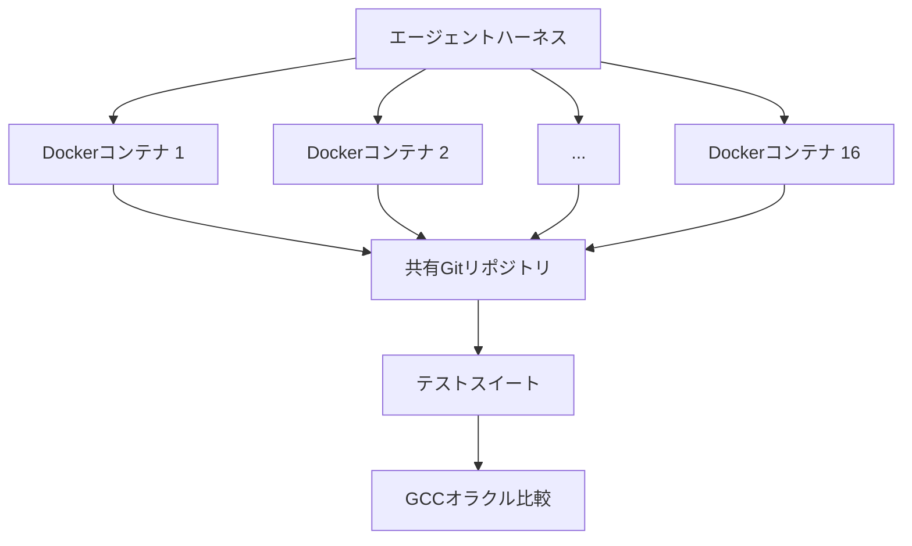
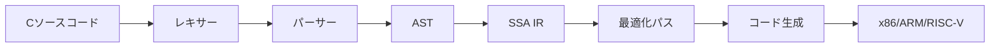

## 概要

Anthropicが2026年2月5日に公開した**CCC（Claude's C Compiler）**は、AIが作ったコンパイラの可能性と限界を同時に示す印象的なプロジェクトです。Claude Opus 4.6が100%コードを生成したRustベースのCコンパイラで、**Linux 6.9カーネルをx86、ARM、RISC-Vでビルド**できます。

2,000回のClaude Codeセッション、$20,000のAPIコスト、10万行のコード — これがAIが「動作するコンパイラ」を作るのに必要だったすべてです。

## CCCとは何か

CCCはAnthropic Safeguardsチームの Nicholas Carliniが設計した**エージェントチーム（Agent Teams）**方式で開発されました。核心アイデアはシンプルです：

> 16個のClaudeインスタンスが共有コードベースで並列作業し、人間の介入なしにコンパイラを完成させる。

### アーキテクチャ



各エージェントは独立したDockerコンテナで実行され、作業の衝突を防ぐために`current_tasks/`ディレクトリに「ロックファイル」を作成します。あるエージェントが`parse_if_statement.txt`をロックすると、他のエージェントは`codegen_function_definition.txt`のような別のタスクを選びます。

### エージェントループ

各エージェントの実行ループは驚くほどシンプルです：

```bash
#!/bin/bash
while true; do
  COMMIT=$(git rev-parse --short=6 HEAD)
  LOGFILE="agent_logs/agent_${COMMIT}.log"
  claude --dangerously-skip-permissions \
    -p "$(cat AGENT_PROMPT.md)" \
    --model claude-opus-X-Y &> "$LOGFILE"
done
```

## CCCの成果

### コンパイル可能なプロジェクト

| プロジェクト | ステータス |
|------------|----------|
| Linux 6.9カーネル（x86, ARM, RISC-V） | ✅ ブート成功 |
| QEMU | ✅ |
| FFmpeg | ✅ |
| SQLite | ✅ |
| PostgreSQL | ✅ |
| Redis | ✅ |
| Doom | ✅ 実行可能 |

### テストスイート結果

- **GCC torture test suite**: 99%パス率
- **主要コンパイラテストスイート**: 99%パス率

## CCC vs GCC — 現実的な比較

GCCは40年以上の歴史を持つプロダクションコンパイラです。CCCとの比較はAIの**現在地**を示しています。

### パフォーマンス

> 「すべての最適化を有効にしても、CCCの出力コードはGCCの最適化無効（-O0）より非効率です。」

これがCCCの最大の弱点です。コンパイラの核心価値である**コード最適化**で、まだGCCに大きく後れを取っています。

### 機能ギャップ

| 機能 | GCC | CCC |
|------|-----|-----|
| 自前のアセンブラ/リンカ | ✅ | ❌（GCCのアセンブラ/リンカを使用） |
| 16ビットx86 | ✅ | ❌（GCCに委任） |
| 全プロジェクトビルド | ✅ | ❌（一部のみ対応） |
| コード最適化 | 数十のパス | 基本的なSSA IR |
| アーキテクチャサポート | 数十 | 3つ（x86, ARM, RISC-V） |

### しかし重要なのは

GCCは数千人の開発者が40年かけて作ったものです。CCCは**AIが2週間で、$20,000で作ったもの**です。

## 80%の品質を爆速で — AIコーディングの本質

CCCプロジェクトの真の意義は「GCCに勝った」ことではありません。以下の事実にあります：

### 1. ゼロから動作するコンパイラへ

人間のコンパイラ開発者なら10万行のRustコンパイラを作るのに**数ヶ月から数年**かかります。AIはこれを2週間で成し遂げました。完璧ではありませんが、**動作します**。

### 2. 並列化の力

16個のエージェントの並列作業は単純な速度向上ではありません。各エージェントが**専門化された役割**を担います：

- 機能実装エージェント
- 重複コード統合エージェント
- コンパイラ性能最適化エージェント
- コード品質改善エージェント
- ドキュメンテーションエージェント

### 3. テスト駆動開発の重要性

このプロジェクトで最も労力がかかったのは**コード作成ではなくテスト環境の設計**でした：

- GCCを「正解オラクル」として使用し出力を比較
- コンテキストウィンドウ汚染防止のための出力最小化
- 時間認識のないAIのための進捗追跡
- 1%/10%ランダムサンプリングによる高速回帰テスト

## 技術的設計ポイント

### クリーンルーム実装

CCCは**インターネットアクセスなし**で開発されました。Rust標準ライブラリのみを使用する完全なクリーンルーム実装です。これはAIが学習済みの知識のみでコンパイラを構築できることを証明しています。

### SSA IRベースの設計



SSA（Static Single Assignment）中間表現を使用して複数の最適化パスをサポートする構造で設計されています。このアーキテクチャ決定は人間が指示しましたが、実装は100% AIです。

### 並列エージェントの限界

Linuxカーネルのコンパイル段階で興味深い問題が発生しました。数百の独立テストとは異なり、カーネルビルドは**一つの巨大なタスク**でした。すべてのエージェントが同じバグにぶつかり、16個のエージェントの利点が消えました。

解決策：GCCをオンラインオラクルとして使用し、**カーネルファイルをランダムに分配**して、各エージェントが異なるファイルのバグを修正するようにしました。

## 今後の展望

### モデル世代別の進化

| モデル | コンパイラ能力 |
|--------|--------------|
| 初期Opus 4.x | 基本的なコンパイラのみ可能 |
| Opus 4.5 | テストスイート通過可能、実プロジェクトビルド不可 |
| Opus 4.6 | Linuxカーネルビルド成功 |

各世代ごとに能力が急激に向上しています。Opus 4.7や5.0ではGCC水準の最適化も可能になるかもしれません。

### 開発者への示唆

1. **テストが核心**: AIエージェントの品質はテスト環境の品質に直結します
2. **アーキテクチャ設計はまだ人間の役割**: SSA IRのような高水準の設計決定は人間が行いました
3. **80%ソリューションの価値**: 完璧でなくても動作する成果物の価値を過小評価しないでください
4. **並列エージェント時代**: 一つのAIではなく、チームとして動作するAIの可能性

## 結論

CCCはGCCの代替品ではありません。それは**AIがソフトウェア開発でどこまで来たかを示すマイルストーン**です。

- 10万行の動作するコンパイラを2週間で生成
- Linuxカーネルをブート可能にビルド
- $20,000のコスト（人間チーム対比ごくわずか）
- GCC水準の最適化にはまだ未達

「80%の品質を爆速で」というAIの特性がコンパイラという極限のソフトウェアプロジェクトでも発揮されました。残りの20%を埋めることは依然として難しいですが、その80%すら以前は不可能だったのです。

## 参考資料

- [Building a C compiler with a team of parallel Claudes — Anthropic Engineering Blog](https://www.anthropic.com/engineering/building-c-compiler)
- [Claude's C Compiler — GitHub](https://github.com/anthropics/claudes-c-compiler)
- [GCC Torture Test Suite](https://gcc.gnu.org/onlinedocs/gccint/Torture-Tests.html)
