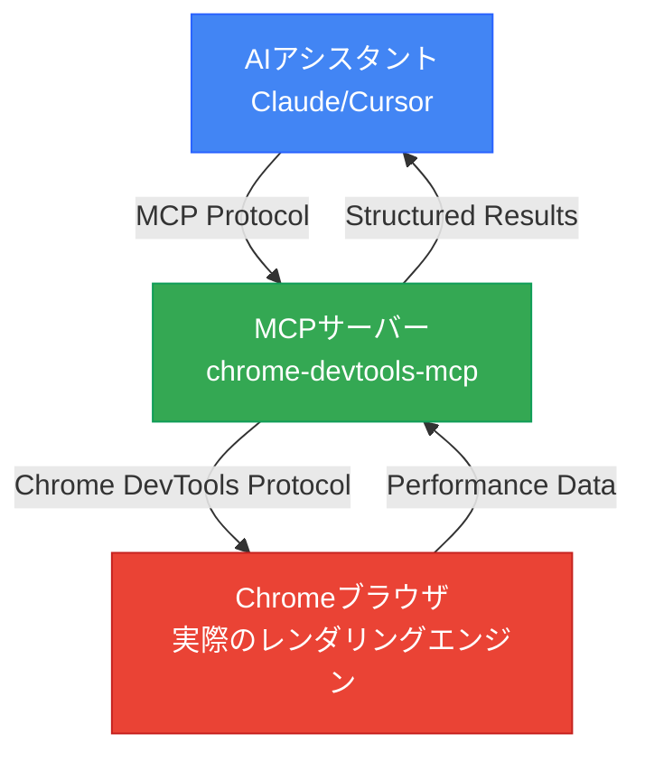

## ウェブパフォーマンス最適化の新しいパラダイム

ウェブパフォーマンスの最適化は常に重要でしたが、一貫して測定し改善することは困難でした。Chrome DevToolsを手動で開いてプロファイリングし、スクリーンショットを撮り、指標を比較する作業は時間がかかり、反復的です。さらに大きな問題は、AIコードジェネレーターが実際のブラウザでどのように動作するか確認できない点でした。

2025年9月22日、Google Chrome DevToolsチームはこの問題を解決する**Chrome DevTools MCP**を公開しました。これにより、Claude、Cursor、CopilotなどのAIアシスタントが実際のChromeブラウザを直接制御し、パフォーマンスを測定し、データに基づいて最適化を検証できるようになりました。

## Chrome DevTools MCPとは?

Chrome DevTools MCPは、AIコーディングアシスタントにChromeブラウザを制御する能力を提供する公式Model Context Protocolサーバーです。簡単に言えば、AIが開発者ツールを直接使用できるようになります。

### 主要機能

- **リアルタイムパフォーマンス測定**: Core Web Vitals (LCP、CLS、INP) の自動測定
- **ネットワークモニタリング**: すべてのHTTPリクエストのタイミング、ヘッダー、ペイロード分析
- **デバイスエミュレーション**: CPUスロットリング、ネットワーク制限でモバイル環境をシミュレート
- **自動化デバッグ**: コンソールメッセージ、エラーログの収集と分析
- **パフォーマンスインサイト**: レンダーブロッキングリソース、長いタスク、レイアウトシフトの自動識別

### 動作原理



AIがリクエスト → MCPサーバーがChrome DevTools Protocolコマンドに変換 → Chromeが実行してデータを返す → AIが分析して提案します。

## インストールと設定

### 1. 前提条件

- Node.js v20.19以上 (v22.12.0推奨)
- Chromeブラウザ (最新安定版)
- Claude DesktopまたはサポートされているAI IDE

### 2. Claude Desktopの設定

`~/Library/Application Support/Claude/claude_desktop_config.json`ファイルを編集します:

```json
{
  "mcpServers": {
    "chrome-devtools": {
      "command": "npx",
      "args": ["-y", "chrome-devtools-mcp@latest"]
    }
  }
}
```

### 3. 高度な設定オプション

```json
{
  "mcpServers": {
    "chrome-devtools": {
      "command": "npx",
      "args": [
        "chrome-devtools-mcp@latest",
        "--headless=true",           // ヘッドレスモード
        "--isolated=true",           // 分離セッション (セキュリティ推奨)
        "--viewport=1920x1080",      // カスタムビューポート
        "--executablePath=/path/to/chrome"  // 特定のChromeバイナリ
      ]
    }
  }
}
```

Claude Desktopを再起動すると設定が適用されます。

## 主要なパフォーマンス最適化ツール

Chrome DevTools MCPは26のツールを提供しますが、パフォーマンス最適化に重要なツールを重点的に見ていきましょう。

### 1. パフォーマンストレーシング

**`performance_start_trace()`**

パフォーマンストレースを開始します。ページロードタイミング、CPU使用量、ネットワークアクティビティ、レンダリング指標をすべてキャプチャします。

```typescript
// AIへのリクエスト例
"localhost:4321でパフォーマンストレースを記録して。ページをリロードして自動停止して。"

// MCP実行:
performance_start_trace(reload=true, autoStop=true)
```

**`performance_stop_trace()`**

トレースを停止し、包括的なパフォーマンスインサイトを返します:

- **Core Web Vitals**: LCP、CLS、INP、TBT、TTFB
- **最も長いメインスレッドタスク**
- **レンダーブロッキングリソース**
- **JavaScript実行タイミング**
- **ネットワークウォーターフォール分析**

**`performance_analyze_insight(insightName)`**

特定のパフォーマンス問題の詳細分析を提供します。

```typescript
// レンダーブロッキングリソースの詳細分析
performance_analyze_insight("RenderBlocking")

// 返される例:
// - /main.css: 200msブロッキング
// - /analytics.js: 150msブロッキング
// 推奨: preloadまたはdefer適用
```

### 2. Core Web Vitals自動測定

Chrome DevTools MCPはすべてのCore Web Vitalsを自動測定します:

- **LCP (Largest Contentful Paint)**: 2.5秒以下 = Good
- **CLS (Cumulative Layout Shift)**: 0.1以下 = Good
- **INP (Interaction to Next Paint)**: 200ms以下 = Good
- **TBT (Total Blocking Time)**: 300ms以下 = Good
- **TTFB (Time to First Byte)**: 600ms以下 = Good

AIはこれらの指標を分析し、どれが閾値を超えているかすぐに教えてくれます。

### 3. デバイスエミュレーション

**CPUスロットリング**

```typescript
// 4倍遅いCPUをシミュレート (ローエンドモバイル)
emulate_cpu(4)

// パフォーマンス再測定
performance_start_trace(reload=true)
```

**ネットワークスロットリング**

```typescript
// Slow 4Gネットワークをシミュレート
emulate_network("Slow 4G")

// オプション: "Slow 3G", "Fast 3G", "Slow 4G", "Fast 4G", "No emulation"
```

### 4. ネットワークリクエストモニタリング

**全リクエスト取得**

```typescript
list_network_requests(
  pageSize=50,
  resourceTypes=["script", "stylesheet", "image"]
)

// 返される:
// - URL、HTTPメソッド、ステータスコード
// - リクエスト/レスポンスヘッダー
// - タイミング (DNS、接続、TTFB)
// - ファイルサイズと圧縮状況
```

**特定リクエストの詳細取得**

```typescript
get_network_request("https://example.com/main.js")

// 返される:
// - 完全なリクエスト/レスポンスボディ
// - パフォーマンスタイミング詳細
// - キャッシング情報
```

## 実践ワークフロー: パフォーマンス最適化の自動化

実際にChrome DevTools MCPを使用してウェブサイトのパフォーマンスを最適化する完全なワークフローを見ていきましょう。

### Step 1: ベースライン測定

```
Claudeへのリクエスト:
"私のブログlocalhost:4321のパフォーマンスを測定してCore Web Vitalsを教えて"

AI実行:
1. navigate_page("http://localhost:4321")
2. performance_start_trace(reload=true, autoStop=true)
3. [自動でページロードと測定完了]

AI応答:
"パフォーマンス測定完了:
- LCP: 3.2秒 (Poor - 2.5秒超過)
- CLS: 0.05 (Good)
- TBT: 450ms (Poor - 300ms超過)
- TTFB: 120ms (Good)

主な問題:
1. LCPが遅い: 最大の画像 (hero.jpg, 1.2MB) の最適化が必要
2. TBTが高い: main.js (350KB) のパースに400ms要する"
```

### Step 2: ボトルネック分析

```
Claudeへのリクエスト:
"レンダーブロッキングリソースを見つけて"

AI実行:
performance_analyze_insight("RenderBlocking")

AI応答:
"レンダーブロッキングリソース:
1. /styles/main.css (200msブロッキング)
   - 28KB、圧縮なし
   - 推奨: Critical CSSインライン + 残り非同期ロード

2. /scripts/analytics.js (150msブロッキング)
   - headで同期ロード
   - 推奨: deferまたはasync属性追加

3. Google Fonts (100msブロッキング)
   - 推奨: font-display: swap + preconnect"
```

### Step 3: 最適化適用

画像最適化:

```bash
# WebP変換とリサイズ
npm install sharp
node optimize-images.js
```

JavaScript最適化:

```html
<!-- 変更前 -->
<script src="/scripts/analytics.js"></script>

<!-- 変更後 -->
<script src="/scripts/analytics.js" defer></script>
```

CSS最適化:

```html
<head>
  <!-- Critical CSSインライン -->
  <style>
    /* Above-the-foldスタイルのみ -->
  </style>

  <!-- 残りのCSSは非同期ロード -->
  <link rel="preload" href="/styles/main.css" as="style"
        onload="this.onload=null;this.rel='stylesheet'">
</head>
```

### Step 4: 再測定と検証

```
Claudeへのリクエスト:
"再度パフォーマンス測定して前回と比較して"

AI応答:
"パフォーマンス測定完了。比較結果:

Before → After:
- LCP: 3.2秒 → 1.8秒 (44%改善 ✓)
- CLS: 0.05 → 0.05 (変化なし)
- TBT: 450ms → 180ms (60%改善 ✓)
- TTFB: 120ms → 115ms

すべてのCore Web Vitalsが'Good'範囲に入りました!

追加改善案:
- 画像preloadでLCPを1.5秒まで短縮可能
- Font preconnectで追加50ms節約可能"
```

## 高度な活用事例

### 1. パフォーマンスリグレッション自動検出

CI/CDパイプラインでパフォーマンス劣化を自動検出できます。

```typescript
// デプロイ前自動テスト
async function performanceCheck() {
  // 1. 現在のプロダクションパフォーマンス測定
  const prodMetrics = await measurePerformance("https://example.com");

  // 2. ステージング環境パフォーマンス測定
  const stagingMetrics = await measurePerformance("https://staging.example.com");

  // 3. 比較と警告
  if (stagingMetrics.LCP > prodMetrics.LCP * 1.1) {
    throw new Error(`LCPリグレッション検出: ${prodMetrics.LCP}ms → ${stagingMetrics.LCP}ms`);
  }
}
```

Claudeにリクエストするだけで上記ロジックを自動実行し、結果を報告します。

### 2. クロスデバイスパフォーマンステスト

```
Claudeへのリクエスト:
"私のサイトをデスクトップとモバイルでそれぞれテストして比較して"

AI実行:
1. [デスクトップテスト]
   - スロットリングなし
   - 結果: LCP 1.8秒、TBT 200ms

2. [モバイルテスト]
   - emulate_cpu(4)
   - emulate_network("Slow 4G")
   - 結果: LCP 5.2秒、TBT 1200ms

AI応答:
"モバイル環境で深刻なパフォーマンス低下を発見:
- LCPが3.4秒遅い (画像最適化不足)
- TBTが1000ms増加 (JavaScript過多)

モバイル最適化優先順位:
1. レスポンシブ画像srcset追加
2. JavaScriptコード分割
3. サードパーティスクリプトlazy load"
```

### 3. プロダクション問題のデバッグ

実際のユーザーが報告したパフォーマンス問題を再現し診断できます。

```
ユーザー報告: "モバイルでページが遅すぎます"

Claudeへのリクエスト:
"https://example.comをモバイル環境でプロファイリングして
遅い原因を見つけて"

AI実行:
1. emulate_cpu(4) + emulate_network("Slow 4G")
2. navigate_page("https://example.com")
3. performance_start_trace(reload=true)
4. list_console_messages() (エラー確認)
5. list_network_requests() (ネットワーク分析)

AI応答:
"問題発見:
1. サードパーティ広告スクリプトが2秒ブロッキング (TBT主犯)
2. WebPなし高解像度画像 (LCP主犯)
3. コンソールに404エラー3件 (不要なリクエスト)

解決方法:
1. 広告スクリプトasyncロード
2. 画像WebP変換 + srcset
3. 404リソース削除またはパス修正"
```

## ベストプラクティスとヒント

### 反復的最適化ワークフロー

```
1. BASELINE
   - 初期パフォーマンス測定
   - Core Web Vitals文書化
   - 上位3つのボトルネック識別

2. PRIORITIZE
   - 閾値失敗した指標優先
   - LCP > 2.5秒 = 優先度1
   - TBT > 300ms = 優先度2
   - CLS > 0.1 = 優先度3

3. OPTIMIZE
   - インサイトベースのターゲット修正
   - 一度に一つずつ (明確な原因分析)

4. VALIDATE
   - パフォーマンス再測定
   - Before/After比較
   - 他の指標のリグレッション確認

5. ITERATE
   - 次のボトルネックへ移動
   - すべての指標が"Good"になるまで繰り返し
```

### セキュリティ考慮事項

- **分離セッション使用**: `--isolated=true`オプションで一時ブラウザセッション使用
- **機密データ注意**: 個人情報があるブラウザプロファイルで使用禁止
- **プロダクションテスト**: アクセス制御実装、読み取り専用モード推奨
- **AI生成スクリプト確認**: 実行前に必ず確認

### 他のMCPとの組み合わせ

Chrome DevTools MCPは他のMCPサーバーと一緒に使うとさらに強力です:

```
パフォーマンス問題発見 (Chrome DevTools MCP)
  → 解決方法リサーチ (Brave Search MCP)
  → 公式ドキュメント確認 (Context7 MCP)
  → コード修正と再測定 (Chrome DevTools MCP)
```

## 実際の成果事例

仮想の事例ですが現実的なシナリオです:

### Before: 手動最適化 (従来の方法)

- 所要時間: 4時間/日
- プロセス:
  1. Chrome DevTools手動実行 (30分)
  2. スクリーンショットと指標記録 (20分)
  3. 問題点をGoogleで検索 (1時間)
  4. コード修正 (1時間)
  5. 再測定と比較 (30分)
  6. 文書化 (40分)

### After: Chrome DevTools MCP活用

- 所要時間: 1時間
- プロセス:
  ```
  "私のサイトのパフォーマンスを最適化して。
   現在の状態を測定して、問題点を見つけて、解決方法を提案して。
   修正後に再測定して比較して。"
  ```
- AIがすべてのステップを自動化
- 結果:
  - LCP: 3.8秒 → 1.9秒 (50%改善)
  - Lighthouse Score: 62 → 94

**時間節約: 75%**

## 今後の展望

Chrome DevTools MCPはウェブ開発ワークフローを根本的に変化させています:

### AIを能動的な開発パートナーに

過去: AIがコード生成 → 開発者が手動テスト
現在: AIがコード生成 → AIが直接ブラウザでテスト → AIが結果分析 → 反復

### 予測可能な発展方向

1. **予測的最適化**: AIがパフォーマンス低下を事前に予測して防止
2. **自動修正**: 簡単なパフォーマンス問題はAIが直接修正 (承認後)
3. **継続的モニタリング**: プロダクション環境でリアルタイムパフォーマンス追跡
4. **パフォーマンスバジェット自動化**: 閾値設定すればCI/CDで自動検証

## 始めてみましょう

Chrome DevTools MCPはウェブパフォーマンス最適化を推測からデータ駆動の科学に転換します。

### 最初のステップ

1. **インストール**: `npx chrome-devtools-mcp@latest`
2. **Claude Desktop設定**: MCPサーバー追加
3. **初回測定**: "私のサイトのパフォーマンスを測定して"
4. **最適化開始**: AIの提案を一つずつ適用
5. **結果検証**: 改善をデータで確認

パフォーマンス最適化はもはや時間のかかる手作業ではありません。AIと一緒なら、速く、正確で、再現可能なプロセスになります。

## 参考資料

- [Chrome DevTools MCP GitHub](https://github.com/ChromeDevTools/chrome-devtools-mcp)
- [Chrome DevTools Protocolドキュメント](https://chromedevtools.github.io/devtools-protocol/)
- [Model Context Protocolスペック](https://modelcontextprotocol.io/)
- [Web.dev Core Web Vitalsガイド](https://web.dev/vitals/)
- [Vladimir Siedykhの完全ガイド](https://vladimirsiedykh.com/blog/chrome-devtools-mcp-ai-browser-debugging-complete-guide-2025)

---

今すぐあなたのウェブサイトのパフォーマンス最適化をAIに任せてみてください。データに語らせ、AIに分析させ、あなたはより重要な問題に集中してください。
