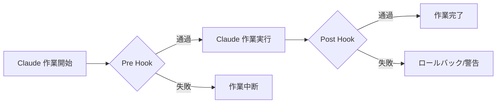
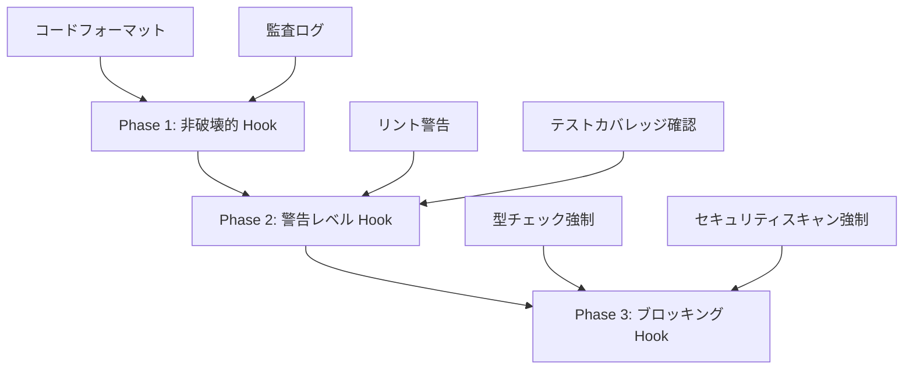
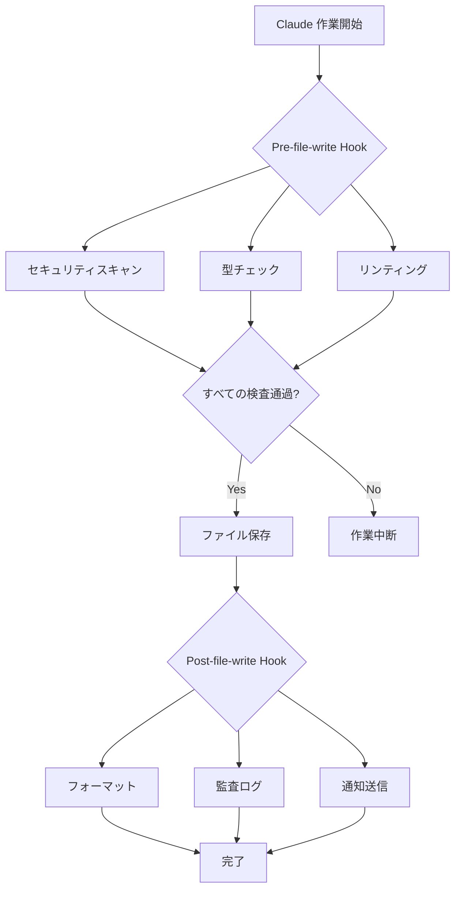

## 概要

AI ベースのコーディングアシスタントは生産性を大幅に向上させますが、<strong>一貫したコード品質とルール遵守</strong>を保証することは依然として難しい課題です。Claude Code の <strong>Hook システム</strong>は、この問題を解決する強力なソリューションです。

Hook は特定のワークフローステップで自動的に実行されるスクリプトであり、コード作成、ファイル保存、コミット前後など、さまざまなタイミングでカスタム検証ロジックを挿入できます。これにより、コードレビュー、テスト、セキュリティスキャン、コンプライアンスなどを完全に自動化できます。

### この記事で取り上げる内容

- Hook システムの核心概念と動作原理
- 様々な Hook タイプと活用事例
- コーディング規則の自動検証実装
- 自動化されたコードレビュープロセスの構築
- CI/CD パイプライン統合戦略
- 実践例とベストプラクティス

## Hook システムを理解する

### Hook とは?

Claude Code Hook は<strong>ワークフローの特定時点で実行されるユーザー定義スクリプト</strong>です。Git hook と似た概念ですが、Claude の AI コーディングワークフローに特化しています。



### Hook 実行メカニズム

Hook は終了コード(exit code)で Claude の動作を制御します:

```bash
# 成功 (作業継続)
exit 0

# 失敗 (作業中断)
exit 1

# 警告 (作業継続するが警告表示)
exit 2
```

### Hook ディレクトリ構造

```
.claude/
└── hooks/
    ├── pre-file-write.sh      # ファイル保存前に実行
    ├── post-file-write.py     # ファイル保存後に実行
    ├── pre-commit.sh          # コミット前に実行
    ├── post-commit.py         # コミット後に実行
    └── code-review.js         # カスタムレビュー Hook
```

## Hook 設定と構成

### 1. 基本 Hook 作成

最もシンプルな Hook から始めましょう:

````bash
#!/bin/bash
# .claude/hooks/pre-file-write.sh

# Hook 入力データは JSON で渡される
input=$(cat)

# ファイルパス抽出
file_path=$(echo "$input" | jq -r '.file_path')

echo "Checking file: $file_path"

# 機密ファイルの保護
if [[ "$file_path" == *".env"* ]] || [[ "$file_path" == *"credentials"* ]]; then
    echo "Error: Cannot modify sensitive files"
    exit 1
fi

# 成功
exit 0
````

### 2. 実行権限設定

Hook スクリプトは実行可能である必要があります:

```bash
chmod +x .claude/hooks/pre-file-write.sh

# すべての Hook に実行権限を付与
chmod +x .claude/hooks/*.sh
chmod +x .claude/hooks/*.py
```

### 3. Hook データ構造

Claude は Hook に JSON 形式でコンテキスト情報を渡します:

```json
{
  "file_path": "src/components/Button.tsx",
  "operation": "write",
  "content": "...",
  "metadata": {
    "timestamp": "2025-10-29T10:30:00Z",
    "user": "developer@example.com"
  }
}
```

## コーディング規則の自動検証

### 1. TypeScript 型チェック Hook

```bash
#!/bin/bash
# .claude/hooks/typescript-check.sh

input=$(cat)
file_path=$(echo "$input" | jq -r '.file_path')

# TypeScript ファイルのみ検査
if [[ "$file_path" != *.ts ]] && [[ "$file_path" != *.tsx ]]; then
    exit 0
fi

echo "Running TypeScript type check..."

# 型チェック実行
npx tsc --noEmit "$file_path" 2>&1 | tee /tmp/tsc-output.txt

if [ ${PIPESTATUS[0]} -ne 0 ]; then
    echo "❌ Type check failed"
    cat /tmp/tsc-output.txt
    exit 1
fi

echo "✅ Type check passed"
exit 0
```

### 2. ESLint リンティング Hook

```python
#!/usr/bin/env python3
# .claude/hooks/eslint-check.py

import sys
import json
import subprocess

def main():
    # 入力データ読み取り
    input_data = json.loads(sys.stdin.read())
    file_path = input_data.get('file_path', '')

    # JavaScript/TypeScript ファイルのみ検査
    if not (file_path.endswith('.js') or
            file_path.endswith('.ts') or
            file_path.endswith('.jsx') or
            file_path.endswith('.tsx')):
        sys.exit(0)

    print(f"Running ESLint on {file_path}...")

    # ESLint 実行
    result = subprocess.run(
        ['npx', 'eslint', file_path, '--format', 'json'],
        capture_output=True,
        text=True
    )

    if result.returncode != 0:
        lint_results = json.loads(result.stdout)

        # エラー概要出力
        for file_result in lint_results:
            for message in file_result.get('messages', []):
                severity = 'Error' if message['severity'] == 2 else 'Warning'
                print(f"{severity}: {message['message']} "
                      f"(line {message['line']}, col {message['column']})")

        sys.exit(1)

    print("✅ ESLint passed")
    sys.exit(0)

if __name__ == '__main__':
    main()
```

### 3. コードフォーマット自動適用

```bash
#!/bin/bash
# .claude/hooks/post-file-write.sh

input=$(cat)
file_path=$(echo "$input" | jq -r '.file_path')

# サポートされているファイル拡張子
if [[ "$file_path" =~ \.(js|ts|jsx|tsx|json|css|scss)$ ]]; then
    echo "Auto-formatting $file_path with Prettier..."

    npx prettier --write "$file_path"

    if [ $? -eq 0 ]; then
        echo "✅ Formatted successfully"
    else
        echo "⚠️  Formatting failed, but continuing..."
    fi
fi

exit 0
```

## 自動コードレビュープロセス

### 1. 包括的コードレビュー Hook

```bash
#!/bin/bash
# .claude/hooks/comprehensive-review.sh

set -e

input=$(cat)
file_path=$(echo "$input" | jq -r '.file_path')

echo "🔍 Starting comprehensive code review for $file_path"

# 段階的検証
declare -a checks=(
    "Security scan"
    "Type checking"
    "Linting"
    "Test coverage"
    "Documentation check"
)

# 1. セキュリティスキャン
echo "🔒 ${checks[0]}..."
if command -v semgrep &> /dev/null; then
    semgrep --config=auto "$file_path" --quiet
fi

# 2. 型チェック
echo "📝 ${checks[1]}..."
if [[ "$file_path" =~ \.(ts|tsx)$ ]]; then
    npx tsc --noEmit "$file_path"
fi

# 3. リンティング
echo "✨ ${checks[2]}..."
if [[ "$file_path" =~ \.(js|ts|jsx|tsx)$ ]]; then
    npx eslint "$file_path"
fi

# 4. テストカバレッジ確認
echo "🧪 ${checks[3]}..."
test_file="${file_path/src/tests}"
test_file="${test_file/.ts/.test.ts}"

if [ ! -f "$test_file" ]; then
    echo "⚠️  Warning: No test file found at $test_file"
    # 警告のみで継続
fi

# 5. ドキュメント確認
echo "📚 ${checks[4]}..."
if [[ "$file_path" =~ \.(ts|tsx|js|jsx)$ ]]; then
    # JSDoc コメント検査
    if ! grep -q "\/\*\*" "$file_path"; then
        echo "⚠️  Warning: No JSDoc comments found"
    fi
fi

echo "✅ Code review completed successfully"
exit 0
```

### 2. SOX/SOC2 監査追跡 Hook

```python
#!/usr/bin/env python3
# .claude/hooks/audit-trail.py

import sys
import json
import hashlib
from datetime import datetime
import os

AUDIT_LOG = '.claude/audit/trail.jsonl'

def main():
    # 入力データ
    input_data = json.loads(sys.stdin.read())

    # 監査ログディレクトリ作成
    os.makedirs(os.path.dirname(AUDIT_LOG), exist_ok=True)

    # 監査エントリ作成
    audit_entry = {
        'timestamp': datetime.utcnow().isoformat(),
        'operation': input_data.get('operation', 'unknown'),
        'file_path': input_data.get('file_path', ''),
        'user': os.environ.get('USER', 'unknown'),
        'content_hash': hashlib.sha256(
            input_data.get('content', '').encode()
        ).hexdigest(),
        'metadata': input_data.get('metadata', {})
    }

    # JSONL 形式でログ追加
    with open(AUDIT_LOG, 'a') as f:
        f.write(json.dumps(audit_entry) + '\n')

    print(f"✅ Audit trail recorded: {audit_entry['timestamp']}")
    sys.exit(0)

if __name__ == '__main__':
    main()
```

### 3. Pull Request 自動検証

```bash
#!/bin/bash
# .claude/hooks/pr-validation.sh

input=$(cat)
file_path=$(echo "$input" | jq -r '.file_path')

echo "🔍 PR Validation Checks"

# チェックリスト
declare -A checks=(
    ["Tests"]="npm test"
    ["Build"]="npm run build"
    ["Type Check"]="npm run typecheck"
    ["Lint"]="npm run lint"
)

failed=0

for check_name in "${!checks[@]}"; do
    echo ""
    echo "Running: $check_name"

    if eval "${checks[$check_name]}" > /tmp/check-output.txt 2>&1; then
        echo "✅ $check_name passed"
    else
        echo "❌ $check_name failed"
        cat /tmp/check-output.txt
        failed=1
    fi
done

if [ $failed -eq 1 ]; then
    echo ""
    echo "❌ PR validation failed. Please fix the issues before committing."
    exit 1
fi

echo ""
echo "✅ All PR validation checks passed"
exit 0
```

## CI/CD 統合戦略

### 1. GitHub Actions 統合

```yaml
# .github/workflows/claude-hooks.yml
name: Claude Code Hooks

on:
  pull_request:
    types: [opened, synchronize]

jobs:
  run-hooks:
    runs-on: ubuntu-latest

    steps:
      - uses: actions/checkout@v4

      - name: Setup Node.js
        uses: actions/setup-node@v4
        with:
          node-version: '20'

      - name: Install dependencies
        run: npm ci

      - name: Make hooks executable
        run: chmod +x .claude/hooks/*.sh

      - name: Run pre-commit hooks
        run: |
          for file in $(git diff --name-only origin/main); do
            if [ -f ".claude/hooks/pre-commit.sh" ]; then
              echo "{\"file_path\": \"$file\"}" | .claude/hooks/pre-commit.sh
            fi
          done

      - name: Run code review hook
        run: |
          for file in $(git diff --name-only origin/main); do
            if [ -f ".claude/hooks/code-review.sh" ]; then
              echo "{\"file_path\": \"$file\"}" | .claude/hooks/code-review.sh
            fi
          done
```

### 2. N8N ワークフロー自動化

Hook 実行結果を N8N に送信して通知自動化:

```bash
#!/bin/bash
# .claude/hooks/notify-n8n.sh

input=$(cat)
file_path=$(echo "$input" | jq -r '.file_path')

# N8N webhook URL (環境変数から取得)
WEBHOOK_URL="${N8N_WEBHOOK_URL}"

if [ -z "$WEBHOOK_URL" ]; then
    echo "Warning: N8N_WEBHOOK_URL not set"
    exit 0
fi

# 通知ペイロード作成
payload=$(cat <<EOF
{
  "event": "code_review_completed",
  "file": "$file_path",
  "timestamp": "$(date -u +%Y-%m-%dT%H:%M:%SZ)",
  "status": "success"
}
EOF
)

# N8N へ送信
curl -X POST "$WEBHOOK_URL" \
  -H "Content-Type: application/json" \
  -d "$payload" \
  --silent

exit 0
```

### 3. Telegram 通知統合

```python
#!/usr/bin/env python3
# .claude/hooks/telegram-notify.py

import sys
import json
import os
import requests

def send_telegram_message(message):
    bot_token = os.environ.get('TELEGRAM_BOT_TOKEN')
    chat_id = os.environ.get('TELEGRAM_CHAT_ID')

    if not bot_token or not chat_id:
        print("Warning: Telegram credentials not set")
        return

    url = f"https://api.telegram.org/bot{bot_token}/sendMessage"
    payload = {
        'chat_id': chat_id,
        'text': message,
        'parse_mode': 'Markdown'
    }

    try:
        requests.post(url, json=payload, timeout=5)
    except Exception as e:
        print(f"Warning: Failed to send Telegram notification: {e}")

def main():
    input_data = json.loads(sys.stdin.read())
    file_path = input_data.get('file_path', 'unknown')

    message = f"""
🔍 *Code Review Completed*

📁 File: `{file_path}`
✅ All checks passed
🕐 {input_data.get('metadata', {}).get('timestamp', 'N/A')}
"""

    send_telegram_message(message)
    sys.exit(0)

if __name__ == '__main__':
    main()
```

## 実践例とパターン

### 1. 段階的 Hook 導入戦略

Hook を一度にすべて適用するとワークフローが遅くなる可能性があります。段階的導入戦略:



<strong>Phase 1 実装:</strong>

```bash
#!/bin/bash
# .claude/hooks/phase1-gentle.sh

input=$(cat)

# 常に成功するが情報提供
echo "ℹ️  Code formatting applied"
echo "ℹ️  Audit trail recorded"

exit 0
```

<strong>Phase 2 実装:</strong>

```bash
#!/bin/bash
# .claude/hooks/phase2-warnings.sh

input=$(cat)
file_path=$(echo "$input" | jq -r '.file_path')

# リンティング実行するが失敗しても継続
npx eslint "$file_path" || echo "⚠️  Linting issues found"

# 警告コードで終了
exit 2
```

<strong>Phase 3 実装:</strong>

```bash
#!/bin/bash
# .claude/hooks/phase3-blocking.sh

input=$(cat)
file_path=$(echo "$input" | jq -r '.file_path')

# 型チェック失敗時は中断
npx tsc --noEmit "$file_path"

if [ $? -ne 0 ]; then
    echo "❌ Type check failed - blocking operation"
    exit 1
fi

exit 0
```

### 2. Hook 条件付き実行

すべてのファイルにすべての Hook を実行する必要はありません:

```bash
#!/bin/bash
# .claude/hooks/conditional-hooks.sh

input=$(cat)
file_path=$(echo "$input" | jq -r '.file_path')

# 条件別 Hook 実行
case "$file_path" in
    *.ts|*.tsx)
        echo "Running TypeScript checks..."
        .claude/hooks/typescript-check.sh <<< "$input"
        ;;
    *.py)
        echo "Running Python checks..."
        .claude/hooks/python-check.sh <<< "$input"
        ;;
    *.md)
        echo "Running Markdown lint..."
        .claude/hooks/markdown-lint.sh <<< "$input"
        ;;
    *)
        echo "No specific checks for this file type"
        ;;
esac

exit 0
```

### 3. Hook パフォーマンス最適化

Hook が遅すぎると開発体験が損なわれます:

```bash
#!/bin/bash
# .claude/hooks/optimized-hook.sh

input=$(cat)
file_path=$(echo "$input" | jq -r '.file_path')

# タイムアウト設定 (5秒)
TIMEOUT=5

# 並列実行
(
    timeout $TIMEOUT npx eslint "$file_path" &
    timeout $TIMEOUT npx prettier --check "$file_path" &
    wait
) 2>/dev/null

if [ $? -eq 124 ]; then
    echo "⚠️  Hook timeout - skipping detailed checks"
    exit 2
fi

exit 0
```

### 4. キャッシングを活用した最適化

```bash
#!/bin/bash
# .claude/hooks/cached-checks.sh

input=$(cat)
file_path=$(echo "$input" | jq -r '.file_path')
content=$(echo "$input" | jq -r '.content')

# コンテンツハッシュ生成
content_hash=$(echo "$content" | sha256sum | cut -d' ' -f1)
cache_dir=".claude/cache"
cache_file="$cache_dir/$content_hash"

mkdir -p "$cache_dir"

# キャッシュ確認
if [ -f "$cache_file" ]; then
    cache_result=$(cat "$cache_file")
    echo "✅ Using cached result: $cache_result"
    exit 0
fi

# 実際の検査実行
echo "Running checks..."
npx eslint "$file_path"

if [ $? -eq 0 ]; then
    echo "passed" > "$cache_file"
    exit 0
else
    echo "failed" > "$cache_file"
    exit 1
fi
```

## ベストプラクティスとヒント

### 1. Hook 設計原則

<strong>SOLID 原則を Hook に適用:</strong>

- <strong>Single Responsibility</strong>: 一つの Hook は一つの責任のみ
- <strong>Open/Closed</strong>: 拡張には開かれ、変更には閉じている
- <strong>Liskov Substitution</strong>: Hook を交換可能に設計
- <strong>Interface Segregation</strong>: 必要なデータのみ要求
- <strong>Dependency Inversion</strong>: 具体的実装ではなく抽象化に依存

### 2. エラー処理戦略

```bash
#!/bin/bash
# .claude/hooks/error-handling.sh

set -euo pipefail  # エラー発生時即座に中断

input=$(cat)

# エラーログファイル
ERROR_LOG=".claude/logs/hook-errors.log"
mkdir -p "$(dirname "$ERROR_LOG")"

# エラーハンドラー
handle_error() {
    local exit_code=$?
    local line_num=$1

    echo "Error on line $line_num (exit code: $exit_code)" | tee -a "$ERROR_LOG"

    # エラー詳細情報をログ記録
    echo "Input data:" >> "$ERROR_LOG"
    echo "$input" >> "$ERROR_LOG"
    echo "---" >> "$ERROR_LOG"

    exit 1
}

# エラートラップ設定
trap 'handle_error $LINENO' ERR

# Hook ロジック...
echo "Executing hook logic..."

exit 0
```

### 3. テスト可能な Hook 作成

```bash
#!/bin/bash
# .claude/hooks/testable-hook.sh

# テストモードサポート
TEST_MODE=${TEST_MODE:-false}

if [ "$TEST_MODE" = "true" ]; then
    # テスト用入力データ
    input='{"file_path": "test.ts", "content": "// test"}'
else
    # 実際の入力データ
    input=$(cat)
fi

# ロジック実行
file_path=$(echo "$input" | jq -r '.file_path')
echo "Processing: $file_path"

exit 0
```

Hook テスト:

```bash
# テスト実行
TEST_MODE=true .claude/hooks/testable-hook.sh

# 実際のデータでテスト
echo '{"file_path": "src/app.ts"}' | .claude/hooks/testable-hook.sh
```

### 4. ドキュメントテンプレート

```bash
#!/bin/bash
# .claude/hooks/example-hook.sh

# Hook 情報
# Name: Example Hook
# Purpose: ファイル保存前に基本検証を実行
# Trigger: pre-file-write
# Exit Codes:
#   0 - Success (作業継続)
#   1 - Error (作業中断)
#   2 - Warning (作業継続するが警告表示)
#
# Input JSON Schema:
# {
#   "file_path": "string",
#   "operation": "string",
#   "content": "string",
#   "metadata": {}
# }
#
# Environment Variables:
#   HOOK_DEBUG - Set to "true" for verbose output
#
# Dependencies:
#   - jq (JSON parser)
#   - bash 4.0+
#
# Author: Your Name
# Last Updated: 2025-10-29

# デバッグモード
DEBUG=${HOOK_DEBUG:-false}

if [ "$DEBUG" = "true" ]; then
    set -x
fi

# Hook ロジック...
input=$(cat)
echo "Hook executed successfully"

exit 0
```

### 5. セキュリティ考慮事項

```bash
#!/bin/bash
# .claude/hooks/secure-hook.sh

set -euo pipefail

input=$(cat)

# 1. 入力検証
if ! echo "$input" | jq empty 2>/dev/null; then
    echo "Error: Invalid JSON input"
    exit 1
fi

# 2. パスインジェクション防止
file_path=$(echo "$input" | jq -r '.file_path')

# 絶対パスのみ許可または相対パスを安全に正規化
if [[ "$file_path" =~ \.\. ]]; then
    echo "Error: Path traversal detected"
    exit 1
fi

# 3. 機密データのログ記録を防止
# コンテンツはログに残さない
echo "Processing file: $(basename "$file_path")"

# 4. 環境変数の検証
if [ -n "${GITHUB_TOKEN:-}" ]; then
    echo "Warning: Sensitive env var detected, masking in logs"
fi

# 5. 一時ファイルの安全な処理
temp_file=$(mktemp)
trap "rm -f $temp_file" EXIT

# Hook ロジック...

exit 0
```

## トラブルシューティングガイド

### 一般的な問題と解決策

#### 1. Hook が実行されない

<strong>症状:</strong> Hook スクリプトが全く実行されない

<strong>解決策:</strong>

```bash
# 実行権限確認
ls -la .claude/hooks/

# 実行権限付与
chmod +x .claude/hooks/*.sh

# Hook ディレクトリ確認
cat .claude/settings.json | jq '.hooks'
```

#### 2. Hook が遅い

<strong>症状:</strong> Hook 実行によりワークフローが著しく遅くなる

<strong>解決策:</strong>

```bash
# Hook 実行時間測定
time echo '{"file_path": "test.ts"}' | .claude/hooks/slow-hook.sh

# 並列実行で最適化
# Before: 順次実行 (遅い)
check1.sh && check2.sh && check3.sh

# After: 並列実行 (速い)
check1.sh & check2.sh & check3.sh & wait
```

#### 3. Hook デバッグ

```bash
#!/bin/bash
# .claude/hooks/debug-hook.sh

# デバッグ出力をファイルに保存
DEBUG_LOG=".claude/logs/hook-debug.log"
mkdir -p "$(dirname "$DEBUG_LOG")"

{
    echo "=== Hook Debug Log ==="
    echo "Timestamp: $(date)"
    echo "Input:"
    cat
} | tee -a "$DEBUG_LOG"

# 入力データパース
input=$(tail -n 1 "$DEBUG_LOG")

echo "Parsed input: $input" >> "$DEBUG_LOG"

exit 0
```

#### 4. JSON パースエラー

```bash
#!/bin/bash
# .claude/hooks/safe-json-parsing.sh

input=$(cat)

# jq がインストールされているか確認
if ! command -v jq &> /dev/null; then
    echo "Error: jq is not installed"
    exit 1
fi

# JSON 妥当性検証
if ! echo "$input" | jq empty 2>/dev/null; then
    echo "Error: Invalid JSON input"
    echo "Received: $input"
    exit 1
fi

# 安全に値抽出
file_path=$(echo "$input" | jq -r '.file_path // "unknown"')

exit 0
```

## 実戦シナリオ: エンタープライズ環境構築

### 完全な Hook システムアーキテクチャ



### 統合 Hook スクリプト

```bash
#!/bin/bash
# .claude/hooks/enterprise-review.sh

set -euo pipefail

input=$(cat)
file_path=$(echo "$input" | jq -r '.file_path')

LOG_DIR=".claude/logs/$(date +%Y-%m-%d)"
mkdir -p "$LOG_DIR"

echo "🚀 Enterprise Code Review Pipeline"
echo "━━━━━━━━━━━━━━━━━━━━━━━━━━━━━━━━"

# ステップ1: セキュリティスキャン
echo "🔒 Security Scan..."
if command -v semgrep &> /dev/null; then
    semgrep --config=auto "$file_path" --json > "$LOG_DIR/security.json"
    echo "✅ Security scan completed"
else
    echo "⚠️  Semgrep not installed, skipping"
fi

# ステップ2: 静的解析
echo "📊 Static Analysis..."
if [[ "$file_path" =~ \.(ts|tsx)$ ]]; then
    npx tsc --noEmit "$file_path" 2>&1 | tee "$LOG_DIR/typecheck.log"
    echo "✅ Type check completed"
fi

# ステップ3: コード品質
echo "✨ Code Quality Check..."
if command -v sonar-scanner &> /dev/null; then
    sonar-scanner -Dsonar.sources="$file_path" > "$LOG_DIR/sonar.log"
    echo "✅ SonarQube analysis completed"
fi

# ステップ4: テストカバレッジ
echo "🧪 Test Coverage..."
npm run test:coverage -- "$file_path" > "$LOG_DIR/coverage.log" 2>&1 || true

# ステップ5: 監査追跡
echo "📝 Audit Trail..."
python3 .claude/hooks/audit-trail.py <<< "$input"

# ステップ6: 結果要約
echo ""
echo "📋 Review Summary"
echo "━━━━━━━━━━━━━━━━━━━━━━━━━━━━━━━━"
echo "File: $file_path"
echo "Timestamp: $(date -u +%Y-%m-%dT%H:%M:%SZ)"
echo "Logs: $LOG_DIR/"
echo ""
echo "✅ All checks passed"

exit 0
```

## まとめ

Claude Code Hook システムは、AI ベースのコーディングワークフローに<strong>一貫性、品質、セキュリティ</strong>を保証する強力なツールです。この記事で取り上げた内容を要約すると:

### 要点

1. <strong>Hook はワークフロー自動化の核心</strong>
   - 特定の時点にユーザー定義ロジックを挿入
   - 終了コードで Claude の動作を制御
   - 様々な言語とツールをサポート

2. <strong>段階的導入が重要</strong>
   - Phase 1: 非破壊的 Hook (情報提供)
   - Phase 2: 警告レベル Hook (問題指摘)
   - Phase 3: ブロッキング Hook (作業中断)

3. <strong>パフォーマンスとセキュリティの考慮</strong>
   - 並列実行で速度向上
   - キャッシングで重複作業防止
   - 入力検証と安全な処理

4. <strong>実践適用パターン</strong>
   - 条件付き実行で効率性向上
   - CI/CD 統合で自動化拡張
   - 通知システムで透明性確保

### 次のステップ

1. プロジェクトに基本 Hook を設定
2. コーディング規則の自動検証実装
3. CI/CD パイプライン統合
4. チーム全体への展開と改善

Hook システムを効果的に活用すれば、コード品質は向上し、レビュー時間は短縮され、規制遵守は自動化されます。小さな Hook から始めて、段階的に拡張していきましょう。

## 参考資料

- [Claude Code Hooks Implementation Guide](https://medium.com/@richardhightower/claude-code-hooks-implementation-guide-audit-system-03763748700f)
- [Complete Guide: Creating Claude Code Hooks](https://suiteinsider.com/complete-guide-creating-claude-code-hooks/)
- [6 Easy Ways to Level Up Claude Code](https://blog.logrocket.com/6-easy-ways-to-level-up-claude-code/)
- [Claude Code Documentation Map](https://simonwillison.net/2025/Oct/24/claude-code-docs-map/)
- [GitHub Actions with Claude Code](https://skywork.ai/blog/claude-code-plus-ci-cd-integration-setup/)
