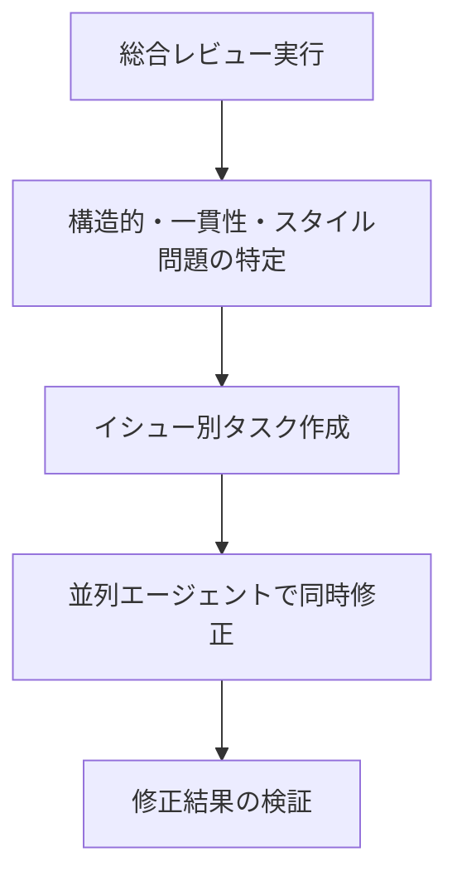
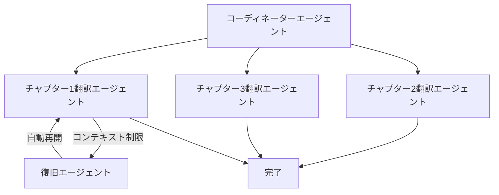

# Claude Code /insights体験記：4,516件のメッセージが語る私のAIコーディングパターン

「自分はClaude Codeを上手く使えているのだろうか？」

AIコーディングツールを毎日使いながらも、この質問に明確に答えることは難しいものでした。しかし、Claude Codeに`/insights`という隠れた宝石のような機能があることを知りました。実際の使用データに基づいて、自分のワークフローを客観的に診断してくれる機能です。

この記事では、実際のプロジェクトで`/insights`を実行した結果をすべて公開し、そこから得たインサイトと実践的なTipsを共有します。

## /insightsとは何か？

`/insights`はClaude Code v2.1で導入された使用パターン分析機能です。ローカルに保存された使用データに基づいて、以下を分析してくれます：

- **使用統計**：メッセージ数、セッション数、ファイル修正履歴
- **うまくいっていること**：効果的に活用できている機能とパターン
- **障害要因**：生産性を低下させるボトルネック
- **改善提案**：すぐに適用できる実践的なTips
- **プロジェクト領域別分析**：どの作業にどう使っているか

いわば「AIコーディング健康診断」のようなものです。実行方法も簡単で、Claude Codeで`/insights`と入力するだけです。

## 実行結果：コア指標

> **分析期間**：2025-12-31 〜 2026-02-03（約35日間）
> **環境**：Claude Code v2.1.31

### 使用量一覧

| 指標 | 数値 |
|------|------|
| 総メッセージ | **4,516件** |
| 総セッション | **1,042回** |
| ファイル修正 | **6,267件** |
| コード変更量 | **+1,046,046 / -109,155行** |
| 活動日数 | **15日** |
| 1日平均メッセージ | **301.1件** |

数字だけ見ても印象的です。1日平均301件のメッセージをClaude Codeとやり取りしていたということは、ほぼフルタイムでAIペアプログラミングをしていることを意味します。100万行を超えるコード追加は、小説プロジェクトやブログコンテンツ生成を含んだ結果でもあります。

### ツール使用Top 6

```
Read     ████████████████████████████ 11,798回
Edit     ████████████████████████   10,068回
Bash     ████████████████         6,334回
Write    ████████████             3,465回
Grep     ██████                   2,059回
TodoWrite ██████                  1,825回
```

ReadとEditが圧倒的です。これはClaudeが既存コードを十分に読んで理解してから修正する「理解してから修正」パターンで動作していることを示しています。TodoWriteがTop 6に入っているのも興味深く、並列エージェントとタスクオーケストレーションを積極的に活用している証拠です。

### 言語別分布

| 言語 | 使用回数 | 比率 |
|------|----------|------|
| Markdown | 5,862 | 39.5% |
| TypeScript | 4,540 | 30.6% |
| Rust | 2,096 | 14.1% |
| JavaScript | 1,406 | 9.5% |
| JSON | 678 | 4.6% |
| YAML | 304 | 2.0% |

Markdownが1位なのは、ブログ記事と小説コンテンツの作業が大きな割合を占めているためです。TypeScriptとRustを合わせると全体の約45%で、実際の開発作業も活発に行われていることがわかります。

## 「うまくいっていること」分析

`/insights`が選んだ3つの強みです。

### 1. 並列エージェントとタスクオーケストレーション

```
TodoWrite: 1,825回
TaskCreate: 1,276回
合計: 4,751回（TodoWrite + TaskCreate + TaskUpdate）
```

私は大規模作業を行う際に必ずタスクリストを先に作成し、これを並列エージェントに分配するパターンを使っています。`/insights`はこれを「洗練されたワークフロー（sophisticated workflow）」と評価しました。

実際の活用例：
- **小説プロジェクト**：総合レビュー → 問題特定 → 並列で複数ファイル同時修正
- **ブログ生成**：韓国語作成 → 日本語/英語/中国語の並列翻訳
- **コードリファクタリング**：イシュー分析 → タスク分配 → 同時修正

このパターンの核心は「計画が先、実行は並列で」です。

### 2. カスタムスラッシュコマンドの活用

`/write-post`のようなカスタムスラッシュコマンドを作成して繰り返し作業を自動化したことも高い評価を受けました。ブログ記事1つを作成するには、リサーチ → 韓国語執筆 → 3言語翻訳 → 画像生成 → メタデータ更新など10段階以上の作業が必要ですが、これを1つのコマンドにエンコードしています。

> 「複雑な多段階コンテンツ生成を再現可能なワンコマンド作業に変換」
> — /insights分析結果

### 3. 日本語小説の2段階パターン

日本語小説プロジェクトで使用したワークフローも良い評価を受けました：



「一人AI出版社」という表現が印象的でした。プロットホールを見つけ、キャラクター名の一貫性を確認し、スタイルの統一性をチェックした後、並列で複数ファイルにわたるすべての問題を修正するワークフローです。

## 「障害要因」分析

良いことばかりではありません。`/insights`は冷静に問題点も指摘してくれます。

### コンテキスト制限 — 最大のボトルネック

> 「コンテキスト制限により、最も野心的なセッションが途中で終了」

これが最大の問題でした。特に以下の作業で頻繁に発生しました：

- **小説レビュー**：複数巻にわたる総合レビュー中に中断
- **翻訳作業**：大規模翻訳の実行中に途切れる
- **ブログコンテンツ生成**：初期読み込み・設定段階で終了

根本原因は**「単一セッションに大きすぎる作業を割り当てるパターン」**でした。すべてを一度に解決しようとする欲張りが、かえって非効率を生んでいたのです。

### エラーパターン分析

| エラー種別 | 発生回数 |
|------------|----------|
| Command Failed | 533件 |
| File Too Large | 293件 |
| Other | 151件 |
| File Changed | 62件 |
| Edit Failed | 37件 |
| File Not Found | 32件 |

「File Too Large」エラーが293件もあるのは、小説プロジェクトの大容量テキストファイルが原因です。このデータを見て、ファイル分割戦略の必要性を実感しました。

## 「クイックウィン」分析

`/insights`が提案したQuick Winsは非常に実用的でした。

### 1. チェックポイントの導入

> 「ヘッドレスモードでチャプター/セクション別チェックポイントにより翻訳・コンテンツ生成を実行」

長時間作業が途中で途切れる問題を解決するには、各段階を完了するたびに進捗をファイルに保存する必要があります。こうすれば、セッションが終了しても次のセッションで続きから作業できます。

```markdown
<!-- .claude/task-status.md の例 -->
## ブログ記事作成の進捗状況
- [x] リサーチ完了
- [x] 韓国語ドラフト作成
- [ ] 日本語翻訳
- [ ] 英語翻訳
- [ ] 中国語翻訳
- [ ] メタデータ更新
```

### 2. 構造化チェックポイントファイル

> 「TodoWrite/TaskCreateパターンを構造化チェックポイントファイルに公式化」

すでにTodoWriteを4,751回も使用していましたが、これをより体系的なファイルベースのチェックポイントに発展させるという提案でした。セッション間の状態共有が鍵となります。

### 3. 自動再開設計

> 「新しいセッションが未完了の作業を検出して再開できるように設計」

CLAUDE.mdに「Long-Running Tasks」セクションを追加し、長時間作業時に常に中間進捗をファイルに保存するルールを明示するというものです。コンテキスト制限に近づいたら`.claude/task-status.md`に完了・未完了タスクのサマリーを記録するパターンです。

## プロジェクト領域別分析

`/insights`は作業タイプ別の詳細な分析も提供します。

### 日本語小説＆品質レビュー（約3セッション）

出版品質評価、デザイン整合性レビュー、多巻総合レビューを実施しました。構造的、一貫性、スタイルの問題を体系的に特定し、並列で修正する方式は、従来の出版業界の校正・校閲プロセスをAIで自動化したのと同じです。

### 小説翻訳 — 日本語→韓国語（約1セッション）

Claude Codeの並列エージェント機能を活用した翻訳作業です。チャプターごとに並列処理して速度を上げましたが、コンテキスト制限でセッションが切れる場合が発生しました。

### ブログコンテンツ生成（約2セッション）

カスタム`/write-post`コマンドを通じたブログ記事生成です。リサーチファイルを入力として4言語のコンテンツを生成する自動化パイプラインですが、初期設定段階でコンテキストが消耗される場合もありました。

### TypeScript & Rust開発

TypeScriptが4,540回、Rustが2,096回で最も活発な開発領域でした。JavaScript（1,406回）、HTML、CSS、JSON作業も含まれます。Webフロントエンドからシステムプログラミングまで幅広く活用していることがわかります。

### マルチファイルイシュー修正＆メンテナンス（約48セッション）

51件のマルチファイル変更が行われた領域です。TodoWriteとTask管理ツールを広範囲に使用し、並列エージェントで体系的レビューと大量修正を実施しました。これが全体セッションの最大の割合を占めています。

## 時間帯別使用パターン

```
午前 (06-12)  ████████           419件 (9.3%)
午後 (12-18)  █████████████████████████████████ 1,644件 (36.4%)
夜間 (18-24)  ██████████████████████████████████ 1,675件 (37.1%)
深夜 (00-06)  ████████████████   778件 (17.2%)
```

午後と夜間の時間帯に集中して作業するパターンが明確です。深夜にも17%の使用量があるのは、AIの利点 — 夜遅くまで疲れることなくコーディングパートナーを維持できることを活用しているということでもあります。

ユーザーの応答時間も興味深いデータです：

| 指標 | 値 |
|------|------|
| 中央値 | 155.0秒 |
| 平均 | 368.1秒 |
| 最頻区間 | 2〜5分（621件） |

応答までの中央値約2.5分は、Claudeの応答を確認して次の指示を出すまでにかかる時間です。完全自動化ではなく「人間が監督するAI作業」パターンと言えます。

## 未来に向けた提案

`/insights`は今後試す価値のあるワークフローも提案してくれました。

### 自己修復型並列翻訳パイプライン



コンテキスト制限に到達すると復旧エージェントが自動的に再開する「fire-and-forget」パターンです。現在は手動でセッションを再起動する必要がありますが、このパターンを導入すれば完全な自動化が可能です。

### 小説品質検証テストケース

小説の品質をCIパイプラインのように自動検証するアイデアもありました：

- キャラクター名の一貫性テスト
- タイムライン検証テスト
- スタイルガイド準拠テスト

コードにユニットテストがあるように、クリエイティブライティングにも自動化された品質検証を導入するという発想が斬新です。

## 実務活用Tips

`/insights`を通じて得た教訓を整理すると以下の通りです。

### 今すぐ適用できること

1. **大きな作業は必ず分割しましょう**：単一セッションにすべてを詰め込まず、チャプター/セクション/モジュール単位で分けましょう。

2. **チェックポイントをファイルに残しましょう**：`task-status.md`のようなファイルを作成して進捗を記録すれば、セッションが切れても続きから作業できます。

3. **カスタムスラッシュコマンドを作りましょう**：繰り返し作業があれば`/write-post`のようにコマンドにエンコードしましょう。一度作れば何度でも再利用できます。

4. **並列エージェントを積極的に活用しましょう**：`TodoWrite` → `TaskCreate`パターンで作業を分配すれば効率が大幅に向上します。

### /insightsを最大限活用する方法

1. **定期的に実行しましょう**：月に1回程度`/insights`を実行すれば、作業パターンの変化を追跡できます。

2. **CLAUDE.mdに反映しましょう**：`/insights`が提案した改善事項をCLAUDE.mdに記録すれば、Claude Codeが自動的にそのルールに従います。

3. **エラーパターンに注目しましょう**：「File Too Large」や「Command Failed」のようなエラーが多い場合、ワークフローの調整が必要です。

4. **HTMLレポートを活用しましょう**：`/insights`は詳細なHTMLレポートも生成します。可視化されたデータでより深い分析が可能です。

## 他の開発者にお勧めする理由

`/insights`を実行して最も強く感じたのは、**「自分がAIをどう使っているか知らないまま、上手く使えていると勘違いしていた」**ということです。

データに基づく客観的な診断は以下の価値をもたらします：

- **隠れたボトルネックの発見**：コンテキスト制限の問題を認識していなければ、同じ失敗を繰り返していたでしょう。
- **効果的なパターンの強化**：並列エージェント活用が実際に効果的であるという確認は自信につながります。
- **具体的な改善方向**：「もっと上手く使ってください」ではなく「チェックポイントを導入してください」という具体的なアクションアイテムを提示してくれます。

AIコーディングツールを使うすべての開発者に`/insights`の実行をお勧めします。5分で実行できますが、そこから得られるインサイトは今後のワークフローを根本的に変える可能性があります。

## おわりに

Claude Code `/insights`は単なる統計機能ではありません。AIコーディングツールとの協業方法をデータで示し、具体的な改善方向を提示する**AIワークフローコーチ**です。

4,516件のメッセージ、1,042回のセッション、6,267件のファイル修正 — これらの数字が語っているのは単に「たくさん使った」ということではなく、「どのように使っていて、どこを改善すればもっと良くなれるか」ということです。

まだ`/insights`を実行していない方は、今すぐClaude Codeを開いて`/insights`と入力してみてください。自分のAIコーディングパターンを客観的に見つめること、それがより良い開発者になる第一歩です。

## 参考資料

- [Claude Code 公式ドキュメント](https://docs.anthropic.com/en/docs/claude-code)
- [Claude Code Best Practices](https://docs.anthropic.com/en/docs/claude-code/best-practices)
- [Claude Code CLI マイグレーションガイド](/ja/blog/claude-code-cli-migration-guide)
