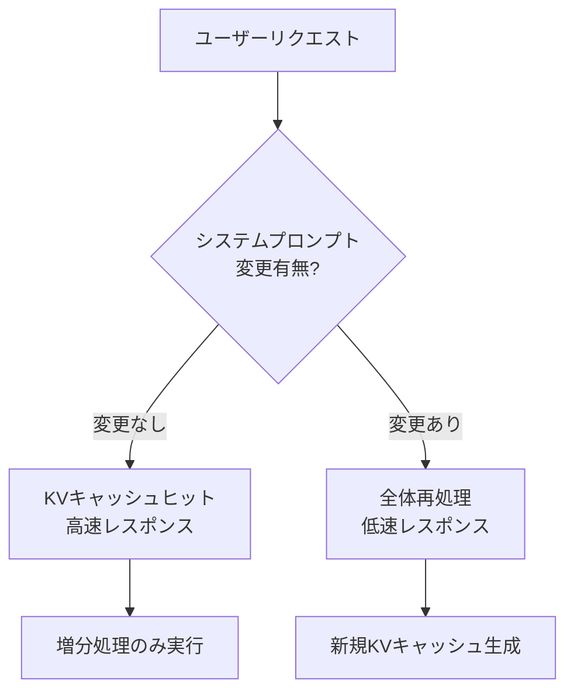
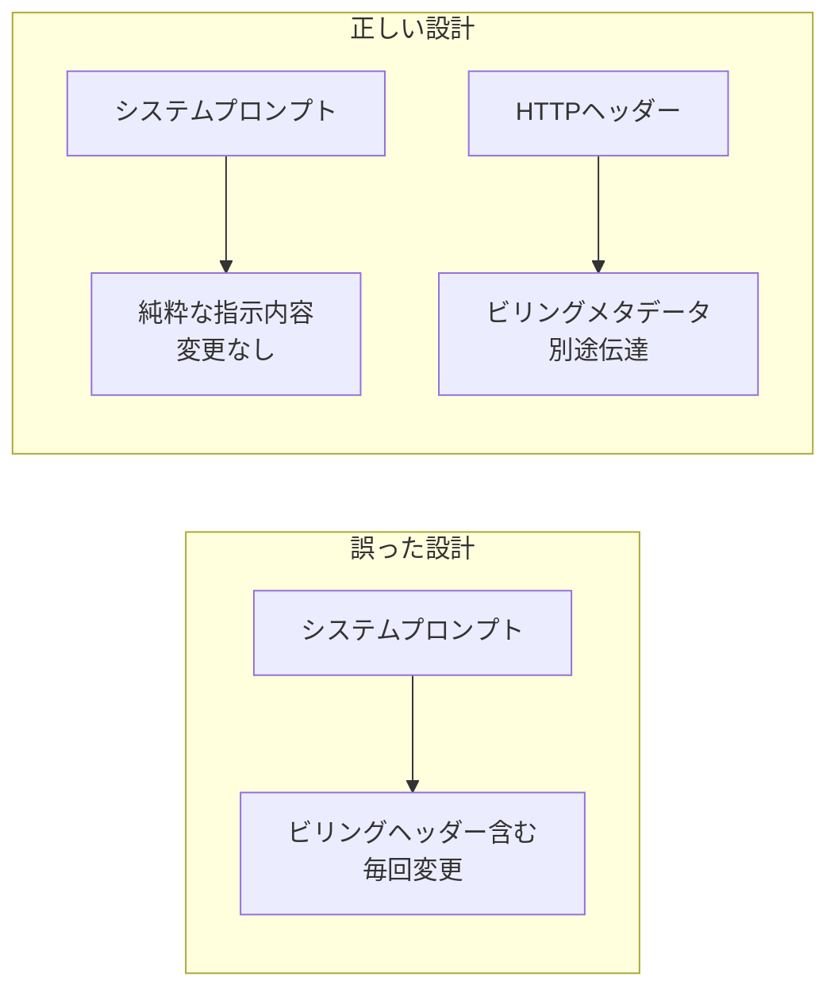

## 概要

Claude Codeは、Anthropicが提供するCLIベースのAIコーディングアシスタントです。公式APIを通じて使用すれば問題なく動作しますが、ローカルLLMやサードパーティプロキシを通じて実行した場合、<strong>毎回のリクエストでプロンプト全体が再処理される</strong>という深刻な非効率性が発生します。最近、Reddit r/LocalLLaMAコミュニティでこの問題が報告され、大きな注目を集めました。

本記事では、この問題の技術的な原因、影響、そして解決方法を詳しく分析します。

## 問題の核心：x-anthropic-billing-header

Claude Codeは内部的にシステムプロンプトに次のようなビリングヘッダーを含めています：

```
x-anthropic-billing-header: cc_version=2.1.39.c39; cc_entrypoint=cli; cch=56445;
```

このヘッダーの値は<strong>リクエストごとに変更</strong>されます。公式Anthropic APIではこのヘッダーが別途処理されますが、ローカルモデルやサードパーティプロキシを通じて実行すると、このヘッダーがシステムプロンプトの一部としてレンダリングされます。

### KVキャッシュ無効化のメカニズム

LLM推論において<strong>KV（Key-Value）キャッシュ</strong>はパフォーマンス最適化の要です。以前のリクエストの演算結果をキャッシュに保存し、同一プレフィックスを持つ後続リクエストで再利用します。



ビリングヘッダーの値が毎回変わると、システムプロンプト全体が変更されたと認識され、<strong>KVキャッシュが完全に無効化</strong>されます。その結果、数千〜数万トークンに及ぶシステムプロンプトと会話履歴が毎回最初から再処理されます。

## パフォーマンスへの影響分析

### ローカルLLMでのコスト

ローカルモデル実行時のKVキャッシュ無効化の影響は特に深刻です：

| 項目 | KVキャッシュ有効 | KVキャッシュ無効化 |
|------|----------------|------------------|
| システムプロンプト処理 | 初回のみ | 毎リクエスト |
| 会話コンテキスト処理 | 増分のみ | 全体再処理 |
| VRAM使用量 | 安定 | 急増・解放の繰り返し |
| レスポンス遅延 | 0.5〜2秒 | 10〜30秒以上 |
| GPU演算コスト | 低い | 非常に高い |

Claude Codeのシステムプロンプトは数万トークンに達することがあり、会話履歴を含めると毎回のリクエストで数十万トークンを再処理することになります。ローカルGPUでは<strong>レスポンス時間が10倍以上増加</strong>する結果となります。

### APIプロキシ使用時のコスト

サードパーティAPIプロキシを通じて他のモデル（例：GPT-4、Gemini）に接続する場合も同じ問題が発生します。プロンプトキャッシングをサポートするAPIでキャッシュが無効化されると、<strong>トークンコストが数倍に増加</strong>します。

## 解決方法

### 環境変数の設定

最も簡単な解決策はビリングヘッダーを無効化することです。`~/.claude/settings.json`ファイルに次を追加します：

```json
{
  "env": {
    "CLAUDE_CODE_ATTRIBUTION_HEADER": "0"
  }
}
```

この設定によりシステムプロンプトからビリングヘッダーが除去され、KVキャッシュが正常に機能するようになります。

### 効果の検証

設定適用後、以下の点を確認してください：

1. <strong>レスポンス速度の改善</strong>：2回目のリクエストからレスポンス時間が大幅に短縮されます
2. <strong>VRAMの安定化</strong>：GPUメモリ使用量の急激な変動が減少します
3. <strong>ログの確認</strong>：システムプロンプトにビリングヘッダーが含まれていないことを確認します

## アーキテクチャ設計の教訓

この問題は単なるバグを超えて、<strong>開発者ツール設計の重要な教訓</strong>を提供しています。

### 1. メタデータとコンテンツの分離

ビリング情報やテレメトリデータなどのメタデータは、プロンプトコンテンツと明確に分離されるべきです。HTTPヘッダー、別のAPIパラメータ、またはアウトオブバンドチャネルを通じて伝達するのが正しい設計です。



### 2. キャッシュフレンドリーな設計

LLMベースのツールを設計する際は、<strong>プロンプトのキャッシュ親和性</strong>を必ず考慮すべきです：

- 頻繁に変更される要素をプロンプトの先頭に配置しない
- 静的コンテンツと動的コンテンツを構造的に分離する
- キャッシュキーに影響を与える要素を最小化する

### 3. サードパーティ互換性の考慮

公式APIでは問題がなくても、サードパーティ環境での互換性を考慮した設計が必要です。特にオープンソースコミュニティで活発に使用されるツールであればなおさらです。

## より広い文脈：LLM開発者ツールの未来

この事例はLLMベースの開発者ツールエコシステムが直面する課題を示しています：

- <strong>ベンダーロックイン</strong>：特定のAPIに最適化されたツールが他の環境で非効率的に動作する
- <strong>透明性の不足</strong>：内部アーキテクチャが公開されておらずデバッグが困難
- <strong>コミュニティ依存</strong>：ユーザーコミュニティが自ら問題を発見し解決策を共有

今後、開発者ツールは<strong>モデルアグノスティック（model-agnostic）</strong>な設計を目指し、内部動作の透明性を高め、多様な実行環境を公式にサポートする方向へ進化すべきでしょう。

## 結論

Claude Codeのローカルモデル使用時の全プロンプト再処理問題は、`CLAUDE_CODE_ATTRIBUTION_HEADER`環境変数を`"0"`に設定することで解決できます。しかし、この問題が示唆するところはより大きいものです。

LLMベースのツールを開発・運用する際は、<strong>キャッシュ効率性、メタデータ分離、サードパーティ互換性</strong>を設計初期から考慮する必要があります。小さなヘッダー一つがシステム全体のパフォーマンスを劇的に変化させうるという事実は、緻密なアーキテクチャ設計の重要性を改めて教えてくれます。

## 参考資料

- [Reddit r/LocalLLaMA — Claude Code with local models: full prompt reprocessing](https://www.reddit.com/r/LocalLLaMA/comments/1r47fz0/claude_code_with_local_models_full_prompt/)
- [claude-code-router Issue #1161 — x-anthropic-billing-header validation error](https://github.com/musistudio/claude-code-router/issues/1161)
- [Anthropic Prompt Caching Documentation](https://docs.anthropic.com/en/docs/build-with-claude/prompt-caching)
