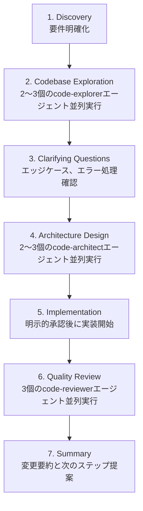

## 概要

Claude CodeはAnthropicが開発したエージェンティックコーディングツールです。プラグインシステムを通じて、スラッシュコマンド、専門エージェント、スキル、フックを<strong>一つのパッケージとしてインストール</strong>できます。

この記事では<strong>公式13プラグイン</strong>の詳細機能、<strong>コミュニティマーケットプレイス</strong>の100以上のプラグイン、そして<strong>実際のプラグイン構造</strong>を深く分析します。

> <strong>★ Insight</strong>
>
> - 公式プラグイン13個: anthropics/claude-codeリポジトリで管理
> - コミュニティマーケットプレイス: 100以上のプラグイン（13カテゴリ）
> - プラグイン構造: commands/, agents/, skills/, hooks/, .mcp.json

## プラグインのインストール方法

### マーケットプレイスの追加

Claude CodeはGitリポジトリベースのマーケットプレイスシステムを使用します。

```bash
# コミュニティマーケットプレイスの追加
/plugin marketplace add ccplugins/awesome-claude-code-plugins
/plugin marketplace add kivilaid/plugin-marketplace
/plugin marketplace add ananddtyagi/cc-marketplace

# 登録されたマーケットプレイス一覧の確認
/plugin marketplace list
```

### プラグインのインストール

```bash
# 基本インストール
/plugin install commit-commands

# 特定マーケットプレイスからインストール
/plugin install ultrathink@cc-marketplace

# インストール済みプラグイン一覧の確認
/plugin list

# 対話型インストール（メニュー方式）
/plugin
```

> <strong>★ Insight</strong>
>
> - プラグイン最小要求バージョン: Claude Code 1.0.33以上
> - 保存場所: プロジェクト(.claude/)またはユーザー(~/.claude/)レベル
> - 開発モード: `cc --plugin-dir /path/to/plugin` でローカルテスト可能

## 公式プラグイン13個の詳細分析

Anthropicが管理する[anthropics/claude-code](https://github.com/anthropics/claude-code/tree/main/plugins)リポジトリの公式プラグインです。

### 1. commit-commands - Gitワークフロー自動化

```bash
/plugin install commit-commands
```

<strong>提供コマンド3つ</strong>:

| コマンド            | 機能                                                                 |
| ------------------- | -------------------------------------------------------------------- |
| `/commit`         | 変更を分析し、リポジトリスタイルに合ったコミットメッセージを自動生成 |
| `/commit-push-pr` | ブランチ作成 → コミット → プッシュ → PR作成まで一度に             |
| `/clean_gone`     | リモートで削除されたローカルブランチの整理、worktree含む             |

**`/commit` の動作方式**:

1. `git status`で変更を確認
2. `git diff`でstaged/unstaged変更を分析
3. `git log`で最近のコミットスタイルを把握
4. リポジトリのコンベンションに合ったコミットメッセージを生成
5. `.env`、`credentials.json`など機密ファイルを除外

**`/commit-push-pr` の動作方式**:

1. mainブランチなら自動で新しいブランチを作成
2. ブランチの<strong>全コミット履歴</strong>を分析（最新コミットだけでなく）
3. PR説明を自動生成（Summary + Test plan）
4. GitHub CLI(`gh`)でPR作成後URLを返す

```bash
# 使用例
git add .
/commit
# → "feat(auth): add JWT validation middleware" を提案
# → 承認しますか？ [Y/n]
```

### 2. feature-dev - 7段階機能開発ワークフロー

```bash
/plugin install feature-dev
```

<strong>7段階の構造化されたワークフロー</strong>:



<strong>専門エージェント3種</strong>:

| エージェント       | 役割                                                                     |
| ------------------ | ------------------------------------------------------------------------ |
| `code-explorer`  | 実行パス追跡、アーキテクチャレイヤー分析、必須ファイル一覧生成           |
| `code-architect` | 最小変更 / クリーンアーキテクチャ / 実用的バランスなど複数アプローチ設計 |
| `code-reviewer`  | シンプルさ/DRY、バグ/正確性、コンベンション/抽象化それぞれに集中レビュー |

```bash
# 使用例
/feature-dev Add OAuth login with Google
# → 7段階を順次進行、各段階でユーザー確認
```

<strong>いつ使うか？</strong>

- 複数ファイルにまたがる新機能開発
- アーキテクチャ決定が必要な複雑な作業
- 要件が不明確な機能

### 3. code-review - 信頼度ベースの自動PRレビュー

```bash
/plugin install code-review
```

<strong>動作方式</strong>:

1. クローズ済み/ドラフト/些細な/レビュー済みPRは自動スキップ
2. CLAUDE.mdガイドラインファイルを収集
3. <strong>4つの並列エージェント</strong>を実行:
   - Agent #1, #2: CLAUDE.md準拠確認（重複検証）
   - Agent #3: バグ検出（PR変更範囲内のみ）
   - Agent #4: Git blame履歴分析
4. 各イシューに<strong>信頼度スコア(0〜100)</strong>を付与
5. <strong>80点未満をフィルタリング</strong>（誤検出除去）

<strong>信頼度スコア基準</strong>:

| スコア | 意味                           |
| ------ | ------------------------------ |
| 0      | 確信なし、誤検出の可能性高い   |
| 25     | ある程度確信、実際かもしれない |
| 50     | 普通の確信、実際だが些細       |
| 75     | 高い確信、実際で重要           |
| 100    | 絶対確信、確実に問題           |

```bash
# ターミナル出力
/code-review

# PRコメントとして投稿
/code-review --comment
```

<strong>フィルタリングされる誤検出</strong>:

- PR以前から存在した問題
- リンターで検出できる問題
- 一般的な品質イシュー（CLAUDE.mdにない場合）
- lint ignore注釈があるコード

### 4. hookify - コーディング不要でフック作成

```bash
/plugin install hookify
```

<strong>提供コマンド4つ</strong>:

| コマンド                | 機能                                       |
| ----------------------- | ------------------------------------------ |
| `/hookify [説明]`     | 自然言語でフック作成                       |
| `/hookify` (引数なし) | 会話を分析して改善すべきパターンを自動発見 |
| `/hookify:list`       | 有効なルール一覧                           |
| `/hookify:configure`  | ルールの有効化/無効化                      |

<strong>フックファイル形式</strong> (`.claude/hookify.*.local.md`):

```yaml
---
name: block-dangerous-rm
enabled: true
event: bash
pattern: rm\s+-rf
action: block  # warn または block
---

⚠️ **危険なrmコマンドを検出！**

このコマンドは重要なファイルを削除する可能性があります。
- パスが正しいか確認してください
- バックアップがあるか確認してください
```

<strong>イベントタイプ</strong>:

- `bash`: Bashコマンド実行時
- `file`: Edit/Writeツール使用時
- `stop`: Claudeが作業終了しようとする時
- `prompt`: ユーザープロンプト送信時
- `all`: すべてのイベント

```bash
# 使用例
/hookify TypeScriptファイルでconsole.logを使ったら警告して
# → .claude/hookify.warn-console-log.local.md が作成される
```

### 5. plugin-dev - 8段階プラグイン開発ツール

```bash
/plugin install plugin-dev
```

<strong>8段階プラグイン作成ワークフロー</strong>:

1. <strong>Discovery</strong>: プラグインの目的と要件把握
2. <strong>Component Planning</strong>: 必要なskills/commands/agents/hooks/MCPを決定
3. <strong>Detailed Design</strong>: 各コンポーネントの詳細設計
4. <strong>Structure Creation</strong>: ディレクトリとmanifest作成
5. <strong>Component Implementation</strong>: AI支援での実装
6. <strong>Validation</strong>: plugin-validatorとコンポーネント別検証
7. <strong>Testing</strong>: Claude Codeでの実動作テスト
8. <strong>Documentation</strong>: README完成と配布準備

<strong>7つのコアスキル</strong>:

| スキル              | トリガーキーワード                 | 内容                                        |
| ------------------- | ---------------------------------- | ------------------------------------------- |
| Hook Development    | "create a hook", "PreToolUse hook" | プロンプト/コマンドフック、全イベントタイプ |
| MCP Integration     | "add MCP server", ".mcp.json"      | stdio/SSE/HTTP/WebSocketサーバー設定        |
| Plugin Structure    | "plugin.json manifest"             | 標準ディレクトリ構造、auto-discovery        |
| Plugin Settings     | ".local.md files"                  | プロジェクト別設定、YAML frontmatter        |
| Command Development | "create a slash command"           | コマンド構造、引数処理                      |
| Agent Development   | "create an agent"                  | エージェントfrontmatter、システムプロンプト |
| Skill Development   | "create a skill"                   | SKILL.md、progressive disclosure            |

```bash
# 使用例
/plugin-dev:create-plugin データベースマイグレーション管理プラグイン
# → 8段階ガイドが進行
```

### 6. frontend-design - 自動起動UIデザインスキル

```bash
/plugin install frontend-design
```

フロントエンド作業時に<strong>自動で起動</strong>されるスキルです。

<strong>コア原則</strong>:

- <strong>大胆な美学的選択</strong>: 汎用的なAIスタイルを避ける
- <strong>独特なタイポグラフィとカラーパレット</strong>
- <strong>高インパクトなアニメーションとビジュアルディテール</strong>
- <strong>コンテキスト認識実装</strong>

```bash
# 自動起動の例
"音楽ストリーミングアプリのダッシュボードを作って"
"AIセキュリティスタートアップのランディングページを作って"
# → frontend-designスキルが自動適用される
```

### 7. pr-review-toolkit - 6つの専門レビューエージェント

```bash
/plugin install pr-review-toolkit
```

<strong>6つの専門エージェント</strong>:

- コメントレビュアー
- テストレビュアー
- エラー処理レビュアー
- 型レビュアー
- コード品質レビュアー
- 総合レビュアー

```bash
/pr-review-toolkit:review-pr
```

### 8. security-guidance - セキュリティ警告フック

```bash
/plugin install security-guidance
```

<strong>9つのセキュリティパターン監視</strong>:

- インジェクション攻撃
- XSS（クロスサイトスクリプティング）
- SQLインジェクション
- コマンドインジェクション
- パストラバーサル
- 安全でないデシリアライゼーション
- 機密データ漏洩
- 脆弱な暗号化
- 認証/認可の欠陥

PreToolUseフックで<strong>ツール実行前</strong>にリアルタイム警告。

### その他の公式プラグイン

| プラグイン                    | 説明                                          |
| ----------------------------- | --------------------------------------------- |
| `agent-sdk-dev`             | Claude Agent SDK開発キット (`/new-sdk-app`) |
| `claude-opus-4-5-migration` | Opus 4.5への自動マイグレーション              |
| `explanatory-output-style`  | 実装選択に関する教育的インサイト提供          |
| `learning-output-style`     | 5〜10行のコード貢献を求める学習モード         |
| `ralph-wiggum`              | 反復開発のための自己参照AIループ              |

## コミュニティマーケットプレイス分析

### 主要マーケットプレイス

| マーケットプレイス                                                                             | プラグイン数 | 特徴                             |
| ---------------------------------------------------------------------------------------------- | ------------ | -------------------------------- |
| [ccplugins/awesome-claude-code-plugins](https://github.com/ccplugins/awesome-claude-code-plugins) | 100+         | 13カテゴリ、最大規模             |
| [kivilaid/plugin-marketplace](https://github.com/kivilaid/plugin-marketplace)                     | 87+          | ドキュメント処理ツールに強み     |
| [ananddtyagi/cc-marketplace](https://github.com/ananddtyagi/cc-marketplace)                       | 動的更新     | ライブデータベース連携           |
| [ivan-magda/claude-code-marketplace](https://github.com/ivan-magda/claude-code-marketplace)       | Swift中心    | Swift 6マイグレーション、iOS開発 |

### カテゴリ別主要プラグイン（ccplugins基準）

<strong>ワークフローオーケストレーション（8個）</strong>:

- `ultrathink`: 4つの専門サブエージェントを指揮するコーディネーター
- `lyra`: マスター級AIプロンプト最適化専門家
- `problem-solver-specialist`: 体系的問題解決

<strong>コード品質＆テスト（16個）</strong>:

- `bug-detective`: 段階的体系的デバッグ
- `double-check`: 変更の二重検証
- `test-writer-fixer`: テスト作成・修正
- `unit-test-generator`: ユニットテスト自動生成
- `database-performance-optimizer`: DB性能最適化

<strong>Gitワークフロー（14個）</strong>:

- `fix-github-issue`: GitHubイシューベースの自動修正
- `create-pr`: PR作成自動化
- `update-branch-name`: ブランチ名コンベンション適用
- `husky`: Gitフック設定

<strong>ドキュメンテーション（8個）</strong>:

- `analyze-codebase`: コードベース総合分析
- `changelog-generator`: 変更ログ自動生成
- `update-claudemd`: CLAUDE.md自動更新
- `openapi-expert`: OpenAPIスペック専門家

<strong>セキュリティ＆コンプライアンス（7個）</strong>:

- `audit`: コードベースセキュリティ監査
- `enterprise-security-reviewer`: エンタープライズ級セキュリティレビュー
- `legal-compliance-checker`: 法的準拠確認
- `data-privacy-engineer`: データプライバシー

<strong>開発エンジニアリング（15個）</strong>:

- `ai-engineer`: AI機能開発専門
- `backend-architect`: バックエンドアーキテクチャ設計
- `flutter-mobile-app-dev`: Flutterモバイルアプリ
- `react-native-dev`: React Native開発

### kiviladマーケットプレイス特化ツール

<strong>ドキュメント処理スイート</strong>:

- `xlsx`: 数式とデータ可視化を含むExcel生成
- `docx`: 変更追跡と書式を含むWord文書
- `pptx`: レイアウトとテンプレートを含むPowerPoint
- `pdf`: PDF抽出、結合、分割、フォーム処理

<strong>クリエイティブ＆デザイン</strong>:

- `algorithmic-art`: p5.jsベースのジェネレーティブアート
- `canvas-design`: PNG/PDFビジュアルアート生成
- `slack-gif-creator`: Slack用アニメーションGIF

<strong>davila7ツールキット（10個）</strong>:

- Gitワークフロー、Supabase、Next.js/Vercel
- テスト、セキュリティ監査、AI/ML、DevOps
- ドキュメント生成、性能最適化、プロジェクト管理

## プラグイン構造詳細

### 標準ディレクトリ構造

```
my-plugin/
├── .claude-plugin/
│   └── plugin.json              # プラグインメタデータ（必須）
├── commands/                    # スラッシュコマンド
│   ├── command-name.md
│   └── another-command.md
├── agents/                      # 自律エージェント
│   ├── agent-name.md
│   └── another-agent.md
├── skills/                      # 再利用可能なスキル
│   ├── skill-name/
│   │   ├── SKILL.md
│   │   ├── references/
│   │   ├── examples/
│   │   └── scripts/
├── hooks/                       # イベントフック
│   ├── hooks.json
│   └── my-hook.sh
├── .mcp.json                    # MCPサーバー設定（任意）
└── README.md
```

### plugin.json例

```json
{
  "name": "my-team-plugin",
  "version": "1.0.0",
  "description": "チーム専用開発ワークフロープラグイン",
  "commands": ["commands/"],
  "agents": ["agents/"],
  "skills": ["skills/"],
  "hooks": ["hooks/"]
}
```

### コマンドファイル形式（YAML frontmatter + Markdown）

```markdown
---
description: "コードレビューを実行します"
argument-hint: "[--comment]"
allowed-tools:
  - Read
  - Grep
  - Bash
---

# コードレビューコマンド

## 指示
1. 現在のブランチの変更を分析します
2. CLAUDE.mdガイドラインを確認します
3. イシューを信頼度スコアと共に報告します
...
```

### エージェントファイル形式

```markdown
---
name: code-explorer
description: |
  コードベースを深く分析するエージェントです。

  <example>
  ユーザー: "認証フローがどう動作するか追跡して"
  → code-explorerが呼び出される
  </example>
model: sonnet
color: blue
tools:
  - Read
  - Grep
  - Glob
---

# System Prompt

あなたはコードベース探索の専門家です...
```

### スキルSKILL.md形式

```markdown
---
description: |
  フロントエンドUIデザインスキルです。

  <trigger_phrases>
  - "ダッシュボードを作って"
  - "ランディングページのデザイン"
  - "UIコンポーネント生成"
  </trigger_phrases>
auto_invoke: true
---

# Frontend Design Skill

## コア原則
1. 汎用的なAIスタイルを避ける
2. 大胆な美学的選択
...
```

### .mcp.json MCPサーバー設定

```json
{
  "mcpServers": {
    "postgresql": {
      "command": "npx",
      "args": ["-y", "@modelcontextprotocol/server-postgres"],
      "env": {
        "DATABASE_URL": "${DATABASE_URL}"
      }
    },
    "browser": {
      "type": "sse",
      "url": "https://mcp.example.com/browser",
      "headers": {
        "Authorization": "Bearer ${API_KEY}"
      }
    }
  }
}
```

<strong>MCPサーバータイプ</strong>:

- `stdio`: ローカルプロセス（最も一般的）
- `sse`: Server-Sent Events（ホスティング/OAuth）
- `http`: REST API
- `websocket`: リアルタイム双方向

## プラグイン管理コマンド

```bash
# インストール
/plugin install <name>
/plugin install <name>@<marketplace>

# 削除
/plugin uninstall <name>

# 一覧
/plugin list

# 更新
/plugin update <name>
/plugin update --all

# マーケットプレイス管理
/plugin marketplace add <owner/repo>
/plugin marketplace remove <name>
/plugin marketplace list

# 対話型メニュー
/plugin
```

## 状況別おすすめプラグイン組み合わせ

### 新規プロジェクト開始時

```bash
/plugin install commit-commands     # Gitワークフロー
/plugin install hookify             # チームコンベンション強制
/plugin install security-guidance   # セキュリティ警告
```

### 機能開発集中時

```bash
/plugin install feature-dev         # 7段階ワークフロー
/plugin install frontend-design     # UI自動スキル（フロントエンドなら）
```

### コードレビュー自動化時

```bash
/plugin install code-review         # 信頼度ベースレビュー
/plugin install pr-review-toolkit   # 6つの専門エージェント
```

### プラグイン開発時

```bash
/plugin install plugin-dev          # 8段階開発ガイド
```

## 注意事項

### 信頼性確認

- 公式プラグイン: `anthropics/claude-code`リポジトリで管理
- コミュニティプラグイン: コードの直接レビューが必要
- プラグインはローカルファイルシステムにアクセス可能

### バージョン要件

```bash
# Claude Code 1.0.33以上が必要
claude --version
```

### MCPサーバー認証

```bash
# 環境変数でAPIキーを設定
export DATABASE_URL="postgresql://..."
export API_KEY="sk-..."
```

## まとめ

Claude Codeプラグインシステムは<strong>公式13プラグイン</strong>と<strong>コミュニティ100以上のプラグイン</strong>で構成される豊富なエコシステムを提供します。

`<strong>`要点まとめ`</strong>`:

| 目的                     | おすすめプラグイン                |
| ------------------------ | --------------------------------- |
| Gitワークフロー自動化    | commit-commands（公式）           |
| 機能開発自動化           | feature-dev（公式、7段階）        |
| コードレビュー自動化     | code-review（公式、信頼度ベース） |
| カスタムルール作成       | hookify（公式、ノーコーディング） |
| セキュリティ警告         | security-guidance（公式）         |
| プラグイン開発           | plugin-dev（公式、8段階）         |
| UIデザイン               | frontend-design（公式、自動）     |
| ドキュメント処理         | xlsx, docx, pptx, pdf（kivilaid） |
| 総合オーケストレーション | ultrathink（ccplugins）           |

## 参考資料

- [Claude Code公式プラグイン](https://github.com/anthropics/claude-code/tree/main/plugins)
- [Claude Codeプラグインドキュメント](https://code.claude.com/docs/en/discover-plugins)
- [ccplugins/awesome-claude-code-plugins](https://github.com/ccplugins/awesome-claude-code-plugins)
- [kivilaid/plugin-marketplace](https://github.com/kivilaid/plugin-marketplace)
- [ananddtyagi/cc-marketplace](https://github.com/ananddtyagi/cc-marketplace)
- [claudemarketplaces.com](https://claudemarketplaces.com/)
