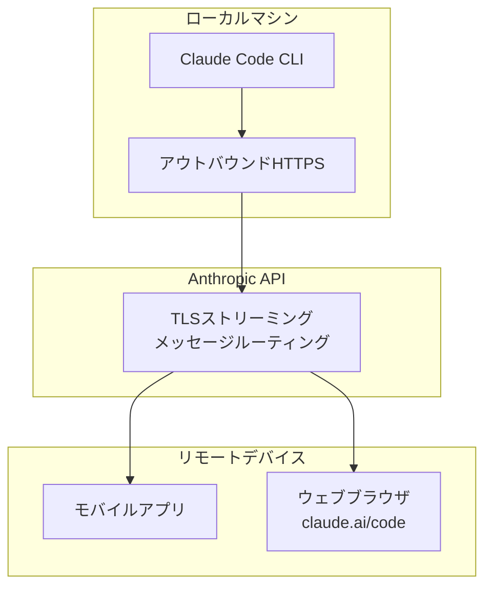
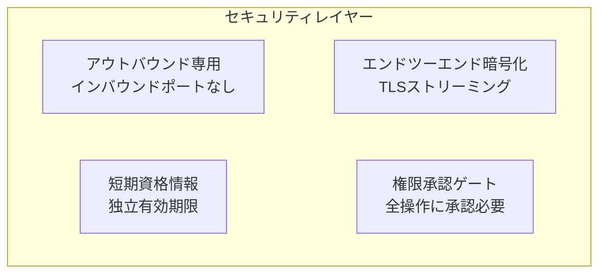

## Remote Controlとは？

Claude Code Remote Controlは、<strong>ローカルマシンで実行中のClaude Codeセッションをモバイルアプリやウェブブラウザから遠隔操作</strong>する機能です。2026年2月25日にリサーチプレビューとしてリリースされました。

重要なポイントを押さえましょう。

- コードと開発環境は<strong>100%ローカルに保持</strong>されます
- モバイル/ウェブは純粋な<strong>リモコン</strong>として機能します
- デスクトップで始めたタスクをソファからモニタリングしたり、会議室から指示を送ることができます



## セットアップ方法

### 方法1：グローバル設定（推奨）

すべてのセッションでRemote Controlを自動有効化するには、`/config`コマンドを使います。

```bash
# Claude Codeセッション内で
/config
```

設定メニューから<strong>「Enable Remote Control for all sessions」</strong>を選択します。以降、すべてのClaude Codeセッションで自動的にRemote Controlが有効になります。

### 方法2：セッション別有効化

特定のセッションでのみRemote Controlを有効にする場合：

```bash
# アクティブなセッション内で
/remote-control

# または省略形
/rc
```

### 方法3：CLIから直接起動

```bash
# 新しいRemote Controlセッションを開始
claude remote-control

# 詳細ログ付き
claude remote-control --verbose

# サンドボックスモードで実行
claude remote-control --sandbox
```

## リモートデバイスからの接続

Remote Controlが有効になると、3つの方法で接続できます。

### QRコードスキャン（最速）

ターミナルでスペースバーを押すとQRコードが表示されます。Claudeモバイルアプリでスキャンすれば即座に接続できます。

### セッションURLのコピー

ターミナルに表示されるセッションURLを別のデバイスのブラウザに貼り付けます。`claude.ai/code`で開きます。

### セッションリストから選択

`claude.ai/code`またはClaudeモバイルアプリを開くと、アクティブなセッションが緑のステータス表示とともに表示されます。

> <strong>ヒント</strong>：複数のセッションを運用する場合、`/rename`で意味のある名前を付けましょう。リモートデバイスでの識別が格段に楽になります。

## ネットワークアーキテクチャとセキュリティ

Remote Controlのセキュリティ設計は以下の原則に従います。



### 主要セキュリティ機能

| 項目 | 説明 |
|------|------|
| <strong>アウトバウンド専用</strong> | ローカルマシンからの発信接続のみ使用、インバウンドポートは開かない |
| <strong>エンドツーエンド暗号化</strong> | すべてのトラフィックがTLSで暗号化 |
| <strong>短期資格情報</strong> | 各資格情報は単一目的に限定、独立して有効期限切れ |
| <strong>Anthropicもコードを見られない</strong> | コードはローカルに留まり、Anthropicサーバーを経由しない |
| <strong>権限ゲート</strong> | すべてのツール実行に明示的な承認が必要 |

### セッションURL のセキュリティ

セッションURLは<strong>パスワードと同様に扱う</strong>必要があります。URLを持つ人は誰でもローカルセッションを操作できます。意図せず共有しないよう注意してください。

## 実践活用シナリオ

### シナリオ1：長時間リファクタリングのモニタリング

デスクトップで大規模なリファクタリングタスクを開始し、ランチに行きながらスマホで進捗を確認します。

```bash
# デスクトップで
/rename "api-refactoring"
/rc

# → QRコードをスマホでスキャン
# → リアルタイムで進捗モニタリング
# → 必要に応じてモバイルから追加指示
```

### シナリオ2：会議中のコード修正

会議中にバグレポートを受けたとき、席に戻らずその場で修正指示を送ります。

```bash
# モバイルアプリから、デスクトップセッションに接続して：
"src/api/auth.tsのトークン検証ロジックで有効期限チェックが漏れています。修正してください。"
```

### シナリオ3：テストスイートの監視

テストスイートを実行し、結果をリモートで確認します。個人用CIパイプラインのような使い方です。

```bash
# デスクトップでテスト開始
"テストスイート全体を実行して、失敗したものだけレポートして"

# → ソファに移動
# → モバイルでテスト結果を確認
# → 失敗したテストに対する修正指示を送信
```

### シナリオ4：マルチプロジェクト管理

複数プロジェクトのClaude Codeセッションにそれぞれ名前を付けて管理します。

```bash
# プロジェクトごとにセッション名を設定
/rename "frontend-nextjs"
/rename "backend-api"
/rename "infra-terraform"

# モバイルで：セッションリスト → プロジェクト選択 → 指示送信
```

## CLI連携コマンド

Remote Controlと合わせて便利なCLIオプションです。

```bash
# ウェブで新しいセッションを作成
claude --remote "ログインバグを修正して"

# ウェブセッションをローカルターミナルに転送
claude --teleport

# 前のセッションを名前で再開
claude --resume "api-refactoring"

# モバイルアプリダウンロードQRコード表示
/mobile
```

## 制限事項と注意点

リサーチプレビュー段階のため、いくつかの制限があります。

| 制限事項 | 説明 |
|----------|------|
| <strong>単一リモート接続</strong> | セッションあたり1つのリモート接続のみ対応 |
| <strong>ターミナル維持必須</strong> | `claude remote-control`プロセスが実行中である必要あり |
| <strong>ネットワークタイムアウト</strong> | 約10分間のネットワーク切断でセッション自動終了 |
| <strong>プラン制限</strong> | Maxプラン優先、Proプランは順次提供予定 |
| <strong>承認必須</strong> | `--dangerously-skip-permissions`でもバイパス不可 |
| <strong>初期安定性</strong> | 断続的なAPI 500エラーが発生する可能性あり |

## `/config`でセッションデフォルトを管理

`/config`コマンドはRemote Control以外にもさまざまな設定を管理します。Remote Control関連の設定を見てみましょう。

```bash
/config

# 表示される設定項目の中から：
# ✅ Enable Remote Control for all sessions
#    → すべての新しいセッションで自動有効化
```

一度設定すれば、毎回`/rc`を入力する必要なく、セッション開始時に自動的にRemote Controlが有効になります。

## コミュニティ代替ソリューション

公式Remote Control以外にも、コミュニティが作成した拡張ソリューションがあります。

| プロジェクト | 特徴 |
|-------------|------|
| <strong>claude-agent-server</strong> | WebSocketサーバーラッパー、E2Bサンドボックスデプロイ |
| <strong>claude-code-server</strong> | WebUIでCLIコマンド実行、Socket.ioリアルタイムストリーミング |
| <strong>247 Claude Code Remote</strong> | Tailscale VPN + Fly.io VM、どこからでもアクセス |

これらのプロジェクトは公式サポート対象外ですが、スケジューリングやプログラマティックなアクセスが必要な場合に便利です。

## まとめ

Claude Code Remote Controlは「デスクの前にいなければコーディングできない」という制約を取り除きます。コードはローカルマシンに安全に保持しながら、どこからでもAIエージェントにタスクを指示しモニタリングできます。

セットアップは`/config`一行で十分です。リサーチプレビュー段階のため断続的な不安定性はありますが、基本的なワークフローは十分に実用的です。

<strong>始めてみましょう</strong>：今すぐターミナルで`/config`を実行し、「Enable Remote Control for all sessions」を有効にしてください。
