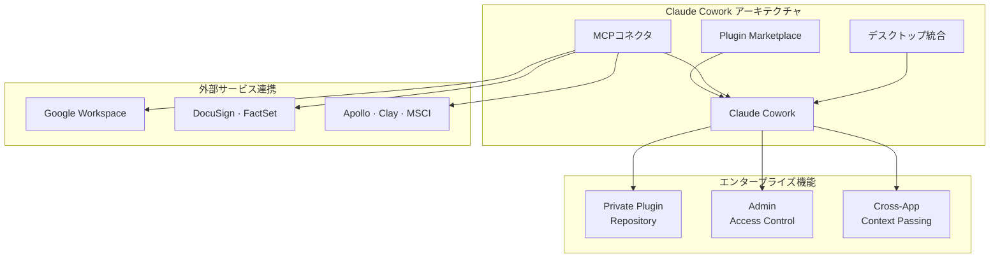
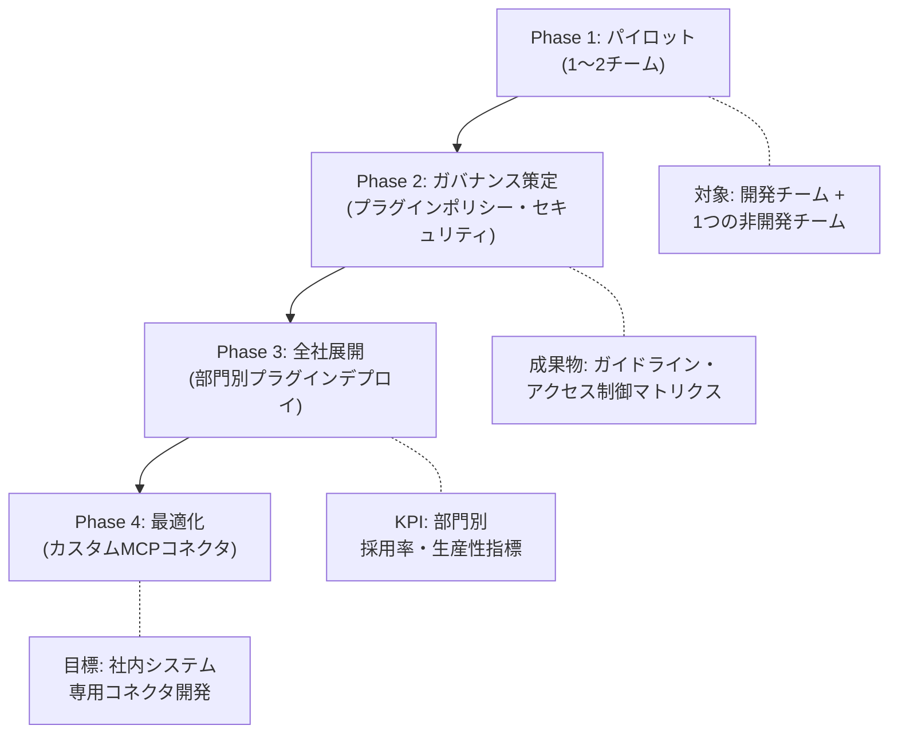

## Claude CodeからClaude Coworkへ

2026年1月、AnthropicはClaude Coworkをリサーチプレビューとして公開しました。2月24日にはエンタープライズ機能を大幅に強化し、本格的な市場参入を宣言しました。TechCrunchのヘッドラインがこの変化を的確に要約しています: <strong>「Claude Codeがプログラミングを変えたなら、Coworkは残りのエンタープライズを変える。」</strong>

Engineering Managerとしてこのプロダクトのローンチが意味するところを分析してみます。Claude Codeが開発チーム内部の生産性ツールだったのに対し、CoworkはHR、デザイン、ファイナンス、オペレーションなど全部門へAIエージェントの能力を拡張するプラットフォームです。

## Coworkのコアアーキテクチャ

Claude Coworkは3つの核となる軸で構成されています。

### 1. Plugin Marketplace — 組織カスタマイズ型AIツールエコシステム

最も注目すべき変化は<strong>Private Plugin Marketplace</strong>です。エンタープライズ管理者が組織専用のプラグインマーケットプレイスを構築できます。

<strong>主な機能:</strong>

- プライベートGitHubリポジトリをプラグインソースとして連携
- 従業員ごとのアクセス権限制御（どのプラグインを誰が使用できるか）
- HR、デザイン、エンジニアリング、オペレーション、ファイナンス分析、投資銀行、株式リサーチ、PE、資産管理など分野別プリビルトテンプレートを提供

これが重要な理由は、以前は各チームがそれぞれChatGPTやClaudeの「上手な使い方」を模索していたのに対し、<strong>組織レベルで検証済みのAIワークフローをデプロイ</strong>できるインフラが整ったという点です。

### 2. MCPコネクタ — 企業システムとのネイティブ統合

Claude CoworkはModel Context Protocol（MCP）を通じて企業の既存システムと直接連携します。新たに追加されたコネクタは以下の通りです:

| カテゴリ | サービス |
|---------|--------|
| <strong>生産性</strong> | Google Drive, Google Calendar, Gmail |
| <strong>契約・法務</strong> | DocuSign, LegalZoom |
| <strong>営業・マーケティング</strong> | Apollo, Clay, Outreach, SimilarWeb |
| <strong>金融・リサーチ</strong> | FactSet, MSCI |
| <strong>コンテンツ</strong> | WordPress, Harvey |

MCPコネクタの意義は単なるAPI連携以上のものです。Claudeがこれらのサービスのコンテキストを<strong>双方向で</strong>理解し操作できるということです。例えば「先週の契約書ドラフト3件をレビューし、主要リスクをまとめてほしい」と指示すれば、DocuSignからドキュメントを取得して分析し、結果をGoogle Driveに保存するワークフローが実現できます。

### 3. デスクトップ統合 — ExcelとPowerPointまで

Claude CoworkはClaudeデスクトップアプリ上で動作し、<strong>ExcelとPowerPointとの直接統合</strong>をサポートしています。核心は<strong>Cross-App Context Passing</strong>です:

- Coworkで分析した内容をExcelで引き続き作業
- ExcelのデータをPowerPointプレゼンテーションへ自動変換
- 複数ファイル間でコンテキストが維持されるため、アプリを切り替える際にゼロから説明し直す必要がない

この機能は特に経営層向けレポート作成、四半期ビジネスレビュー、投資分析などの業務で大きな生産性向上をもたらすことが期待されます。

## EM/CTO視点での戦略的インサイト

### 1. 「開発チームAI」から「全社AI」への転換

多くの組織でAI導入は開発チームから始まりました。Claude Code、GitHub Copilot、Cursorといったツールが代表例です。しかしCoworkのローンチはこの境界を取り払います。

<strong>CTOが検討すべき問い:</strong>

- 開発チームのAIツール導入経験を非開発部門へどう展開するか？
- Plugin Marketplaceのガバナンスポリシーを誰が管理するか？
- MCPコネクタを通じたデータアクセス範囲をどう制限するか？

### 2. ベンダーロックインとプラットフォーム戦略

AnthropicのCowork戦略は明確です — <strong>MCPを通じたオープンエコシステムの構築</strong>です。MCPがLinux Foundationに寄贈されオープンスタンダードとなった状況で、Coworkは「標準を最もよく実装したプロダクト」のポジションを先取りしようとしています。

比較:

| 項目 | Claude Cowork | Microsoft Copilot | Google Gemini for Workspace |
|------|-------------|-------------------|---------------------------|
| <strong>プロトコル</strong> | MCP（オープンスタンダード） | 独自規格 | 独自規格 |
| <strong>プラグインカスタマイズ</strong> | Private Marketplace | Admin Center | AppSheet |
| <strong>コーディングエージェント連携</strong> | Claude Code → Cowork | GitHub Copilot | Jules（限定的） |
| <strong>デスクトップ統合</strong> | Excel, PPT（新規） | Office 365ネイティブ | Google Workspace |

### 3. セキュリティ上の考慮事項

最近Check Point ResearchがClaude CodeにおいてCVE-2025-59536、CVE-2026-21852の脆弱性を発見した点は記憶に留めておく必要があります。Hooks、MCPサーバー設定、環境変数を通じたリモートコード実行とAPIキー窃取が可能でした（現在はパッチ済み）。

Coworkがより多くの企業システムと接続されるだけに、<strong>MCPコネクタのセキュリティ監査</strong>と<strong>プラグインコードレビュープロセス</strong>は必須です。

## 実践導入ロードマップ

エンタープライズでClaude Coworkを導入する際に推奨するフェーズ別アプローチを紹介します:

<strong>Phase 1: パイロット（2〜4週間）</strong>

- すでにClaude Codeを使用中の開発チーム + 1つの非開発チーム（例: ファイナンスまたはHR）
- 基本MCPコネクタ（Google Workspace）の接続
- プリビルトプラグインテンプレートのテスト

<strong>Phase 2: ガバナンス策定（2〜4週間）</strong>

- Private Plugin Marketplaceの設定
- プラグイン承認プロセスの定義
- MCPコネクタごとのデータアクセス範囲の設定
- セキュリティ監査チェックリストの策定

<strong>Phase 3: 全社展開（4〜8週間）</strong>

- 部門別カスタムプラグインのデプロイ
- 部門チャンピオン（AIアンバサダー）の指名
- 使用量および生産性指標のモニタリング

<strong>Phase 4: 最適化（継続的）</strong>

- 社内システム専用MCPコネクタの開発
- ワークフローオートメーションの高度化
- ROI測定および拡大可否の判断

## Anthropicのエンタープライズ戦略を読む

Coworkのローンチをより広い文脈で見ると、Anthropicの戦略は3段階で読み取れます:

1. <strong>開発者市場の掌握</strong>（2024〜2025年）: Claude Codeで開発者生産性市場におけるポジションを確立
2. <strong>エンタープライズ拡張</strong>（2026年初頭）: Coworkで非開発職種までAIエージェントを拡張
3. <strong>プラットフォームエコシステム</strong>（2026年〜）: MCPオープンスタンダード + Plugin Marketplaceでサードパーティエコシステムを構築

この戦略はSlackが開発チーム → 全社コミュニケーションツールへ進化した経路と類似しています。違いはCoworkが<strong>エージェンティックAIの実行力</strong>を提供するという点です — 単にメッセージをやり取りするのではなく、実際の業務を代行できます。

## まとめ

Claude Coworkのエンタープライズ版ローンチは、AIツール市場における重要なターニングポイントです。開発チーム内部に留まっていたAIエージェントが、全社的な生産性ツールへ拡張される初めての実質的な事例です。

EMやCTOとして今取り組むべきことは以下の通りです:

1. <strong>現在の組織におけるAIツール利用状況</strong>を把握する（シャドーAIを含む）
2. <strong>Coworkパイロット対象チーム</strong>を選定する
3. <strong>MCPコネクタのセキュリティポリシー</strong>を事前に策定する
4. <strong>プラグインガバナンス体制</strong>を設計する

AIが「開発者のツール」から「組織のインフラ」へ転換される局面にあります。この転換を能動的にマネジメントするか、受動的に追従するかが、今後の組織の技術競争力を決定づけるでしょう。

## 参考資料

- [Anthropic、Claude Coworkエンタープライズプラグイン拡張 — TechCrunch](https://techcrunch.com/2026/02/24/anthropic-launches-new-push-for-enterprise-agents-with-plugins-for-finance-engineering-and-design/)
- [Claude Cowork: 非開発者向けのClaude Code — TechCrunch](https://techcrunch.com/2026/01/12/anthropics-new-cowork-tool-offers-claude-code-without-the-code/)
- [Anthropic、Claude Coworkでオフィスワーカー生産性ツールをアップデート — CNBC](https://www.cnbc.com/2026/02/24/anthropic-claude-cowork-office-worker.html)
- [Claude Cowork、ExcelとPowerPointワークフローを革新 — Applying AI](https://applyingai.com/2026/03/how-anthropics-claude-is-revolutionizing-excel-and-powerpoint-workflows/)
- [Anthropic vs ペンタゴンAIガバナンス — Axios](https://www.axios.com/2026/03/03/ai-race-safety-guardrail)
