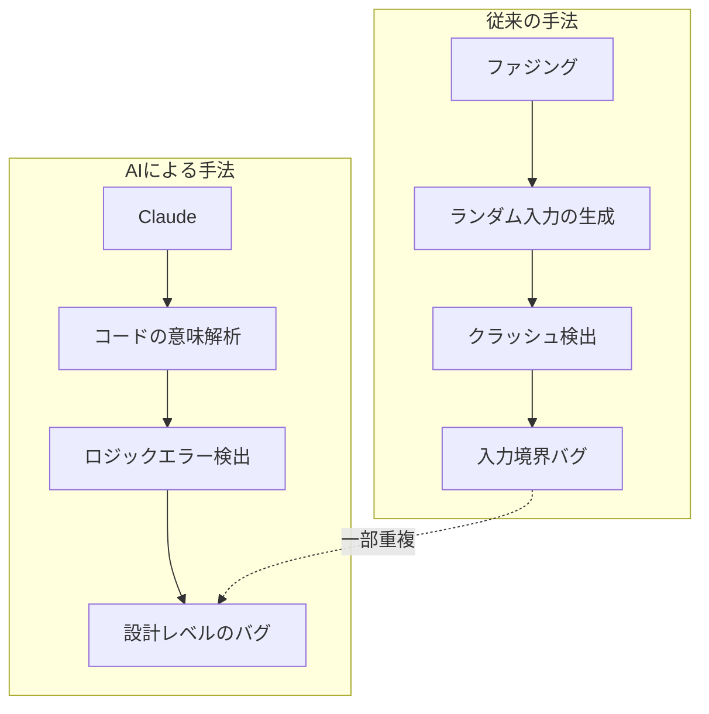
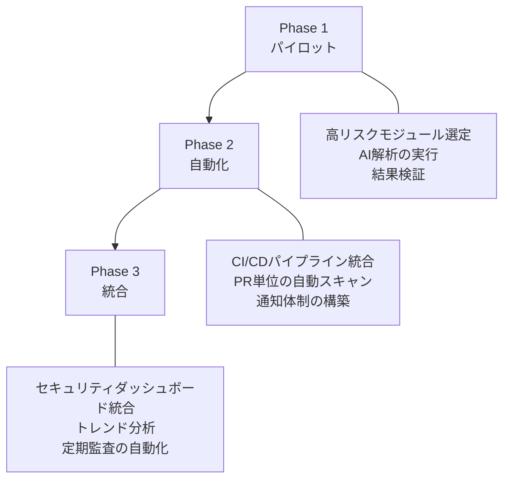

## 2週間、6,000個のC++ファイル、22件のCVE

2026年3月6日、AnthropicとMozillaはAIモデルを活用したブラウザセキュリティ監査の結果を共同発表しました。Claude Opus 4.6がFirefoxのC++コードベース約<strong>6,000個のファイル</strong>を分析し、<strong>112件のユニークなバグレポート</strong>を提出しました。そのうち<strong>22件が正式なCVE</strong>として登録されています。

深刻度の分類は以下の通りです：

| 深刻度 | 件数 | 割合 |
|--------|------|------|
| High | 14件 | 63.6% |
| Moderate | 7件 | 31.8% |
| Low | 1件 | 4.5% |

14件の高深刻度の脆弱性は、2025年の1年間にパッチが適用されたFirefoxの高深刻度脆弱性の<strong>約5分の1</strong>に相当します。これらの脆弱性はすべてFirefox 148でパッチ済みです。

## ファジングが見逃したものをAIが発見した

Firefoxは数十年にわたって<strong>ファジング（fuzzing）</strong>、<strong>静的解析（static analysis）</strong>、定期的なセキュリティレビューを経てきたプロジェクトです。それでもClaudeが新たな脆弱性を発見できた理由は非常に興味深いものがあります。

核心的な違いは<strong>検出対象の性質</strong>にあります：

- <strong>ファジング</strong>：ランダムな入力でクラッシュを誘発する手法です。入力バリデーションの欠如やバッファオーバーフローのようなパターンに強みがあります。
- <strong>AIコード解析</strong>：コードの意味とコンテキストを理解し、論理的な欠陥を検出します。ファジングが見逃す<strong>ロジックエラー（logic errors）</strong>や<strong>Use After Free</strong>のような複合的なメモリ脆弱性を発見します。

Mozillaの公式発表によると、Claudeは「数十年にわたるファジングと静的解析にもかかわらず、これまで知られていなかった多くのバグを発見」しました。特にJavaScriptエンジンの探索を開始してから<strong>わずか20分で</strong>Use After Free脆弱性を1件発見した事例が報告されています。

## 112件のレポート品質 — Mozillaが信頼した理由

単に「脆弱性をN件発見」したことよりも重要なのは<strong>レポートの品質</strong>です。MozillaセキュリティチームがAnthropicの結果を迅速に受け入れることができた理由は3つあります：

1. <strong>最小再現テストケース（Minimal Test Case）</strong>：各バグに対して再現可能な最小コードを併せて提出
2. <strong>詳細なPoC（Proof of Concept）</strong>：脆弱性がどのように悪用され得るか具体的なシナリオを提示
3. <strong>候補パッチ（Candidate Patches）</strong>：修正案まで含まれた完結型レポート

この構成のおかげで、Mozillaセキュリティチームはレポート受信後<strong>数時間以内に</strong>検証を完了し、修正作業に着手することができました。セキュリティ監査において最大のボトルネックである「レポートトリアージ（triage）」の時間が大幅に短縮されたことになります。

## エクスプロイト vs 検出 — AIの現在地

注目すべき点として、Anthropicは別途Claudeの<strong>エクスプロイト開発能力</strong>もテストしています：

| 項目 | 結果 |
|------|------|
| テスト回数 | 数百回 |
| APIコスト | $4,000 |
| 成功したエクスプロイト | 2件 |

<strong>脆弱性検出能力</strong>と<strong>エクスプロイト開発能力</strong>の間には大きなギャップがあります。AIはコードを読み取り潜在的な問題を特定する点では優れていますが、実際の攻撃コードを作成することはまだ困難です。これは防御側に有利な非対称性であり、セキュリティチームがAIを攻撃よりも防御に先行して活用できる<strong>時間的猶予（window of opportunity）</strong>があることを意味します。

## EM/CTOのための実践的な示唆

この事例がエンジニアリングリーダーに示す示唆をまとめます。

### 1. AIセキュリティ監査の導入ロードマップ

<strong>Phase 1（パイロット、1〜2週間）</strong>：
- レガシーコードの中からセキュリティ上重要なモジュール（認証、決済、データ処理）を選定
- LLMベースのコード解析ツールで1回限りの監査を実施
- 結果を既存のセキュリティチームが検証し、信頼度を測定

<strong>Phase 2（自動化、1〜2ヶ月）</strong>：
- CI/CDパイプラインにAIセキュリティスキャンのステップを追加
- PR単位で変更されたコードに対する自動解析
- Slack/メール通知体制の構築

<strong>Phase 3（統合、四半期ごと）</strong>：
- セキュリティダッシュボードにAI監査結果を統合
- 脆弱性トレンドの分析とリスクスコアリング
- 四半期ごとの全コードベース自動監査

### 2. コスト対効果

Anthropicの事例を基準にした推定は以下の通りです：

| 項目 | 従来の方式 | AI監査 |
|------|------------|---------|
| 所要期間 | 数週間〜数ヶ月 | 2週間 |
| 専門人材 | シニアセキュリティエンジニア2〜3名 | AI + 検証担当1名 |
| 範囲 | サンプリングベース | 全コードベース（6,000ファイル） |
| レポート品質 | 専門家レベル | テストケース + PoC + パッチ付き |

もちろん、AI監査が人間の専門家を完全に置き換えるものではありません。最適なアプローチは、<strong>AIが一次スクリーニング</strong>を行い、<strong>人間の専門家が検証と優先順位の判断</strong>を担うハイブリッドモデルです。

### 3. 組織内への導入時の考慮事項

- <strong>コードの機密性</strong>：外部AI APIにコードを送信することに関するセキュリティポリシーの検討が必要です。オンプレミスモデルまたはゼロリテンションAPI契約の検討をお勧めします
- <strong>誤検出（False Positive）管理</strong>：112件中22件が実際にCVEとして登録された比率（約20%）です。残りは低深刻度のバグまたは誤検出です。トリアージプロセスが不可欠です
- <strong>既存ツールとの統合</strong>：SAST（静的解析）、DAST（動的解析）、SCA（ソフトウェア構成分析）など、既存のAppSecパイプラインとの連携戦略の策定が必要です
- <strong>規制準拠</strong>：SOC 2、ISO 27001などのコンプライアンスフレームワークにおいて、AIセキュリティ監査結果をエビデンスとして活用する方法の検討が求められます

## より広い文脈 — AI AppSecの未来

今回の事例は一過性のイベントではなく、<strong>AIベースのセキュリティ監査</strong>が業界標準へと進化していく流れの一部です：

- <strong>Google Project Zero</strong>はすでにLLMを活用した脆弱性検出の研究を進めています
- <strong>GitHub Copilot</strong>のセキュリティレビュー機能が強化されつつあります
- <strong>NIST</strong>のAIエージェントセキュリティ標準は、逆にAIをセキュリティツールとして活用するためのガイドラインも含んでいます

EM/CTOの立場から重要な問いは「AIセキュリティ監査を導入するかどうか」ではなく、<strong>「いつ、どのような順序で導入するか」</strong>です。Firefoxのように数十年にわたり検証されてきたコードベースでもAIが新たな脆弱性を発見できるのであれば、皆さんのコードベースではどうでしょうか。

## 要点まとめ

| 項目 | 内容 |
|------|------|
| 主体 | Anthropic（Claude Opus 4.6）× Mozilla |
| 期間 | 2週間（2026年2月） |
| 範囲 | Firefox C++コードベース 6,000個のファイル |
| 結果 | 112件のレポート → 22 CVE（高深刻度14件） |
| 主な差別化要因 | ファジングが見逃したロジックエラーの検出 |
| レポート品質 | 最小再現コード + PoC + 候補パッチ付き |
| パッチ状況 | Firefox 148で全件パッチ済み |

## 参考資料

- [Anthropic公式発表: Mozilla Firefox Security](https://www.anthropic.com/news/mozilla-firefox-security)
- [Mozillaブログ: Hardening Firefox with Anthropic's Red Team](https://blog.mozilla.org/en/firefox/hardening-firefox-anthropic-red-team/)
- [TechCrunch: Anthropic's Claude found 22 vulnerabilities in Firefox over two weeks](https://techcrunch.com/2026/03/06/anthropics-claude-found-22-vulnerabilities-in-firefox-over-two-weeks/)
- [The Hacker News: Anthropic Finds 22 Firefox Vulnerabilities](https://thehackernews.com/2026/03/anthropic-finds-22-firefox.html)
