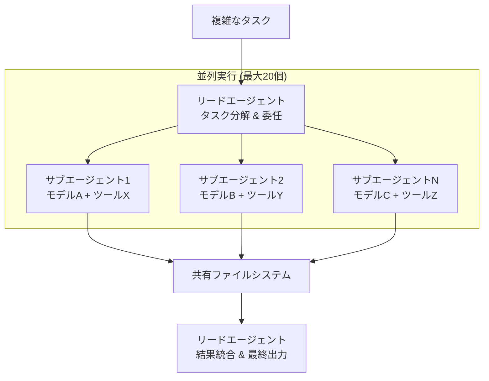
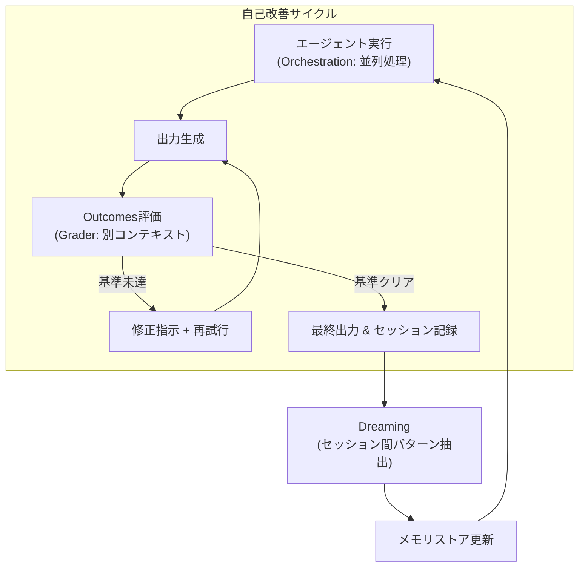

5月6日、サンフランシスコのCode with Claudeカンファレンスで、AnthropicがManaged Agentsに三つの新機能を発表したとき、私が最初に思ったのはこの問いだった。「このエージェントは、私が退勤した後、何を学んでいるのだろう？」

Dreaming、Outcomes、Multiagent Orchestration。名前だけ見るとマーケティング的な印象があるが、構造を掘り下げると具体的なエンジニアリングの決定が込められている。特にDreamingについては、初めて聞く人が誤解しやすいポイントがある。「エージェントが学習する」という言い方は正しいが、モデルが改善するわけではない。変わるのはメモリだ。この区別が実際に重要になる。

APIキーがないためDreamingを直接実行することはできなかった。Research Preview段階でもある。この記事は公式ドキュメント、Anthropicブログ、カンファレンス発表資料、そして初期パイロット事例をもとに、三つの機能の構造を分析する。

## Code with Claude 2026 — 新モデルなし、エージェントインフラのみ

5月6日のSFキーノートで最も印象的だったのは、新モデルの発表がなかった点だ。Anthropicはモデル競争ではなく、エージェント実行インフラに注力した。

主な発表内容：

- **Dreaming**：エージェントメモリの自動更新（Research Preview）
- **Outcomes**：成功基準に基づく自己評価・反復（Public Beta）
- **Multiagent Orchestration**：リード-サブエージェント並列実行（Public Beta）
- 使用制限を2倍に拡大（Pro、Max、Team、Enterprise）
- ピーク時間帯のスロットリング廃止（Pro、Max）
- <strong>Claude Security</strong>：コード脆弱性スキャナー（Enterprise、Opus 4.7ベース）
- Remote Agents：スマートフォンでノートPCを制御
- SpaceX Project Colossusパートナーシップ（220,000台以上のGPU）

これらの発表は、昨年に個人開発者向けプレビューとして始まったManaged Agentsが、エンタープライズ規模のワークフローへと進化していることを示している。実際にNotion、Rakuten、Sentry、Harveyがすでにプロダクションで適用中だとAnthropicは述べた。

カンファレンスはSFに続き、ロンドン（5月19日）、東京（6月10日）でも開催される予定だ。

## Dreaming — 眠りながら整理するメモリシステム

AnthropicがDreamingを説明する際に使った比喩が、海馬（hippocampus）のメモリ統合だ。人間が睡眠中に日中の経験を整理し、重要な情報を長期記憶へ移す過程と似ているという。

Dreamingが技術的に行うプロセス：

1. 過去のセッション（最大100件）を確認する
2. 繰り返しのミス、収束したワークフロー、チームの好みなどのパターンを抽出する
3. 既存のメモリストアから重複・古い項目を削除し、新しい項目を追加する
4. 元のセッション記録はそのまま保持する

<strong>重要な点：モデルの重みは変更されない。</strong> Dreamingはファインチューニングではない。変わるのは、エージェントが次のセッション開始時に参照するメモリストアだ。Anthropicも明示的に述べている。"Dreaming does not modify the underlying model weights."

Harvey（法律AI企業）のパイロット結果がよく引用される。タスク完了率が約6倍向上したという。具体的には、Dreaming有効化後、エージェントがファイル形式の特性やツール固有のパターンをセッション間で記憶するようになり、完了率が上昇したとのことだ。

この数値は興味深いが、文脈が重要だと私は思う。Harveyは法律文書処理専門のAI企業だ。同じ種類の契約書、同じツール、反復的なレビューワークフロー — パターンが明確な環境だ。この条件下でメモリ学習がうまく機能するのは合理的だ。しかし、リクエストが毎回異なる汎用エージェント環境で「6倍」を期待するのは難しい。

DreamingはまだResearch Previewのため、公式ドキュメントと初期ユーザーレポートに基づいてのみ分析できる。直接テストしたかのように書くつもりはない。

## Outcomes — LLM-as-judgeパターンの製品化

Outcomesは正直、新しい概念ではない。LLM-as-judge、つまり別のモデルインスタンスがエージェントの出力を評価するパターンは、すでに多くのエージェントシステムで使われている。AnthropicがこれをManaged Agentsに統合した方法が注目ポイントだ。

Outcomesの動作方式：

```
1. 開発者が成功基準（rubric）を作成
   例：「契約条項が法的要件A、B、Cをすべて満たすこと」

2. Writer エージェントが出力を生成

3. Graderが別のコンテキストウィンドウでrubricを基準に評価
   - Writerの推論プロセスに影響されない独立した評価
   - 基準ごとの合否判定を出力

4. 不合格項目があれば → Graderが修正指示をWriterに送信

5. Writerが修正して再試行

6. すべての基準をパス → 結果を返す
```

核心設計ポイントは、graderが<strong>完全に別のコンテキストウィンドウ</strong>で実行されることだ。Writerの推論プロセスに汚染されず独立して評価する。単に「自己レビュー」をさせるのとは異なる理由がここにある。同じコンテキスト内でself-reviewをすると、Writerが自分の結果物に対して偏った評価を下す可能性が高い。

Anthropicの内部ベンチマーク結果：Word文書生成品質8.4%向上、PowerPointスライド10.1%向上。

実際の導入では、rubricの設計が核心作業となる。緩すぎるrubricではOutcomesの効果がなく、厳しすぎるとエージェントが無限修正ループに陥る可能性がある。

4月に取り上げた[Managed Agents基本デプロイガイド](/ja/blog/ja/claude-managed-agents-production-deployment-guide)でAPIチェーン設定とセッションあたり$0.08のコスト構造を分析したが、Outcomesを追加するとgrader実行コストが加わる構造だ。実際のコストはrubricの複雑さと再試行回数によって変わる。

## Multiagent Orchestration — 並列処理の標準化

複雑なタスクを一つのエージェントが順次処理するよりも、専門エージェント複数が並列で分担する方が速く品質も高いことは知られた事実だ。[Claude Codeのエージェントワークフロー5パターン](/ja/blog/ja/claude-code-agentic-workflow-patterns-5-types)でもこの構造を取り上げたことがある。

Multiagent Orchestrationが追加するもの：

- リードエージェントが複雑なタスクを分解し、サブエージェントに委任
- サブエージェントは最大20個まで並列実行
- 各サブエージェントは<strong>独自のモデル、プロンプト、ツール</strong>を組み合わせ可能
- 共有ファイルシステムで成果物を共有
- Claude Consoleで全体フローを追跡可能



各サブエージェントが独自のモデルとツールを持てる点が重要だ。例えば、コード生成サブエージェントはClaude Opus 4.7を、高速検証サブエージェントはClaude Haiku 4.5を使うように構成できる。パフォーマンスとコストを同時に最適化できる構成だ。

## 三つの機能が一緒に作る自己改善ループ

Dreaming、Outcomes、Orchestrationをそれぞれ独立して見ると、別々の機能のように見える。一緒に動く方式を見ると構造が見えてくる。



Observe：エージェントがタスクを実行する間、セッションデータが蓄積される。

Evaluate：Outcomesのgraderが各タスクを成功基準で評価する。失敗原因が記録される。

Improve：Dreamingが定期的に蓄積されたセッションデータを検討し、メモリを更新する。次のセッションのエージェントはこのメモリを参照する。

このサイクルが繰り返されると、エージェントは新しいスキルを習得したわけではなく、「どの状況で何に注意すべきか」という運用知識が蓄積される。モデルはそのままなのにパフォーマンスが改善する構造だ。

[エージェントメモリ学習パターンのより深い分析はHindsight MCPの記事](/ja/blog/ja/hindsight-mcp-agent-memory-learning)で取り上げたことがある。Dreamingが追求する「経験ベースのメモリ更新」の哲学と類似したアプローチだ。

## 批判的に見ると — まだ検証されていない点

いくつかの点が正直気になる。

<strong>第一に、Harvey 6倍数値の一般化可能性。</strong> Harveyは法律文書処理専門のAI企業だ。同じ種類の文書を繰り返し処理する環境でのパターン学習はうまく機能する。しかし「AIエージェントを使えば完了率が6倍になる」という結論は誤解だ。法律文書の反復性が前提となっている数値だ。

<strong>第二に、メモリ汚染（memory poisoning）のリスク。</strong> Dreamingが間違ったパターンを強化する可能性がある。エージェントが繰り返し間違った方向でアプローチしていたなら、Dreamingはその誤ったアプローチをパターンとして記録しうる。Anthropicは「メモリ変更を適用前にレビューできる」オプションを提供すると述べているが、実際にすべてのチームがこれを丁寧にレビューできるかは別の問題だ。

<strong>第三に、ガバナンスの緊張。</strong> エージェントが自ら行動パターンを変えるシステムは監査（audit）が難しい。「6ヶ月前にエージェントがなぜその決定を下したか」を追跡するためには、メモリストアのバージョン管理が必要になる。この点についてAnthropicの公式ガイドはまだ十分ではない。

<strong>第四に、Research Previewの状態。</strong> DreamingはまだResearch Previewだ。Public BetaのOutcomes、Orchestrationと異なり、プロダクションでの安定性はさらなる検証が必要だ。[エージェントコスト現実分析の記事](/ja/blog/ja/ai-agent-cost-reality)でも強調したが、エージェントシステムの運用コストはトークンコストだけではない。ガバナンスコスト、モニタリングコスト、デバッグコストが伴う。

第五に、Outcomesのgrader実行コストだ。graderもエージェントセッションとして実行されるため、rubricが複雑で再試行が多くなるほどコストが線形的に増加する。これに対するコスト予測ツールはまだない。

## 誰に向いているか、そして私の判断

<strong>まずOutcomesを導入することを勧める。</strong> 既にManaged Agentsを使っていて、出力品質の一貫性が課題のチームであれば、rubric設計に時間を投資する価値がある。graderの分離構造はself-reviewの偏りの問題を実際に解決する。Public Betaのため安定性も相対的に高い。

<strong>Multiagent Orchestrationは、単一エージェントが処理するには大きすぎるか、多様な専門知識が必要なタスクに適している。</strong> 大規模レポート生成、コードレビューとドキュメント化の同時進行、複数データソース分析など。ただし、20個のサブエージェントを設計ミスするとオーケストレーションのオーバーヘッドが並列化の恩恵を相殺することがある。

<strong>Dreamingは慎重に取り組むことを勧める。</strong> Research Previewの状態であり、メモリガバナンス体制が整っているチームでのみ試験的に適用する価値がある。エージェントが繰り返し同じ種類のタスクを長期間処理する環境ほど、Dreamingの効果が大きい。毎回異なるリクエストを処理する環境では効果が不明確だ。

三つの機能の組み合わせは興味深いと思う。Observe → Evaluate → Improveのサイクルが明確に設計されている。しかし「自己改善エージェント」というフレーミングが生み出す過大な期待は警戒すべきだ。モデルが改善するのではなく、メモリが改善するのであり、メモリは間違う可能性がある。そしてResearch Preview機能は、Anthropicが直接警告するように、プロダクションでの検証がまだ十分ではない。

## 実行可能性の判断

私が直接再現できた範囲はここまでだ：Anthropic SDKのインストール、基本Messages API接続。Managed AgentsのDreaming、Outcomes、OrchestrationはEnterprise/Betaプランが必要な機能のため、直接実行できなかった。

公式ドキュメントで確認した範囲：
- [New in Claude Managed Agents: dreaming, outcomes, and multiagent orchestration](https://claude.com/blog/new-in-claude-managed-agents)
- Outcomes実装例：[Claude Cookbook — managed-agents-cma-verify-with-outcome-grader](https://platform.claude.com/cookbook/managed-agents-cma-verify-with-outcome-grader)
- Code with Claude 2026概要：[Code w/ Claude SF 2026](https://claude.com/blog/code-w-claude-sf-2026-sf)

直接使用したチームの公開レポートが増えれば、特にHarvey以外のドメインでのDreaming効果データが出れば、判断を更新する予定だ。今は「興味深い構造だが、まだ十分に検証されていない機能」という評価が適切だと思う。
