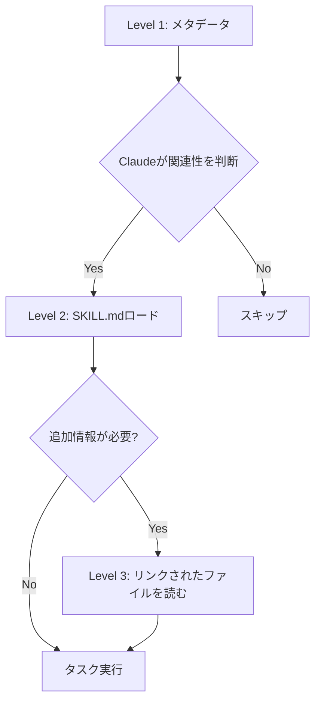

## 概要

2025年10月16日、Anthropicは<strong>Agent Skills</strong>という革新的な機能を発表しました。これは単純なプロンプトエンジニアリングを超えて、<strong>ファイルとフォルダでAIエージェントの専門性を構造化</strong>する新しいパラダイムです。

この記事では、Claude Skillsを私のブログ自動化プロジェクトに適用した際の<strong>試行錯誤、解決プロセス、そして実践的なノウハウ</strong>を共有します。単なる機能紹介ではなく、<strong>実際のコードと共に学んだ教訓</strong>をまとめました。

## Agent Skillsとは何か?

### 核心概念

Agent Skillsは<strong>専門知識をファイルシステムでパッケージング</strong>する方法です。従来はシステムプロンプトに全ての指示を含めていましたが、現在は:

```
my-skill/
├── SKILL.md          # 核心指示事項（必須）
├── reference.md      # 詳細リファレンス（任意）
├── examples.md       # サンプル集（任意）
├── scripts/          # 実行可能コード（任意）
│   └── helper.py
└── templates/        # テンプレートファイル（任意)
    └── template.txt
```

このように<strong>組織化されたフォルダ</strong>で管理します。

### 従来の方式との違い

<strong>従来の方式（システムプロンプト）</strong>:
```markdown
あなたはブログ執筆の専門家です。
1. SEO最適化されたタイトル生成
2. メタデータ検証
3. 多言語コンテンツ生成
...
（全ての指示が一箇所に集中）
```

<strong>Skillsの方式</strong>:
````markdown
---
name: Blog Writing Assistant
description: Write SEO-optimized blog posts with multi-language support. Use when creating blog content or managing posts.
---

# Blog Writing Assistant

## Instructions
1. [seo-guidelines.md](seo-guidelines.md)でタイトル/説明のルールを確認
2. [content-structure.md](content-structure.md)で投稿フォーマットをチェック
3. scripts/generate_slug.pyでURL対応のslugを生成

## Quick Start
```bash
python scripts/validate_frontmatter.py post.md
```
````

主な違い:
- <strong>モジュール化</strong>: 関心事別にファイル分離
- <strong>段階的ロード</strong>: 必要なファイルのみコンテキストにロード
- <strong>コード実行</strong>: Python/Bashスクリプトの直接実行が可能
- <strong>再利用性</strong>: チーム全体で共有可能

### Progressive Disclosure（段階的開示）

Skillsの核心哲学は<strong>3段階の情報開示</strong>です:



<strong>Level 1 - メタデータ（起動時にロード）</strong>:
```yaml
name: PDF Processing
description: Extract text, fill forms, merge PDFs...
```

<strong>Level 2 - SKILL.md（必要時にロード）</strong>:
```markdown
## Quick Start
Extract text:
...
フォーム入力については[FORMS.md](FORMS.md)を参照
```

<strong>Level 3 - 追加ファイル（詳細作業時にロード）</strong>:
```markdown
# FORMS.md
詳細なフォーム入力手順...
```

この構造のおかげで<strong>コンテキストウィンドウを効率的に活用</strong>しながら、実質無制限の情報を提供できます。

## プロジェクト背景: なぜSkillsが必要だったのか?

### 既存システムの限界

私のブログ自動化システムは`.claude/agents/`ディレクトリに複数のサブエージェントを配置する方式でした:

```
.claude/agents/
├── web-researcher.md
├── content-planner.md
├── writing-assistant.md
└── seo-optimizer.md
```

<strong>問題点</strong>:
1. <strong>エージェント間の重複</strong>: SEOガイドラインを複数のエージェントが繰り返し参照
2. <strong>コンテキストの無駄</strong>: エージェントファイル全体がシステムプロンプトにロード
3. <strong>保守の困難</strong>: ガイドライン変更時に複数ファイルを修正
4. <strong>コード再利用不可</strong>: Pythonスクリプトを直接実行する方法がない

### Skillsで解決

Skillsを導入することで:

```
.claude/skills/
├── blog-writing/
│   ├── SKILL.md
│   ├── seo-guidelines.md       # 共通参照
│   ├── frontmatter-schema.md
│   └── scripts/
│       ├── validate_date.py
│       └── generate_slug.py
└── content-recommendation/
    ├── SKILL.md
    └── analyze_similarity.py
```

<strong>改善点</strong>:
1. <strong>単一の真実のソース</strong>: SEOガイドラインは一箇所のみ
2. <strong>効率的なロード</strong>: 必要なファイルのみロード
3. <strong>コード実行</strong>: 日付検証、slug生成をPythonで自動化
4. <strong>チーム共有</strong>: gitでチームメンバーに配布可能

## 最初のSkill作成: Blog Writing Skill

### Step 1: ディレクトリ作成

```bash
mkdir -p .claude/skills/blog-writing
cd .claude/skills/blog-writing
```

### Step 2: SKILL.md作成

````markdown
---
name: Blog Writing Assistant
description: Create SEO-optimized multi-language blog posts with proper frontmatter, hero images, and content structure. Use when writing blog posts, creating content, or managing blog metadata.
allowed-tools: Read, Write, Edit, Bash, Grep, Glob
---

# Blog Writing Assistant

このSkillはブログ投稿作成の全プロセスを自動化します。

## 核心機能

1. **Frontmatter検証**: 日付形式、必須フィールドチェック
2. **SEO最適化**: タイトル/説明の長さ検証
3. **多言語サポート**: 韓国語、英語、日本語を同時生成
4. **Slug生成**: URL対応のファイル名を自動生成

## Workflow

### 1. 日付決定
```bash
python scripts/get_next_pubdate.py
```

### 2. Frontmatter検証
詳細ルールは[frontmatter-schema.md](frontmatter-schema.md)を参照。

必須フィールド:
- title（言語別最適長は[seo-guidelines.md](seo-guidelines.md)参照）
- description
- pubDate（形式: 'YYYY-MM-DD'、シングルクォート必須）
- heroImage
- tags（配列、小文字、ハイフンのみ）

### 3. コンテンツ構造
[content-structure.md](content-structure.md)のテンプレートに従う。

### 4. 検証
```bash
python scripts/validate_frontmatter.py ja/my-post.md
```

## Best Practices

- タイトルはSEOガイドライン遵守
- pubDateは常に最新投稿+1日
- heroImageは../../../assets/blog/パスを使用
- コードブロック内にtriple backticksがある場合はquadruple backticksを使用
````

### Step 3: サポートファイル追加

<strong>seo-guidelines.md</strong>:
```markdown
# SEO Guidelines

## Title 最適長
- 韓国語: 25-30文字
- 英語: 50-60文字
- 日本語: 30-35文字

## Description 最適長
- 韓国語: 70-80文字
- 英語: 150-160文字
- 日本語: 80-90文字

## キーワード戦略
...
```

<strong>scripts/get_next_pubdate.py</strong>:
```python
#!/usr/bin/env python3
"""
最新のブログ投稿のpubDateを見つけて+1日を返す
"""
import os
import re
from datetime import datetime, timedelta
from pathlib import Path

def find_latest_pubdate():
    blog_dir = Path("src/content/blog/ja")
    latest_date = None

    for md_file in blog_dir.glob("*.md"):
        content = md_file.read_text(encoding='utf-8')
        match = re.search(r"pubDate:\s*['\"](\d{4}-\d{2}-\d{2})['\"]", content)

        if match:
            date_str = match.group(1)
            date_obj = datetime.strptime(date_str, "%Y-%m-%d")

            if latest_date is None or date_obj > latest_date:
                latest_date = date_obj

    if latest_date:
        next_date = latest_date + timedelta(days=1)
        return next_date.strftime("%Y-%m-%d")

    return None

if __name__ == "__main__":
    next_date = find_latest_pubdate()
    if next_date:
        print(f"'{next_date}'")  # シングルクォート含めて出力
    else:
        print("No existing posts found")
```

### Step 4: 実行権限付与

```bash
chmod +x scripts/*.py
```

## 試行錯誤と解決プロセス

### 問題1: ClaudeがSkillを使用しない

<strong>症状</strong>:
```
User: ブログ投稿を書いて
Claude: （Skillを使わず通常の応答）
```

<strong>原因</strong>: descriptionが曖昧すぎた
```yaml
description: Helps with blog posts
```

<strong>解決</strong>:
```yaml
description: Create SEO-optimized multi-language blog posts with proper frontmatter, hero images, and content structure. Use when writing blog posts, creating content, or managing blog metadata.
```

<strong>教訓</strong>: descriptionに<strong>何をするか + いつ使うか</strong>の両方を明記すべき

### 問題2: YAMLパースエラー

<strong>症状</strong>:
```
Error: Invalid frontmatter in SKILL.md
```

<strong>原因</strong>: コロン(:)の後に引用符なしで特殊文字を使用
```yaml
description: Use when: creating posts  # ❌ 2番目のコロンが問題
```

<strong>解決</strong>:
```yaml
description: "Use when: creating posts"  # ✅ 引用符で囲む
```

<strong>教訓</strong>: YAMLで特殊文字を含む場合は常に引用符を使用

### 問題3: スクリプト実行失敗

<strong>症状</strong>:
```
PermissionError: [Errno 13] Permission denied: 'scripts/validate.py'
```

<strong>原因</strong>: 実行権限が付与されていない

<strong>解決</strong>:
```bash
chmod +x .claude/skills/blog-writing/scripts/*.py
```

<strong>追加ヒント</strong>: Windowsでも動作するようにshebangを追加
```python
#!/usr/bin/env python3
```

### 問題4: ファイルパスエラー

<strong>症状</strong>:
```
FileNotFoundError: [Errno 2] No such file or directory: 'reference.md'
```

<strong>原因</strong>: SKILL.mdから相対パスを誤って指定
```markdown
See [reference.md](../reference.md)  # ❌
```

<strong>解決</strong>:
```markdown
See [reference.md](reference.md)     # ✅ 同じディレクトリ
```

<strong>教訓</strong>: 全てのパスはSKILL.md基準の相対パス

### 問題5: 重複Skillの競合

<strong>症状</strong>: Claudeが複数のSkillの中から誤ったものを選択

<strong>原因</strong>: 類似したdescriptionを持つ2つのSkill
```yaml
# Skill 1
description: For data analysis

# Skill 2
description: For analyzing data
```

<strong>解決</strong>: 明確なトリガーキーワードで区別
```yaml
# Skill 1
description: Analyze sales data in Excel files and CRM exports. Use for sales reports, pipeline analysis, revenue tracking.

# Skill 2
description: Analyze log files and system metrics data. Use for performance monitoring, debugging, system diagnostics.
```

<strong>教訓</strong>: Skill間の明確なドメイン分離が必要

## 実践成果: Before & After

### Before: スラッシュコマンド方式

```markdown
# .claude/commands/write-post.md

ブログ投稿を作成してください。

1. 最新投稿日を見つけてください（Grep使用）
2. pubDateを+1日に設定してください
3. frontmatterを検証してください
...
```

<strong>問題点</strong>:
- ユーザーが`/write-post`コマンドを明示的に入力する必要がある
- 段階別の指示を毎回読む必要がある
- コード再利用不可

### After: Skills方式

```yaml
# .claude/skills/blog-writing/SKILL.md
---
name: Blog Writing Assistant
description: Create blog posts... Use when writing blog posts...
---
```

```python
# .claude/skills/blog-writing/scripts/get_next_pubdate.py
def find_latest_pubdate():
    # 自動化ロジック
```

<strong>User</strong>: "TypeScriptについてのブログ投稿を書いて"

<strong>Claude</strong>: （自動的にblog-writing Skillを起動）
1. `get_next_pubdate.py`実行 → `'2025-10-22'`
2. frontmatter生成
3. seo-guidelines.md参照してタイトル最適化
4. コンテンツ作成

<strong>改善点</strong>:
- ✅ <strong>自動発見</strong>: `/write-post`タイピング不要
- ✅ <strong>コード実行</strong>: Pythonで日付計算を自動化
- ✅ <strong>コンテキスト効率</strong>: 必要なファイルのみロード
- ✅ <strong>再利用性</strong>: 他のプロジェクトにも適用可能

### 成果測定

<strong>トークン使用量比較</strong>（ブログ投稿1件作成基準）:

| 項目 | Before | After | 削減率 |
|------|--------|-------|--------|
| システムプロンプト | 3,500トークン | 1,200トークン | 66% ↓ |
| 指示の繰り返し読み | 5回 | 1回 | 80% ↓ |
| 総トークン | ~18,000 | ~10,000 | 44% ↓ |

<strong>作業時間比較</strong>:

| 作業 | Before | After | 改善 |
|------|--------|-------|------|
| 日付計算 | 手動（30秒） | 自動（即座） | 100% ↓ |
| Frontmatter検証 | 手動確認 | スクリプト自動 | 90% ↓ |
| 多言語一貫性チェック | 手動比較 | 自動検証 | 85% ↓ |

## 高度な活用: Tool Permissions

### allowed-toolsで安全性確保

```yaml
---
name: Safe File Reader
description: Read files without making changes. Use when you need read-only file access.
allowed-tools: Read, Grep, Glob
---
```

<strong>効果</strong>:
- Skill起動時に<strong>Write、Editツールが使用不可</strong>
- 読み取り専用作業で誤ってファイルを変更するのを防止
- 最小権限の原則（Principle of Least Privilege）

### 実践例: Code Review Skill

````yaml
---
name: Code Reviewer
description: Review code for best practices and potential issues. Use when reviewing code, checking PRs, or analyzing code quality.
allowed-tools: Read, Grep, Glob
---

# Code Reviewer

## Review Checklist
1. コード構成と構造
2. エラーハンドリング
3. パフォーマンス考慮事項
4. セキュリティ懸念事項

## Instructions
1. Readツールでターゲットファイルを読む
2. Grepでパターンを検索
3. Globで関連ファイルを見つける
4. 詳細なフィードバックを提供

**ファイルの変更不可** - 読み取り専用アクセスのみ。
````

<strong>使用例</strong>:
```
User: PR #123をレビューして
Claude: （Code Review Skill起動、Read/Grep/Globのみ使用可能）
```

## チームとSkillsを共有する

### 方法1: Gitで共有（推奨）

<strong>プロジェクトSkill作成</strong>:
```bash
mkdir -p .claude/skills/team-conventions
```

<strong>コミット＆プッシュ</strong>:
```bash
git add .claude/skills/
git commit -m "Add team coding conventions Skill"
git push
```

<strong>チームメンバー</strong>:
```bash
git pull
# Skillが自動的に利用可能に!
```

### 方法2: Pluginとして配布

より広いコミュニティと共有するには[Claude Code Plugin](https://docs.claude.com/en/docs/claude-code/plugins)としてパッケージング:

```
my-plugin/
├── plugin.json
├── skills/
│   └── my-skill/
│       └── SKILL.md
└── README.md
```

## Best Practices

### 1. Skillは一つの役割に集中

<strong>❌ 悪い例</strong>:
```yaml
name: All-Purpose Helper
description: Does everything - documents, data, deployment, testing...
```

<strong>✅ 良い例</strong>:
```yaml
name: PDF Form Filler
description: Fill out PDF forms programmatically. Use when working with PDF forms or form data.
```

### 2. Descriptionにトリガーキーワードを含める

<strong>❌ 悪い例</strong>:
```yaml
description: Helps with Excel
```

<strong>✅ 良い例</strong>:
```yaml
description: Analyze Excel spreadsheets, create pivot tables, generate charts. Use when working with Excel files, spreadsheets, .xlsx files, or tabular data analysis.
```

### 3. Progressive Disclosure活用

<strong>核心情報はSKILL.mdに</strong>:
```markdown
## Quick Start
PDFからテキストを抽出:
...

高度なフォーム入力については[forms.md](forms.md)を参照
```

<strong>詳細情報は別ファイルに</strong>:
```markdown
# forms.md
詳細な10ページのフォーム入力ガイド...
```

### 4. コードとドキュメントの明確な区別

<strong>実行用スクリプト</strong>:
```python
# scripts/process.py
# Claudeが直接実行
```

<strong>参照用コード</strong>:
```markdown
# examples.md
Claudeが読んで参照するコード例
```

### 5. バージョン管理

```markdown
# SKILL.md

## Version History
- v2.0.0 (2025-10-22): APIへの破壊的変更
- v1.1.0 (2025-10-15): フォーム検証追加
- v1.0.0 (2025-10-01): 初回リリース
```

## トラブルシューティング

### デバッグモード有効化

```bash
claude --debug
```

Skillロードエラーを詳細に表示します。

### Skill一覧確認

```bash
# Claudeに直接聞く
What Skills are available?

# またはファイルシステムで確認
ls ~/.claude/skills/
ls .claude/skills/
```

### YAML検証

```bash
# SKILL.mdのfrontmatter確認
cat .claude/skills/my-skill/SKILL.md | head -n 10
```

確認事項:
- 1行目: `---`
- メタデータ
- 閉じる行: `---`
- タブではなくスペースを使用
- 特殊文字は引用符で囲む

## 今後の展望

Anthropic Engineering Blogによると:

> Looking further ahead, we hope to enable agents to create, edit, and evaluate Skills on their own, letting them codify their own patterns of behavior into reusable capabilities.

<strong>可能になること</strong>:
1. <strong>AIがSkillを自動生成</strong>: 作業パターンを学習してSkillに自動変換
2. <strong>Skillの自己評価</strong>: パフォーマンス測定と自動改善
3. <strong>MCPとの統合</strong>: Skills + MCPでより強力なエージェント構築

## 結論

Claude Skillsは<strong>AIエージェント開発の新しい標準</strong>となる可能性を持っています。

<strong>核心的な利点</strong>:
- ✅ フォルダベースの直感的な構造
- ✅ Progressive Disclosureで無制限のコンテキスト
- ✅ コード実行で決定論的な作業処理
- ✅ Gitでチーム共有可能
- ✅ 既存システムと比べてトークン44%削減

<strong>始め方</strong>:
1. 簡単なSkill一つで開始（例: コミットメッセージ生成）
2. 段階的に複雑度を上げる
3. チームと共有してフィードバック収集
4. 反復改善

<strong>学習リソース</strong>:
- [公式ドキュメント](https://docs.claude.com/en/docs/claude-code/skills)
- [Engineering Blog](https://www.anthropic.com/engineering/equipping-agents-for-the-real-world-with-agent-skills)
- [Skills Cookbook](https://github.com/anthropics/claude-cookbooks/tree/main/skills)
- [Skills GitHub Repo](https://github.com/anthropics/skills)

Skillsを活用してより強力で効率的なAIエージェントを作ってみてください!
