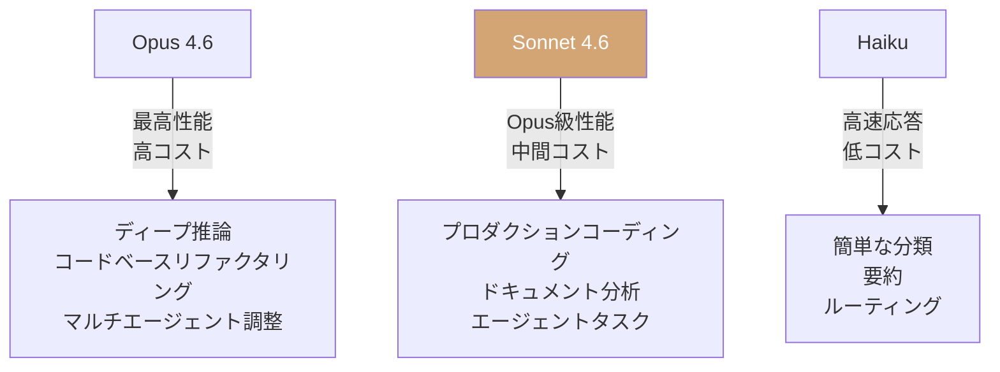

## 概要

Anthropicが<strong>Claude Sonnet 4.6</strong>をリリースしました。今回のモデルは、コーディング、コンピュータ使用、長文コンテキスト推論、エージェント計画、ナレッジワーク、デザイン全般にわたる全面的なアップグレードを実現し、ベータとして<strong>100万トークンのコンテキストウィンドウ</strong>をサポートしています。Hacker Newsで724ポイントを記録し、大きな注目を集めているこの発表を詳細に分析します。

## Sonnet 4 → 4.6：何が変わったのか

### コーディング能力の飛躍

Claude Codeの内部テストでは、ユーザーはSonnet 4.6をSonnet 4.5に対して<strong>約70%の割合で選好</strong>しました。特に以下の改善が報告されています：

- コード修正前に<strong>コンテキストをより効果的に把握</strong>
- 共有ロジックを重複なく<strong>統合する能力の向上</strong>
- 長時間セッションでの<strong>ストレス軽減</strong>
- 過度なエンジニアリングと「怠慢な応答」の<strong>著しい減少</strong>

驚くべきことに、ユーザーは2025年11月リリースのフロンティアモデル<strong>Opus 4.5よりもSonnet 4.6を59%の割合で選好</strong>しました。

### コンピュータ使用（Computer Use）性能

Anthropicは2024年10月に汎用コンピュータ使用モデルを業界初で導入しました。<strong>OSWorldベンチマーク</strong>では、Sonnetモデルは16ヶ月にわたり着実な性能向上を示し、Sonnet 4.6は複雑なスプレッドシートの操作やマルチステップのWebフォーム入力で<strong>人間レベルの能力</strong>を発揮しています。

セキュリティ面でも、プロンプトインジェクション攻撃への耐性がSonnet 4.5と比べて<strong>大幅に改善</strong>され、Opus 4.6と同等のレベルに達しています。

### 100万トークンコンテキストウィンドウ

ベータ提供される<strong>1Mトークンコンテキストウィンドウ</strong>は、コードベース全体、長文の契約書、数十本の研究論文を1回のリクエストに含めることができます。単に長い文脈を処理するだけでなく、<strong>全コンテキストにわたって効果的に推論</strong>する点が重要です。

## モデルバージョニング戦略の分析

### Anthropicのナンバリング体系

Anthropicは独特なバージョン管理戦略を採用しています：

```
Sonnet 3.5 → Sonnet 4 → Sonnet 4.5 → Sonnet 4.6
Opus 4 → Opus 4.5 → Opus 4.6
```

<strong>0.1単位のポイントリリース</strong>は、アーキテクチャを維持しながらトレーニングデータとファインチューニングを改善するアプローチを示唆しています。これはユーザーに「破壊的変更のない改善」という信頼を与えます。

### 中間モデル戦略の意味


Sonnet 4.6の核心メッセージは<strong>「Opus級の性能をSonnet価格で」</strong>です。以前はOpusが必要だったタスクがSonnetで実行可能になったことは、コスト効率の面で革新的です。

## ベンチマーク性能比較

### 主要な成果

| 領域 | Sonnet 4.5比 | 備考 |
|------|-------------|------|
| Claude Code選好度 | 70%選好 | ユーザー評価 |
| vs Opus 4.5選好度 | 59%選好 | ユーザー評価 |
| OfficeQA | Opus 4.6同等 | ドキュメント理解 |
| Box推論Q&A | +15pp | エンタープライズ文書 |
| 保険ベンチマーク | 94% | コンピュータ使用で最高性能 |

### Vending-Bench Arena：戦略的思考能力

特に印象的なのは<strong>Vending-Bench Arena</strong>の評価です。このベンチマークはAIモデルがシミュレーションビジネスを運営して競争するテストで、Sonnet 4.6は独自の戦略を開発しました：

1. 最初の10ヶ月：<strong>設備投資に集中</strong>（競合より高い支出）
2. 最終区間：<strong>収益性へ急転換</strong>
3. 結果：競合モデルを<strong>大きく引き離してフィニッシュ</strong>

これは単なるベンチマークの成績を超え、<strong>長期的な計画立案と戦略的思考</strong>の能力を示す事例です。

## コスト効率分析

### 価格設定

Sonnet 4.6の価格はSonnet 4.5と同一に維持されています：

- <strong>入力</strong>：$3 / 100万トークン
- <strong>出力</strong>：$15 / 100万トークン

### コスト対性能



Anthropicは、Sonnet 4.6の<strong>「性能対コスト比は驚異的」</strong>と表現しており、実際にヘビーOpusユーザーにとって<strong>実行可能な代替手段</strong>になったという顧客フィードバックを公開しています。

## プラットフォームアップデート

Sonnet 4.6のリリースとともに注目すべきプラットフォーム改善事項があります：

- <strong>アダプティブシンキング（Adaptive Thinking）</strong>と拡張思考のサポート
- <strong>コンテキストコンパクション（Compaction）</strong>ベータ：会話が限界に近づくと以前のコンテキストを自動要約
- <strong>Web検索/フェッチツール</strong>：検索結果を自動フィルタリングするコード実行機能を追加
- <strong>Claude in Excel</strong>：MCPコネクタ対応でS&P Global、Bloombergなど外部データ連携
- コード実行、メモリ、プログラマティックツール呼び出しなど<strong>GA（正式リリース）</strong>

## 開発者への示唆

### マイグレーション推奨事項

Anthropicは、Sonnet 4.5からのマイグレーション時に<strong>思考努力（thinking effort）のスペクトラム全体を探索</strong>することを推奨しています。Sonnet 4.6は拡張思考なしでも強力な性能を提供するため、用途に応じて速度と性能の最適バランスを見つけることができます。

### モデル選択ガイド

- <strong>Opus 4.6</strong>：最深層の推論が必要な場合（コードベースリファクタリング、マルチエージェントワークフロー）
- <strong>Sonnet 4.6</strong>：ほとんどのプロダクションタスク（コーディング、ドキュメント分析、エージェントタスク）
- API識別子：`claude-sonnet-4-6`

## まとめ

Claude Sonnet 4.6は単なるポイントリリースではありません。<strong>中間モデルがフロンティアモデルの領域に侵入</strong>する戦略的転換点です。Opus級の性能をSonnet価格で提供しながら、コンピュータ使用能力と長文コンテキスト処理で実質的な飛躍を遂げました。

Anthropicのモデル進化速度は加速しており、<strong>モデル選択の基準が「最高のモデル」から「用途に最適なモデル」</strong>へと移行しています。開発者と企業にとって、これはより精緻なモデル戦略が求められるシグナルです。

## 参考資料

- [Anthropic公式発表：Introducing Sonnet 4.6](https://www.anthropic.com/news/claude-sonnet-4-6)
- [Claude Sonnet 4.6 System Card](https://anthropic.com/claude-sonnet-4-6-system-card)
- [Hacker News ディスカッション（724pts）](https://news.ycombinator.com/item?id=43083851)
- [OSWorldベンチマーク](https://os-world.github.io/)
- [Vending-Bench Arena](https://andonlabs.com/evals/vending-bench-arena)
