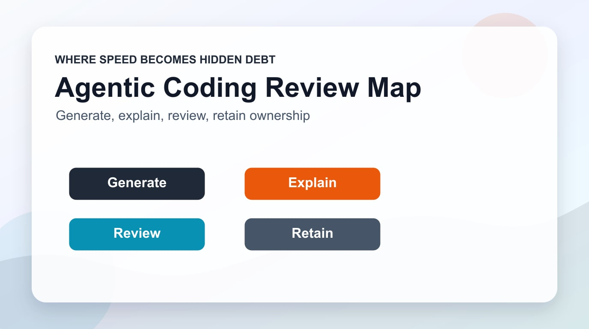

# Cognitive Debt: Anthropic 2026エージェンティックコーディングレポートが警告するAI時代の新たな負債

2026年1月、Anthropicが発表した**2026 Agentic Coding Trends Report**は、ソフトウェアエンジニアリングの大転換を公式に宣言した。TELUSはAIエージェント導入後にエンジニアリングコードの出荷速度が30%向上し、Rakutenは新機能リリースサイクルを24日から5日へ79%短縮した。数字だけ見れば黄金期だ。

しかし同時期、ソフトウェア工学研究者のMargaret StoreyとSimon Willisonがそれぞれ独立して同じ警告を発表した。その警告の名は**Cognitive Debt（認知的負債）**だ。

## Cognitive Debtとは何か

技術的負債（Technical Debt）はコードに蓄積される。リファクタリングすれば減らせる。
Cognitive Debtは**開発者の頭の中に蓄積される**。コードがどれだけきれいになっても、チームがそのコードを理解していなければ、負債はむしろ増える。

2025年のMIT研究はこの現象を実験で証明した。AIの助けを借りて文章を書いた参加者は、AI未使用グループと比べて<strong>脳の接続性が弱まり、記憶保持率が低下し、成果物への主人意識も減少</strong>した。客観的な成果物の質は実際には高かったにもかかわらず。

Storeyの論文はこの概念をエンジニアリングチームへと拡張する。AIがコードを生成するほど、チームの**システムに対する共有理解（Shared Theory of the System）**が侵食される。症状はビルド失敗として現れない。次のような形で現れる。

- 特定モジュールを修正しようとしたとき、誰も自信を持って名乗り出ない
- なぜその設計決定がなされたのかを知る人が誰もいない
- オンボーディング中の新規開発者がコードは読めても「なぜ」を説明できない
- 「この部分はAIが作ったので…」という言葉が免罪符として使われる

## Anthropicレポートの8トレンドとCognitive Debtの交差点

Anthropicの2026年レポートはエージェンティックコーディングの8つのトレンドを提示する。

<strong>1. 役割の構造的転換</strong>
開発者はコード作成者からエージェント監督者へ移行する。エージェントが実装・テスト・デバッグ・文書化を担い、人間はアーキテクチャと意思決定に集中する。

<strong>2. エージェントのチームプレイヤー化</strong>
単一エージェントから専門化されたエージェントチームへ。並列実行とオーケストレーションが標準となる。

<strong>3. エンドツーエンドのエージェント作業</strong>
数時間〜数日にわたる長期作業が可能になる。アプリケーション全体のビルドが単一プロンプトから始まりうる。

<strong>4. インテリジェントなヘルプシーキング</strong>
エージェントが不確実な時点を検知し、人間に積極的に確認を求める。

<strong>5. エンジニアを超えた拡張</strong>
COBOL、Fortranなどのレガシー言語対応とともに、セキュリティ・運用・デザイン・データの役割まで拡張される。

<strong>6. デリバリーの加速</strong>
数週間かかっていた作業が数日に短縮される。機能あたりのコストが急減する。

<strong>7. ビジネスユーザーによるエージェンティックコーディング採用</strong>
営業・法務・マーケティング・オペレーションチームが、エンジニアリングを待たずに直接ローカルプロセスの問題をエージェントで解決する。

<strong>8. 両刃の剣となるセキュリティへの影響</strong>
防御的活用（コードレビュー、セキュリティ強化）と攻撃的活用（エクスプロイトのスケーリング）の両方が強化される。

このうちトレンド1〜3がCognitive Debtと直接衝突する。エージェントが長時間独立してコードを生成するほど、そのコードに対するチームの理解は比例的に低下する可能性がある。

## なぜCognitive Debtは静かに蓄積されるのか

Cognitive Debtの最も危険な特性は**可視性の欠如**だ。技術的負債はコードレビューで発見され、テスト失敗で露わになる。認知的負債は次の瞬間まで分からない。

- 6ヶ月後に重要な機能を修正しようとしたとき
- ベテラン開発者が退職したとき
- 複雑なバグの根本原因を追跡しなければならないとき
- 新しい要件が既存のアーキテクチャと衝突するとき

Anthropicのレポートもこのリスクを認識している。開発者がAIに<strong>検証可能または低リスクのタスク</strong>は委任するが、概念的に複雑または設計依存のタスクは自分で行うかAIと協力すると明かしている。つまり、委任の境界を意識的に管理している開発者は認知的負債をコントロールしている。問題はそうでないチームだ。

## Engineering Managerが今すぐやるべき5つのこと

<strong>1. 「AIが作ったから」免罪符禁止ルールの導入</strong>
コードレビューで「この部分はAIが生成しました」は説明として不十分とする。<strong>なぜこの構造なのか、どんなトレードオフがあるのか</strong>を説明できて初めてマージ可能とする。

<strong>2. 理解の検証をデプロイゲートに</strong>
最低一人の人間がAI生成の変更を完全に理解した後にデプロイする。速度が落ちて見えるが、認知的負債の利子は後から更に高くつく。

<strong>3. 決定理由のドキュメント化を義務付ける</strong>
Whatではなく<strong>Why</strong>を記録する。AIコード生成時に同時生成される説明をADR（Architectural Decision Record）に統合する。

<strong>4. 定期的な「システム理解セッション」</strong>
月1回以上、特定モジュールについてチーム全員が説明できるか検証する。説明できない部分がCognitive Debtの所在だ。

<strong>5. 委任境界の明文化</strong>
チームのAI委任ポリシーを文書化する。「検証可能なタスクは委任、設計判断は協力、コアアーキテクチャは人間」のような基準を作る。

## 結論: スピードと理解のバランス

Anthropicレポートが提示する未来は刺激的で現実だ。TELUSとRakutenの数字は本物だ。しかし「velocity without understanding is not sustainable（理解なき速度は持続不可能）」というStoreyの警告も本物だ。

Engineering Managerの役割がコード作成者の管理からエージェント監督者の管理へと移行するこの転換期に、新しいKPIが必要だ。単純にどれだけ速く作ったかではなく、**どれだけ多くの人が理解しているか**。

AIエージェントがチームの生産性を10倍にする一方で、チームの理解力を10分の1にしないように — それが2026年のEMの新たな課題だ。

---

*参考資料:*
- *Anthropic, 2026 Agentic Coding Trends Report (2026.01.21)*
- *Margaret Storey, "How Generative and Agentic AI Shift Concern from Technical Debt to Cognitive Debt" (2026.02.09)*
- *Simon Willison, "Cognitive Debt" (2026.02.15)*
