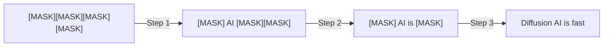
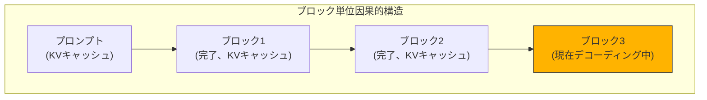

## 概要

Autoregressive（AR）言語モデルはトークンを1つずつ逐次的に生成します。安定した方式ですが、本質的に<strong>並列化が不可能</strong>という限界があります。Together AIが発表した<strong>Consistency Diffusion Language Models（CDLM）</strong>は、拡散型言語モデルの推論速度を最大14倍まで引き上げながら、品質損失をほぼゼロに抑えた革新的な技術です。

## 拡散言語モデル（DLM）とは

拡散言語モデルは、画像生成で馴染みのある拡散（Diffusion）の概念をテキストに適用します。完全にマスクされたシーケンスから開始し、<strong>複数の反復ステップを経て段階的にクリーンなテキストへ変換</strong>します。

このアプローチには2つの核心的な利点があります：

- <strong>並列生成</strong>：1回の反復で複数のトークンを同時に確定
- <strong>双方向コンテキスト</strong>：テキスト穴埋め（infilling）や修正タスクが可能

## 従来のDLMの2つのボトルネック

しかし、従来のDLMには実用性を阻害する深刻な問題がありました：

1. <strong>KVキャッシュ不可</strong>：双方向アテンションを使用するため、各デノイジングステップで全コンテキストに対してアテンションを再計算する必要があります
2. <strong>多数の反復ステップが必要</strong>：品質を維持するには生成長に比例する多くのデノイジングステップが必要で、ステップを減らすと品質が急激に低下します

## CDLMの核心メカニズム

CDLMは<strong>ポストトレーニング（post-training）</strong>手法で、この2つのボトルネックを同時に解決します。

### 1. 軌跡収集（Trajectory Collection）

まずティーチャーDLMを使用してオフラインでデコーディング軌跡を収集します。生成長256、ブロックサイズ32で設定し、高品質な軌跡データを確保します。

### 2. ブロック因果的スチューデントモデル

ティーチャーモデルが双方向アテンションを使用するのに対し、スチューデントモデルは<strong>ブロック単位の因果的マスク</strong>を使用します。これにより：

- プロンプトと以前の完了ブロックに対する<strong>正確なKVキャッシュ</strong>が可能
- 現在のブロック内では双方向コンテキストを維持

### 3. 3つの学習目標

CDLMは3つの損失関数を同時に最適化します：

- <strong>蒸留損失（Distillation Loss）</strong>：新たにアンマスクされた位置でティーチャーモデルの分布を学習
- <strong>一貫性損失（Consistency Loss）</strong>：ブロック内の時間的一貫性を保証し、安定した多段ステップ遷移を誘導
- <strong>補助MLM損失（Auxiliary DLM Loss）</strong>：標準マスクデノイジングで一般的なトークン予測能力と推論能力を維持

## パフォーマンス結果

CDLM-Dreamのベンチマーク結果は印象的です：

| ベンチマーク | ステップ削減 | レイテンシ改善 |
|-----------|-----------|-------------|
| GSM8K-CoT | ~7.7x | <strong>11.2x</strong> |
| MBPP-Instruct | ~4.1x | <strong>14.5x</strong> |
| 全体平均 | 4.1x~7.7x | 最大14.5x |

核心は、この速度向上が<strong>精度をほとんど損なわない</strong>という点です。単純にステップ数を減らすと品質が大幅に低下しますが、CDLMの学習ベースのアプローチは軌跡一貫性を強制することでこの問題を解決します。

## なぜブロック単位DLMが最適なのか

ハードウェア利用率の分析において、ブロック単位DLMは<strong>ARと従来DLMの間の最適点</strong>に位置します：

- <strong>ARデコーディング</strong>：小バッチでメモリバウンド（算術強度 ≈ 1）
- <strong>従来のDLM</strong>：バッチ1でもコンピュートバウンド（双方向アテンションによる飽和）
- <strong>ブロックDLM（CDLM）</strong>：ブロック内並列性でメモリアクセスを分散させながら、実用的なスケーリングが可能なバランスポイント

## 実践的な意味

### Autoregressive一強時代の転換点

現在のLLMエコシステムはARモデルが支配しています。GPT、Claude、Geminiすべてが AR方式です。CDLMは拡散モデルが<strong>速度と品質の両方で競争力</strong>を持てることを示しています。

### スケーラビリティ

CDLMはポストトレーニングレシピであるため、より強力なDLMバックボーンが登場すればその上に適用できます。大規模ティーチャーモデルから軌跡を収集し、中規模スチューデントモデルをトレーニングする方向も有望です。

### 新たなユースケース

双方向コンテキストを活用するため、テキスト穴埋め、修正、リライティングなどARモデルが自然に処理しにくいタスクで強みを発揮できます。

## 結論

CDLMは拡散言語モデルの実用化に向けた重要な一歩です。ブロック単位の因果的構造でKVキャッシュを可能にし、一貫性学習でステップ数を大幅に削減しながら品質を維持します。最大14.5倍のレイテンシ改善は、ARモデル中心の現在のパラダイムに対する意味のある挑戦となり得ます。

## 参考資料

- [Together AI公式ブログ — Consistency Diffusion Language Models](https://www.together.ai/blog/consistency-diffusion-language-models)
- [Block Diffusion: Interpolating Between Autoregressive and Diffusion Language Models](https://arxiv.org/abs/2503.09573)
- [Beyond Next-Token Prediction: A Performance Characterization of Diffusion versus Autoregressive Language Models](https://arxiv.org/abs/2412.00024)
