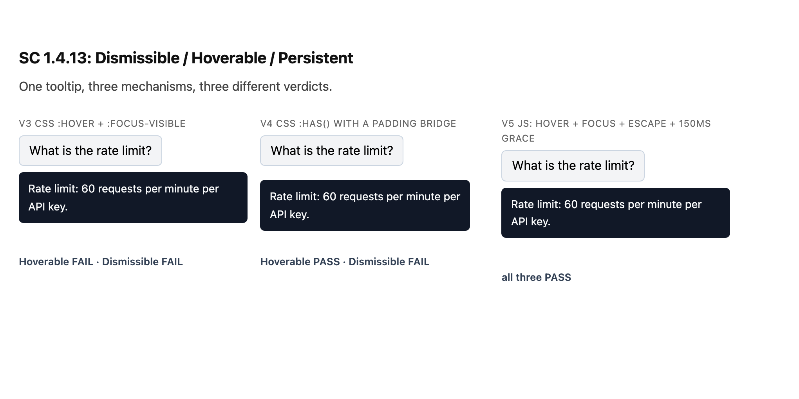
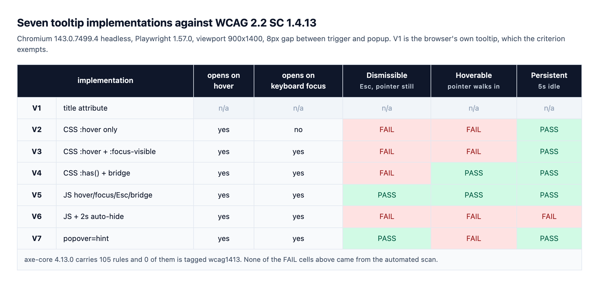

HTMLに `popover` 属性が入ったとき、ツールチップまわりの面倒は終わったと思った。表示状態もトップレイヤーもブラウザが持ってくれる。手書きのz-index戦争から解放される、と。

半分は当たっていた。残りの半分は、測ってみるまで見えていなかった。

WCAG 2.2の達成基準1.4.13は、ホバーやフォーカスで出てくる追加コンテンツに3つの条件を課す。閉じる手段があるか、ポインタをその上に運べるか、いつまで残るか。「開くこと」は条件に入っていない。前提であって、項目ではない。

そこで同じ一文を表示するツールチップを7通りの機械仕掛けで作り、リポジトリ外の一時ディレクトリに置いて、3項目を別々に測った。CSSだけの3つは全部Dismissibleで落ちた。`popover="hint"` はDismissibleを一行も書かずに通し、Hoverableで落ちた。7つのうち3項目すべてを通したのは1つだけだった。



## 何がこの基準の対象になるのか

先に射程を確認しておく。1.4.13はレベルAAで、WCAG 2.1で新設され2.2に引き継がれた。対象は「ポインタを乗せるかキーボードフォーカスを与えると現れ、それを外すと消える追加コンテンツ」だ。ツールチップが代表格で、ホバーで開くメガメニュー、ユーザー名の上に出るプロフィールカード、入力欄の横のヘルプ吹き出しも全部ここに入る。

入らないものも明記されている。W3Cが基準本文に付けた3つ目のノートはこう書く。原文は[W3CのWCAG 2.2勧告](https://www.w3.org/TR/WCAG22/#content-on-hover-or-focus)にある。

> This criterion applies to content that appears in addition to the triggering component itself. Since hidden components that are made visible on keyboard focus (such as links used to skip to another part of a page) do not present additional content they are not covered by this criterion.

フォーカスを受けて自分自身が現れるスキップリンクは、この基準の対象外ということだ。トリガーとは別のコンテンツが「追加で」出てこないと判定対象にならない。この線引きを先に引いておかないと、ページの半分を1.4.13で誤って指摘することになる。

3項目が何を守ろうとしているのかも押さえておきたい。どれも画面拡大を使う人と、手元が定まりにくい人に向いている。400%に拡大した画面でツールチップはビューポートのかなりの面積を覆う。覆ったものをどける手段がなければ、その下の文章は読めないまま終わる。ポインタ操作が精密でない人は、ツールチップの本文を読もうとマウスを動かした拍子にそれを取り逃がす。そして数秒で勝手に消えるポップアップは、読むのが速くない人にとっては最初から無いのと同じだ。Dismissible、Hoverable、Persistentはこの3つの場面に一対一で対応している。

## 基準本文が要求していること

規範本文は短い。[W3Cの達成基準1.4.13の原文](https://www.w3.org/TR/WCAG22/#content-on-hover-or-focus)をそのまま引く。

> Where receiving and then removing pointer hover or keyboard focus triggers additional content to become visible and then hidden, the following are true:
>
> **Dismissible:** A mechanism is available to dismiss the additional content without moving pointer hover or keyboard focus, unless the additional content communicates an input error or does not obscure or replace other content;
>
> **Hoverable:** If pointer hover can trigger the additional content, then the pointer can be moved over the additional content without the additional content disappearing;
>
> **Persistent:** The additional content remains visible until the hover or focus trigger is removed, the user dismisses it, or its information is no longer valid.
>
> Exception: The visual presentation of the additional content is controlled by the user agent and is not modified by the author.

引っかかる箇所が2つある。

1つ目。Dismissibleには条件節が付いている。追加コンテンツが入力エラーを伝える場合、または他のコンテンツを覆いも置き換えもしない場合は、この要求が免除される。つまり「何も覆わないツールチップ」なら閉じる手段は要らない。ただしそんなツールチップは珍しい。私が作った6つは、実測で全部が直下の段落を覆っていた。

2つ目。例外は「著者が手を入れていない、ブラウザ側の描画」にしか効かない。同じ文書の最初のノートがその対象を名指しする。

> Examples of additional content controlled by the user agent include browser tooltips created through use of the HTML `title` attribute [HTML].

`title` 属性は基準の外だ。ここで誤解が生まれやすい。対象外というのは合格したという意味ではなく、この物差しでは測らないという意味でしかない。`title` のツールチップは相変わらずタッチ端末では出ないし、表示のタイミングも持続時間も著者からは触れない。免除は判定を保留するだけで、問題を消してはくれない。

## 7つを並べて同じ物差しを当てた

一時ディレクトリに静的HTMLを1枚作った。同じボタン、同じ一文（"Rate limit: 60 requests per minute per API key."）、トリガーとポップアップの間隔は8px。ここまでは7行とも共通で、違うのは開閉の機械仕掛けだけだ。

| | 実装 | 開くきっかけ |
|---|---|---|
| V1 | `title` 属性 | ブラウザが描く |
| V2 | CSS `:hover` のみ | ポインタのみ |
| V3 | CSS `:hover` + `:focus-visible` | ポインタ・キーボード |
| V4 | CSS `:has()` + パディングの橋 | ポインタ・キーボード |
| V5 | JS ホバー・フォーカス・Escape・150msの猶予 | ポインタ・キーボード |
| V6 | JS + 2秒の自動非表示 | ポインタ・キーボード |
| V7 | ネイティブ `popover="hint"` | ポインタ・キーボード |

判定はPlaywrightで取った。項目ごとにページを読み直して状態が混ざらないようにし、5つを測る。

- ポインタを乗せると開くか
- Tabでフォーカスを与えると開くか
- **Dismissible**: 開いた状態でポインタを動かさずEscapeを押したとき閉じるか
- **Hoverable**: トリガー中央からポップアップ中央まで、ポインタを12段階で動かしたときポップアップが生きているか
- **Persistent**: ポインタを乗せてから5秒間なにもしなかったとき残っているか

Hoverableの測り方だけ補足する。`mouse.move` で目的地に一発で飛ばすと途中のhit-testが省略され、隙間をすり抜けてしまう。そこで座標を12等分し、20ms間隔で押し進めた。実際の手が通る経路に近づけるためだ。

```js
const path = 12, from = center(tb), to = center(pb);
for (let i = 1; i <= path; i++) {
  await page.mouse.move(
    from.x + (to.x - from.x) * i / path,
    from.y + (to.y - from.y) * i / path
  );
  await page.waitForTimeout(20);
}
r.hoverable = await page.locator(v.tip).isVisible();
```

環境はChromium 143.0.7499.4のヘッドレス、Playwright 1.57.0、Node 22.22、ビューポート900×1400。同じスクリプトを2回走らせ、7行の値が全部一致することを確認した。



## CSSはEscapeを聞けない

V2、V3、V4はJavaScriptを一行も使っていない。3つともDismissibleで落ちた。実装ミスではなく、構造の問題だ。Dismissibleが求めるのは「ポインタもフォーカスも動かさずに閉じる手段」であり、現実的にその手段はEscapeキーになる。CSSにはキー入力に反応するセレクタがない。

W3Cの[Understanding文書](https://www.w3.org/WAI/WCAG22/Understanding/content-on-hover-or-focus.html)も、この要求を説明するときにEscapeでツールチップを消す例を挙げている（要約であって逐語引用ではない）。CSS専用のツールチップは、先ほどの免除条項に当てはまらない限り、この項目を通す道がない。

免除を狙う手はある。「他のコンテンツを覆いも置き換えもしない」ツールチップにすればいい。だからポップアップの矩形と直下の段落の矩形が重なるかも一緒に測った。6つとも重なった。トリガーの真下にabsoluteで浮かせるという、いちばんよくある配置では、後続コンテンツを覆わないほうがむしろ難しい。レイアウトの流れの中にあらかじめ場所を空けておく設計なら免除は成立するが、それはツールチップというよりアコーディオンだ。

ここから実務の判断が1つ出る。**ツールチップはCSSだけで作れるという言い方は、たいてい「1.4.13の3つのうち2つまで」を指している。** 残りの1つのために結局キーボードのイベントリスナーが要るなら、最初からJSで状態を持ったほうがコードは短い。`:hover` の2行で終わったつもりのコンポーネントが未完成のままデプロイされる。これがこの実験でいちばん繰り返し確かめられたことだ。似た構図は[モーダルのEscapeとinertを測った記事](/ja/blog/ja/modal-focus-escape-inert-measure-2026)でも見たが、あちらには少なくとも「閉じられるべきだ」という認識があった。ツールチップにはその認識すらない。

## 8pxは目にだけ置き、箱からは消す

Hoverableで V3とV4の運命が分かれた。どちらもCSSで、開くきっかけも同じ。違ったのはセレクタではなく箱の大きさだった。

V3はポップアップに `margin-top: 8px` を与えた。画面上で8px離れて見え、hit-testでも8px離れている。ポインタがトリガーを出てその8pxの上に乗った瞬間に `:hover` が解け、ポップアップは消える。スクリプトが測ったトリガー下端とポップアップ上端の距離は、きっかり8pxだった。

V4は同じ8pxをマージンではなくパディングで作った。ポップアップの箱そのものはトリガーに接していて、箱の内側の上に18pxの透明な余白を置いて中身だけを下げている。スクリプトが測った間隔は0pxだ。目には離れて見えるが、ポインタにとっては地続きになっている。見える大きさとヒット領域が割れるこの構造は、[ターゲットサイズの基準を実測したとき](/ja/blog/ja/wcag22-target-size-audit-2026)と同じ軸の上にある。ここに `:has()` でポップアップ自身へのホバーも開く条件に足せば、CSSだけでHoverableが成立する。

```css
/* ポップアップをトリガーに接し、余白は箱の内側へ押し込む */
#tip { display: none; margin-top: 0; padding-top: 18px; background: transparent; }
#tip .inner { background: #111827; color: #f9fafb; border-radius: 6px; padding: 10px 12px; }

.anchor:has(.trigger:hover) #tip,
.anchor:has(.trigger:focus-visible) #tip,
.anchor:has(#tip:hover) #tip { display: block; }
```

通す道はもう1本ある。時間だ。V5は間隔を8pxのまま残し、`mouseleave` で即座に閉じる代わりに150ms後に閉じる予約を入れ、ポップアップにポインタが触れたらその予約を取り消す。空白の8pxを渡っているあいだ、ポップアップは生きている。

```js
let timer;
const open  = () => { clearTimeout(timer); tip.classList.add('open'); };
const close = () => tip.classList.remove('open');
const soft  = () => { clearTimeout(timer); timer = setTimeout(close, 150); };

trigger.addEventListener('mouseenter', open);
trigger.addEventListener('focus', open);
trigger.addEventListener('blur', close);
trigger.addEventListener('mouseleave', soft);
tip.addEventListener('mouseenter', open);
tip.addEventListener('mouseleave', soft);
document.addEventListener('keydown', (e) => { if (e.key === 'Escape') close(); });
```

この20行が、7つのうち唯一3項目を全部通した実装だ。特別な技法はない。Escapeを聞き、隙間に猶予を与え、タイマーで隠さない。それだけである。

ただし150msという値は私が選んだ数字で、基準から出てきた数字ではない。ヘッドレスブラウザの直線経路では足りたが、手が遅い場合や曲線で回り込む実際の操作でいくら必要かは今回測っていない。猶予の値を振って失敗点を探るスイープは次の宿題だ。確実なのはパディングの橋のほうで、間隔が0なら猶予時間を選ぶ必要そのものがなくなる。

## popoverがくれるのはDismissibleまで

いちばん学びが多かったのはV7だった。`popover` 属性を使うとブラウザが表示状態とトップレイヤーを管理してくれる。`popover="hint"` はそのうちツールチップを狙った値で、[WHATWGのHTML仕様](https://html.spec.whatwg.org/multipage/popover.html)によればautoとhintの状態はlight dismissとclose requestに反応し、manualは反応しない（要約であって逐語引用ではない）。close requestにはEscapeキーが含まれる。

測定値はそのとおりに出た。V7はポインタを置いたままEscapeを押すと閉じた。**Dismissibleをコード一行も書かずに手に入れたのは、7つのうちこれだけだ。** ブラウザが標準として配り始めた機能がアクセシビリティ基準を1つまるごと肩代わりする例で、この値がなぜ入ったのか腑に落ちた。

ところがHoverableは落ちた。理由は単純で、`popover` が面倒を見るのは「開いているか閉じているかという状態」であって、「いつ開き、いつ閉じるか」ではない。ホバーで開くツールチップを作ろうとすれば結局 `mouseenter` で `showPopover()`、`mouseleave` で `hidePopover()` を呼ぶことになり、その `mouseleave` はポインタが8pxの隙間に入った瞬間に発生する。ポップアップがトップレイヤーにいても、ポインタはまだその上に着いていない。

整理するとこうなる。CSSはHoverableとPersistentをくれてDismissibleをくれない。`popover` はDismissibleをくれてHoverableをくれない。2つの半分は重なっていないので、3つとも満たすには `popover` を使っても前節の猶予ロジックかパディングの橋をそのまま乗せることになる。「popoverでツールチップのアクセシビリティは解決」という説明を見かけたら、この一点を確かめたほうがいい。

## 2秒で消えるツールチップ

V6はよくある気づかいから出発した実装だ。ツールチップが画面に居座ると邪魔だから、2秒で勝手に消す。いくつものUIライブラリがこれを既定値にしているし、私も昔この書き方をしていた。

ポインタを乗せたまま5秒待ったら、ポップアップは無かった。Persistentの不合格である。基準が認める消滅条件は3つしかない。トリガーが取り除かれるか、利用者が閉じるか、情報が有効でなくなるか。経過時間はその一覧に入っていない。

「情報が有効でなくなる」をタイマーの根拠にできないか、という疑問は出るところだ。使える場面はある。残り時間を数えるカウントダウンや、期限のある使い捨てコードのように、中身そのものが時間に縛られている場合だ。APIのレート制限を説明する一文は2秒後も同じように真である。読むのが遅い人からその一文を取り上げる根拠にはならない。

V6はHoverableでも落ちているが、これはタイマーとは別に `mouseleave` で即閉じる作りだったからだ。1つの部品が3項目を同時に取りこぼすのは、そう難しいことではない。

## axeの105ルールのうち、この基準を見るのは0

7つを全部開いた状態でaxe-core 4.13.0を回した。報告された違反は `landmark-one-main` と `region` の2件だけ。フィクスチャのHTMLにランドマークを置かなかったせいで、ツールチップの挙動とは関係がない。

理由はルール一覧にある。axe-core 4.13.0が持つルールは105個で、そのうち `wcag1413` タグが付いたものは0個だ。

```
axe-core 4.13.0 total rules: 105
rules tagged wcag1413: 0 []
```

自動検査を責める話ではない。Dismissible、Hoverable、Persistentは静的なDOMから判定できる性質ではない。キーを押し、ポインタを運び、待たなければならない。[axeのルールタグを達成基準ごとに数えた記事](/ja/blog/ja/act-rules-axe-coverage-wcag-sc-2026)で確かめた死角が、ここでもそのまま出ている。スコアが緑であることと、この基準を守れていることのあいだには何の関係もない。

だから今回の測定の射程も狭く書いておく。エンジン1つ（Chromium 143）、間隔の値1つ（8px）、自作のフィクスチャ1枚だ。実サイトの違反率を語る数字ではないし、他のレンダリングエンジンで同じコードが同じように動くという主張でもない。タッチ端末の挙動と支援技術利用時の体験は、この物差しでは測っていない。そして私のフィクスチャが3項目を通したことと、実ページの適合判定とは別の話だ。判定には免除条項と文脈が一緒に入ってくる。

## 8pxを消すか、150msを与えるか

今回の測定が残した判断の線は短い。

- **Escapeの居場所はCSSの外にある。** ツールチップが後続コンテンツを少しでも覆うなら、キーボードのリスナーを付ける。覆わないという確信があるときだけ免除条項に寄りかかる。
- **間隔は目にだけ置き、箱からは消す。** `margin` で作った8pxはポインタの落とし穴で、`padding` で作った8pxはそうではない。判定を分けるのは見た目の距離ではなく、hit-test上の距離だ。
- **間隔を残すなら猶予を与える。** `mouseleave` で即閉じず、100〜200ms後に閉じる。ポップアップに入ったら取り消す。
- **タイマーで隠さない。** 自動非表示が正当化されるのは、中身が実際に時間に縛られているときだけだ。
- **`popover` を使っても開閉条件は自分で書く。** ブラウザが代わってくれるのはDismissibleまで。
- **手で確かめる。** 自動検査のルール一覧にこの基準は無い。ポップアップへポインタを押し込み、Escapeを押し、5秒待つ。3動作で足りる。

決めきれなかったことも1つ残った。ポップアップをトリガーに接してhit-testの間隔を0にすればHoverableは確実になるが、トリガーとポップアップの境目が視覚的にぼやけ、どこまでがボタンなのか分かりにくくなる瞬間がくる。パディングをどこまで厚くすればその境目が戻るのか、そしてその値が8pxを保って猶予を与える道より本当に良いのかは、このフィクスチャだけでは答えが出なかった。次は猶予の値を振って、2つの道に同じ物差しを当ててみたい。

ドロップダウンとメニューと吹き出しが何層にも重なった画面で、この3項目をどこから手を付けるか見当がつかないなら、聞いてもらってかまわない。基準の文章をコンポーネントのコードに移し、その判定を人の手ではなくスクリプトに繰り返させるのが私の仕事だ。連絡先はプロフィールに置いてある。

---

*出典: W3Cの[WCAG 2.2 達成基準1.4.13 Content on Hover or Focus](https://www.w3.org/TR/WCAG22/#content-on-hover-or-focus)（W3C勧告）、[Understanding SC 1.4.13](https://www.w3.org/WAI/WCAG22/Understanding/content-on-hover-or-focus.html)、WHATWGの[HTML Standard, The popover attribute](https://html.spec.whatwg.org/multipage/popover.html)（すべて公式）。達成基準の本文とノート1・3はW3C勧告の原文をその場で突き合わせて逐語で引き、引用のそばに原文リンクを置いた。Understanding文書とHTML仕様の内容は要約して移し、リンクで代えた。測定環境: 一時サンドボックスディレクトリの静的HTML 1枚（ツールチップ実装7種）、Chromium 143.0.7499.4ヘッドレス、Playwright 1.57.0、Node 22.22、ビューポート900×1400、トリガーとポップアップの間隔8px、axe-core 4.13.0、2026年8月12日測定。プローブは `scripts/probe-hover-focus-1413.mjs`、フィクスチャは `scripts/fixtures-hover-focus-1413.html`、原資料は `data/hover-focus-1413-probe.json`。同じスクリプトを2回実行して同一の結果を確認した。すべての判定はこのエンジン・このフィクスチャ・この間隔値で出たものであり、実サイトの適合判定や他のレンダリングエンジンの挙動についての主張ではない。タッチ入力と支援技術利用時の挙動、および `title` 属性がブラウザに描かせるツールチップはDOMから観測できないため測定していない。*
