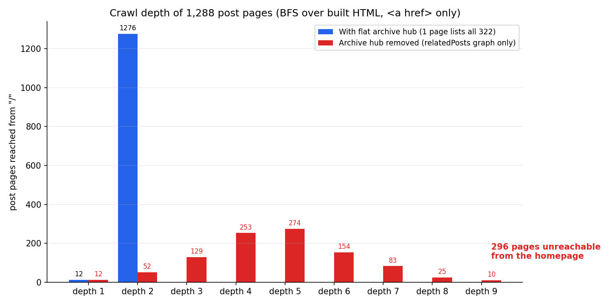

記事ごとに関連リンクが8本ついている。だから内部リンクは足りている、と思っていた。その数字は何も保証していなかった。

きっかけは前日の作業だ。表マークアップを測るためにビルド成果物を掘っていて、別の疑いが湧いた。リンクの数え方がおかしい。私はこれまで内部リンクを「この記事に入ってくるリンクが何本あるか」でしか見ていなかった。しかしクローラーにとって効くのは本数ではなく経路だ。20本ついていても、その20本すべてがホームから届かない記事から出ているなら、ルートから出発したクローラーには0本と変わらない。

そこでビルド済みHTML1,330枚を、ホームから幅優先で辿るスクリプトを書いた。60行ほど。ブラウザは使わない。結果は二段構えで出た。現在の構造は記事1,288本のうち1,276本が深度2に収まっていて、きわめて健全だった。そして一覧ページ4枚をグラフから抜いた途端、296本がホームから到達不能に落ちた。被リンク中央値8本の推薦グラフは、その296本を救わなかった。

## クロール深度は本数ではなく経路を数える値だ

用語をそろえておく。本稿でいうクロール深度は「ホーム(`/`)から出発してリンクだけを辿るとき、そのページへ届くまでに必要な最小ホップ数」だ。ホームが深度0、ホームから直接リンクされたページが深度1。グラフ理論の最短経路そのもので、幅優先探索を一度回せば全ページ分が出る。

なぜこの値が被リンク本数より重要なのか。検索エンジンもAIクローラーも、サイトを把握する基本経路がリンク追跡だからだ。しかもここでいうリンクの定義は思うより狭い。Googleの公式文書はこう言い切る。

> Google can only crawl your link if it's an `<a>` HTML element (also known as *anchor element*) with an `href` attribute.

([Links Google can crawl](https://developers.google.com/search/docs/crawling-indexing/links-crawlable)、Google Search Central) 同じ文書は、スクリプトイベントでリンクのように振る舞う要素にもはっきり線を引く。"Google can't reliably extract URLs from `<a>` elements that don't have an `href` attribute or other tags that perform as links because of script events." クリックハンドラで遷移するカード、`<div>`にルーターを噛ませた一覧、もっと読むボタン。画面上はリンクに見えても、リンクグラフには存在しない。

深度が深くなると何が悪化するのか。それは公式文書に断定的には書かれていない。Googleはクリック深度の閾値を公開していないし、リンク構造が順位を保証するとも言っていない。代わりにクロール予算の文書が前提を教えてくれる。"Google defines a site's crawl budget as the set of URLs that Google can and wants to crawl." そして同じ文書は対象をこう絞る。"If your site doesn't have a large number of pages that change rapidly, or if your pages seem to be crawled the same day that they are published, you don't need to read this guide."([Large site owner's guide to managing your crawl budget](https://developers.google.com/search/docs/crawling-indexing/large-site-managing-crawl-budget))

私のサイトはこの文書が言う「読む必要のない」規模だ。だから深度を予算の問題としては扱わない。もっと素朴な問いに使う。**リンクだけを辿る訪問者にとって、この記事は存在しているか。** その訪問者は人間かもしれず、Googlebotかもしれず、JSを実行しないAIクローラーかもしれない。実行せずHTMLだけを読む側については[AIクローラーがJavaScriptをレンダリングしないとき残るもの](/ja/blog/ja/ai-crawlers-dont-render-javascript-csr-2026/)で別に測った。到達性はその前提の上でだけ意味を持つ指標だ。

## ビルド成果物を幅優先で辿る60行

測定対象は開発サーバーではなく、`npm run build` が吐いた `dist/` だ。理由は二つある。実際に配信されるバイトと同一であること。そしてクライアントで後から生えるリンクを最初から数えないこと。数えないことが目的である。

ルールはできるだけ保守的にした。`<a href>` だけをリンクと認め、`rel="nofollow"` のついたアンカーは除き、画像・CSS・JS・フィードといった資産の拡張子は捨て、フラグメントとクエリを落として正規化する。絶対URLは自ドメインだけ残す。

```javascript
// リンク抽出: <a href> のみ、nofollow は除外
const linksOf = (url) => {
  const html = readFileSync(pages.get(url), 'utf8');
  const out = new Set();
  for (const m of html.matchAll(/<a\b[^>]*?href\s*=\s*["']([^"']+)["'][^>]*>/gi)) {
    if (/\brel\s*=\s*["'][^"']*nofollow/i.test(m[0])) continue;
    const t = norm(m[1], url);          // 正規化 + 資産拡張子を除外
    if (t && pages.has(t)) out.add(t);  // 実際にビルドされたページのみ
  }
  return out;
};

// ホームから幅優先探索
const depth = new Map([['/', 0]]);
let q = ['/'], d = 0;
while (q.length) {
  const next = [];
  for (const u of q) for (const t of linksOf(u)) {
    inbound.set(t, (inbound.get(t) || 0) + 1);
    if (!depth.has(t)) { depth.set(t, d + 1); next.push(t); }
  }
  q = next; d++;
}
```

正規表現でHTMLを解析するのは一般には悪癖だ。今回は監査対象が自分の書いたテンプレート一式で、アンカータグの形が予測できるのでそのままにした。他人のサイトを測るならパーサーを噛ませたほうがいい。

## 1,276本が深度2、到達不能は0本

初回の結果は予想より良かった。

| 項目 | 値 |
|---|---|
| ビルド済みHTMLページ | 1,330枚 |
| 記事ページ(4言語) | 1,288本 |
| 最大深度 | 3 |
| 深度1の記事 | 12本 |
| 深度2の記事 | 1,276本 |
| 到達不能な記事 | 0本 |
| 記事あたり被リンク中央値 | 8本 |
| 被リンク0本の記事 | 0本 |
| 被リンク2本以下の記事 | 0本 |

記事以外では5枚がホームから届かなかった。`/404/`、別アプリのランディングとその配下2枚、広告ネットワークの所有権確認用HTML。どれもリンクグラフに入る理由がないページなので、そのままにした。

深度2が圧倒的な理由は構造を見ればすぐ分かる。ホームから言語別の一覧ページ(`/ja/blog/`)へ1ホップ、その一覧から各記事へ1ホップ。一覧がページネーションなしで322本を1枚に全部並べているので、4年前の記事も昨日の記事も同じ深度2に座る。最初から狙った設計ではない。記事が数十本だった頃に作った一覧を触らずに300本まで来た、それだけだ。

## 一覧4枚を外したら296本が消えた

ここで本当に気になったのは、その深度2が何のおかげなのかだった。推薦グラフが密だからか、それとも一覧ページ1枚が全部を支えているのか。被リンク中央値8本という数字だけを見れば前者に思える。

そこでリンクグラフから言語別の一覧ページ4枚だけを外し、同じ探索を回した。ページは存在するまま、クローラーがそのページのリンクを収穫できない状況を模した。一覧がクライアントレンダリングに変わったとき、もっと読むボタンの裏に入ったとき、うっかり `noindex, nofollow` がついたとき。実際に起こることだ。



| 条件 | 最大深度 | 深度別の記事数 | 到達不能 |
|---|---|---|---|
| 現在の構造 | 3 | 1: 12 / 2: 1,276 | 0本 |
| 一覧ページを除外 | 9 | 1: 12 / 2: 52 / 3: 129 / 4: 253 / 5: 274 / 6: 154 / 7: 83 / 8: 25 / 9: 10 | **296本** |
| 一覧に最新10本だけ表示 | 9 | 1: 12 / 2: 64 / 3: 121 / 4: 249 / 5: 274 / 6: 154 / 7: 83 / 8: 25 / 9: 10 | **296本** |

296本。全体の23%だ。被リンクが中央値8本あり、被リンク0本の記事が1本も存在しないサイトで、言語ごとに一覧を1枚ずつ計4枚外しただけで4本に1本近くがホームから届かなくなった。

原因は推薦グラフの性質にある。関連記事リンクには向きがある。AがBを推薦してもBがAを推薦するとは限らない。しかも推薦は類似度で選ばれるから、似た記事どうしで固まる。結果として、互いを密に指し合うのに外から矢が入ってこない塊ができる。強く連結した島だ。島の中の記事は被リンクが8本あってもルートから到達不能になる。**被リンク本数は到達性を測る指標ではない。**

3行目のほうが印象的だ。一覧が最新10本しか出さない場合、つまりページネーションの1ページ目は生きているが次ページへのリンクが `<a href>` ではない場合を模した。到達不能は296本のまま動かない。1ページ目が生きていても、後続ページへのクロール可能なリンクがなければ何も救われない。Googleの文書がページネーションについて求めているのは、まさにこの一点だ。

> To make sure search engines understand the relationship between pages of paginated content, include links from each page to the following page using `<a href>` tags.

([Pagination and incremental page loading](https://developers.google.com/search/docs/specialty/ecommerce/pagination-and-incremental-page-loading)、Google Search Central) 同じ文書は `rel="next"`/`rel="prev"` について "Google no longer uses these tags, although these links may still be used by other search engines" と書く。関係を伝える手段はメタのヒントではなく本文のアンカーだということだ。

## フラットな一覧の請求書は670KBとDOM 7,257個

では322本を1枚に並べる代償は何か。プロダクションビルドをローカルで配信し、Chromeで測った。

| 指標 | `/ja/blog/`(一覧) | 記事ページ1枚 |
|---|---|---|
| 転送バイト(gzip) | 86,431 | 24,168 |
| デコード後バイト | 670,699 | 83,719 |
| DOMノード | 7,257 | 684 |
| アンカー | 349(固有の記事リンク322) | 45 |
| 画像 | 320(`loading="lazy"` 319) | 未計測 |
| DOMContentLoaded | 387ms | 423ms |
| loadEventEnd | 1,861ms | 未計測 |

生HTML655KBがgzipで84KBまで縮む。マークアップの反復が多い一覧ページは圧縮がよく効く。言語別ではko 655.0KB(84.1KB)、ja 659.7KB(85.1KB)、zh 628.5KB(83.9KB)、en 604.4KB(66.7KB)。4言語すべてアンカー349本、固有の記事リンク322本で揃っている。

正直に言えばDOMノード7,257個は気にかかる。記事ページの10倍を超える。ただし緩衝はすでに効いている。画像320枚のうち319枚が `loading="lazy"` なので、初期ビューポート外のサムネイルは要求されない。DOMContentLoaded 387msは記事ページ(423ms)より速かった。この比較はローカル配信・温まったキャッシュという条件なので絶対値をそのまま信じるわけにはいかない。とはいえ「一覧ページだけが極端に遅くなる兆候」はこの条件では観測されなかった。

私の判断はこうだ。この請求書は**1枚に局所的に届き、計測でき、上限が見える。** 対して296本がリンク経路を失う損害は局所的ではなく、いつ回復するのかも分からない。私は前者を払う。こういうページで実際に危ないのはバイトよりレイアウトの安定性とレンダリングコストで、そちらは[CLSを0.559から0.014へ下げた実測](/ja/blog/ja/cls-layout-shift-reserve-space-measure-2026/)でやったように領域を先取りしておけばおおむね抑えられる。

## ページネーションを入れると深度はこう伸びる

一覧を分割したくなる日が来るかもしれないので、算数を先に済ませておいた。記事322本が前提だ。

| 1ページあたり | 一覧ページ数 | 次ページリンクのみの最悪深度 | 5枠の番号ページャの最悪深度 |
|---|---|---|---|
| 10本 | 32枚 | 33 | 9 |
| 20本 | 16枚 | 17 | 6 |
| 50本 | 7枚 | 8 | 4 |
| 100本 | 4枚 | 5 | 3 |
| 322本(現在) | 1枚 | 2 | 2 |

「次ページリンクのみ」は `1 → 2 → 3 → …` と鎖でつなぐ典型的なnext-onlyページャだ。1ページ10本で割ると最古の記事は深度33に座る。同じ32枚でも番号ページャを5枠ずつ出せば深度9まで下がる。ページャのUIをどう描くかが情報構造の深さを直接決める、という意味になる。UIの選択だと思っていたものが、実はクロール経路の設計だった。

ここから出る実務ルールは単純だ。ページネーションを入れるならnext-onlyページャは避ける。番号ページャを使うか、一覧とは別に全記事を1枚に並べる索引ページを残す。後者がいわゆるサイトマップページだ。XMLのサイトマップと違い、人も読めてクローラーもリンクとして辿れる。

## この測定が言っていないこと

境界を正直に引いておく。

**深度は私の指標だ。** Googleが特定の深度を基準線に使っているという公式文書はない。リンク構造で順位が保証されることもない。公式が保証しているのはクロール可能なリンクの形(`<a href>`)と、クロール予算という概念の定義までだ。本稿の深度は「自分が作った構造が、リンクだけでどれだけ自分自身を説明できているか」の指標として読むべきものだ。

**到達不能はインデックス不能ではない。** sitemap.xmlにURLが載っていればリンク経路なしでも発見されうる。296本がすぐ消えるという話ではない。ただしサイトマップはURLの一覧でしかなく、文脈を運ばない。どの記事の下位で、どの主題の束に属し、何の次に読むべきなのか。それを表現できるのはリンクだけだ。サイトマップで発見を補うことと、リンクで構造を表すことは、互いの代替にならない。

**2行目と3行目はシミュレーションだ。** Googlebotの実挙動を観測したのではなく、自分のリンクグラフから特定の辺を除いて最短経路を再計算した値である。検証できた命題は「あの一覧が消えると、私のリンクグラフは296本をルートから失う」までだ。

**静的HTMLしか数えていない。** クライアントで生えるリンクは計算に入っていない。これは限界ではなく設計だ。JSを実行しないクローラーが見るグラフを測るのが目的だった。

**被リンク中央値8本は私のサイトの値だ。** そのグラフは私の推薦生成器が作ったもので、形はこのサイトに固有である。他のサイトで同じ実験をすれば数字は変わる。再現されるのは数字ではなく方法だ。

## まとめ: リンクは本数で数えず、ルートから測る

今日の結論をチェックリストにして残す。サイト規模に関係なく30分で回せる。

1. **ビルド成果物で測る。** 開発サーバーやCMSのデータではなく、配信されるHTMLから `<a href>` だけを集めてホームから幅優先探索する。クライアントで生えるリンクが抜け落ちるのが正常だ。
2. **被リンク本数ではなく到達不能件数をKPIにする。** 被リンク0本(孤児)だけを見る監査は、強く連結した島を通してしまう。見るべきはルートからの到達不能件数と深度分布だ。
3. **ハブ除去シミュレーションを一度回す。** 一覧・タグ・カテゴリのようなハブページを1枚ずつグラフから抜き、到達不能件数がどれだけ跳ねるかを見る。1枚外して数百本が飛ぶなら、そのページは単一障害点だ。知って維持するのと知らずに維持するのは違う。
4. **もっと読む・無限スクロールの裏にコンテンツを隠さない。** スクリプトイベントで動く要素はクロール可能なリンクではない(Google公式)。無限スクロールを使うなら、同じ一覧を `<a href>` のページャでも併置する。
5. **ページャはnext-onlyを避ける。** 322本を10本ずつに割ると最悪深度は33、同じ枚数を番号ページャで出せば9まで下がる。深度はUI選択の結果だ。
6. **フラットな一覧のコストは計測して上限を知る。** 私の場合は転送86KB、DOM 7,257個、サムネイル320枚のうち319枚が遅延読み込みだった。この程度なら払う。勘で「重いだろう」と流さず、数字を見てから決める。

では自分のサイトはいま何本を失っているのか。この問いを数字に変えるのが私の仕事だ。情報構造の監査、内部リンクの再設計、クローラー到達性の計測。答えが気になるなら[プロフィール](/ja/about/)の窓口から投げてもらってかまわない。

---

*出典: Google Search Centralの [Links Google can crawl](https://developers.google.com/search/docs/crawling-indexing/links-crawlable)、[Pagination and incremental page loading](https://developers.google.com/search/docs/specialty/ecommerce/pagination-and-incremental-page-loading)、[Large site owner's guide to managing your crawl budget](https://developers.google.com/search/docs/crawling-indexing/large-site-managing-crawl-budget)(いずれも公式)。測定環境: 自サイトのAstroビルド成果物1,330枚、Node 24のスクリプトで幅優先探索、Chromeでローカルプレビューを計測。深度指標とハブ除去の結果はこのサイトで出た値であり、Googleのクロールモデルではない。*
