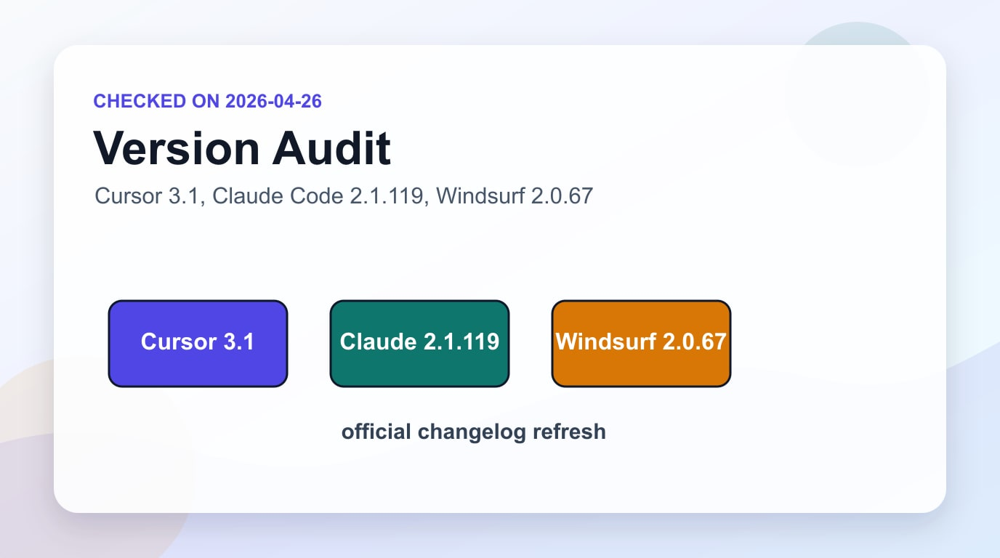

「Cursor使ってる？ Claude Code？ それともWindsurf？」最近の開発者コミュニティで最もよく聞かれる質問の一つだ。

私は3つ全部使ってみた。日常のコーディングからブログの自動化、複雑なリファクタリングまで。正直に言えば、最初は「人気のものを1つ使えばいいんじゃない？」と思っていた。でも実際に使ってみると、それぞれが全く異なるツールだった。「AIがコードを助ける」という共通点が一つあるだけで、哲学から使用パターン、コスト構造、適合するタスクまで全部違う。

2026年4月26日時点で3つのツールの状態を整理する。スペックの羅列ではなく、実際に使ってみて感じたことを中心に。

> <strong>最新性の確認</strong>: この記事は[Cursor公式changelog](https://www.cursor.com/changelog)、[Claude Code changelog](https://code.claude.com/docs/en/changelog)、[Windsurf changelog](https://windsurf.com/changelog)を再確認して修正した。Cursorは3.1世代と4月中旬の機能アップデート、Claude Codeは2.1.119系、Windsurfは2.0.67とGPT-5.5対応の流れとして整理している。

## 3つのツール、3つの異なる哲学

機能比較の前に、各ツールの核心的な賭けを理解することが重要だ。どんな哲学の上に作られているかを知らないと、機能表に意味がない。

<strong>Cursorの賭け</strong>：「開発者は既存のワークフローを変えたくない。AIをその中に溶け込ませろ。」

Cursor 3がリリースされて興味深いことが起きた。The New Stackがこのリリースを["The IDE is now a fallback, not the default"](https://thenewstack.io/cursor-3-demotes-ide/)と表現した。つまりIDEはもはやデフォルトではなく、エージェントが作業できないときに戻ってくるフォールバックだ。2026年4月26日時点の公式changelogでは、3.1世代と4月中旬アップデートが現在の流れだ。

<strong>Claude Codeの賭け</strong>：「IDEがなくてもいい。コードベースを理解するAIさえあれば十分だ。」

Claude CodeはIDEではない。ターミナルベースのCLIエージェントだ。ファイルを読み、修正し、コマンドを実行する。シェルで作業するのが慣れている人には強力だが、GUIに慣れた人には最初に馴染みにくい。2026年4月26日時点の公式changelogで最新項目は2.1.119だ。

<strong>Windsurfの賭け</strong>：「AIと開発者の境界を消せ。AIはツールではなく協業パートナーだ。」

Cascadeエージェントが中心。コードベースの文脈を記憶し、マルチステップ作業を自律実行する。Arena Modeが代表的な差別点で、2つのモデルに同じタスクを与えて結果を比較して選ぶ。バイブコーディングの代名詞。2026年4月26日時点では、Windsurfは2.0.67系とGPT-5.5対応まで進んでいる。

3つとも「AIがコードを助ける」と言うが、実際には完全に異なる方向を向いている。

## Cursor 3.1 — IDEの座をエージェントに譲ったツール

Cursorを最初に使ったとき、まず感動したのはTabオートコンプリートだ。コードを半行入力すると残りを補完する精度が、他のツールより一段上だ。これは今でも認める。

Cursor 3.1世代の核心は<strong>非同期サブエージェント</strong>だ。難しい問題に集中しながら、他のタスクを並列処理できる。以前のバージョンが「エージェントが作業する間待つ」構造だったなら、今は本当のマルチタスクが可能だ。

Bugbotも変わった。単純なPRレビューツールを超えて、フィードバックを学習して時間が経つにつれてレビュー水準が上がる。MCPサポートも追加された。そして今回のリリースで<strong>Design Mode</strong>が入った。UI要素をクリックして自然言語で変更内容を記述すると、エージェントが実装する。

<strong>Composer 2</strong>という独自のコーディングモデルもある。高い使用制限が長所だ。ただし、外部の最高モデル（Claude Opus 4.x、GPT-5.xなど）との性能比較はCursorが公式に公開していないため、直接比較が難しい点は残念だ。

価格はPro基準で月$20。これにマルチレポレイアウト、クラウド・ローカルエージェントのシームレスな切り替えが含まれる。

惜しい点を一つ挙げると、Cursor 3が「エージェント中心」にポジショニングを変えたことで、既存ユーザーが「自分が知っているCursorじゃない」と戸惑っているという点だ。製品が素早く変わるときによく起きる問題で、Cursorはまさにその過渡期にある。

Cursorをチーム環境で使う強みもある。BugbotがチームのPRフィードバック履歴を蓄積して学習するという点は、時間が経つにつれチームのスタイルに合わせたレビュアーが育つようなものだ。個人開発者にはあまり重要ではないが、5人以上のチームなら、この学習ループが実質的な価値を生む。

モデルの透明性についても注意が必要だ。CursorはComposer 2のベースモデルや学習方法を公開していない。セキュリティポリシーが厳しい企業の場合、コードが外部サーバーに送信されることを事前に確認しておく必要がある。

## Claude Code 2.1 — ターミナル上のアーキテクト

この記事自体がClaude Codeで書かれている。このブログのポスト自動化、内部リンク挿入、多言語翻訳、ビルド検証まで全てClaude Codeベースのワークフローだ。

だからこのツールについては最も多く語れる。

2026年4月時点のClaude Code 2.1の最大の変化は<strong>ネイティブCLIバイナリ</strong>への移行だ。バンドルJavaScriptからネイティブに変えて起動速度が目に見えて速くなった。そして<strong>Ultraplan</strong>が追加された。クラウドで計画を立て、ウェブエディタでレビューした後、ローカルまたはリモートで実行するフローだ。複雑な大型作業を分散処理するのに役立つ。

<strong>Monitor ツール</strong>も新しく入った。バックグラウンドで動いているプロセスをリアルタイムストリーミングで確認できる。ビルドログを見ながら次の作業を進めるパターンが自然にできるようになった。

個人的に最もよく使うのは`/loop`機能だ。インターバルなしで自分のペースで繰り返し作業を実行する。[Claude CodeのGit Worktreeを使った並列セッション](/ja/blog/ja/claude-code-parallel-sessions-git-worktree)と組み合わせれば、マルチレポ作業も効率的にこなせる。運用ルーティンを先に整えたいなら、[Claude Code実践ルーティンガイド](/ja/blog/ja/claude-code-routines-practical-guide-2026)も合わせて読むとよい。

Claude Codeが他のツールと最も大きく異なる点は<strong>コードベース全体を理解する</strong>ことだ。ファイルをいくつか見るのではなく、リポジトリ全体の構造を読んでアーキテクチャレベルの判断を下す。

SWE-bench（実際のソフトウェアエンジニアリングタスクベンチマーク）でClaude Code + Claude Opus 4.xの組み合わせがトップ圏にある。「ベンチマークと実際は違う」という意見もあるが、私の経験でも複雑なリファクタリングや設計決定でClaude Codeがより良いコードを出す傾向がある。

惜しい点は明確だ。<strong>UIがない</strong>。ターミナルを開いてプロンプトを入力して、結果をテキストで読む。最初にこの参入障壁が高い。そして自動補完がない。ファイルをエディタで直接編集する作業は、Claude Codeではなく依然としてエディタの役目だ。

コストも考慮が必要だ。Claude Pro（$20/月）で基本アクセスはできるが、ヘビーユーザーはAPI使用量に応じて追加費用が発生する。軽く使えば$20+$10〜15程度だが、このブログのような自動化ワークフローを動かすと$20+$50になることもある。

Claude Codeの真の力は<strong>HooksとSkillsシステム</strong>にある。ポスト完成時にTelegram通知を送り、ビルド失敗時に自動でエラー分析するフックを運用している。複雑なスクリプトは不要で、Claude Codeに「ビルドが終わったらこうして」と伝えるだけだ。`/loop`で繰り返し作業を回し、Monitorでリアルタイムログを見るパターンは、CursorやWindsurfでは同じ方法では実現しにくい。

セキュリティ面でもClaude Codeは異なる。ローカルで動作し、コードはAnthropicのAPIにのみ送られる。APIキーを適切に管理すれば、機密コードでも使いやすい選択肢だ。

## Windsurf 2.0 — 速度を優先するAIネイティブエディタ

Windsurfを最初に使ったとき、「ああ、これがバイブコーディングか」と実感した。コードを書く速度が他のツールより速く感じる。Cascadeエージェントが現在の作業の文脈をよく覚えていて、マルチステップ作業を自律処理する。

<strong>Arena Mode</strong>が最も独創的な機能だ。2つのモデルに同じプロンプトを与えて、2つの応答を並べて見ながら一つを選ぶ。[Windsurf Arena Modeを使って発見した興味深いデータ](/ja/blog/ja/windsurf-arena-mode-speed-over-accuracy)がある。開発者はAIコーディングツールで正確さより速さを2倍以上重視するということだ。

2026年のWindsurf 2.0は<strong>Devin統合</strong>を追加した。ローカルCascadeセッションとクラウドDevinセッションを一つのカンバン形式のダッシュボードで管理する。チーム単位でエージェントを運用するときに便利だ。

Claude Opus 4.5がSonnet価格で期間限定提供されている点も言及に値する。モデル選択の幅が広いというのがWindsurfの長所の一つだ。

率直に惜しい点もある。私の経験では、Windsurfは「とりあえず動くコード」を速く出すときは素晴らしい。しかしレガシーが積み重なると、Cascadeが文脈を見失い始める。速度を優先するツールの特性上、コード品質が「とりあえず動く」水準で止まる傾向がある。プロダクションのコードベースを長期間Windsurfだけで維持するのはまだ無理があると思う。

価格は2026年3月にクレジットベースからクォータベースに変わってProが$15から$20に上がった。Maxプランは$200/月だ。

Windsurfが2025〜2026年にかけてWaveリリースを14回行ったことも注目に値する。Arena Mode、並列エージェント、ブラウザ統合、音声コマンドなど、各Waveで実質的な機能が追加された。製品が生きているという信号だ。しかし皮肉なことに、Windsurfの開発速度を可能にしている「速度優先」の哲学が、あなたのコードを書く方法にも影響する。Cascadeが素早く書くコードは「今日動く」レベルで止まりがちだ。

## 実際の1日のワークフローでの使い方

仕様書より重要なのは、実際にどんな場面でどう使われるかだ。私の実際の使用パターンを共有する。

<strong>Claude Codeをメインに使う場合：</strong>

朝ターミナルを開くと、前日の作業状態がClaude Codeに残っている。`/recap`でセッションの要約を確認して作業を再開する。新しいポストを書くときは`/loop`で「書く→翻訳→内部リンク挿入→ビルド検証」のサイクルを回す。ビルド中はMonitorでログをリアルタイムに見ながら次の作業を進める。

このフローでGUIエディタを開く場面はほとんどない。��ンポーネントの直接編集やファイル構造の確認時だけVSCodeを使う。それがCursorを手放せない理由だ。

<strong>Cursorを補助として使う場合：</strong>

新しいコンポーネントの作成や素早いコード修正にはCursorを開く。Tailwindのクラス操作やTypeScriptの型定義など、繰り返しパターンが多いコードでのCursorのタブ補完は他のツールと感触が違う。

しかしリファクタリングやアーキテクチャの変更が必要になったらCursorを閉じてClaude Codeに戻る。「このコンポーネントをリポジトリ全体の構造に合わせて再設計して」というリクエストで、2つのツールの出力の差が最も大きく出る。

<strong>Windsurfを使う場面：</strong>

新しいアイデアを素早く検証したいときにWindsurfを開く。20分以内にプロトタイプを作って「このアプローチは実際に動くか」を確認するとき。Arena Modeで2つのモデルの回答を比べながら、どちらのアプローチが良いか判断するのに便利だ。

ただしそのプロトタイプをプロダクションコードに育てる必要があれば、そこからClaude Codeで設計し直す。Windsurfが作ったコードをそのまま使い続けると、後で修正にかかる時間の方が最初に節約した時間より長くなる。

## 機能・価格を一目で比較

|  | <strong>Cursor 3.1</strong> | <strong>Claude Code 2.1.119</strong> | <strong>Windsurf 2.0.67</strong> |
|---|---|---|---|
| インターフェース | GUI（IDE） | ターミナルCLI | GUI（IDE） |
| インライン補完 | ⭐⭐⭐⭐⭐ 最強 | なし | ⭐⭐⭐⭐ |
| アーキテクチャ推論 | ⭐⭐⭐ | ⭐⭐⭐⭐⭐ | ⭐⭐⭐ |
| マルチレポ | ✅（ネイティブ） | ✅（Worktree組み合わせ） | ⚠️（制限あり） |
| 非同期エージェント | ✅（サブエージェント） | ✅（ループ/フック） | ✅（Devin統合） |
| モデル選択 | Composer 2 + 一部 | Claude系列最新 | 多様（Arena Mode） |
| SWE-benchパフォーマンス | 中 | 最高 | 中 |
| Pro価格 | $20/月 | $20/月（Claude Pro） | $20/月 |
| 最上位プラン | 非公開 | API使用量ベース | $200/月 Max |
| 代表的な強み | タブ補完、チーム環境 | 複雑なリファクタリング、自動化 | 高速プロトタイピング |

## いつ何を使うべきか — 状況別判断基準

機能表を見ても「で、何を使えばいい？」が解決しないなら、以下の判断基準の方が役立つかもしれない。

<strong>Cursor 3.1を選ぶべき場合：</strong>

- 1日のコーディング時間の半分以上がファイル直接編集でオートコンプリートが重要
- 複数のレポを同時に作業するチーム環境で仕事している
- PRレビュー自動化（Bugbot）とCI統合が必要
- ターミナルよりGUIでエディタを開く方が自然

<strong>Claude Codeを選ぶべき場合：</strong>

- コードベース全体を理解してアーキテクチャレベルのリファクタリングが必要
- Hooks + Skills + Subagentsでカスタムワークフローを作って自動化したい
- すでにClaudeをメインAIとして使っていてコンテキストの連続性が重要
- ビルド、テスト、デプロイパイプラインをAIと統合したい
- コード品質と長期保守性が開発速度より重要

<strong>Windsurfを選ぶべき場合：</strong>

- MVPやプロトタイプを素早く作る必要がある
- 複数のモデルの応答を比較しながら最適な結果を選びたい
- 素早い反復が必要な初期探索フェーズの開発
- チームにAIエージェントを導入したがモデル選択に確信がない

現実的に、多くの開発者が2つを組み合わせて使っている。CursorのTab補完 + Claude Codeのリファクタリングの組み合わせが最もよくあるパターン。費用は$40〜$60/月に上がるが、それぞれのツールの強みを異なる場面で使う戦略だ。

<strong>ソロ開発者とチーム環境でも判断が変わる。</strong>一人で作業するなら、Claude Codeのカスタマイズ自由度が最大のメリット。HooksとSkillsで自分だけのワークフローを作れる。5人以上のチームなら、CursorのBugbotとマルチレポ機能がチーム全体に適用しやすい。WindsurfのエージェントダッシュボードはチームスケールでのAIエージェント管理に視認性が高い。

現実的なコスト計算：3つとも月$20のProプランだが、Claude CodeはAPI使用量が別途かかる。軽く使えば月$30〜40、ヘビーな自動化ワークフローを回すなら$60〜70になることもある。

## 私の結論 — 3つ全部使ってみて

率直に言えば、私は今Claude Code中心で運用している。このブログの自動化ワークフロー、多言語ポスト作成、コードレビューまで全部Claude Codeベースだ。アーキテクチャを理解して長期的に保守可能なコードを書くという点が決め手だった。[Claude Codeのベストプラクティスを初めて整理したとき](/ja/blog/ja/claude-code-best-practices)、このツールが単純なコーディング補助ではなくシステム設計パートナーとして使えることを確認した。

かといってCursorを完全に離れたわけでもない。Tab補完はまだCursorが最強だ。コードを素早く入力しながら修正する作業でのCursorの体感は依然として他のツールと違う。

Windsurfは過大評価されていると思う。Arena Modeは新鮮で、Cascadeの速さも実際に感じる。でも「速い」ことが長期的には技術的負債につながる傾向が私の経験にはあった。素早く作って投資家に見せる必要がある状況ならWindsurfが合う。6ヶ月プロジェクトを最初からWindsurfで構築するなら、もう一度考えた方がいいかもしれない。

3つのツール全部、6ヶ月前と今では完全に別製品だ。この記事も数ヶ月後に書き直せば内容が変わるだろう。今最も確かなアドバイスは一つ：無料プランやトライアルで直接試して、自分のワークフローに合うものを選んでほしい。スペック表やレビュー記事ではなく、自分のコードで試すのが唯一の正解だ。

最後にもう一点。この3つのうちどれかを選ぶことは、他の2つを完全に諦める決断ではない。AIコーディングツールはまだ「一つだけで十分」な段階にない。私もClaude Codeをメインに使いながら、ファイル編集にCursorを使い、簡単なプロトタイプにはWindsurfを試す。それぞれのツールが何に強いかを理解すれば、状況に応じて適切なツールを選ぶ感覚が身につく。それが2026年のAIコーディングツールをうまく活用する方法だ。より広いエージェントツールの選び方は、[Python AIエージェントライブラリ比較](/ja/blog/ja/python-ai-agent-library-comparison-2026)と[MCP・A2A・Open Responsesプロトコル比較](/ja/blog/ja/mcp-vs-a2a-vs-open-responses-agent-protocol-comparison-2026)でも続けて扱っている。
