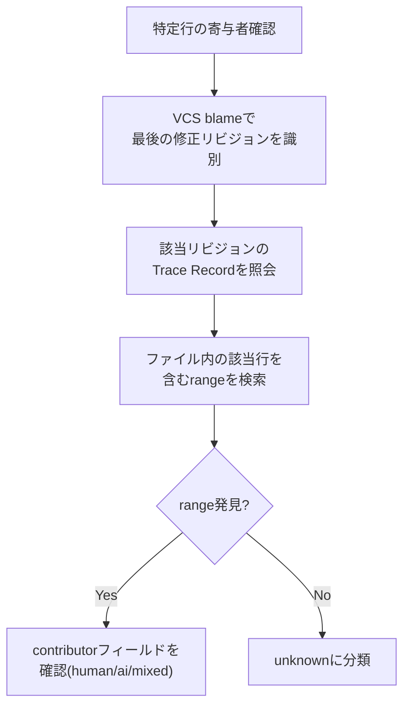
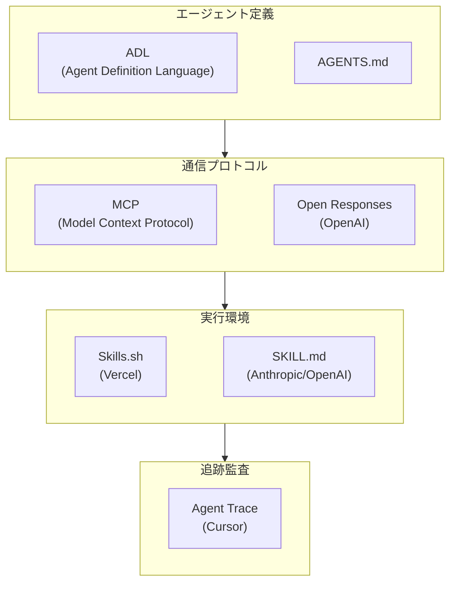

## 概要

2026年1月、Cursorが<strong>Agent Trace</strong>というオープン仕様（RFC）を公開しました。バージョン0.1.0で始まったこの仕様は、「AIが作成したコードをどのように追跡するか」という質問に対する業界初の体系的な回答です。

現在、ほとんどの開発チームが使用している`git blame`は、「誰が最後にこの行を修正したか」のみを示します。しかし、AIコーディングツールが普及した今、本当に必要な情報は異なります。<strong>このコードは人間が作成したものか、AIが生成したものか、それとも両者の協力の結果か？</strong>

この記事では、Agent Traceの技術仕様を分析し、エンジニアリングマネージャーとCTOの観点から、なぜこの標準が重要なのかを見ていきます。

## Agent Traceとは何か

Agent Traceは、バージョン管理されたコードベースで<strong>AI寄与と人間寄与をベンダー中立的なJSONフォーマットで記録</strong>するオープン仕様です。

核心的な特徴は以下の通りです。

<strong>ファイルおよび行レベルの寄与追跡</strong>：単に「このコミットにAIが関与した」のではなく、特定ファイルの何行目から何行目までがAIによって生成されたかを記録します。

<strong>4つの寄与者タイプ分類</strong>：`human`（人間による直接作成）、`ai`（AI生成）、`mixed`（人間がAI出力を編集、またはその逆）、`unknown`（出所不明）に分類します。

<strong>ベンダー中立的設計</strong>：Cursor、Copilot、Claude Code等、どのツールからでも同じフォーマットで記録できます。

<strong>リポジトリ非依存</strong>：ローカルファイル、gitノート、データベース等、どこにでも保存できます。

## Trace Recordの構造

Agent Traceの基本単位は<strong>Trace Record</strong>です。JSONスキーマを見ていきましょう。

```json
{
  "version": "0.1.0",
  "id": "550e8400-e29b-41d4-a716-446655440000",
  "timestamp": "2026-01-15T09:30:00Z",
  "vcs": {
    "type": "git",
    "revision": "a1b2c3d4e5f6..."
  },
  "tool": {
    "name": "cursor",
    "version": "0.45.0"
  },
  "files": [
    {
      "path": "src/utils/parser.ts",
      "conversations": [
        {
          "url": "https://cursor.com/conversations/abc123",
          "ranges": [
            {
              "start_line": 15,
              "end_line": 42,
              "contributor": "ai",
              "content_hash": "murmur3:9f2e8a1b"
            },
            {
              "start_line": 43,
              "end_line": 50,
              "contributor": "mixed"
            }
          ]
        }
      ]
    }
  ],
  "metadata": {
    "dev.cursor": {
      "session_id": "xyz789"
    }
  }
}
```

この構造で注目すべき点がいくつかあります。

<strong>会話（conversation）ベースのグループ化</strong>：AIとの1つの会話セッションで生成された複数のコード範囲をまとめて管理します。これは「なぜこのコードがこのように生成されたのか」を追跡する際に重要です。

<strong>content_hashでコード移動を追跡</strong>：コードがリファクタリングにより別のファイルや場所に移動しても、ハッシュ値を通じて元の寄与情報を保持できます。

<strong>モデル識別子</strong>：`provider/model-name`形式（例：`anthropic/claude-opus-4-5-20251101`）でどのAIモデルがコードを生成したかを記録します。

## 行追跡方法論

Agent Traceで特定の行の寄与者を確認するプロセスは以下の通りです。



この方法は既存の`git blame`と相互補完的に機能します。`git blame`が「誰が最後に修正したか」を示すならば、Agent Traceは「その修正がAIによるものか、人間によるものか」を追加で示します。

## EMとCTOにとって重要な理由

### 1. コードレビューワークフローの進化

現在、ほとんどのチームではプルリクエスト（PR）のすべてのコードを同じレベルでレビューしています。しかし、Agent Traceが導入されるとレビュー戦略を差別化できます。

<strong>AI生成コード</strong>：ロジック正確性、エッジケース、セキュリティ脆弱性に集中したレビュー

<strong>人間作成コード</strong>：設計意図、アーキテクチャ適合性中心のレビュー

<strong>Mixedコード</strong>：人間がAI出力をどのように修正したか、修正の根拠が妥当かを確認

これにより、レビュー時間を効率的に配分できます。

### 2. チーム能力測定の新しい基準

AIツール利用率が高いからといって、生産性が高いわけではありません。Agent Traceデータを分析すれば、以下が把握できます。

<strong>AI生成コードの修正率</strong>：AIが生成したコードのうち、人間が再度修正する必要があった割合。この値が高い場合は、プロンプト品質やAIツール選択を再検討する必要があります。

<strong>ツール別のコード品質比較</strong>：Cursor、Copilot、Claude Code等のツール別に生成されたコードの欠陥率を比較できます。

<strong>チームメンバー別のAI活用パターン</strong>：誰がAIを効果的に活用しているか、どの領域でAI活用教育が必要かをデータに基づいて判断できます。

### 3. コンプライアンスと監査対応

金融、医療、防衛等の規制業界では、コードの出所を明確にする要件が増えています。Agent Traceは以下をサポートします。

<strong>監査証跡（Audit Trail）</strong>：コードのAI寄与率を定量的に報告できます。

<strong>ライセンスリスク管理</strong>：AI生成コード部分を識別してライセンスレビュー対象を明確化します。

<strong>セキュリティ脆弱性への対応</strong>：AI生成コードでセキュリティ問題が発見された場合、同じ会話セッションで生成された他のコードも一緒にレビューできます。

## サポート対象のVCSと拡張性

Agent Traceはgit以外にも複数のバージョン管理システムをサポートしています。

| VCS | リビジョン形式 | 特記事項 |
|-----|------------|---------|
| git | 40字hex SHA | 最も一般的 |
| jj (Jujutsu) | Change ID | リベースにも安定的 |
| hg (Mercurial) | Changeset ID | レガシープロジェクト対応 |
| svn | リビジョン番号 | エンタープライズ環境 |

また、`metadata`フィールドに逆ドメイン記法（例：`dev.cursor`、`com.github`）でベンダー別の拡張データを追加でき、互換性を損なわずに各ツールの固有情報を保存できます。

## 意図的に扱わないこと

Agent Trace仕様が明示的に除外している領域も重要です。

<strong>法的所有権/著作権</strong>：AIが生成したコードの法的所有権問題はこの仕様の範囲外です。これは法律と政策の領域です。

<strong>学習データの出所追跡</strong>：AIモデルがどの学習データに基づいてコードを生成したかは追跡しません。

<strong>コード品質評価</strong>：AI生成コードが良いコードか悪いコードかを判断しません。これはコードレビューとテストの領域です。

<strong>UI表現方法</strong>：追跡データをどのように可視化するかは各ツールの実装に任せます。

このような境界設定は、仕様を現実的で採用可能にすることが重要です。

## 実務導入シナリオ

### シナリオ1：AIコーディングツール導入効果の測定

チームにClaude Codeを導入して3ヶ月が経ったと仮定しましょう。Agent Traceデータを分析すれば、以下のようなレポートを生成できます。

```
AIコード寄与分析レポート（2026年Q1）
====================================
全体コード行数：45,000
├── human: 28,000（62.2%）
├── ai: 12,000（26.7%）
├── mixed: 4,500（10.0%）
└── unknown: 500（1.1%）

AI生成コード修正率：23%
（AIが生成した12,000行のうち2,760行が後続コミットで人間により修正）

モデル別分布：
├── anthropic/claude-opus-4-5: 7,200行（修正率18%）
├── openai/gpt-5.2: 3,800行（修正率31%）
└── cursor/custom: 1,000行（修正率15%）
```

このようなデータがあれば、AI道具投資対比効果を経営陣に定量的に報告できます。

### シナリオ2：セキュリティインシデント対応

本番環境でセキュリティ脆弱性が発見された場合、Agent Traceを通じて該当コードがAIによって生成されたことを確認し、同じ会話セッションで生成された他のコードもセキュリティチェック対象に含めることができます。

## AIエージェント標準化の大きな流れ

Agent Traceは単独で存在するものではありません。2025〜2026年にかけてAIエージェントエコシステムで複数の標準が同時に登場しています。



Agent Traceはこのエコシステムで<strong>「実行後（post-execution）」</strong>段階を担当します。エージェントが定義され（ADL/AGENTS.md）、通信し（MCP/Open Responses）、実行した（Skills）後の成果物を追跡する役割です。

## 現在の限界と未解決の課題

RFC状態であるため、まだ解決されていない課題があります。

<strong>マージとリベース処理</strong>：ブランチマージ時にTrace Recordがどのように統合されるべきかについて、まだ明確な答えがありません。

<strong>大規模エージェント変更</strong>：AIが一度に数百個のファイルを修正する場合の性能と保存戦略が未定です。

<strong>採用インセンティブ</strong>：ツールベンダーがこの仕様を採用する動機付けが必要です。現在はCursorが主導しており、Vercel、Cognition、Cloudflare等がパートナーとして参加しています。

## 結論

Agent Traceは、AI コーディング時代における<strong>「このコードは誰が書いたのか」</strong>という根本的な質問に対する最初の体系的な回答です。まだRFC段階ですが、コードレビュー、チーム能力測定、コンプライアンスという3つの実務領域で即座に価値を提供する可能性を持っています。

特にEMやCTOの観点からは、この仕様の発展を注視しながら、チーム内のAIコーディングツール使用状況を測定するための基盤を事前に準備しておくことが賢明な戦略です。Agent Traceが成熟すれば、そのデータはAIツール投資判断とチーム運営最適化の重要な根拠となるでしょう。

## 参考資料

- [Agent Trace公式サイト](https://agent-trace.dev/)
- [Cursor Agent Trace GitHubリポジトリ](https://github.com/cursor/agent-trace)
- [InfoQ: Agent Trace分析記事](https://www.infoq.com/news/2026/02/agent-trace-cursor/)
- [Cognition: Agent Traceコンテキストグラフ](https://cognition.ai/blog/agent-trace)
