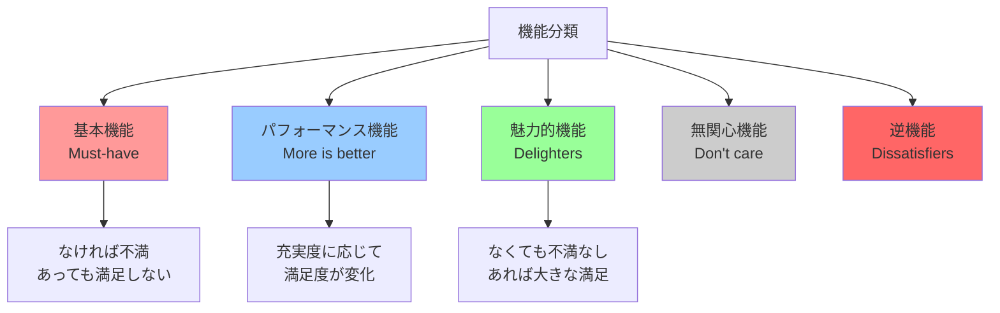
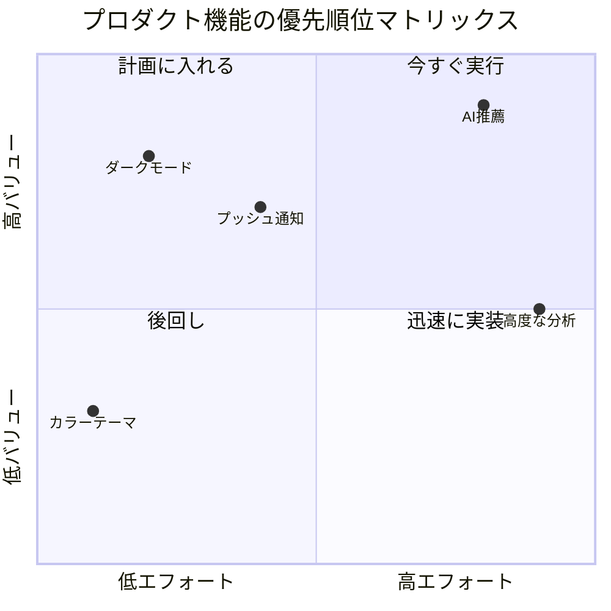
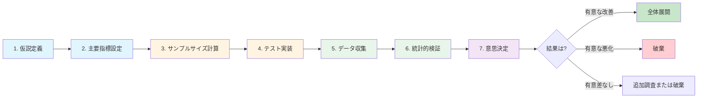
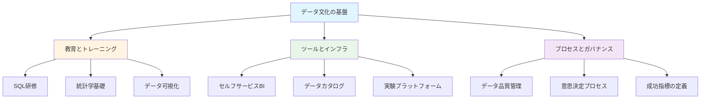
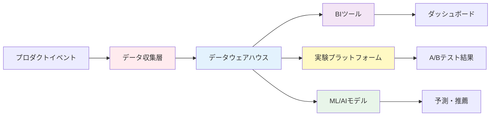
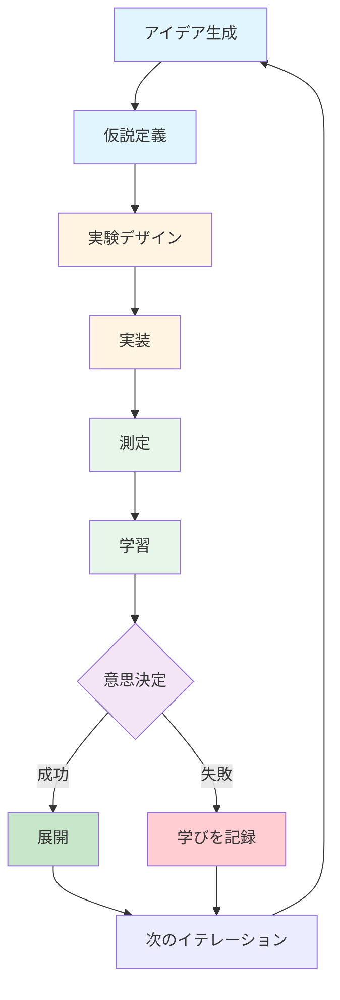

## 概要

現代のプロダクトマネジメントにおいて、データ駆動型の意思決定は成功の鍵となっています。直感や経験も重要ですが、データに基づいた客観的な判断がプロダクトの成長を加速させます。

本記事では、プロダクトマネージャー（PM）が日々の意思決定で活用できる<strong>実践的な分析フレームワーク</strong>、<strong>主要指標の測定方法</strong>、<strong>A/Bテストのベストプラクティス</strong>、そして<strong>データ文化の構築方法</strong>について詳しく解説します。

## プロダクトマネージャーが追跡すべき主要指標

### 基本的なエンゲージメント指標

プロダクトの健全性を把握するために、以下の基本指標を継続的に監視する必要があります。

#### 1. DAU/MAU（デイリー/マンスリーアクティブユーザー）

```sql
-- DAU/MAU比率の計算
WITH daily_users AS (
  SELECT
    DATE(event_timestamp) as date,
    COUNT(DISTINCT user_id) as dau
  FROM events
  WHERE event_timestamp >= DATE_SUB(CURRENT_DATE(), INTERVAL 30 DAY)
  GROUP BY date
),
monthly_users AS (
  SELECT
    DATE_TRUNC('month', event_timestamp) as month,
    COUNT(DISTINCT user_id) as mau
  FROM events
  WHERE event_timestamp >= DATE_SUB(CURRENT_DATE(), INTERVAL 30 DAY)
  GROUP BY month
)
SELECT
  d.date,
  d.dau,
  m.mau,
  ROUND(d.dau * 1.0 / m.mau, 3) as stickiness_ratio
FROM daily_users d
JOIN monthly_users m ON DATE_TRUNC('month', d.date) = m.month
ORDER BY d.date DESC;
```

<strong>DAU/MAU比率</strong>は「粘着性（Stickiness）」を示す重要な指標です。一般的に、20%以上であれば良好とされています。

#### 2. リテンション率

ユーザーがプロダクトに戻ってくる頻度を測定します。

```sql
-- コホートリテンション分析
WITH cohorts AS (
  SELECT
    user_id,
    DATE_TRUNC('month', MIN(created_at)) as cohort_month
  FROM users
  GROUP BY user_id
),
user_activities AS (
  SELECT
    e.user_id,
    c.cohort_month,
    DATE_TRUNC('month', e.event_timestamp) as activity_month
  FROM events e
  JOIN cohorts c ON e.user_id = c.user_id
)
SELECT
  cohort_month,
  COUNT(DISTINCT CASE WHEN activity_month = cohort_month THEN user_id END) as month_0,
  COUNT(DISTINCT CASE WHEN activity_month = DATE_ADD(cohort_month, INTERVAL 1 MONTH) THEN user_id END) as month_1,
  COUNT(DISTINCT CASE WHEN activity_month = DATE_ADD(cohort_month, INTERVAL 2 MONTH) THEN user_id END) as month_2,
  COUNT(DISTINCT CASE WHEN activity_month = DATE_ADD(cohort_month, INTERVAL 3 MONTH) THEN user_id END) as month_3,
  -- 月ごとのリテンション率を計算
  ROUND(100.0 * COUNT(DISTINCT CASE WHEN activity_month = DATE_ADD(cohort_month, INTERVAL 1 MONTH) THEN user_id END) /
    NULLIF(COUNT(DISTINCT CASE WHEN activity_month = cohort_month THEN user_id END), 0), 2) as retention_month_1
FROM user_activities
GROUP BY cohort_month
ORDER BY cohort_month DESC;
```

#### 3. NPS（ネット・プロモーター・スコア）

ユーザー満足度と推奨意向を測定する指標です。

```sql
-- NPSの計算
WITH nps_responses AS (
  SELECT
    user_id,
    score,
    CASE
      WHEN score >= 9 THEN 'promoter'
      WHEN score >= 7 THEN 'passive'
      ELSE 'detractor'
    END as category
  FROM nps_surveys
  WHERE survey_date >= DATE_SUB(CURRENT_DATE(), INTERVAL 90 DAY)
)
SELECT
  COUNT(*) as total_responses,
  SUM(CASE WHEN category = 'promoter' THEN 1 ELSE 0 END) as promoters,
  SUM(CASE WHEN category = 'detractor' THEN 1 ELSE 0 END) as detractors,
  ROUND(
    100.0 * (SUM(CASE WHEN category = 'promoter' THEN 1 ELSE 0 END) -
             SUM(CASE WHEN category = 'detractor' THEN 1 ELSE 0 END)) /
    COUNT(*),
    2
  ) as nps_score
FROM nps_responses;
```

### プロダクトタイプ別の重要指標

| プロダクトタイプ | 主要指標 | 目標値の例 |
|--------------|---------|-----------|
| <strong>SaaS</strong> | MRR（月次経常収益）、Churn Rate、LTV/CAC | Churn < 5%、LTV/CAC > 3 |
| <strong>Eコマース</strong> | コンバージョン率、平均注文額、リピート購入率 | CVR 2〜5%、リピート率 > 30% |
| <strong>マーケットプレイス</strong> | GMV（流通取引総額）、Take Rate、両面のアクティブ率 | 両面アクティブ率 > 20% |
| <strong>コンテンツプラットフォーム</strong> | エンゲージメント時間、コンテンツ消費量、クリエイター成長率 | 平均セッション時間 > 10分 |
| <strong>ソーシャルネットワーク</strong> | ネットワーク密度、シェア率、DAU/MAU比 | DAU/MAU > 25% |

## プロダクト意思決定フレームワーク

### 1. RICEスコアリングモデル

RICEは、機能の優先順位を決定するための定量的なフレームワークです。

```
RICE Score = (Reach × Impact × Confidence) / Effort
```

<strong>計算例</strong>：

| 機能 | Reach (月間ユーザー数) | Impact (1-3) | Confidence (%) | Effort (人日) | RICE Score |
|------|---------------------|-------------|---------------|--------------|------------|
| プッシュ通知システム | 10,000 | 3 | 80% | 20 | 1,200 |
| ダークモード | 8,000 | 2 | 100% | 5 | 3,200 |
| AI推薦機能 | 15,000 | 3 | 50% | 40 | 562.5 |

この例では、<strong>ダークモード</strong>が最も高いRICEスコアを獲得しています。

### 2. ICEスコアリング

より簡易的な評価方法で、迅速な意思決定に適しています。

```
ICE Score = (Impact × Confidence × Ease) / 3
```

各要素を1〜10で評価します。

### 3. Kanoモデル

ユーザー満足度とプロダクト機能の関係を分析します。



### 4. バリューvsエフォートマトリックス

機能を4つの象限に分類します。



## データ分析ツールの比較

### 主要なプロダクト分析プラットフォーム

| ツール | 強み | 弱み | 価格帯 | 最適な用途 |
|-------|------|------|--------|-----------|
| <strong>Amplitude</strong> | 強力なコホート分析、行動分析 | 学習曲線が急 | $$ - $$$ | B2C、高頻度利用プロダクト |
| <strong>Mixpanel</strong> | リアルタイム分析、使いやすいUI | 大規模データ処理が遅い | $$ - $$$ | スタートアップ、モバイルアプリ |
| <strong>Heap</strong> | 自動イベント追跡、後付け分析可能 | 生データアクセス制限 | $$ | データチームが小規模な企業 |
| <strong>Google Analytics 4</strong> | 無料、強力な統合機能 | プロダクト分析には不向き | 無料 - $$ | ウェブサイト、コンテンツサイト |
| <strong>PostHog</strong> | オープンソース、セルフホスト可 | エンタープライズ機能が少ない | $ - $$ | プライバシー重視、スタートアップ |

### データウェアハウスとBIツール

<strong>データウェアハウス</strong>：
- <strong>BigQuery</strong>（Google Cloud）：最もスケーラブル、SQL標準
- <strong>Snowflake</strong>：マルチクラウド、高速
- <strong>Redshift</strong>（AWS）：AWSエコシステムとの統合

<strong>BIツール</strong>：
- <strong>Looker</strong>：LookMLによるデータモデリング
- <strong>Tableau</strong>：強力なビジュアライゼーション
- <strong>Metabase</strong>：オープンソース、使いやすい

## A/Bテストのベストプラクティス

### A/Bテストの設計プロセス



### サンプルサイズの計算

```python
# Python例：サンプルサイズ計算
from scipy import stats
import math

def calculate_sample_size(baseline_rate, mde, alpha=0.05, power=0.8):
    """
    baseline_rate: ベースラインのコンバージョン率（例：0.05 = 5%）
    mde: 最小検出効果（Minimum Detectable Effect）（例：0.01 = 1%ポイント）
    alpha: 有意水準（通常0.05）
    power: 検出力（通常0.8）
    """
    # Z値の計算
    z_alpha = stats.norm.ppf(1 - alpha/2)
    z_beta = stats.norm.ppf(power)

    # サンプルサイズ計算
    p1 = baseline_rate
    p2 = baseline_rate + mde
    p_pooled = (p1 + p2) / 2

    n = (2 * p_pooled * (1 - p_pooled) * (z_alpha + z_beta)**2) / (p2 - p1)**2

    return math.ceil(n)

# 例：ベースライン5%、1%ポイント改善を検出したい場合
sample_size = calculate_sample_size(0.05, 0.01)
print(f"必要なサンプルサイズ（各グループ）: {sample_size:,}")
# 出力：必要なサンプルサイズ（各グループ）: 15,686
```

### よくある間違いと対策

| 間違い | 影響 | 対策 |
|--------|------|------|
| <strong>ピーキング</strong>（途中で結果を見て判断） | 偽陽性率の増加 | 事前に決めた期間まで待つ |
| <strong>サンプルサイズ不足</strong> | 統計的検出力の低下 | 事前にパワー分析を実施 |
| <strong>複数の指標を同時検証</strong> | 多重検定問題 | Bonferroni補正、またはプライマリ指標に集中 |
| <strong>セグメント別分析の乱用</strong> | データマイニングバイアス | 事前にセグメントを定義 |
| <strong>ノベルティ効果の無視</strong> | 長期的効果の誤判断 | 最低2週間以上のテスト期間 |

### ファネル分析のSQLクエリ

```sql
-- コンバージョンファネル分析
WITH funnel_events AS (
  SELECT
    user_id,
    MAX(CASE WHEN event_name = 'page_view' THEN 1 ELSE 0 END) as viewed,
    MAX(CASE WHEN event_name = 'add_to_cart' THEN 1 ELSE 0 END) as added_to_cart,
    MAX(CASE WHEN event_name = 'checkout_started' THEN 1 ELSE 0 END) as started_checkout,
    MAX(CASE WHEN event_name = 'purchase_completed' THEN 1 ELSE 0 END) as completed_purchase
  FROM events
  WHERE event_timestamp >= DATE_SUB(CURRENT_DATE(), INTERVAL 7 DAY)
  GROUP BY user_id
)
SELECT
  'Step 1: View' as step,
  SUM(viewed) as users,
  100.0 as conversion_rate,
  NULL as drop_off_rate
FROM funnel_events

UNION ALL

SELECT
  'Step 2: Add to Cart' as step,
  SUM(added_to_cart) as users,
  ROUND(100.0 * SUM(added_to_cart) / NULLIF(SUM(viewed), 0), 2) as conversion_rate,
  ROUND(100.0 * (1 - SUM(added_to_cart) * 1.0 / NULLIF(SUM(viewed), 0)), 2) as drop_off_rate
FROM funnel_events

UNION ALL

SELECT
  'Step 3: Start Checkout' as step,
  SUM(started_checkout) as users,
  ROUND(100.0 * SUM(started_checkout) / NULLIF(SUM(added_to_cart), 0), 2) as conversion_rate,
  ROUND(100.0 * (1 - SUM(started_checkout) * 1.0 / NULLIF(SUM(added_to_cart), 0)), 2) as drop_off_rate
FROM funnel_events

UNION ALL

SELECT
  'Step 4: Complete Purchase' as step,
  SUM(completed_purchase) as users,
  ROUND(100.0 * SUM(completed_purchase) / NULLIF(SUM(started_checkout), 0), 2) as conversion_rate,
  ROUND(100.0 * (1 - SUM(completed_purchase) * 1.0 / NULLIF(SUM(started_checkout), 0)), 2) as drop_off_rate
FROM funnel_events

ORDER BY step;
```

## 実践事例：成功企業のデータ駆動型意思決定

### Netflix：パーソナライゼーションとA/Bテスト

<strong>戦略</strong>：
- 年間数千件のA/Bテストを実施
- サムネイル画像、タイトル、説明文を個別最適化
- ユーザーごとに異なるホーム画面を生成

<strong>成果</strong>：
- 視聴時間が月間10億時間増加
- キャンセル率を大幅に削減

<strong>主要指標</strong>：
- ストリーム開始率（Take Rate）
- 視聴完了率
- リテンション率

### Spotify：ディスカバリーウィークリー

<strong>戦略</strong>：
- 協調フィルタリング、自然言語処理、音声分析の組み合わせ
- 毎週月曜日に個別プレイリストを自動生成
- リスニングパターンの継続的分析

<strong>成果</strong>：
- 週間アクティブユーザーが40%増加
- 新しいアーティストの発見が30%向上

<strong>主要指標</strong>：
- プレイリスト完了率
- 新規アーティスト発見数
- リピートリスニング率

### Airbnb：ダイナミックプライシング

<strong>戦略</strong>：
- 機械学習による価格最適化
- 需要予測、競合分析、季節性を考慮
- ホストに推奨価格を提案

<strong>成果</strong>：
- 予約率が25%向上
- ホストの収益が平均14%増加

<strong>主要指標</strong>：
- 予約確定率
- 平均宿泊単価
- ホストの価格採用率

### Amazon：1-Clickチェックアウト

<strong>戦略</strong>：
- チェックアウトプロセスを1クリックに簡素化
- 支払い情報と配送先を事前保存
- 摩擦を最小化

<strong>成果</strong>：
- コンバージョン率が大幅に向上
- カート放棄率が減少

<strong>主要指標</strong>：
- チェックアウト完了率
- 平均注文額
- リピート購入率

## 陥りやすい罠と回避方法

### 1. 相関と因果関係の混同

<strong>問題</strong>：
相関関係を因果関係と誤解すると、誤った意思決定につながります。

<strong>例</strong>：
- アイスクリームの売上と溺死事故の相関（どちらも夏に増加）
- プレミアム機能の利用とリテンション率の相関（エンゲージメントの高いユーザーが利用）

<strong>対策</strong>：
- A/Bテストで因果関係を検証
- 交絡因子（Confounding Variables）を考慮
- 傾向スコアマッチング（Propensity Score Matching）を使用

### 2. 虚栄の指標（Vanity Metrics）

<strong>問題となる指標</strong>：
- 総ユーザー数（アクティブ率が重要）
- ページビュー（エンゲージメント深度が重要）
- アプリダウンロード数（アクティベーション率が重要）

<strong>実行可能な指標への変換</strong>：

| 虚栄の指標 | 実行可能な指標 |
|-----------|--------------|
| 総ユーザー数 | 週間アクティブユーザー（WAU） |
| ページビュー | セッションあたりのページビュー |
| ダウンロード数 | Day 1〜Day 7リテンション率 |
| メール登録数 | メールからのコンバージョン率 |
| ソーシャルフォロワー | エンゲージメント率 |

### 3. サンプルサイズと統計的検出力の不足

```sql
-- 統計的検出力の事後分析
WITH test_results AS (
  SELECT
    variant,
    COUNT(*) as n,
    SUM(CASE WHEN converted = 1 THEN 1 ELSE 0 END) as conversions,
    AVG(CASE WHEN converted = 1 THEN 1.0 ELSE 0.0 END) as conversion_rate
  FROM ab_test_results
  WHERE test_id = 'homepage_redesign_2024'
  GROUP BY variant
)
SELECT
  *,
  -- 標準誤差の計算
  SQRT(conversion_rate * (1 - conversion_rate) / n) as standard_error,
  -- 95%信頼区間
  conversion_rate - 1.96 * SQRT(conversion_rate * (1 - conversion_rate) / n) as ci_lower,
  conversion_rate + 1.96 * SQRT(conversion_rate * (1 - conversion_rate) / n) as ci_upper
FROM test_results
ORDER BY variant;
```

### 4. セグメンテーションの過剰適用

<strong>リスク</strong>：
- データマイニングバイアス
- 偶然の有意差を真の効果と誤認
- 一般化不可能な結論

<strong>ベストプラクティス</strong>：
- 事前にセグメントを定義（Ad-hoc分析を避ける）
- セグメント数を制限（2〜3個まで）
- 多重検定補正を適用

### 5. 短期的指標と長期的価値の不一致

<strong>問題</strong>：
短期的なエンゲージメント向上が、長期的なユーザー価値を損なうケース。

<strong>例</strong>：
- 過剰な通知がDAUを上げるが、長期的にはアンインストール増加
- クリックベイト的なコンテンツが短期的な閲覧数を増やすが、ブランド価値を毀損

<strong>対策</strong>：
- North Star Metricを定義（長期的価値に連動）
- リテンション率、LTV、NPSなどの長期指標も追跡
- カウンター指標（Counter Metrics）を設定

## データ文化の構築

### 組織全体のデータリテラシー向上



### 1. 教育プログラム

<strong>初級レベル（全員対象）</strong>：
- データの読み方と基本的な解釈
- 主要指標の理解
- ダッシュボードの使い方

<strong>中級レベル（PM、マーケター対象）</strong>：
- SQL基礎
- A/Bテストの設計と解釈
- コホート分析、ファネル分析

<strong>上級レベル（データチーム、シニアPM対象）</strong>：
- 統計的検定の詳細
- 機械学習の基礎
- 因果推論手法

### 2. データインフラストラクチャ

<strong>必須コンポーネント</strong>：



### 3. クロスファンクショナルコラボレーション

<strong>データチームとプロダクトチームの協働モデル</strong>：

| 役割 | 責任 | PMとの協働ポイント |
|------|------|------------------|
| <strong>データアナリスト</strong> | データ抽出、レポート作成、Ad-hoc分析 | 週次指標レビュー、ディープダイブ分析 |
| <strong>データエンジニア</strong> | データパイプライン、インフラ構築 | 新規イベント実装、データ品質保証 |
| <strong>データサイエンティスト</strong> | 予測モデル、機械学習、因果推論 | 高度な分析、実験デザイン |
| <strong>プロダクトアナリティクス</strong> | プロダクト指標、実験運用、インサイト導出 | 密接な日常的協働 |

### 実験駆動型開発の実践



### データガバナンスとプライバシー

<strong>重要な考慮事項</strong>：

1. <strong>データ品質管理</strong>
   - スキーマ検証
   - データリネージ追跡
   - 異常検知

2. <strong>プライバシーとコンプライアンス</strong>
   - GDPR、CCPA対応
   - PII（個人識別情報）の適切な管理
   - 同意管理

3. <strong>アクセス制御</strong>
   - ロールベースアクセス制御（RBAC）
   - データマスキング
   - 監査ログ

## PMのための実践的チェックリスト

### 日次タスク

- [ ] 主要指標ダッシュボードの確認（DAU、コンバージョン率、エラー率）
- [ ] 進行中のA/Bテストの健全性チェック
- [ ] ユーザーフィードバックとサポートチケットのレビュー

### 週次タスク

- [ ] 週次指標レビューミーティング
- [ ] 実験結果の分析と意思決定
- [ ] コホートリテンション分析
- [ ] ファネル分析と改善機会の特定

### 月次タスク

- [ ] 月次ビジネスレビュー（MBR）の準備
- [ ] 長期トレンド分析
- [ ] NPS調査とユーザーインタビュー
- [ ] プロダクトロードマップの見直し

### 四半期タスク

- [ ] OKRレビューと次四半期目標設定
- [ ] 深いユーザーセグメント分析
- [ ] 競合分析とベンチマーキング
- [ ] データインフラとツールの評価

## 結論：データ駆動型PMへの道

データ駆動型のプロダクトマネジメントは、一夜にして達成できるものではありません。継続的な学習、実践、そして組織全体での文化醸成が必要です。

### 今日から始められるアクションステップ

1. <strong>主要指標の定義</strong>：プロダクトのNorth Star Metricと支援指標を明確にする
2. <strong>ダッシュボード構築</strong>：日々追跡すべき指標の可視化
3. <strong>小さな実験から開始</strong>：シンプルなA/Bテストで実験文化を醸成
4. <strong>SQLスキルの習得</strong>：基本的なクエリから始める
5. <strong>データチームとの関係構築</strong>：定期的なコラボレーションの機会を作る

### 長期的な目標

- プロダクト意思決定の80%以上をデータに基づいて実施
- 月間10件以上の実験を実行できる体制構築
- 組織全体のデータリテラシー向上
- セルフサービス分析環境の整備

データ駆動型アプローチを採用することで、直感や経験だけに頼るのではなく、<strong>客観的な根拠に基づいた自信を持った意思決定</strong>が可能になります。これは、プロダクトの成功確率を高めるだけでなく、チーム全体の説明責任と透明性を向上させます。

今日から、データを味方につけて、より良いプロダクトを作り上げていきましょう。

---

<strong>参考リソース</strong>：

- [Amplitude's North Star Playbook](https://amplitude.com/north-star)
- [Reforge Product Strategy Course](https://www.reforge.com/product-strategy)
- [Evan Miller's A/B Test Calculator](https://www.evanmiller.org/ab-testing/)
- [Mode Analytics SQL Tutorial](https://mode.com/sql-tutorial/)
- [Mixpanel's Product Metrics Guide](https://mixpanel.com/topics/product-metrics/)
