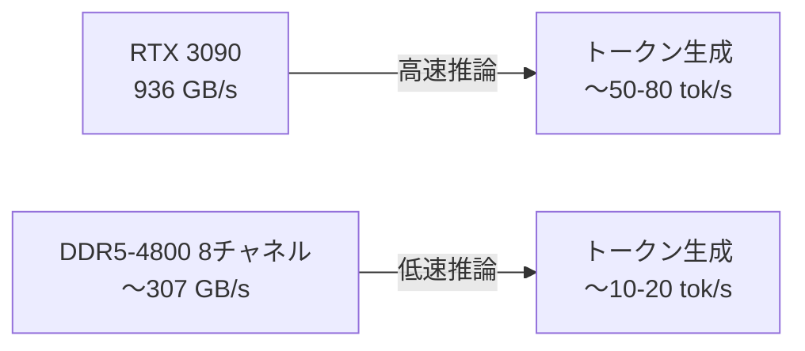
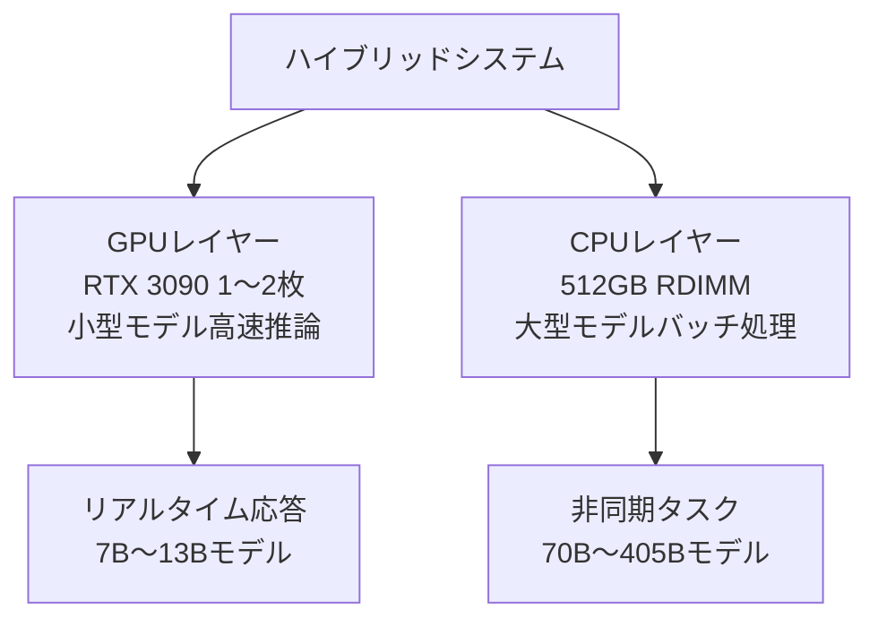

## 概要

2026年2月、Reddit r/LocalLLaMAコミュニティで<strong>DDR5 RDIMMのGB単価がRTX 3090のVRAM GB単価を下回った</strong>という議論が大きな話題となりました。392ポイントの支持を集めたこの投稿は、ローカルLLMハードウェア選択における根本的な転換点を示唆しています。

これまで「VRAMこそ正義」だったローカルLLMコミュニティにおいて、RAM基盤のCPU推論がコスト効率でGPUを逆転する可能性は、多くの人々に衝撃を与えました。

## GB単価比較：現時点の実際の数値

### RTX 3090のVRAMコスト

RTX 3090は24GB GDDR6X VRAMを搭載しており、2026年現在の中古市場では約<strong>$600〜800</strong>で取引されています。

- VRAM 24GB基準：<strong>$25〜33/GB</strong>
- 4枚スタック時（96GB）：<strong>$2,400〜3,200</strong>
- NVLink非対応のためテンソル並列化不可、パイプライン並列化のみ可能

### DDR5 RDIMMのコスト

DDR5 RDIMM価格が急激に下落し、状況が変わりました。

- DDR5-4800 RDIMM 128GB：<strong>約$200〜250</strong>
- GB単価：<strong>$1.5〜2.0/GB</strong>
- 512GB構成時：<strong>$800〜1,000</strong>

```
┌─────────────────────────────────────────────┐
│         GB単価比較（2026年2月）              │
├──────────────────┬──────────────────────────┤
│ RTX 3090 VRAM    │ $25〜33/GB              │
│ DDR5 RDIMM       │ $1.5〜2.0/GB            │
│ コスト差         │ 約15〜20倍              │
├──────────────────┴──────────────────────────┤
│ 512GBメモリ確保コスト                       │
│ GPU（3090 x22枚）│ 〜$15,000               │
│ RAM（RDIMM x4）  │ 〜$1,000                │
└─────────────────────────────────────────────┘
```

## なぜGPUを使うのか：速度の問題

GB単価だけ見ればRDIMMが圧倒的に有利ですが、核心は<strong>推論速度</strong>です。

### メモリ帯域幅比較



- <strong>RTX 3090</strong>：GDDR6X 936 GB/sの帯域幅
- <strong>DDR5-4800 8チャネル</strong>：約307 GB/sの帯域幅
- GPUが約<strong>3倍</strong>の帯域幅を提供

LLM推論においてトークン生成速度はメモリ帯域幅にほぼ正比例します。つまり、同じモデルを実行する場合、GPUが約3〜5倍高速です。

## コスト構造分析：CPUが有利なケース

### シナリオ1：大型モデルのロードが目標の場合

70B〜405Bパラメータ級モデルをローカルで実行したい場合、VRAM確保が最大のボトルネックです。

- <strong>Llama 3.1 405B（Q4_K_M）</strong>：約230GB必要
- GPUで対応：RTX 3090約10枚（$6,000〜8,000）
- RAMで対応：DDR5 RDIMM 256GB（$500）+ CPU/MB（$1,000〜2,000）

この場合、<strong>CPU推論がコスト面で圧倒的に有利</strong>です。

### シナリオ2：高速レスポンスが必須の場合

リアルタイムチャットボットやコード自動補完など、レイテンシが重要な場合：

- RTX 3090 1枚で7B〜13Bモデル：<strong>50+ tok/s</strong>
- DDR5システムで同モデル：<strong>10〜20 tok/s</strong>

速度が重要なら、依然として<strong>GPUが圧倒的</strong>です。

### シナリオ3：バッチ処理/非同期タスク

ドキュメント要約、翻訳、データ分析など、レスポンス時間があまり重要でない場合：

- GPUシステムコスト：<strong>$3,000〜5,000</strong>（3090 x2〜4枚）
- CPUシステムコスト：<strong>$2,000〜3,000</strong>（Xeon + 512GB RDIMM）
- CPUシステムが<strong>より大きなモデルをより安価に</strong>実行可能

## コミュニティの反応と主要論点

Redditコミュニティで出た核心的な論点をまとめると：

### 「RDIMMにはコンピューティングパワーが含まれない」

GPUはVRAM + コンピューティングパワー（CUDAコア）を一緒に提供します。RDIMMは純粋なメモリのみ提供するため、別途CPUが必要です。しかし、最新のXeonやEPYCプロセッサのAVX-512性能はCPU推論に相当効率的です。

### 「消費電力も考慮すべき」

- RTX 3090 4枚：<strong>〜1,400W</strong>
- Xeon + 512GB RDIMMシステム：<strong>〜300〜500W</strong>

長期運用時の電力コスト差は相当なものです。

### 「中古3090の価格がさらに下がる可能性」

RTX 5090の発売に伴い3090の中古価格は下落傾向にありますが、RDIMM価格の下落速度の方が速いです。

## 実践ビルドガイド：CPU推論システム

大容量モデル向けのCPU推論システムを構成するなら：

### 推奨構成（約$2,500）

| パーツ | モデル | 予想価格 |
|--------|--------|----------|
| CPU | Intel Xeon w5-2465X（16コア） | $800 |
| マザーボード | ASUS Pro WS W790E-SAGE | $700 |
| RAM | DDR5-4800 RDIMM 128GB x4（512GB） | $800 |
| その他 | PSU、ケース、SSD | $200 |

### llama.cppの設定

```bash
# llama.cppビルド（AVX-512最適化）
cmake -B build -DGGML_AVX512=ON -DGGML_AVX512_VNNI=ON
cmake --build build --config Release

# 405Bモデル実行（Q4_K_M量子化）
./build/bin/llama-server \
  -m models/llama-3.1-405b-q4_k_m.gguf \
  --threads 16 \
  --ctx-size 8192 \
  --host 0.0.0.0 \
  --port 8080
```

## ハイブリッドアプローチ：GPU + CPU併用

実際に最も現実的な選択は<strong>ハイブリッド構成</strong>です。



- 小型モデル（7B〜13B）はGPUで高速推論
- 大型モデル（70B+）はCPUでコスト効率的に実行
- llama.cppの`--n-gpu-layers`オプションで一部レイヤーのみGPUにオフロード可能

## 結論：転換点の意味

DDR5 RDIMM価格がRTX 3090 VRAMのGB単価を下回ったことは、単純な価格逆転ではありません。これは<strong>ローカルLLM運用戦略の根本的な変化</strong>を意味します。

1. <strong>大型モデルへのアクセシビリティ向上</strong>：405B級モデルも$2,500のシステムで実行可能
2. <strong>コスト最適化オプションの多様化</strong>：用途に応じてGPU/CPU/ハイブリッドを選択
3. <strong>参入障壁の低下</strong>：ローカルLLM実験のコストが大幅に減少

速度が最優先ならGPUが正解です。しかし、<strong>「最大のモデルを最も安価に」</strong>が目標なら、DDR5 RDIMM基盤のCPU推論が2026年の新しい最適解となりつつあります。

## 参考資料

- [Reddit r/LocalLLaMA: PSA: DDR5 RDIMM price passed the point were 3090 are less expensive per gb](https://www.reddit.com/r/LocalLLaMA/comments/1r83irw/psa_ddr5_rdimm_price_passed_the_point_were_3090/)
- [llama.cpp GitHub Repository](https://github.com/ggml-org/llama.cpp)
- [DDR5 RDIMM Pricing Trends — Memory Benchmark](https://www.memorybenchmark.net/)
