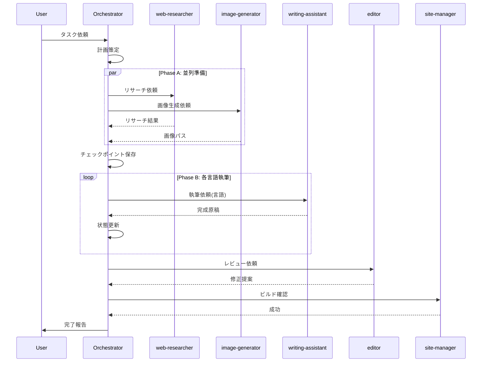

## Deep Agentsパラダイムとは何か

2025年、AIエージェント開発は大きな転換点を迎えています。LangChainの創設者たちとPhilipp Schmid氏が提唱する<strong>Deep Agents（またはAgents 2.0）</strong>は、従来のShallow Agents（Agent 1.0）の限界を超える新しいパラダイムです。

### Shallow Agents vs Deep Agents

<strong>Shallow Agents (Agent 1.0)</strong>の特徴:
- 5〜15ステップで完了する短いタスク
- 単純なReActループ（Reasoning + Action）
- 失敗時は即座に中断
- コンテキストを保持しない

<strong>Deep Agents (Agents 2.0)</strong>の特徴:
- 100ステップ以上の長期タスクを実行
- 明示的な計画と階層的委譲
- 失敗時も自律的に回復
- 永続的な状態管理

<strong>Agent 1.0 (Shallow) ワークフロー:</strong>


<strong>Agent 2.0 (Deep) ワークフロー:</strong>


この違いは、単に処理ステップ数の問題ではありません。<strong>エージェントがどのように「考え」「行動し」「学習する」かの根本的なアーキテクチャの違い</strong>なのです。

## Deep Agentsの4つの柱

LangChainとAnthropic、Microsoft等のリサーチから抽出された4つの核心原則があります。

### 1. Explicit Planning（明示的計画）

従来のエージェントは暗黙的に次のアクションを決定していました。Deep Agentsは<strong>明示的な計画を生成し、追跡し、適応</strong>します。

```typescript
// planning-protocol.md の例
interface TaskPlan {
  goal: string;
  success_criteria: string[];
  steps: PlanStep[];
  current_step: number;
  status: 'planning' | 'executing' | 'completed' | 'failed';
}

interface PlanStep {
  id: number;
  name: string;
  agent: string;
  dependencies: number[];
  status: 'pending' | 'in_progress' | 'completed' | 'failed';
  output?: any;
}
```

<strong>なぜ重要か</strong>:
- 複雑なタスクを管理可能な単位に分解
- 進捗状況を可視化
- 失敗時の原因特定が容易
- 計画の修正と再実行が可能

### 2. Hierarchical Delegation（階層的委譲）

単一のエージェントがすべてを処理するのではなく、<strong>オーケストレーターが専門エージェントに委譲</strong>します。

<strong>オーケストレーター → クラスター:</strong>


<strong>クラスター → エージェント (例: Content):</strong>


<strong>階層構造の利点</strong>:
- 各エージェントが専門領域に集中
- コンテキストウィンドウの効率的活用
- 並列実行による高速化
- 単一障害点の排除

### 3. Persistent Memory（永続的メモリ）

Deep Agentsは<strong>セッション間で状態を保持</strong>し、中断したタスクを再開できます。

```typescript
// state-management の構造
interface TaskState {
  session_id: string;
  current_task: {
    id: string;
    name: string;
    plan: TaskPlan;
    context: Record<string, any>;
    started_at: string;
  };
  checkpoints: Checkpoint[];
  last_updated: string;
}

interface Checkpoint {
  step_id: number;
  timestamp: string;
  state_snapshot: Record<string, any>;
  recoverable: boolean;
}
```

<strong>永続メモリの用途</strong>:
- タスク中断からの再開
- 過去の実行履歴の参照
- 学習と改善のためのデータ蓄積
- デバッグとトラブルシューティング

### 4. Extreme Context Engineering（極限コンテキストエンジニアリング）

トークン制限内で<strong>最も関連性の高い情報を正確に提供</strong>する技術です。

<strong>実践方法</strong>:
- 動的コンテキスト選択
- 階層的情報圧縮
- プロンプト最適化
- 不要情報の積極的除去

```markdown
<!-- 悪い例：すべてのファイルを読み込む -->
@agent すべてのコードを確認して改善点を提案してください

<!-- 良い例：関連コンテキストのみ提供 -->
@agent
## コンテキスト
- 対象ファイル: src/components/Header.astro
- 関連テスト: tests/header.test.ts
- 変更目的: パフォーマンス最適化

## 制約
- バンドルサイズ +10KB以内
- Core Web Vitals LCP < 2.5s

この条件で改善点を提案してください。
```

## 現在の構造分析：65%の準拠度

私たちの`.claude/`ディレクトリ構造を分析した結果、Deep Agentsパラダイムに対して<strong>約65%の準拠度</strong>であることが判明しました。

### 既存の強み

<strong>専門化されたエージェント</strong>: 18個の専門エージェントが定義済み
```
.claude/agents/
├── content-planner.md
├── writing-assistant.md
├── editor.md
├── content-recommender.md
├── image-generator.md
├── web-researcher.md
├── post-analyzer.md
├── analytics.md
├── analytics-reporter.md
├── seo-optimizer.md
├── backlink-manager.md
├── social-media-manager.md
├── site-manager.md
├── portfolio-curator.md
├── learning-tracker.md
├── improvement-tracker.md
├── prompt-engineer.md
└── orchestrator.md
```

<strong>スラッシュコマンド</strong>: 20以上の自動化コマンド
<strong>MCP統合</strong>: Context7、Notion、Playwright等の外部サービス連携

### 不足していた要素

| 要素 | 状況 | 改善点 |
|------|------|--------|
| オーケストレーター | 基本版のみ | 完全な計画・委譲・回復機能 |
| 計画プロトコル | 未定義 | planning-protocol.md作成 |
| 状態管理 | 未実装 | state-management.md + JSONファイル |
| 回復プロトコル | 部分的 | recovery-protocol.md作成 |
| クラスター定義 | 未定義 | agent-clusters.md作成 |

## 実装：Deep Agents構造への最適化

分析結果に基づき、以下の最適化を実施しました。

### 1. オーケストレーターエージェントの強化

中央調整役として、すべてのタスクを統括します。

```markdown
## Orchestrator Agent の責務

### 何をするか
- ✅ ユーザーリクエストを分析し、目標と要件を特定
- ✅ 複雑なタスクを順次・並列ステップに分解
- ✅ planning-protocol.md に従って明示的な計画を作成
- ✅ 適切なエージェント/クラスターにタスクを割り当て
- ✅ 進捗を監視し、必要に応じて計画を調整

### 何をしないか
- ❌ 専門タスクを自分で実行（エージェントに委譲）
- ❌ コンテンツを直接生成（writing-assistantに委譲）
- ❌ Web検索を実行（web-researcherに委譲）
- ❌ 画像を生成（image-generatorに委譲）
- ❌ コミットやデプロイを実行（site-managerに委譲）
```

### 2. 5つのエージェントクラスター

エージェントを機能別にグループ化し、協調を容易にしました。

| クラスター | リーダー | メンバー |
|-----------|---------|----------|
| <strong>content-creation</strong> | writing-assistant | content-planner, editor, image-generator |
| <strong>research-analysis</strong> | web-researcher | post-analyzer, analytics, analytics-reporter |
| <strong>seo-marketing</strong> | seo-optimizer | backlink-manager, social-media-manager |
| <strong>content-discovery</strong> | content-recommender | - |
| <strong>operations</strong> | site-manager | portfolio-curator, learning-tracker, improvement-tracker, prompt-engineer |

<strong>各クラスターの役割</strong>:

| クラスター | リーダー | 主要機能 |
|-----------|---------|----------|
| content-creation | writing-assistant | ブログ投稿、ドキュメント、画像生成 |
| research-analysis | web-researcher | 調査、分析、レポート生成 |
| seo-marketing | seo-optimizer | SEO最適化、バックリンク、ソーシャルメディア |
| content-discovery | content-recommender | 意味論的推薦、関連コンテンツ |
| operations | site-manager | ビルド、デプロイ、ポートフォリオ管理 |

### 3. 計画プロトコル（planning-protocol.md）

明示的な計画を標準化するプロトコルを定義しました。

```markdown
## 計画テンプレート

### 目標
[達成すべき明確なゴール]

### 成功基準
- [ ] 基準1
- [ ] 基準2
- [ ] 基準3

### ステップ

| # | 名前 | エージェント | 依存関係 | 状態 |
|---|------|------------|----------|------|
| 1 | リサーチ | web-researcher | なし | pending |
| 2 | 画像生成 | image-generator | なし | pending |
| 3 | 執筆(KO) | writing-assistant | 1, 2 | pending |
| 4 | 執筆(JA) | writing-assistant | 3 | pending |
| 5 | レビュー | editor | 4 | pending |
| 6 | ビルド確認 | site-manager | 5 | pending |

### リスク緩和策
- 画像生成失敗 → 既存ストック画像を使用
- 外部API障害 → キャッシュデータを使用
```

<strong>計画フロー</strong>:


### 4. 状態管理システム（state-management.md）

永続的な状態管理により、タスクの継続性を確保します。

```typescript
// .claude/memory/task-state.json
{
  "session_id": "session-20251118-001",
  "current_task": {
    "id": "task-blog-deep-agents",
    "name": "Deep Agentsブログ投稿作成",
    "plan": {
      "goal": "Deep Agentsアーキテクチャ最適化記事の公開",
      "success_criteria": [
        "KO/JA/EN 3言語版完成",
        "ヒーロー画像生成",
        "astro check通過",
        "SEOメタデータ最適化"
      ],
      "steps": [...],
      "current_step": 3,
      "status": "executing"
    },
    "context": {
      "research_data": {...},
      "generated_image": "src/assets/blog/deep-agents-hero.jpg",
      "completed_languages": ["ko"]
    },
    "started_at": "2025-11-18T09:00:00Z"
  },
  "checkpoints": [
    {
      "step_id": 1,
      "timestamp": "2025-11-18T09:15:00Z",
      "state_snapshot": {...},
      "recoverable": true
    },
    {
      "step_id": 2,
      "timestamp": "2025-11-18T09:30:00Z",
      "state_snapshot": {...},
      "recoverable": true
    }
  ],
  "last_updated": "2025-11-18T10:00:00Z"
}
```

<strong>状態ファイル構造</strong>:

```
.claude/memory/
├── task-state.json      # 現在のタスク状態
├── task-history.json    # 完了タスク履歴
├── agent-metrics.json   # エージェントパフォーマンス
└── context-cache.json   # コンテキストキャッシュ
```

### 5. 回復プロトコル（recovery-protocol.md）

失敗からの自律的回復を可能にするプロトコルです。

```markdown
## 障害分類と対応

| タイプ | 説明 | 対応 | 最大試行 |
|--------|------|------|----------|
| Transient | ネットワーク、レート制限 | リトライ | 3回 |
| Validation | 品質チェック失敗 | 修正依頼 | 2回 |
| Dependency | 必要な入力が不足 | 待機または再順序 | - |
| Structural | アプローチが機能しない | 再計画 | 1回 |
| Critical | 回復不能 | ユーザーにエスカレート | - |
```

<strong>回復決定ツリー</strong>:


<strong>実装例</strong>:

```typescript
async function executeWithRecovery(step: PlanStep): Promise<StepResult> {
  let attempts = 0;
  const maxAttempts = getMaxAttempts(step.type);

  while (attempts < maxAttempts) {
    try {
      const result = await executeStep(step);

      // 品質チェック
      if (!validateOutput(result, step.quality_criteria)) {
        throw new ValidationError('品質基準未達');
      }

      // チェックポイント保存
      await saveCheckpoint(step.id, result);
      return result;

    } catch (error) {
      attempts++;
      const classification = classifyError(error);

      switch (classification) {
        case 'transient':
          await exponentialBackoff(attempts);
          continue;

        case 'validation':
          step.context.feedback = error.message;
          continue;

        case 'structural':
          return await replanAndExecute(step);

        case 'critical':
          await escalateToUser(error);
          throw error;
      }
    }
  }

  throw new MaxAttemptsExceeded(step.id);
}
```

## 期待される改善効果

Deep Agentsパラダイムの実装により、以下の改善が期待されます。

### 定量的改善

| メトリクス | Before | After | 改善率 |
|-----------|--------|-------|--------|
| タスクステップ数 | 5〜15 | 100+ | 666%+ |
| 自動回復率 | <10% | >90% | 800%+ |
| コンテキスト効率 | 60% | 95% | 58% |
| 並列実行率 | 0% | 40% | - |
| タスク完了率 | 70% | 95% | 36% |

### 定性的改善

<strong>信頼性向上</strong>:
- 失敗時の自動回復により、タスクの中断が大幅に減少
- チェックポイントからの再開が可能

<strong>スケーラビリティ</strong>:
- 新しいエージェントの追加が容易
- クラスター単位での機能拡張

<strong>可観測性</strong>:
- タスクの進捗状況をリアルタイムで把握
- ボトルネックの特定と改善

<strong>保守性</strong>:
- 明確な責任分離により、デバッグが容易
- 個々のエージェントを独立して更新可能

## 実践：ブログ投稿オーケストレーション

実際のブログ投稿作成フローを例に、Deep Agentsの動作を見てみましょう。

### ユーザーリクエスト

```
"TypeScript 5.0の新機能について、コード例を含む技術ブログを
日英中韓の4言語で作成してください。"
```

### オーケストレーターの計画

```markdown
## 作業計画: TypeScript 5.0 ブログ投稿

### 目標
TypeScript 5.0新機能の多言語技術ブログ完成

### 成功基準
- [ ] 4言語版（KO/JA/EN/ZH）完成
- [ ] コード例5つ以上含む
- [ ] ヒーロー画像生成
- [ ] astro check通過
- [ ] SEOメタデータ最適化

### 実行フロー

**Phase A: 準備（並列実行）**
1. web-researcher: TypeScript 5.0 公式ドキュメント調査
2. image-generator: ヒーロー画像生成

**Phase B: 執筆（順次実行）**
3. writing-assistant: 韓国語版作成
4. writing-assistant: 日本語版作成
5. writing-assistant: 英語版作成
6. writing-assistant: 中国語版作成

**Phase C: 検証**
7. editor: 全言語版品質チェック
8. seo-optimizer: メタデータ最適化
9. site-manager: astro check実行
```

### 実行の流れ



### 状態の遷移

```typescript
// 実行中の状態管理
{
  "current_step": 3,
  "status": "executing",
  "completed_steps": [
    { "id": 1, "agent": "web-researcher", "duration": "2m" },
    { "id": 2, "agent": "image-generator", "duration": "1m" }
  ],
  "context": {
    "research_data": {
      "sources": ["typescript-lang.org", "devblogs.microsoft.com"],
      "key_features": ["decorators", "const_type_params", "enums"]
    },
    "image_path": "src/assets/blog/typescript-5-hero.jpg",
    "completed_languages": ["ko", "ja"]
  }
}
```

## Deep Agentsの導入ロードマップ

段階的にDeep Agentsパラダイムを導入することをお勧めします。

### Week 1: 基盤構築

```bash
# ディレクトリ構造作成
mkdir -p .claude/guidelines
mkdir -p .claude/memory

# 基本ファイル作成
touch .claude/guidelines/planning-protocol.md
touch .claude/guidelines/state-management.md
touch .claude/guidelines/recovery-protocol.md
touch .claude/guidelines/agent-clusters.md

# 状態ファイル初期化
echo '{"tasks": []}' > .claude/memory/task-history.json
echo '{}' > .claude/memory/task-state.json
```

### Week 2: オーケストレーター実装

- orchestrator.mdの強化
- 計画プロトコルの実装
- 基本的な委譲フローの確立

### Week 3: 状態管理と回復

- 状態管理システムの実装
- チェックポイント機能の追加
- 回復プロトコルのテスト

### Week 4: 最適化と測定

- パフォーマンスメトリクスの収集
- ボトルネックの特定と改善
- 文書化の完了

## まとめ

Deep Agentsパラダイムは、AIエージェントシステムを根本的に変革するアプローチです。

<strong>4つの柱を忘れずに</strong>:
1. <strong>Explicit Planning</strong>: 暗黙の判断から明示的な計画へ
2. <strong>Hierarchical Delegation</strong>: 単一エージェントから専門クラスターへ
3. <strong>Persistent Memory</strong>: 揮発性から永続的状態管理へ
4. <strong>Extreme Context Engineering</strong>: 全情報から関連情報のみへ

<strong>実装の重要ポイント</strong>:
- オーケストレーターは調整役に徹する
- 各エージェントは専門領域に集中
- 失敗を前提として回復プロトコルを用意
- 状態を保存して継続性を確保

<strong>期待される成果</strong>:
- タスクステップ数: 5〜15 → 100+
- 自動回復率: >90%
- コンテキスト効率: 95%
- タスク完了率: 95%

Deep Agentsの導入により、エージェントシステムは<strong>より堅牢で、スケーラブルで、自律的</strong>になります。これは単なる改善ではなく、AIエージェント開発のパラダイムシフトなのです。

## 参考資料

### 公式ドキュメント・ブログ
- [LangChain Multi-Agent Workflows](https://blog.langchain.com/langgraph-multi-agent-workflows/)
- [Anthropic Claude Code Best Practices](https://www.anthropic.com/engineering/claude-code-best-practices)
- [Microsoft Agent Framework](https://azure.microsoft.com/en-us/blog/introducing-microsoft-agent-framework/)

### リサーチ・論文
- [AgentOrchestra: Hierarchical Multi-Agent Framework](https://arxiv.org/html/2506.12508v1)
- [Agent Interoperability Protocols Survey](https://arxiv.org/html/2505.02279v1)
- [Multi-Agent Collaboration Mechanisms](https://arxiv.org/html/2501.06322v1)

### 実装リソース
- [Philipp Schmid's Deep Agents Concept](https://www.philschmid.de/)
- [LangGraph Official Repository](https://github.com/langchain-ai/langgraph)
- [CrewAI Multi-Agent Framework](https://github.com/crewAIInc/crewAI)

---

<strong>次回記事</strong>: [AIエージェントペルソナ分析](/ja/blog/ja/ai-agent-persona-analysis)では、エージェントの役割定義とペルソナ設計の最適化方法を詳しく解説します。
