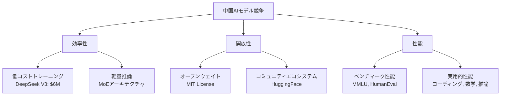

## 概要

2026年初頭、中国AI業界で大規模言語モデル（LLM）の新たな波が押し寄せています。Reddit r/LocalLLaMAコミュニティで<strong>DeepSeek V4のリリースが間近</strong>というニュースが伝わり、大きな注目を集めています。Qwen3.5、GLM-5に続いてDeepSeek V4まで — 中国AI企業の次世代モデル競争が本格的に加速しています。

## DeepSeekの軌跡

### V3からV4への飛躍

DeepSeekは2023年の設立以来、急速に成長した中国AI企業です。特に<strong>DeepSeek V3</strong>はわずか600万ドルのトレーニングコストでGPT-4に匹敵する性能を達成し、AI業界に「スプートニクモーメント」を引き起こしました。

V4で期待される主な改善点は以下の通りです：

- <strong>Mixture of Experts（MoE）アーキテクチャ</strong>のさらなる精緻化
- 推論能力の大幅な強化（R1系列の成果統合）
- マルチモーダル対応の拡大
- トレーニング効率のさらなる改善

### オープンウェイト戦略の継続

DeepSeekの核心的な競争力の一つは<strong>オープンウェイトポリシー</strong>です。MITライセンスの下でモデルウェイトを公開することで、世界中の開発者コミュニティが自由に活用・改善できます。V4でもこの戦略が継続されると予想されています。

## 中国AIモデルラッシュ — 2026年の現況

2026年初頭に発表された（または発表予定の）重要モデルを整理すると以下の通りです：

| モデル | 開発元 | 特徴 |
|--------|--------|------|
| <strong>DeepSeek V4</strong> | DeepSeek | MoEベース、超効率トレーニング、オープンウェイト |
| <strong>Qwen3.5</strong> | Alibaba Cloud | 大規模パラメータ、多言語強化 |
| <strong>GLM-5</strong> | Zhipu AI | マルチモーダル統合、エージェント機能強化 |
| <strong>Yi-Lightning</strong> | 01.AI | 推論最適化、コスト効率 |

### 競争の核心軸

## オープンモデル vs クローズドモデルの構図

中国AI企業のオープンモデル戦略は、欧米企業のクローズドモデルアプローチと対照的です。

### オープンモデルの利点

- <strong>透明性</strong>：モデル構造とウェイトを検証可能
- <strong>カスタマイズ</strong>：特定ドメインに合わせたファインチューニングが可能
- <strong>ローカル実行</strong>：データプライバシーの保証
- <strong>コミュニティイノベーション</strong>：量子化、最適化などコミュニティの貢献

### クローズドモデルとのギャップ縮小

DeepSeek R1がOpenAI o1に匹敵する性能を示したように、中国のオープンモデルはクローズドモデルとの性能差を急速に縮めています。特に<strong>コーディング</strong>、<strong>数学</strong>、<strong>推論</strong>分野での進展が顕著です。

## ローカルLLMコミュニティの反応

Reddit r/LocalLLaMAコミュニティでDeepSeek V4のニュースは308ポイントを記録し、大きな反響を呼びました。主な関心事は以下の通りです：

- <strong>ローカル実行の可能性</strong>：VRAM要件はどの程度になるか
- <strong>量子化サポート</strong>：GGUF、GPTQなどのフォーマット対応計画
- <strong>性能ベンチマーク</strong>：GPT-4o、Claude 3.5との比較
- <strong>API価格</strong>：既存V3対比の価格変動

## 今後の展望

### 競争加速の意義

中国AI企業のモデルラッシュは単なる競争を超えて、AI技術の民主化に貢献しています。オープンモデルの継続的な発展は、以下のような変化をもたらすと予想されます：

1. <strong>AIアクセシビリティの向上</strong>：中小企業や個人開発者も最先端モデルを活用可能
2. <strong>コスト削減</strong>：トレーニングおよび推論コストの継続的な低下
3. <strong>イノベーションの加速</strong>：コミュニティベースのモデル改善と応用分野の拡大
4. <strong>地政学的影響</strong>：AI技術覇権競争の新たな局面

## 結論

DeepSeek V4のリリースが近づく中、中国AI企業の次世代モデル競争は新たなステージに入っています。Qwen3.5、GLM-5と続くモデルラッシュは、オープンAIモデルエコシステムをさらに豊かにしてくれるでしょう。ローカルLLMを活用する開発者にとっては、これまで以上にエキサイティングな時期が訪れています。

## 参考資料

- [Reddit r/LocalLLaMA - DeepSeek V4 Release Soon](https://www.reddit.com/r/LocalLLaMA/comments/1r71tn1/deepseek_v4_release_soon/)
- [DeepSeek公式サイト](https://www.deepseek.com/)
- [DeepSeek HuggingFace](https://huggingface.co/deepseek-ai)
- [Wikipedia - DeepSeek](https://en.wikipedia.org/wiki/DeepSeek)
