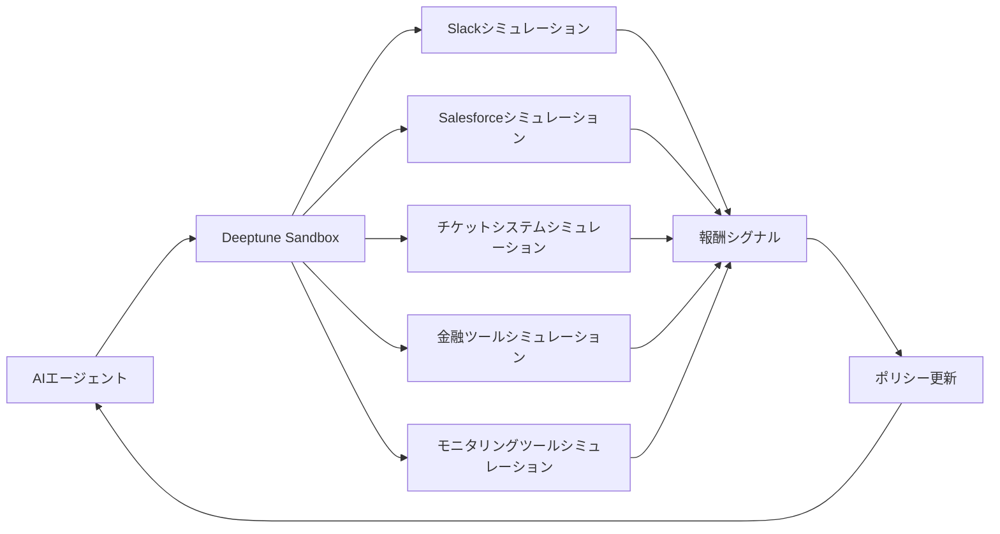
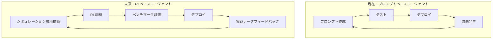

## 概要

ニューヨークを拠点とするスタートアップ**Deeptune**が、Andreessen Horowitz（a16z）主導で**$43M Series A**の資金調達を完了しました。776、Abstract Ventures、Inspired Capitalが参加し、OpenAI ResearchのNoam Brown、Mercor CEOのBrendan Foody、Applied Compute CEOのYash Patilなど、業界のキーパーソンがエンジェル投資家として名を連ねています。

Deeptuneが構築しているのは、AIエージェントのための**「トレーニングジム（Training Gym）」**です。会計士、カスタマーサポート担当者、DevOpsエンジニアなど専門職の実際の業務環境を高忠実度（high-fidelity）でシミュレーションする**強化学習（Reinforcement Learning, RL）環境**を提供します。Slack、Salesforce、チケットシステム、金融ツール、モニタリングツールなどを仮想的に再現し、AIエージェントが実践経験を積めるようにします。

本記事では、Deeptuneのアプローチがなぜ注目に値するのか、そしてエンジニアリングリーダーとしてこのトレンドにどう備えるべきかを分析します。

---

## Deeptuneの事業内容

### 「サンドボックス」アーキテクチャ

Deeptuneのコアアイデアはシンプルです。**AIエージェントに実際の業務環境と同一の仮想環境を提供し、強化学習で反復訓練する**というものです。

既存のLLMファインチューニングが「教科書を読ませること」だとすれば、DeeptuneのRL環境は「実習室で実際にやらせること」に近いです。エージェントがSlackメッセージを確認し、Salesforceで顧客データを照会し、チケットシステムに回答を作成する一連のワークフローを、シミュレーション内で数千回繰り返します。

### チーム構成

Deeptuneのチームは**Anthropic、Scale AI、Palantir、Glean**出身のメンバーで構成されています。AIモデル開発、データインフラ、エンタープライズソフトウェアに対する深い知見を持つチームです。特にAnthropic出身者が含まれている点は、LLMの限界とRLによる補完の可能性を実感した人々がこの課題に取り組んでいるという重要なシグナルです。

### なぜRLなのか？

現在のAIエージェントの大半は、プロンプトエンジニアリングとfew-shot例に依存しています。このアプローチの限界は明確です：

- **エッジケースへの対応不足**：プロンプトだけでは全ての例外的状況をカバーできません
- **ツール使用の最適化欠如**：どの順序で、どのツールを使えば効率的かを学習できません
- **マルチステップ意思決定の脆弱性**：5ステップ以上の複合ワークフローで精度が急激に低下します

RLはこれらの問題を**経験ベースの学習**で解決します。数千回のシミュレーションを通じて、エージェントが最適な行動ポリシー（Policy）を自ら発見します。

---

## なぜエンジニアリング組織が注目すべきなのか

### 1. AIエージェント導入のボトルネックが変わる

これまでAIエージェント導入の最大のボトルネックは**「モデル性能」**でした。しかしGPT-4、Claude、GeminiなどFoundation Modelの性能が収束する中、ボトルネックは**「特定業務への適応（Adaptation）」**にシフトしています。

Deeptuneのアプローチは、この適応問題を構造的に解決しようとするものです。エンジニアリング組織にとっては、汎用LLMをプロンプトで「説得する」のではなく、**RLで「訓練された」エージェントをデプロイ**する時代が到来するということです。

### 2. 「AIエージェントDevOps」時代の到来

現在のソフトウェア開発でCI/CDパイプラインが必須であるように、まもなく**AIエージェントの訓練・評価・デプロイパイプライン**が必須になるでしょう。DeeptuneのRL環境は、そのパイプラインの「訓練」フェーズを担います。

### 3. RL市場の爆発的成長

強化学習市場は2025年の**$11.6B**規模から、2034年には**$90B以上**に成長すると予測されています。この成長の相当部分は、ゲームやロボティクスではなく、**エンタープライズ業務自動化**領域から生まれるでしょう。Deeptuneはこの巨大市場のインフラレイヤーを狙っています。

---

## 専門業務ワークフローのためのRL：テクニカル分析

### 従来のRLとの違い

Atariゲームやロボット制御に使用されるRLと比較すると、専門業務ワークフローRLには固有のテクニカルチャレンジがあります：

| 次元 | ゲーム/ロボットRL | 専門業務RL |
|------|----------------|-----------|
| **状態空間** | ピクセル、センサー値（連続的） | テキスト、構造化データ（複合的） |
| **行動空間** | ジョイスティック入力（限定的） | API呼び出し、テキスト入力（ほぼ無限） |
| **報酬シグナル** | スコア、距離（即時的） | 作業品質、顧客満足度（遅延あり） |
| **エピソード長** | 数秒〜数分 | 数分〜数時間 |
| **環境の複雑性** | 物理法則ベース | ビジネスロジックベース |

### コアテクニカルチャレンジ

**1. 環境忠実度（Environment Fidelity）**

シミュレーション環境が実際の環境にどれだけ近いかが、RL訓練の成否を決定します。DeeptuneがSlack、Salesforceなどを「高忠実度」でシミュレーションするということは、単純にAPIをモッキング（Mocking）するレベルではなく、**実際の使用パターン、データ分布、エラーケースまで再現**するということを意味します。

**2. 報酬関数設計（Reward Shaping）**

「良い顧客対応」を数値化するのは容易ではありません。Deeptuneはおそらく以下のような多層的報酬体系を使用しているでしょう：

- **完了報酬**：タスクを正常に完了したか
- **効率報酬**：最小限のステップで完了したか
- **品質報酬**：成果物の正確性と完成度
- **安全報酬**：危険な行動（データ削除、誤った金額入力など）を避けたか

**3. Sim-to-Real Transfer**

シミュレーションで訓練したポリシーが実際の環境でも機能するかという問題です。ゲームRLでもこのギャップは大きな課題ですが、業務環境では**予期せぬユーザー行動、システム障害、データ不整合**などにより、ギャップがさらに大きくなる可能性があります。

### OpenAIのNoam Brownが投資した理由

エンジェル投資家リストで最も目を引く名前は、OpenAI Researchの**Noam Brown**です。ポーカーAI LibratusとPluribusの中心研究者であり、RLを通じた戦略的意思決定の最前線にいる人物です。彼がDeeptuneに投資したことは、**「LLMだけでは実戦業務エージェントは作れない、RLが必須だ」**という確信の表れです。

---

## CTO/EMアクションアイテム

### 短期（3〜6ヶ月）

1. **AIエージェントパイロット業務の特定**：社内で反復的で、ルールが明確で、失敗コストが低い業務をリストアップしてください。このような業務が、今後RL基盤エージェントの最初の適用対象になります。

2. **現在のプロンプトベースエージェントの限界を文書化**：既にLLMベースのエージェントを導入している場合、どのタイプの失敗が繰り返されるか体系的に記録してください。このデータが今後のRL報酬関数設計の基礎になります。

3. **業務ワークフローの標準化**：RL訓練のためには業務プロセスが明確に定義されている必要があります。今からコアワークフローを文書化し、ツール使用パターンを標準化してください。

### 中期（6〜18ヶ月）

4. **RL Ops能力の確保**：MLOpsチームにRL経験のあるエンジニアを確保するか、既存チームのRL能力を強化してください。Deeptuneのようなプラットフォームを活用する場合でも、自社ドメインに合わせたカスタマイズは必要です。

5. **シミュレーション環境パイプラインの検討**：Deeptuneのようなサードパーティソリューションを評価しつつ、自社業務環境の特殊性をシミュレーションできるか確認してください。特に独自システムが多い組織は、環境構築コストを慎重に評価する必要があります。

6. **エージェント評価フレームワークの構築**：RL訓練されたエージェントをプロダクションにデプロイする前に、体系的に性能を評価できるベンチマークと安全性テストフレームワークを準備してください。

### 長期（18ヶ月以上）

7. **「Human-in-the-Loop RL」プロセスの設計**：エージェントがプロダクションで蓄積する経験をRL訓練に反映するフィードバックループを設計してください。これが競合他社との差別化の鍵になります。

8. **AIエージェントガバナンス体制の確立**：RLで訓練されたエージェントの行動は、プロンプトベースよりも予測しにくい側面があります。モニタリング、監査（Audit）、ロールバックポリシーを含むガバナンス体制が必要です。

---

## まとめ

Deeptuneの$43M資金調達は、単なるスタートアップニュースではありません。これはAIエージェント市場が**「プロンプトエンジニアリングの時代」から「強化学習訓練の時代」へ転換**しているという強力なシグナルです。

キーメッセージを整理すると：

- **LLMは「知識」を提供しますが、RLは「経験」を提供します。** 専門業務を遂行するエージェントには両方が必要です。
- **シミュレーション環境は新しいインフラレイヤーです。** CI/CDがソフトウェアデプロイの標準になったように、RLシミュレーションがエージェントデプロイの標準になるでしょう。
- **今から準備が必要です。** 業務ワークフロー標準化、エージェント失敗パターンの文書化、RL Ops能力の確保——この3つから始めてください。

a16z、OpenAI ResearchのNoam Brown、そしてAnthropic/Scale AI出身のチームが、全て同じ方向を示しています。エンジニアリングリーダーとして、この転換点を見逃してはなりません。
