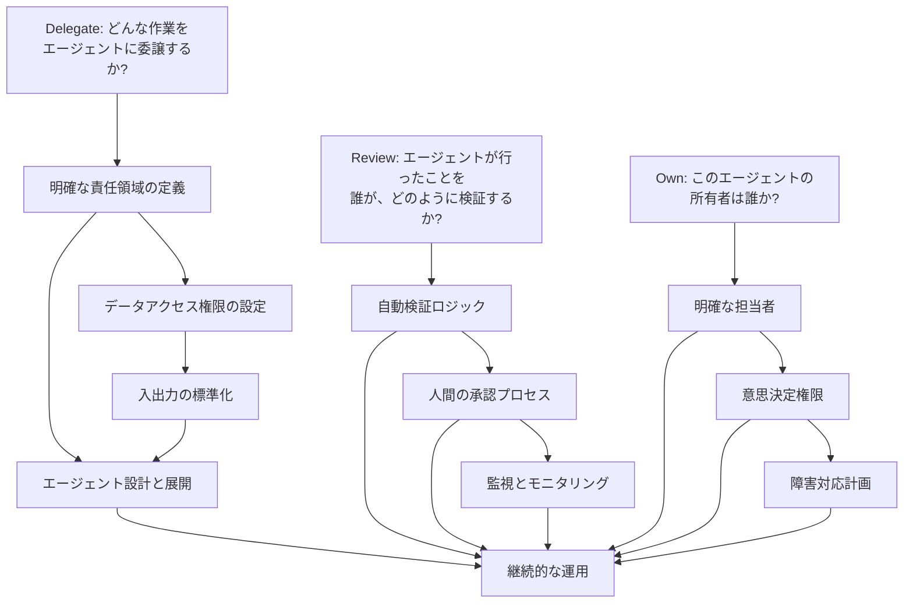
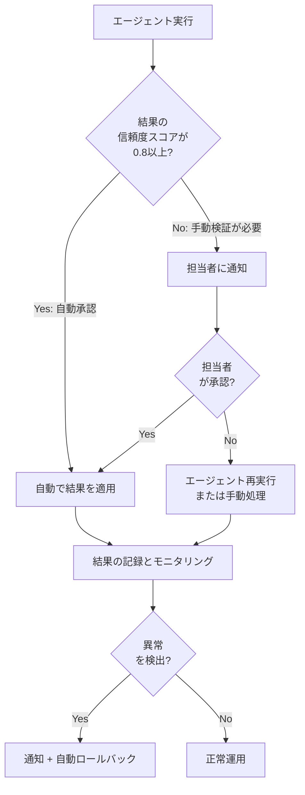
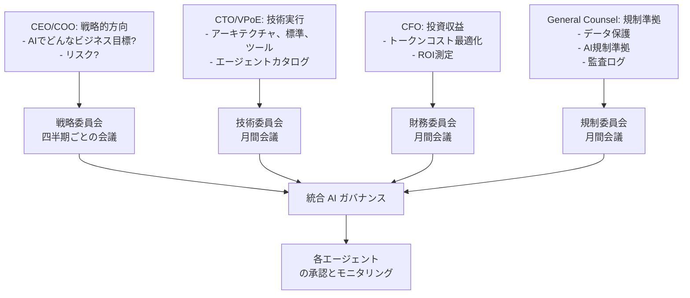

## 序論: エージェンティック AI革命の蜃気楼

2024年から「AI エージェント時代が来る」と言われていました。そして一部の企業は本当に素晴らしいデモを作成しました。Slackメッセージを受け取り、自動的に Jiiraチケットを生成し、データを分析し、レポートを作成するエージェントたちです。

しかし、Deloitteの2026年Tech Trendsレポートが暴露した現実は冷たいものです。

**<strong>世界中の企業の11%のみが、エージェンティック AIをプロダクション環境で実際に運用しています。</strong>**

残りはどこにいるのでしょうか。

- **42%**: まだ戦略を策定中です
- **35%**: 公式な戦略がありません
- **12%**: 実験段階に留まっています

<strong>89%の企業が実際の運用環境に到達していません。</strong>これは単なる遅延ではありません。これは組織的な運用モデルの失敗です。

本記事が扱うのは「なぜ AIエージェントを導入すべきなのか」ではありません。(それは以前の記事「生成型 AIの導入、なぜトップダウン方式が必要なのか」で扱いました。)代わりに、<strong>実際にどのように運用すべきかを</strong>EM/VPoEの視点から具体的に提示します。

---

## パート1: 現状診断 — あなたの組織はどのステージにいるか

### ステージ1: 探索段階(42% — まだ戦略策定中)

「AIエージェントは未来だ。私たちも何かしなければ。」

このステージの組織は以下の特徴を示します。

- <strong>分散した PoC(概念実証)</strong>: 各チームが独立して小さなエージェントを構築しています
- <strong>明確な所有権の欠如</strong>: 「誰がこれを責任を持つのですか?」という質問に答えがありません
- <strong>トークンコストへの衝撃</strong>: わずかな小さなエージェントを実行しても、月間請求書は数万ドルです
- <strong>継続性の欠如</strong>: 一人の人が去れば、エージェントも去ります

**警告信号**:
```
エンジニア1: 「うちのチームで Slack AIボットを作ったんです」
エンジニア2: 「え? うちも作りました」
EM: 「… 両方ともプロダクション環境ですか?」
```

### ステージ2: パイロット段階(12% — 実験中)

「よし、組織的なアプローチを試してみよう。」

このステージでは:

- <strong>中央 AIチームが編成されます</strong>(または試みられます)
- <strong>いくつかの主要なワークフローが選択されます</strong>
- <strong>初期の成功を収めます</strong>: 開発者がコードレビューリクエストを自動化したところ、本当に役に立ちました
- <strong>その後停滞します</strong>: 5つ以上のエージェントを同時に運用し始めると、管理の複雑性が爆増します

**典型的な困惑のポイント**:
```
月1週: 「これ本当に上手くいく!」
月3週: 「でも… このエージェントが時々奇妙なことをするんです」
月4週: 「この問題の原因は何でしょう? 誰がコードを見てくれますか?」
月5週: 「結局手作業でやり直そう」
```

### ステージ3: 戦略欠如(35% — 方向性なし)

最も危険な状態です。組織が AIエージェントの必要性は感じていますが、どのように進めるべきか分かりません。

このステージの組織が示すパターン:

- <strong>高い期待値、低い実現性</strong>: CEOは「AIで効率を2倍にしろ」と言いますが、チームは「基本的なインフラもないのに何をどうすれば」と思っています
- <strong>ガバナンスの空白</strong>: AIエージェントが会社データにアクセスしていますが、誰が監視するかが決定されていません
- <strong>トークンコストショック</strong>: Gartnerによると、トークンコストは2年間で280倍低下しましたが、エンタープライズの月間請求書は数千万ドルです。なぜですか?使用量が爆増したからです。

---

## パート2: 失敗の根本原因 — 技術ではなく運用

Gartnerの警告は明確です。

**<strong>エージェンティック AIプロジェクトの40%が2027年までに失敗するでしょう。その原因は技術の欠如ではなく、組織が壊れたプロセスにエージェントを乗せているためです。</strong>**

### 根本原因1: 自動化に対応するように作業方法を再設計していない

ほとんどの組織が犯す間違い:

**間違ったアプローチ**:
```
既存プロセス: 人間 → データ収集 → 分析 → レポート → 意思決定
↓
新しいプロセス: エージェント → データ収集 → 分析 → レポート → 人間(意思決定)
```

エージェントを単に「人間の手作業部分」の代替として置き換えているだけです。これは組織運用の根本的なボトルネックを解決していません。

**正しいアプローチ**:
```
分析: なぜこのプロセスが遅いのか?
- 「データ収集に2日かかる」 → データアクセス構造の再設計
- 「レポートフォーマットが複雑だ」 → レポート自動生成 + コア部分のみ人間がレビュー
- 「意思決定が複数チームを経由する」 → 意思決定権限の再編

再設計されたプロセス: エージェント → リアルタイムデータアクセス → 自動分析 → コア項目のみ人間が承認 → 自動実行
```

**CIO.comの2026年エンジニアリングレポート**によると、先導的な企業のエンジニアはもはや「コードを書く」に時間を費やしていません。代わりに:

- <strong>データエンジニアリング</strong>(時間の50%以上): エージェントがアクセスできるデータ構造の設計
- <strong>エージェントオーケストレーション</strong>(20〜30%): 複数のエージェント間の調整
- <strong>ガバナンスおよび規制準拠</strong>(20%以上): エージェントが何ができて何ができないかを定義
- <strong>コーディング</strong>(10%以下): 以前はほとんどの時間を費やしていた活動

### 根本原因2: 隠れた作業の爆発

Deloitteのレポートからの驚くべき発見:

<strong>全体の仕事の80%が「つまらない」仕事です。</strong>

- データクレンジングと検証
- ステークホルダー間の調整とコミュニケーション
- ガバナンス、監視、規制準拠チェック
- ワークフロー統合と例外処理

エージェントを導入すると、<strong>この退屈な仕事が突然可視化されます。</strong>

```
以前: 「レポート作成に3時間かかります」
→ エージェント導入後: 「レポートは1時間でできますが、データ検証に4時間、
                      3つのチーム間で意見を調整するのに2時間、
                      規制をチェックするのに1時間…」
```

予期しなかったこの「隠れた作業」がエージェント導入の真の費用です。

### 根本原因3: トークンコストの急増

これは単なるコストの問題ではなく、<strong>運用モデル設計の失敗</strong>を露呈しています。

**事実:**
- Claude/GPT-4のトークンコストは2年間で280倍低下しました ✓
- しかし、エンタープライズの月間 AI請求書は$10M〜$50Mです ✗

**なぜですか?**

先導的な企業は以下を理解しています:
- エージェントは24時間365日実行されます(営業時間のみではなく)
- 各ワークフローには複数のエージェントが必要です
- 再試行、例外処理、監視によってトークン使用量は5〜10倍増加します

**正しい運用モデルでは:**
- エージェントが「いつ実行すべきか」を定義します
- トークン使用量を監視し、異常を検出します
- 各エージェントのコストを測定し、ROIを追跡します

---

## パート3: Delegate、Review、Own フレームワーク

これが**HBRとGoogle Cloudが提示する「Enterprise-Wide Agentic AI Transformation」の中核的な運用モデル**です。

### 概念説明



### ステップ1: Delegate(委譲) — エージェントに何を委譲するか

このステップは<strong>技術ではなく組織設計です。</strong>

**チェックリスト**:

1. <strong>作業範囲の定義</strong>
   - [ ] 「この作業の入力は何ですか?」(データ、シグナル、リクエスト)
   - [ ] 「成功の定義は何ですか?」(測定可能な結果)
   - [ ] 「失敗の可能性があるか? どのように処理するか?」(例外処理)

2. <strong>データガバナンス</strong>
   - [ ] 「エージェントはどんなデータにアクセスしますか?」
   - [ ] 「アクセス権限は誰が検証しますか?」
   - [ ] 「機密データ(PII、財務情報)をどのように処理しますか?」

3. <strong>境界設定</strong>
   - [ ] 「エージェントが何ができないことは?」(例: 決して削除しない、常に承認が必要など)
   - [ ] 「トークン予算は?」(月間コストの上限)
   - [ ] 「応答時間要件は?」(リアルタイム?1時間ごと?毎日?)

**実例**:

```
作業: 毎日カスタマーサティスファクションレポートを生成

Delegate:
✓ 入力: 昨日のカスタマーフィードバックデータ(自動収集)
✓ 作業: 感情分析 → トピック分類 → 要約
✓ 出力: 構造化JSON(レポートシステムが理解する形式)
✓ 権限: カスタマー名は匿名化
✓ 境界: 決してカスタマーに直接メッセージしない
✓ トークン予算: 1日$500を超えないこと
✓ 時間: 毎日午前9時 JST
```

### ステップ2: Review(検証) — 自動化された検証と人間の承認

これが<strong>89%の組織が失敗するポイント</strong>です。

多くの組織が次のいずれかの極端に陥ります:

**極端1: 完全自動化**
```
エージェント実行 → 自動で結果を適用(人間の介入なし)
問題: 一度失敗すると大規模な損害
```

**極端2: 100%手動検証**
```
エージェント実行 → 人間がすべての結果を確認して承認
問題: エージェントの利点を失います。仕事量が増えるだけ
```

**正しいアプローチ: インテリジェントな Review構造**



**Review設計の原則:**

1. <strong>信頼度スコアベースの自動化</strong>
   - エージェントの出力はどの程度確実ですか?
   - 通常、0.8以上であれば自動実行、0.5〜0.8であれば手動検証、0.5以下は却下

2. <strong>例外ベースのモニタリング</strong>
   - すべての結果を見る代わりに、異常のみを検出
   - 「昨日から5%以上の差」「金額が平均の2倍」など

3. <strong>承認権限の分散</strong>
   ```
   低リスク作業: チームリーダーが自動承認
   中リスク: EMまたは担当者の承認が必要
   高リスク: VPoE/技術リーダーの承認が必要
   規制影響: 法務/コンプライアンスの最終承認
   ```

### ステップ3: Own(所有) — 明確な責任と権限

**これが最も重要です。** 89%の失敗した組織はこのステップをスキップします。

各エージェントについて:

1. <strong>明確な担当者の指定</strong>
   - 通常は「エージェントが自動化する作業の元々の担当者」
   - 例: デイリーレポートを生成するエージェント → データアナリストが Owner

2. <strong>意思決定権限</strong>
   - [ ] エージェントの入力値を変更できますか?(例: 分析期間)
   - [ ] エージェントの実行頻度を調整できますか?
   - [ ] エージェントの出力フォーマットを変更できますか?

3. <strong>障害対応計画(RCA: Root Cause Analysis)</strong>
   - エージェントが失敗した場合はどうしますか?
   - フォールバック処理は?(手作業に戻す)
   - どこまで自動で再試行し、いつ人間に通知しますか?

**実際のテンプレート**:

```markdown
## エージェント Owner チェックリスト

### エージェント: Customer_Satisfaction_Report_Generator

**Owner**: 田中データ(データ分析チームリーダー)
**バックアップ**: 鈴木インサイト(シニア分析家)

### 意思決定権限
- [x] 分析期間の調整(毎日 → 毎週)
- [x] 含む/除外カスタマーグループの変更
- [x] 感情分析閾値の調整
- [ ] 出力フォーマットの変更(VPoEの承認が必要)

### モニタリング
- 日次実行状況: Slack #ai-agents チャネルで確認
- 失敗率目標: 3%以下
- トークン使用量: $400/日(予算: $500/日)

### 障害対応
1. 自動再試行(3回、1時間間隔)
2. それでも失敗したら Slack で Owner に通知
3. Owner が1時間以内に応答しなければエスカレーション
4. フォールバック: 昨日のレポートを送信(最小限のサービス維持)
```

---

## パート4: EM向け実践チェックリスト — 月曜朝にすること

あなたが EM または VPoEであれば、今週の月曜朝にこのチェックリストを実行してください。

### 第1週: 現状把握

**月曜日**:
- [ ] 組織の現在の AIエージェントの状況を把握
  ```bash
  Q: 「うちの組織でプロダクション環境で実行中の AIエージェントは何個か?」
      (プロトタイプを除く)
  ```
- [ ] 各エージェントの Owner を確認
  ```bash
  Q: 「各エージェントの Owner が明確に指定されているか?」
      (回答: 「はい/いいえ」 → いいえなら問題)
  ```
- [ ] トークンコスト追跡システムを確認
  ```bash
  Q: 「先月の AIエージェントのコストはいくらか?」
      (答えられなければ緊急)
  ```

**火曜日**:
- [ ] 失敗しているエージェントを把握
  ```bash
  Q: 「過去3ヶ月で運用を中止したエージェントがあるか?」
      あれば: 「なぜ中止した? Owner は?」
  ```
- [ ] 隠れたコストを把握
  ```bash
  エンジニアに: 「AIエージェントが原因で新しく生じた仕事があるか?
                 データ検証、モニタリング、例外処理?」
  ```

**水曜日〜金曜日**:
- [ ] 各チームのエージェント利用者と面談(1時間ずつ5チーム)
  - 何が上手くいっているか?
  - 何が詰まっているか?
  - どんなガバナンスが必要か?

### 第2週: 問題定義

**月曜日**:
- [ ] Delegate、Review、Own フレームワークドキュメントを作成(ドラフト)
- [ ] 各チームに配布してフィードバックを収集

**火曜日〜金曜日**:
- [ ] 各エージェントの Review プロセスを再設計
  - 現在: どんな検証を行っているか?(あるいは行っていないか?)
  - 目標: 信頼度スコアベースの自動化 + 異常検出

### 第3〜4週: 実行

**主要な作業**:

1. <strong>Owner の再指定</strong>
   - すべてのエージェントについて明確な Owner を指定
   - 職務記述書(JD)を更新(AIエージェント管理責任を含む)

2. <strong>Review 構造の改善</strong>
   - 信頼度スコアベースの自動化を実装(エンジニアリングチーム)
   - モニタリングダッシュボードを構築

3. <strong>トークンコスト追跡</strong>
   - 各エージェント別のコストタギング
   - 月間レポーティング体系の確立

4. <strong>ガバナンスポリシーの策定</strong>
   - どんなデータはエージェントがアクセスできないか?
   - 監視監査ログはどのように維持するか?

---

## パート5: ガバナンス — リーダーシップが直接関わる必要がある理由

これが最も重要な部分です。

HBRの「Blueprint for Enterprise-Wide Agentic AI Transformation」によると:

**<strong>シニアリーダーシップが AI ガバナンスに直接関わる企業は、そうでない企業より3倍多くのビジネス価値を生み出します。</strong>**

なぜでしょうか?

### ガバナンスの真の意味

ガバナンスは「エージェントに何をさせるか」ではありません。(それは技術的決定です。)

ガバナンスは**「組織が AI エージェントを通じてどんな価値を創出するのかを定義すること」**です。

### ガバナンスフレームワーク



### 4つのガバナンスポリシー

**1. データガバナンス**

```
ポリシー: どんなデータはエージェントが見られないか?

✓ アクセス可能:
  - 公開カスタマーデータ(匿名化)
  - 内部メトリクス(収益、成長率など)
  - 標準化された運用データ

✗ アクセス不可:
  - 個人識別情報(PII)
  - 金融口座情報
  - 医療/機密情報
  - 従業員の個人情報
  - M&Aなど機密情報
```

**2. トークンコストガバナンス**

```
ポリシー: エージェントのコストをどのように管理するか?

レベル別予算承認:
- <$1K/月: チームリーダーの承認
- $1K〜$10K/月: EM の承認
- $10K〜$100K/月: VPoE の承認
- >$100K/月: CEO/CTO の承認

異常検出:
- 日次コストが予算の150%を超過 → 自動停止 + 通知
- 月間コストが予算の120%を超過 → レビュー会議
```

**3. 規制準拠ガバナンス**

```
ポリシー: エージェントが生成した出力の責任は誰にあるか?

原則:
- すべてのエージェント出力は監査ログに記録されます
- エージェント出力によるビジネス損失 → Owner の責任
- エージェント自体の技術的エラー → エンジニアリングチームの責任
- ガバナンスポリシー違反 → VPoE + 法務チームの責任

例:
エージェントがカスタマー個人情報を公開 → 法務チーム + Owner + CTO が調査
```

**4. 成果測定ガバナンス**

```
ポリシー: エージェントの成功をどのように定義するか?

すべてのエージェントについて:
1. ビジネスメトリクス
   - 「時間節約: 月40時間」 → 価値: $5,000/月
   - 「エラー率低下: 95% → 99%」 → カスタマー満足度向上
   - 「トークンコスト: $200/月」

2. 技術メトリクス
   - 成功率: 99%以上を目標
   - 平均応答時間: <5秒
   - 再試行率: <3%

3. ガバナンスメトリクス
   - 規制準拠率: 100%
   - 監査結果: 合格/不合格
```

---

## パート6: 実装ロードマップ(3ヶ月)

### 月1: 基礎構築

**週間計画:**

**第1週: 現状把握とチーム編成**
- [ ] AIエージェントインベントリの構築(プロダクション、パイロット、PoC を区分)
- [ ] 各エージェントの Owner/担当者を確認
- [ ] AI ガバナンスタスクフォースの構成(CEO、CTO、CFO、General Counsel を含む)

**第2〜3週: Delegate、Review、Own フレームワークを定義**
- [ ] フレームワークドキュメントの作成と理事会の承認
- [ ] 各チームとワークショップを開催(最小5チーム)
- [ ] 初期フィードバックの収集と改善

**第4週: ガバナンスポリシーの策定**
- [ ] データアクセスポリシーの策定
- [ ] トークンコスト管理ポリシーの策定
- [ ] 規制準拠要件の定義

### 月2: 最初の実装

**週間計画:**

**第1週: パイロットエージェントの選定**
- [ ] Delegate、Review、Own を適用する3つのエージェントを選定(低リスクから)
- [ ] 各エージェントの再設計計画の策定

**第2〜4週: パイロット再設計と展開**
- [ ] Delegate: 入力、出力、権限の明確化
- [ ] Review: 信頼度スコアベースの自動化を実装
- [ ] Own: Owner の指定と責任体系の確立

**モニタリング:**
- 成功率の追跡
- トークンコストの追跡
- ユーザーフィードバックの収集

### 月3: 拡大と最適化

**週間計画:**

**第1〜2週: パイロット結果の評価**
- [ ] ビジネスメトリクスのレビュー(時間節約、エラー率など)
- [ ] 技術メトリクスのレビュー(成功率、応答時間)
- [ ] ガバナンス準拠度のレビュー

**第3〜4週: 組織全体への拡大**
- [ ] すべてのエージェントに Delegate、Review、Own を適用
- [ ] 自動モニタリングダッシュボードの構築
- [ ] 四半期ごとのレビュープロセスの確立

---

## パート7: EM が避けるべき5つの間違い

Deloitte の研究で発見されたパターンです。

### 間違い1: エージェントが「自律的」だと思う

**リスク**: 「このエージェントは完全に自律的に動作します。私たちは手を離せます。」

**現実**: 自律的なエージェントもガバナンスが必要です。
- モニタリング(成果指標)
- 監査(規制準拠)
- 再教育(データ変化時)

**正しいマインドセット**: 「エージェントは労働者であって、ロボットではない」

### 間違い2: モニタリングなしの展開

**リスク**: エージェントを展開してから気にしない。

**現実**:
```
展開第1週: すべてが上手くいく。
展開第2週: 微妙な問題が発生(5%のエラー率)
展開第3週: 誰かがバグを発見したが、すでに1,000件の損傷データ
```

**正しいアプローチ**:
- 第1週: 日次モニタリング
- 第2〜4週: 週間モニタリング
- 月2以降: 自動モニタリング + 週間レビュー

### 間違い3: 人間を置き換えようとする

**リスク**: 「このエージェントでこのチームメンバーを削除できる。」

**現実**: Deloitte の発見によると、エージェント導入後:
- 自動化された作業 30%減少 ✓
- 新しい管理/モニタリング作業 25%増加
- 純業務量削減: 5%のみ

**正しいアプローチ**: 「エージェントで人間を再配置し、より高い価値の仕事に投入」
- データ検証 → 戦略的分析
- レポート生成 → インサイト導出
- スケジュール管理 → プロジェクト企画

### 間違い4: 承認プロセスなしで出力を適用

**リスク**: エージェントが生成したレポートを直接カスタマーに送信する。

**現実**:
```
エージェント間違いの事例(実際に発生):
1. ChatGPT が生成した法的意見書に幻覚(hallucination)があった
   → 弁護士が法廷に提出(災難)

2. AI エージェントが給与計算を間違える → 従業員300名に間違った給与を支給
   → 規制違反 + 訴訟リスク
```

**正しいアプローチ**: 常に Review ステップが必要
- 低リスク: 自動承認(信頼度 0.9以上)
- 中リスク: チームリーダーの承認
- 高リスク: EM/VPoE の承認

### 間違い5: トークンコストを追跡しない

**リスク**: 「AI のコストがいくらかわかりません」

**現実**:
```
2024年: エンタープライズ AI 月間コスト $2M
2025年: $8M(4倍増加)
2026年: 予想 $25M

経営陣: 「何が増えた?」
VPoE: 「エージェントが… まあ… 多くなって…」
```

**正しいアプローチ**:
```yaml
エージェント別コスト追跡:
  - Customer_Analysis_Agent: $1,200/月
  - Inventory_Optimizer: $3,500/月
  - Support_Chatbot: $2,100/月
  - ...

異常検出:
  - 昨日比2倍以上 → 通知
  - 月間予算120%超過 → レビュー

最適化:
  - バッチ処理に変更(リアルタイム → 日1回) → 70%コスト削減
  - より効率的なモデルに変更 → 40%コスト削減
```

---

## 結論: あなたの次の一歩

Deloitte の現実は冷たいですが明確です。

**<strong>技術は準備ができています。残っているのは運用モデルです。</strong>**

あなたが EM または VPoE であれば:

1. **今週の月曜日**: 組織の現状を把握してください。「私たちは Deloitte レポートの11%に属しているのか、それとも89%に属しているのか?」

2. **今月**: Delegate、Review、Own フレームワークを導入してください。組織全体を一度に変更しようとせず、1つのエージェントから始めてください。

3. **今四半期**: ガバナンスポリシーを確立してください。トークンコストを追跡し、成果を測定してください。

4. **3ヶ月後**: あなたの組織が11%に進入したのか、それともまだ89%にいるのかを評価してください。

HBR の言葉は正しいです: <strong>「シニアリーダーシップが AI ガバナンスに直接関わる企業は、そうでない企業より3倍多くのビジネス価値を生み出します。」</strong>

あなたのリーダーシップがこの変化の中心にあるとき、組織は初めてエージェンティック AI の時代に到達できます。

---

## 参考資料

**研究ソース:**
- Deloitte Tech Trends 2026
- Gartner Enterprise AI Survey
- HBR「Blueprint for Enterprise-Wide Agentic AI Transformation」+ Google Cloud
- CIO.com「Engineering Workflows in 2026」
- MIT Sloan Management Review(AI Pilot Success Rate)

**関連記事:**
- 「生成型 AI の導入、なぜトップダウン方式が必要なのか」(戦略的観点)
- 「AI エージェント KPI と倫理: 成果測定をどのように行うか」(ガバナンス深掘り)
- 「NIST AI エージェントセキュリティ標準」(セキュリティ観点)
