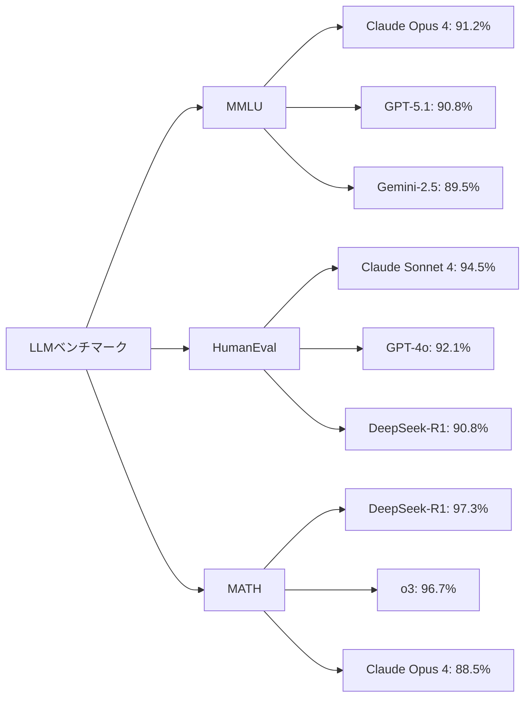
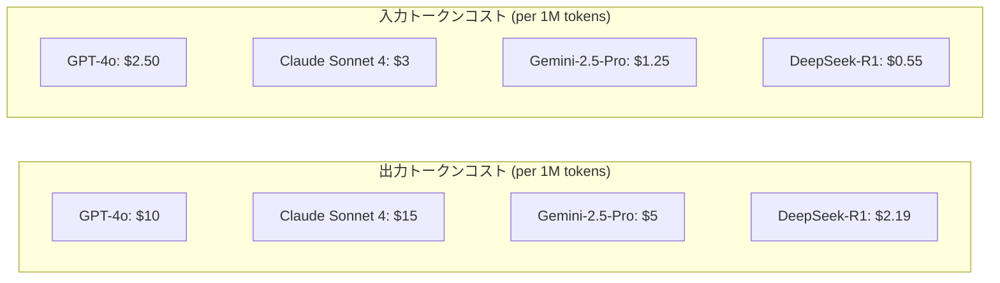
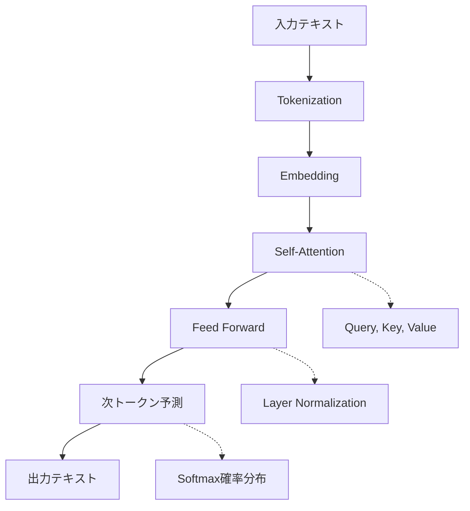
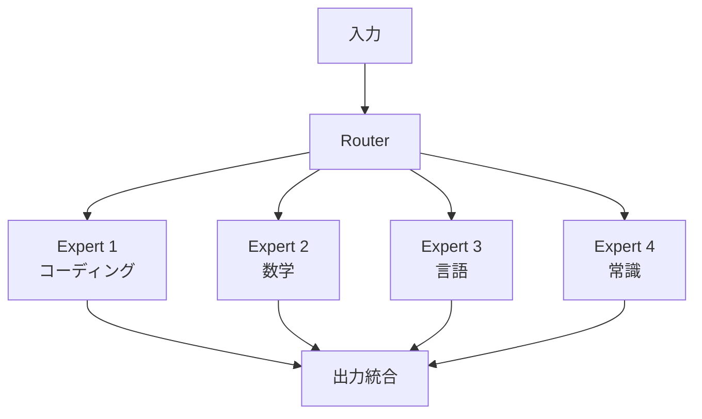
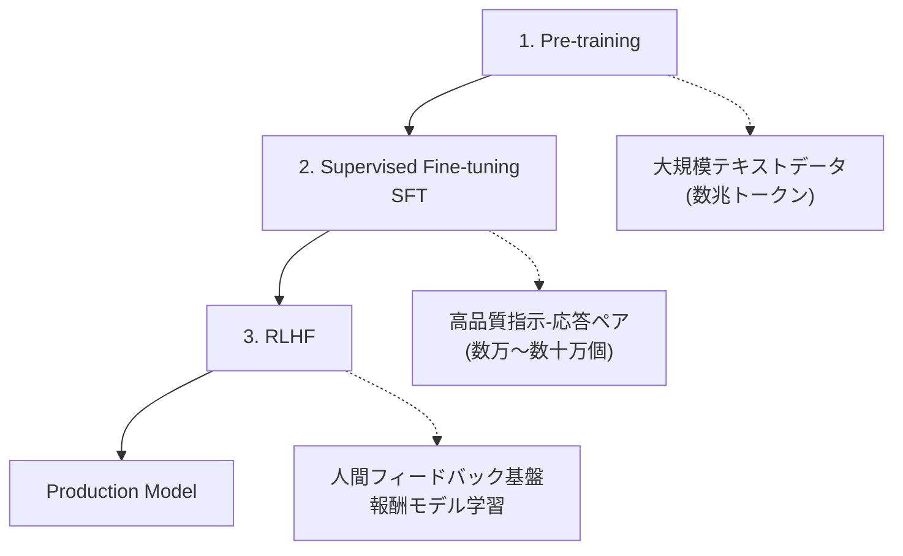
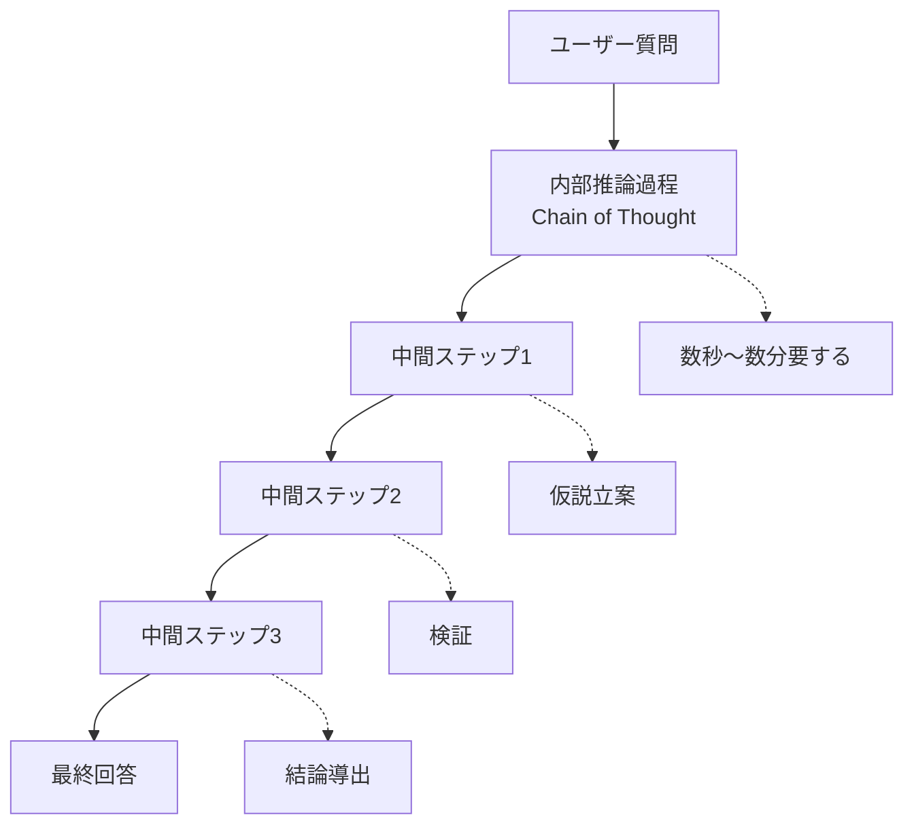
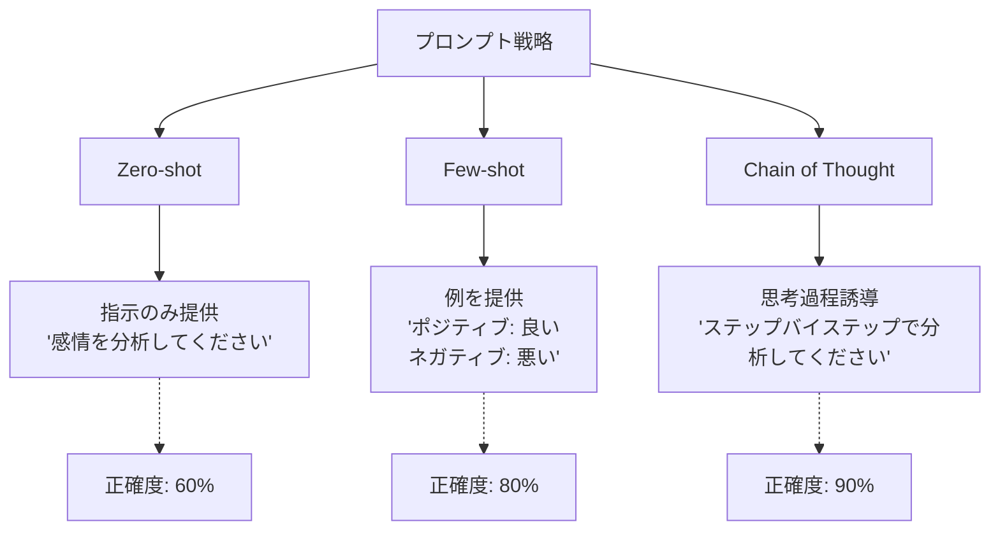
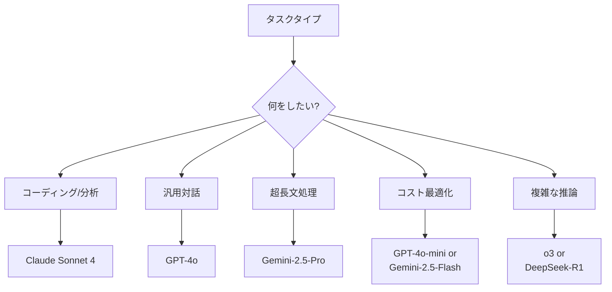

> <strong>シリーズ: DeNA LLM スタディ</strong> (1/5)
>
> 1. <strong>[Part 1: LLM基礎と2025年AI現況](/ja/blog/ja/dena-llm-study-part1-fundamentals)</strong> ← 現在の記事
> 2. [Part 2: 構造化出力とマルチLLMパイプライン](/ja/blog/ja/dena-llm-study-part2-structured-output)
> 3. [Part 3: モデル学習方法論](/ja/blog/ja/dena-llm-study-part3-model-training)
> 4. [Part 4: RAGアーキテクチャと最新トレンド](/ja/blog/ja/dena-llm-study-part4-rag)
> 5. [Part 5: エージェント設計とマルチエージェントオーケストレーション](/ja/blog/ja/dena-llm-study-part5-agent-design)

## DeNA LLM スタディを始めるにあたって

2025年、AI技術の発展速度は想像を超えています。DeNAで実施されたLLMスタディ資料をもとに、最新LLM技術の基礎から実践活用まで5回にわたって整理します。今回のPart 1では、LLMの基本原理と2025年現在のAIエコシステムを見ていきます。

> <strong>資料出典</strong>: 本記事は[DeNA 社内勉強会資料](https://dena.github.io/llm-study20251201/)を基に作成されました。

## 2025年主要LLM現況

### 性能比較: GPT-4 vs Claude vs Gemini

2025年現在、3つの主要LLMが市場を主導しています:

```markdown
| モデル                               | 開発会社  | 特徴             | 強み                       |
| ------------------------------------ | --------- | ---------------- | -------------------------- |
| <strong>GPT-5.1 / GPT-4o</strong>    | OpenAI    | 128Kコンテキスト | 汎用性、マルチモーダル     |
| <strong>Claude Opus 4</strong>       | Anthropic | 200Kコンテキスト | エージェント、コーディング、分析 |
| <strong>Claude Sonnet 4</strong>     | Anthropic | 200Kコンテキスト | コーディング、コスト効率   |
| <strong>Gemini-2.5-Pro</strong>      | Google    | 1Mコンテキスト   | マルチモーダル、超長文     |
| <strong>DeepSeek-R1</strong>         | DeepSeek  | 64Kコンテキスト  | 推論、オープンソース       |
```

### ベンチマーク性能 (2025年12月基準)



> <strong>MMLU</strong>: Massive Multitask Language Understanding (57科目の知識評価)
> <strong>HumanEval</strong>: プログラミング能力評価
> <strong>MATH</strong>: 数学問題解決能力

### 価格比較 (2025年12月基準)



> <strong>重要インサイト</strong>: DeepSeek-R1はコストパフォーマンスに優れ、Claudeはコーディングとエージェントタスクで優位性を示します。

## Next Token Prediction: LLMの核心原理

### Transformerアーキテクチャ

LLMの基盤となるTransformerは、2017年にGoogleの"Attention is All You Need"論文で初めて紹介されました。



### Next Token Prediction 動作原理

```python
# 簡単なNext Token Prediction例
def predict_next_token(context: str, model: LLM) -> str:
    """
    与えられたコンテキストから次トークンを予測

    Args:
        context: "The quick brown"
        model: LLMモデル

    Returns:
        "fox" (最も確率の高いトークン)
    """
    # 1. トークン化
    tokens = tokenize(context)  # ["The", "quick", "brown"]

    # 2. 埋め込み変換
    embeddings = model.embed(tokens)

    # 3. Transformerレイヤー通過
    hidden_states = model.forward(embeddings)

    # 4. 確率分布計算
    logits = model.lm_head(hidden_states[-1])  # 最後のトークンのhidden state
    probs = softmax(logits)

    # 5. 最も確率の高いトークン選択
    next_token = argmax(probs)  # "fox" (prob: 0.87)

    return next_token
```

> <strong>重要</strong>: LLMは単語ではなく<strong>トークン</strong>単位で動作します。英語は1単語 ≈ 1トークン、日本語は1単語 ≈ 2〜3トークンです。

### 最新研究動向: Mixture of Experts (MoE)

2024年から大型モデルはMoEアーキテクチャを採用しています:



<strong>利点</strong>:

- 計算効率性: 全パラメータの一部のみ活性化
- 専門化: 各Expertが特定ドメインに特化
- 拡張性: Expert追加で性能向上可能

## Instruction Tuning: AIを指示に従えるように

### Pre-training vs Fine-tuning vs RLHF



### Instruction Tuning データセット例

```yaml
# SFT (Supervised Fine-Tuning) データ形式
- instruction: "次のJSONをパースして名前を抽出してください。"
  input: '{"user": {"name": "John", "age": 30}}'
  output: "John"

- instruction: "このコードのバグを修正してください。"
  input: |
    def add(a, b):
        return a - b
  output: |
    def add(a, b):
        return a + b  # - の代わりに + 使用

- instruction: "次の文を日本語に翻訳してください。"
  input: "Hello, world!"
  output: "こんにちは、世界!"
```

### Post-training 技法比較

| 技法                               | 目的             | データ要求量 | コスト |
| ---------------------------------- | ---------------- | ------------ | ------ |
| <strong>SFT</strong>               | 指示に従う学習   | 数万個       | 低い   |
| <strong>RLHF</strong>              | 人間の好みに整列 | 数千〜数万個 | 高い   |
| <strong>DPO</strong>               | 好み直接最適化   | 数千個       | 中間   |
| <strong>Constitutional AI</strong> | 価値整列自動化   | 非常に少ない | 低い   |

> <strong>DPO (Direct Preference Optimization)</strong>: 2023年にStanfordで提案された方法で、RLHFよりシンプルで効果的です。

## Reasoning モデル: 考えるAI

### o1、o3とDeepSeek-R1の登場

2024年9月、OpenAIは「考える」AIモデルo1を発表し、2025年には改善版o3を公開しました。特にDeepSeek-R1はオープンソースでありながら最高レベルの数学・推論性能を示しています:



### Reasoning モデル性能比較

```markdown
| ベンチマーク                                    | GPT-4o          | o3              | DeepSeek-R1     |
| ----------------------------------------------- | --------------- | --------------- | --------------- |
| <strong>AIME 2024</strong> (数学オリンピアード) | 13.4%           | 96.7%           | 79.8%           |
| <strong>Codeforces</strong> (コーディング大会)  | 11th percentile | 99th percentile | 96th percentile |
| <strong>GPQA Diamond</strong> (科学)            | 50.6%           | 87.7%           | 71.5%           |
| <strong>MATH-500</strong>                       | 74.6%           | 96.7%           | 97.3%           |
```

### Chain of Thought (CoT) プロンプティング

一般モデルもCoTを使用すれば推論能力を向上できます:

```markdown
# ❌ 一般プロンプト

"234 × 567を計算してください。"
→ 間違った回答の可能性が高い

# ✅ CoT プロンプト

"234 × 567をステップバイステップで計算してください。各ステップの中間結果を示してください。"
→ 正確度が大幅に向上
```

<strong>実際のCoT例</strong>:

```
質問: 234 × 567を計算してください。

CoT 応答:
1. まず234を200 + 30 + 4に分解します。
2. それぞれを567に掛けます:
   - 200 × 567 = 113,400
   - 30 × 567 = 17,010
   - 4 × 567 = 2,268
3. すべてを足します:
   113,400 + 17,010 + 2,268 = 132,678

答: 132,678
```

## プロンプトエンジニアリング基礎

### Zero-shot vs Few-shot vs Chain of Thought



### Temperature パラメータの影響

```python
# Temperature設定による出力の違い

# Temperature = 0 (決定的、一貫性)
response = model.generate(
    "Pythonでフィボナッチ数列を書いてください。",
    temperature=0
)
# 出力: 常に同じコード (最も確率の高いトークン選択)

# Temperature = 0.7 (バランス、推奨)
response = model.generate(
    "創造的なストーリーを書いてください。",
    temperature=0.7
)
# 出力: 適度に多様で一貫性維持

# Temperature = 1.5 (創造的、不安定)
response = model.generate(
    "完全に新しいアイデアを提案してください。",
    temperature=1.5
)
# 出力: 非常に多様だが一貫性低い、時に奇妙な出力
```

### 効果的なプロンプト作成原則

1. <strong>明確性</strong>: 曖昧な指示を避ける

   ```
   ❌ "これについて教えて"
   ✅ "Claude Sonnet 4の主な特徴3つを150字以内で説明してください。"
   ```

2. <strong>コンテキスト提供</strong>: 背景情報を含める

   ```
   ❌ "コードレビューして"
   ✅ "次はReactコンポーネントです。性能、可読性、アクセシビリティの観点からレビューしてください: [コード]"
   ```

3. <strong>出力形式指定</strong>: 望む構造を明示
   ```
   ✅ "次の形式で応答してください:
   1. 要約 (1文)
   2. 主要ポイント (3つ)
   3. 実行計画 (ステップバイステップ)"
   ```

## 実習 A インサイト: OpenAI API 実践

### API基本使用法

```python
from openai import OpenAI

client = OpenAI(api_key="your-api-key")

# 基本チャット完成
response = client.chat.completions.create(
    model="gpt-4o",
    messages=[
        {"role": "system", "content": "あなたは役立つAIアシスタントです。"},
        {"role": "user", "content": "LLMとは何ですか?"}
    ],
    temperature=0.7,
    max_tokens=500
)

print(response.choices[0].message.content)
```

### 会話履歴管理

```python
# 会話コンテキスト維持
conversation_history = [
    {"role": "system", "content": "あなたはPython専門家です。"}
]

def chat(user_message: str) -> str:
    # ユーザーメッセージ追加
    conversation_history.append({"role": "user", "content": user_message})

    # API呼び出し
    response = client.chat.completions.create(
        model="gpt-4o",
        messages=conversation_history,
        temperature=0.7
    )

    # アシスタント応答保存
    assistant_message = response.choices[0].message.content
    conversation_history.append({"role": "assistant", "content": assistant_message})

    return assistant_message

# 会話例
print(chat("リスト内包表記を説明してください。"))
print(chat("例のコードを見せてください。"))  # 以前のコンテキスト維持
print(chat("これを辞書内包表記に変えてください。"))  # 連続的な会話
```

### トークン使用量最適化

```python
import tiktoken

def count_tokens(text: str, model: str = "gpt-4") -> int:
    """テキストのトークン数を計算"""
    encoding = tiktoken.encoding_for_model(model)
    return len(encoding.encode(text))

# プロンプト最適化例
long_prompt = "これは非常に長いプロンプトです..." * 100
token_count = count_tokens(long_prompt)
print(f"トークン数: {token_count}")  # 例: 8,543 tokens

# コスト計算
input_cost = (token_count / 1_000_000) * 10  # GPT-4 Turbo 入力コスト
print(f"予想コスト: ${input_cost:.4f}")
```

## 主要学習ポイント

### 1. モデル選択基準



### 2. 性能向上チェックリスト

- ✅ <strong>明確な指示</strong>: 曖昧性を排除
- ✅ <strong>Few-shot例</strong>: 3〜5個提供
- ✅ <strong>CoT プロンプティング</strong>: 複雑な推論タスク
- ✅ <strong>Temperature調整</strong>: タスクに合わせて設定
- ✅ <strong>出力形式指定</strong>: 構造化された応答
- ✅ <strong>コンテキスト管理</strong>: トークン制限考慮

### 3. 実践活用シナリオ

| シナリオ                         | 推奨モデル       | 設定     |
| -------------------------------- | ---------------- | -------- |
| コードレビュー                   | Claude Sonnet 4  | temp=0.3 |
| 創造的な執筆                     | GPT-4o           | temp=0.9 |
| データ分析                       | Claude Sonnet 4  | temp=0.1 |
| カスタマーサポートチャットボット | GPT-4o-mini      | temp=0.7 |
| 長文ドキュメント要約             | Gemini-2.5-Pro   | temp=0.5 |
| 複雑な数学/推論                  | DeepSeek-R1      | temp=0.1 |

## 次回予告

Part 2では<strong>構造化出力とマルチLLMパイプライン</strong>を扱います:

- JSONモードとFunction Calling
- 構造化出力の実践活用
- マルチLLMパイプライン設計
- Pydanticを活用した型安全性
- 実習 B: 複雑なデータ抽出システム構築

> <strong>次の記事へ</strong>: [Part 2: 構造化出力とマルチLLMパイプライン](/ja/blog/ja/dena-llm-study-part2-structured-output)

## 参考資料

- [DeNA LLM スタディ資料 (Zenn)](https://dena.github.io/llm-study20251201/)
- [OpenAI API Documentation](https://platform.openai.com/docs)
- [Anthropic Claude Documentation](https://docs.anthropic.com/claude/docs)
- [Google Gemini Documentation](https://ai.google.dev/docs)
- [Attention is All You Need (Transformer論文)](https://arxiv.org/abs/1706.03762)
- [Chain of Thought Prompting](https://arxiv.org/abs/2201.11903)

---

<strong>作成日</strong>: 2025年12月8日
<strong>シリーズ</strong>: DeNA LLM スタディ (1/5)
<strong>タグ</strong>: #LLM #AI #PromptEngineering #DeNA
