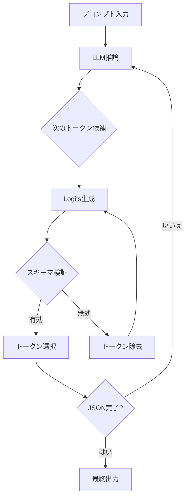
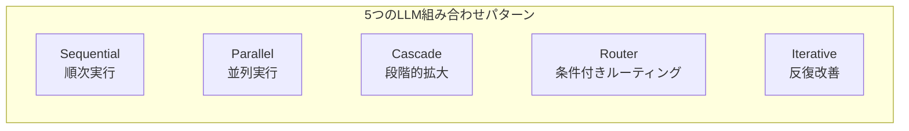

> **シリーズ: DeNA LLMスタディ** (2/5)
>
> 1. [Part 1: LLM基礎と2025年AI現況](/ja/blog/ja/dena-llm-study-part1-fundamentals)
> 2. <strong>Part 2: 構造化出力とマルチLLMパイプライン</strong> ← 現在の記事
> 3. [Part 3: モデル学習方法論](/ja/blog/ja/dena-llm-study-part3-model-training)
> 4. [Part 4: RAGアーキテクチャと最新トレンド](/ja/blog/ja/dena-llm-study-part4-rag)
> 5. [Part 5: エージェント設計とマルチエージェントオーケストレーション](/ja/blog/ja/dena-llm-study-part5-agent-design)

## 概要

DeNAのLLMスタディシリーズPart 2では、LLMの出力を安定的に制御する<strong>構造化出力(Structured Output)</strong>技法と、複数のLLMを組み合わせてより強力なシステムを構築する<strong>Multi-LLMパイプラインパターン</strong>を扱います。

今回の記事では、DeNAのスタディ資料をもとに最新情報を追加し、実務で即座に活用できるパターンとベストプラクティスをまとめました。

### この記事で扱う内容

1. **構造化出力技法**
   - JSON SchemaとPydanticの活用
   - Constrained Decodingの原理
   - プロバイダー別実装方式 (OpenAI、Anthropic、Google)

2. **複数LLM組み合わせパターン**
   - Sequential、Parallel、Cascade、Router、Iterative
   - 各パターンの適用シナリオとトレードオフ
   - 実践的な実装例

3. **実習B & C内容**
   - B1: 二項分類 (コメント分類)
   - B2: 複数項目抽出と採点
   - B3: ネスト構造化出力
   - C1: 複数評価軸の並列処理
   - C2: 評価結果を利用した修正
   - C3: 修正-評価ループの実装

## 1. 構造化出力 (Structured Output)

### 1.1 構造化出力が必要な理由

LLMは基本的に自由形式のテキストを生成します。しかし実務アプリケーションでは以下のような要件があります:

- **パース可能なデータ**: JSON、YAMLなどの標準形式
- **型安全性**: フィールド型の検証 (string、number、booleanなど)
- **必須フィールドの保証**: 欠落防止
- **ネスト構造のサポート**: 複雑なデータモデル

自由テキスト出力の問題点:

```python
# ❌ 問題: パース失敗の可能性
response = llm.generate("Extract name and age from: John is 30 years old")
# 出力: "John is 30 years old. His name is John and he is 30."
# このテキストをどうパースする?
```

構造化出力の利点:

```python
# ✅ 解決: 構造化された出力
response = llm.generate_structured(
    prompt="Extract name and age",
    schema={"name": str, "age": int}
)
# 出力: {"name": "John", "age": 30}
# すぐに使えるデータ
```

### 1.2 JSON Schemaベースの構造化

JSON SchemaはJSONデータの構造を定義する標準です。

#### 基本例

```json
{
  "$schema": "http://json-schema.org/draft-07/schema#",
  "type": "object",
  "properties": {
    "name": {
      "type": "string",
      "description": "ユーザー名"
    },
    "age": {
      "type": "integer",
      "minimum": 0,
      "maximum": 150
    },
    "email": {
      "type": "string",
      "format": "email"
    }
  },
  "required": ["name", "age"]
}
```

#### OpenAI Structured Outputs API (2024年8月リリース)

OpenAIはJSON Schemaを直接サポートするAPIを提供しています:

```python
from openai import OpenAI

client = OpenAI()

response = client.chat.completions.create(
    model="gpt-4o",
    messages=[
        {"role": "user", "content": "Extract: John is 30 years old, email: john@example.com"}
    ],
    response_format={
        "type": "json_schema",
        "json_schema": {
            "name": "user_info",
            "strict": True,  # 厳格モード: スキーマ完全準拠
            "schema": {
                "type": "object",
                "properties": {
                    "name": {"type": "string"},
                    "age": {"type": "integer"},
                    "email": {"type": "string"}
                },
                "required": ["name", "age", "email"],
                "additionalProperties": False
            }
        }
    }
)

data = json.loads(response.choices[0].message.content)
# {"name": "John", "age": 30, "email": "john@example.com"}
```

**主な特徴**:

- `strict: True`オプションで100%スキーマ準拠を保証
- Constrained Decodingベースで誤ったJSON生成が不可能
- 追加コストなし

### 1.3 Pydanticを活用した型安全な構造化

PydanticはPythonのデータ検証ライブラリで、LLM出力検証に最適です。

#### 基本的なPydanticモデル

```python
from pydantic import BaseModel, Field, EmailStr
from typing import List, Optional

class UserInfo(BaseModel):
    """ユーザー情報モデル"""
    name: str = Field(description="ユーザー名")
    age: int = Field(ge=0, le=150, description="年齢 (0-150)")
    email: EmailStr = Field(description="メールアドレス")
    tags: Optional[List[str]] = Field(default=None, description="タグリスト")

# Pydanticモデル → JSON Schema自動変換
schema = UserInfo.model_json_schema()
```

#### Instructorライブラリの活用

InstructorはPydanticとLLM APIを完全に統合します:

```python
import instructor
from openai import OpenAI

# OpenAIクライアントにInstructorをパッチ
client = instructor.from_openai(OpenAI())

# Pydanticモデルで直接レスポンスを受け取る
user = client.chat.completions.create(
    model="gpt-4o",
    messages=[
        {"role": "user", "content": "Extract: John is 30, email john@example.com"}
    ],
    response_model=UserInfo  # Pydanticモデルを直接渡す
)

print(user.name)  # "John"
print(user.age)   # 30
print(user.email) # "john@example.com"
```

**利点**:

- Pythonネイティブの型チェック
- IDEの自動補完サポート
- ランタイム検証の自動実行
- 複雑なネスト構造のサポート

#### ネスト構造の例 (B3実習)

```python
from pydantic import BaseModel
from typing import List

class Address(BaseModel):
    """住所情報"""
    street: str
    city: str
    zip_code: str

class Company(BaseModel):
    """会社情報"""
    name: str
    industry: str

class Person(BaseModel):
    """人物情報 (ネスト構造)"""
    name: str
    age: int
    address: Address  # ネストされたオブジェクト
    companies: List[Company]  # オブジェクト配列

# LLMにネスト構造の抽出を依頼
person = client.chat.completions.create(
    model="gpt-4o",
    messages=[
        {"role": "user", "content": """
        Extract information:
        John lives at 123 Main St, New York, 10001.
        He works at Google (tech) and Microsoft (software).
        """}
    ],
    response_model=Person
)

print(person.address.city)  # "New York"
print(person.companies[0].name)  # "Google"
```

### 1.4 Constrained Decodingの原理

Constrained Decodingは、LLMがトークンを生成する際に、<strong>スキーマに合わないトークンをリアルタイムでブロック</strong>する技法です。

#### 動作原理



#### 例: JSON生成プロセス

```python
# 目標スキーマ: {"name": str, "age": int}
# LLM生成プロセス (ステップごと)

# Step 1: 最初のトークン
# 候補: ["{", "The", "Name", ...] → "{" を選択 (スキーマ開始)

# Step 2: キー生成
# 候補: ["name", "age", "invalid", ...] → "name" を選択

# Step 3: 区切り文字
# 候補: [":", ",", "}"] → ":" を選択

# Step 4: 値生成
# 候補: ["John", "123", "true"] → "John" を選択 (string型)

# Step 5: 次のフィールド
# 候補: [",", "}"] → "," を選択 (ageフィールドが必要)

# Step 6: 2つ目のキー
# 候補: ["age", "name", ...] → "age" を選択

# Step 7: 値生成
# 候補: ["30", "John", "true"] → "30" を選択 (integer型)

# Step 8: 終了
# 候補: ["}"] → "}" を選択 (必須フィールド完了)

# 最終出力: {"name": "John", "age": 30}
```

**ポイント**:

- 各ステップで<strong>スキーマに合うトークンのみ許可</strong>
- 誤ったJSONが生成される可能性<strong>0%</strong>
- 追加の検証ロジック不要

#### プロバイダー別実装

| プロバイダー          | 実装方式                                | 備考                         |
| --------------------- | --------------------------------------- | ---------------------------- |
| **OpenAI**            | Native Structured Outputs API           | 最も便利 (2024.08〜)         |
| **Anthropic**         | Tool Use迂回方式                        | `tools`パラメータ活用        |
| **Google Gemini**     | `response_mime_type="application/json"` | JSON Schemaサポート (Beta)   |
| **Local (llama.cpp)** | Grammar-based decoding                  | GBNF文法定義が必要           |
| **Outlines**          | FSM-based decoding                      | オープンソース、全モデル対応 |

#### Anthropic Claude Tool Use方式

Claudeは直接的なJSON Schemaサポートの代わりにTool Useを活用します:

```python
import anthropic

client = anthropic.Anthropic()

response = client.messages.create(
    model="claude-sonnet-4-20250514",
    max_tokens=1024,
    tools=[
        {
            "name": "extract_user_info",
            "description": "ユーザー情報抽出",
            "input_schema": {
                "type": "object",
                "properties": {
                    "name": {"type": "string"},
                    "age": {"type": "integer"}
                },
                "required": ["name", "age"]
            }
        }
    ],
    messages=[
        {"role": "user", "content": "John is 30 years old"}
    ]
)

# Tool use結果の抽出
tool_use = next(
    block for block in response.content
    if block.type == "tool_use"
)
data = tool_use.input  # {"name": "John", "age": 30}
```

### 1.5 実習B: 構造化出力実践

#### B1: 二項分類 (Sentiment Analysis)

```python
from pydantic import BaseModel
from enum import Enum

class Sentiment(str, Enum):
    """感情分類"""
    POSITIVE = "positive"
    NEGATIVE = "negative"

class SentimentResult(BaseModel):
    """感情分析結果"""
    text: str
    sentiment: Sentiment
    confidence: float = Field(ge=0.0, le=1.0)

# 分類実行
result = client.chat.completions.create(
    model="gpt-4o",
    messages=[
        {"role": "user", "content": "Analyze: This product is amazing!"}
    ],
    response_model=SentimentResult
)

print(result.sentiment)  # Sentiment.POSITIVE
print(result.confidence)  # 0.95
```

#### B2: 複数項目抽出と採点

```python
from typing import List

class Entity(BaseModel):
    """固有表現認識結果"""
    text: str = Field(description="抽出されたテキスト")
    type: str = Field(description="エンティティタイプ (PERSON、ORG、LOCなど)")
    start: int = Field(description="開始位置")
    end: int = Field(description="終了位置")

class ExtractionResult(BaseModel):
    """複数項目抽出結果"""
    entities: List[Entity]
    total_count: int
    quality_score: float = Field(ge=0.0, le=1.0, description="抽出品質スコア")

# 複数項目抽出
result = client.chat.completions.create(
    model="gpt-4o",
    messages=[
        {"role": "user", "content": """
        Extract entities from:
        "Apple CEO Tim Cook announced the new iPhone in California."
        """}
    ],
    response_model=ExtractionResult
)

for entity in result.entities:
    print(f"{entity.text} ({entity.type})")
# Apple (ORG)
# Tim Cook (PERSON)
# iPhone (PRODUCT)
# California (LOC)

print(f"Quality: {result.quality_score}")  # 0.92
```

## 2. 複数LLM組み合わせパターン

単一のLLMだけでは解決が難しい問題を、複数のLLMを組み合わせて解決します。

### 2.1 パターン概要



### 2.2 Sequential Pattern (順次実行)

**概念**: 前のLLMの出力を次のLLMの入力として使用

**適用シナリオ**:

- 段階的データ変換 (翻訳 → 要約 → 感情分析)
- 段階的精緻化 (草案作成 → 文法校正 → スタイル改善)

```python
# 例: 翻訳 → 要約パイプライン
async def sequential_pipeline(text: str) -> str:
    # Step 1: 翻訳
    translated = await llm_call(
        model="gpt-4o",
        prompt=f"Translate to English: {text}"
    )

    # Step 2: 要約 (翻訳結果を使用)
    summary = await llm_call(
        model="gpt-4o-mini",  # より安価なモデルで要約
        prompt=f"Summarize in 3 sentences: {translated}"
    )

    return summary

# 実行
result = await sequential_pipeline("日本語の長い文書...")
```

**トレードオフ**:

- ✅ 各ステップが明確に分離
- ✅ デバッグが容易
- ❌ 遅延時間の累積 (ステップ数 × LLM呼び出し時間)
- ❌ 前のステップのエラーが後のステップに伝播

### 2.3 Parallel Pattern (並列実行)

**概念**: 複数のLLMを同時に実行して結果を集約

**適用シナリオ**:

- 多角的評価 (文法、スタイル、内容を同時評価)
- アンサンブル推論 (複数モデルの結果を投票/平均)

```python
import asyncio

async def parallel_evaluation(text: str) -> dict:
    """複数評価軸の並列処理 (C1実習)"""

    # 3つの評価を並列実行
    tasks = [
        evaluate_grammar(text),    # 文法評価
        evaluate_style(text),      # スタイル評価
        evaluate_content(text)     # 内容評価
    ]

    # 同時実行 (asyncio.gather)
    grammar, style, content = await asyncio.gather(*tasks)

    return {
        "grammar_score": grammar,
        "style_score": style,
        "content_score": content,
        "overall_score": (grammar + style + content) / 3
    }

async def evaluate_grammar(text: str) -> float:
    response = await llm_call(
        model="gpt-4o",
        prompt=f"文法スコア (0-100): {text}",
        response_model=ScoreResult
    )
    return response.score

# 他の評価関数も同じパターン...
```

**実行時間の比較**:

```python
# Sequential: 3秒 × 3 = 9秒
# Parallel: max(3秒, 3秒, 3秒) = 3秒
# → 66%の時間短縮!
```

**トレードオフ**:

- ✅ 最大速度 (並列実行)
- ✅ 独立した評価が可能
- ❌ コスト増加 (同時に複数のAPI呼び出し)
- ❌ 結果集約ロジックが必要

### 2.4 Cascade Pattern (段階的拡大)

**概念**: 小さなモデルから始めて、必要に応じて大きなモデルに拡大

**適用シナリオ**:

- コスト最適化 (簡単な質問は小さなモデルで)
- 品質保証 (複雑な質問のみ大きなモデルで)

```python
async def cascade_routing(query: str) -> str:
    """Cascadeパターン: 小さなモデル → 大きなモデル"""

    # Step 1: 小さなモデルで試行
    response_small = await llm_call(
        model="gpt-4o-mini",  # 安価なモデル
        prompt=query,
        max_tokens=100
    )

    # Step 2: 品質検証
    quality = await evaluate_quality(response_small)

    if quality >= 0.8:
        # 品質十分 → 小さなモデルの結果を返す
        return response_small

    # Step 3: 品質不足 → 大きなモデルで再試行
    response_large = await llm_call(
        model="gpt-4o",  # 強力なモデル
        prompt=query,
        max_tokens=500
    )

    return response_large

# コスト削減効果
# - 80%の質問: gpt-4o-mini ($0.15/1M tokens)
# - 20%の質問: gpt-4o ($5/1M tokens)
# → 平均コスト: 0.15 × 0.8 + 5 × 0.2 = $1.12 (78%削減)
```

**トレードオフ**:

- ✅ コスト効率の最大化
- ✅ 平均品質の維持
- ❌ 最悪の場合、遅延時間が2倍 (再試行)
- ❌ 品質評価ロジックが必要

### 2.5 Router Pattern (条件付きルーティング)

**概念**: 入力の特性に応じて最適なモデルにルーティング

**適用シナリオ**:

- ドメイン別専門家モデル (医療、法律、技術)
- 言語別モデル (韓国語特化、英語特化)

```python
from enum import Enum

class QueryType(str, Enum):
    TECHNICAL = "technical"
    MEDICAL = "medical"
    LEGAL = "legal"
    GENERAL = "general"

async def router_pattern(query: str) -> str:
    # Step 1: クエリ分類
    classification = await llm_call(
        model="gpt-4o-mini",  # 高速分類器
        prompt=f"Classify query type: {query}",
        response_model=QueryClassification
    )

    # Step 2: 専門家モデルにルーティング
    if classification.type == QueryType.TECHNICAL:
        model = "gpt-4o"  # 技術文書に強いモデル
    elif classification.type == QueryType.MEDICAL:
        model = "claude-opus-4-20250514"  # 医療知識が豊富なモデル
    elif classification.type == QueryType.LEGAL:
        model = "gpt-4o"  # 法律推論に強いモデル
    else:
        model = "gpt-4o-mini"  # 一般的な質問は安価なモデル

    # Step 3: 選択されたモデルで実行
    response = await llm_call(model=model, prompt=query)
    return response
```

**トレードオフ**:

- ✅ 最適なモデル選択
- ✅ コスト対品質の最適化
- ❌ 分類エラーの可能性
- ❌ ルーティングロジックの保守

### 2.6 Iterative Pattern (反復改善)

**概念**: 評価 → 修正を繰り返して品質改善

**適用シナリオ**:

- ライティング改善 (草案 → フィードバック → 修正 → 再評価)
- コードリファクタリング (コード → レビュー → 修正 → 再レビュー)

```python
async def iterative_improvement(
    initial_text: str,
    max_iterations: int = 3,
    target_score: float = 0.9
) -> str:
    """修正-評価ループ (C2、C3実習)"""

    current_text = initial_text

    for iteration in range(max_iterations):
        # Step 1: 評価
        evaluation = await llm_call(
            model="gpt-4o",
            prompt=f"Evaluate quality (0-1): {current_text}",
            response_model=EvaluationResult
        )

        print(f"Iteration {iteration + 1}: Score = {evaluation.score}")

        # Step 2: 目標達成確認
        if evaluation.score >= target_score:
            print(f"Target achieved! ({evaluation.score} >= {target_score})")
            break

        # Step 3: フィードバックに基づいて修正
        current_text = await llm_call(
            model="gpt-4o",
            prompt=f"""
            Improve the text based on feedback:

            Current text: {current_text}
            Feedback: {evaluation.feedback}

            Generate improved version.
            """
        )

    return current_text

# 実行
improved = await iterative_improvement(
    initial_text="草案テキスト...",
    max_iterations=3,
    target_score=0.9
)
```

**トレードオフ**:

- ✅ 段階的な品質改善
- ✅ 明確なフィードバックループ
- ❌ コスト増加 (反復回数 × コスト)
- ❌ 収束保証なし (無限ループの可能性)

### 2.7 パターン選択ガイド

| 要件         | 推奨パターン | 理由                       |
| ------------ | ------------ | -------------------------- |
| 速度最優先   | Parallel     | 並列実行で遅延最小化       |
| コスト最優先 | Cascade      | 小さなモデル優先使用       |
| 品質最優先   | Iterative    | 反復改善で品質保証         |
| ドメイン特化 | Router       | 専門家モデルにルーティング |
| 段階的処理   | Sequential   | 明確なパイプライン構成     |

### 2.8 実践的な実装: ハイブリッドパターン

実務では複数のパターンを組み合わせます:

```python
async def hybrid_pipeline(text: str) -> str:
    """Router + Cascade + Parallel組み合わせ"""

    # Step 1: Router (クエリ分類)
    query_type = await classify_query(text)

    if query_type == "simple":
        # Step 2a: Cascade (簡単なクエリ)
        return await cascade_routing(text)

    else:
        # Step 2b: Parallel + Iterative (複雑なクエリ)
        # 並列で草案生成と評価
        draft, evaluation = await asyncio.gather(
            generate_draft(text),
            evaluate_requirements(text)
        )

        # 反復改善
        improved = await iterative_improvement(
            draft,
            evaluation,
            max_iterations=2
        )

        return improved
```

## 3. 実習まとめ

### 実習B: 構造化出力

| 実習 | テーマ       | 核心概念                             |
| ---- | ------------ | ------------------------------------ |
| B1   | 二項分類     | Enum型、Pydantic validation          |
| B2   | 複数項目抽出 | List型、ネスト検証                   |
| B3   | ネスト構造   | オブジェクトのネスト、複雑なスキーマ |

### 実習C: 複数LLM組み合わせ

| 実習 | テーマ     | 核心概念                               |
| ---- | ---------- | -------------------------------------- |
| C1   | 並列評価   | asyncio.gather、同時実行               |
| C2   | 評価-修正  | Sequential pattern、フィードバック活用 |
| C3   | 反復ループ | Iterative pattern、収束条件            |

## 4. 最新動向とベストプラクティス

### 4.1 2025年の構造化出力標準

**OpenAI Structured Outputs**が事実上の標準として定着しました:

- **Constrained Decodingベース**: 100%スキーマ準拠
- **追加コストなし**: 既存APIと同じ価格
- **Pydantic統合**: Instructorなどのライブラリサポート

**競合製品**:

- Anthropic: Tool Use方式 (迂回的)
- Google: `response_mime_type` (Beta)
- Local: Outlines、llama-cpp-python

### 4.2 コスト最適化戦略

```python
# コスト効率戦略の組み合わせ
async def cost_optimized_pipeline(query: str) -> str:
    # 1. Cascade: 小さなモデル優先
    result = await cascade_routing(query)

    # 2. Caching: 繰り返しクエリのキャッシング
    cache_key = hash(query)
    if cache_key in cache:
        return cache[cache_key]

    # 3. Batch Processing: API呼び出しをまとめる
    if len(pending_queries) >= 10:
        results = await batch_call(pending_queries)

    cache[cache_key] = result
    return result
```

**コスト削減効果**:

- Cascade: 70-80%
- Caching: 50-90% (繰り返しクエリの割合に応じて)
- Batch: 20-30%

### 4.3 品質保証チェックリスト

**構造化出力**:

- ✅ 必須フィールドの定義 (`required`配列)
- ✅ 型制約 (`minimum`、`maximum`、`pattern`)
- ✅ 説明の追加 (`description`フィールドでLLMをガイド)
- ✅ 検証ロジック (`Pydantic validator`)

**パイプライン設計**:

- ✅ エラー処理 (各ステップでtry-catch)
- ✅ タイムアウト設定 (無限待機防止)
- ✅ ロギング (デバッグのための中間結果記録)
- ✅ モニタリング (コスト、遅延、エラー率追跡)

### 4.4 オープンソースツールエコシステム

| ツール         | 用途                             | 推奨度     |
| -------------- | -------------------------------- | ---------- |
| **Instructor** | Pydantic ↔ LLM統合               | ⭐⭐⭐⭐⭐ |
| **Outlines**   | Constrained Decoding (ローカル)  | ⭐⭐⭐⭐   |
| **LangChain**  | パイプラインオーケストレーション | ⭐⭐⭐     |
| **LlamaIndex** | RAG + Structured Outputs         | ⭐⭐⭐⭐   |
| **Guidance**   | Template-based出力制御           | ⭐⭐⭐     |

## 5. 次のステップ

### Part 3予告: RAGとベクトルデータベース

次の記事では、<strong>外部知識をLLMに注入</strong>するRAG(Retrieval-Augmented Generation)技法を扱います:

1. **ベクトルデータベース基礎**
   - Embeddingモデル選択
   - FAISS、Pinecone、Weaviate比較

2. **RAGパイプライン構築**
   - Chunking戦略
   - Retrieval最適化
   - Reranking技法

3. **高度なRAGパターン**
   - Hybrid Search (キーワード + ベクトル)
   - Multi-hop Retrieval
   - Self-Query

### 実習プロジェクト提案

1. **文書処理システム**
   - PDF → 構造化データ抽出
   - Parallel Patternで並列処理
   - Pydanticで検証

2. **自動評価パイプライン**
   - Iterative Patternで品質改善
   - 複数評価軸 (文法、スタイル、内容)
   - 目標スコア到達まで反復

3. **コスト最適化システム**
   - Cascade Patternでモデル選択
   - クエリ分類 → ルーティング
   - キャッシング + バッチ処理

## 結論

DeNA LLMスタディPart 2では、LLMを実務に適用するための2つの核心技法を学びました:

1. **構造化出力**
   - JSON Schema、Pydanticで型安全な出力を保証
   - Constrained Decodingで100%スキーマ準拠
   - OpenAI Structured Outputs APIが現在最高の選択

2. **Multi-LLM組み合わせパターン**
   - Sequential、Parallel、Cascade、Router、Iterative
   - 各パターンのトレードオフの理解
   - 実務ではハイブリッド組み合わせを活用

**核心メッセージ**:

- 構造化出力は<strong>プロダクションLLMアプリケーションの必須要素</strong>
- 単一LLMより<strong>複数LLM組み合わせがより強力</strong>
- コスト、速度、品質の<strong>バランスを見つけることが実務の核心</strong>

次のPart 3では、RAGを通じてLLMの知識を拡張する方法を学びます!

## 参考資料

### 公式ドキュメント

- [OpenAI Structured Outputs](https://openai.com/index/introducing-structured-outputs-in-the-api/)
- [Anthropic Tool Use](https://docs.anthropic.com/claude/docs/tool-use)
- [Pydantic公式ドキュメント](https://docs.pydantic.dev/)
- [Instructorライブラリ](https://python.useinstructor.com/)

### 論文と研究

- [A Unified Approach to Routing and Cascading for LLMs](https://arxiv.org/html/2410.10347v1) (2024)
- [Constrained Decoding for LLMs](https://www.aidancooper.co.uk/constrained-decoding/) (2024)
- [Generating Structured Outputs from Language Models](https://arxiv.org/html/2501.10868v1) (2025)

### 実務ガイド

- [Enforcing JSON Outputs in Commercial LLMs](https://datachain.ai/blog/enforcing-json-outputs-in-commercial-llms)
- [Mastering Pydantic for LLM Workflows](https://ai.plainenglish.io/mastering-pydantic-for-llm-workflows-c6ed18fc79cc)
- [The guide to structured outputs and function calling](https://agenta.ai/blog/the-guide-to-structured-outputs-and-function-calling-with-llms)
