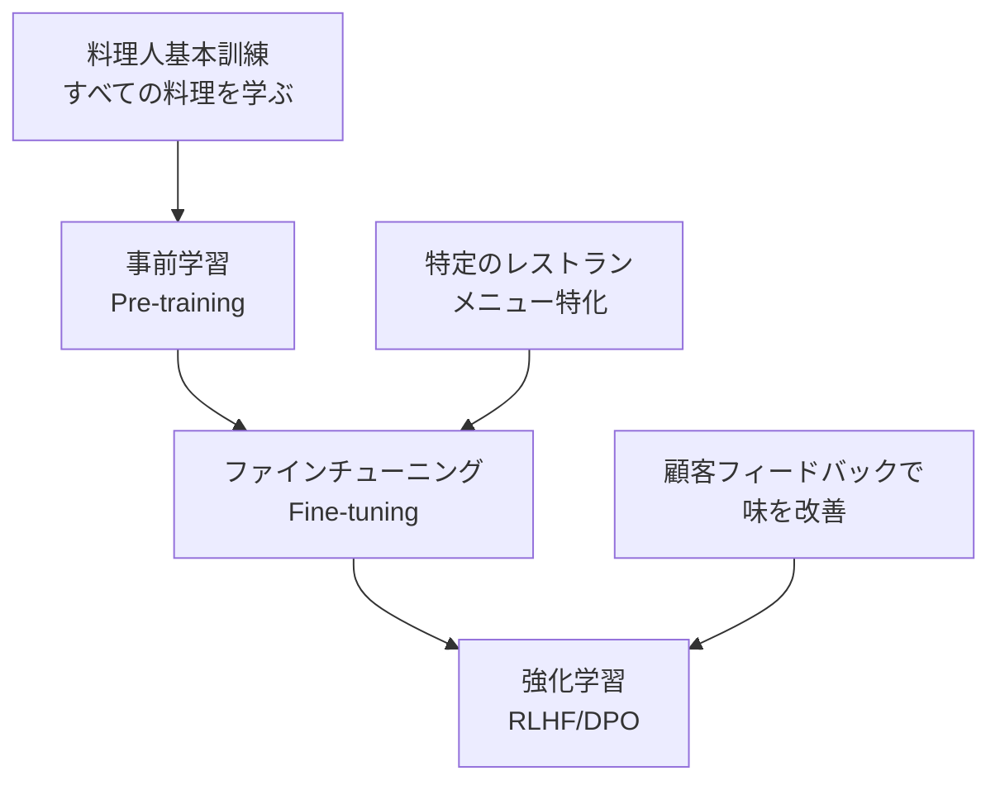
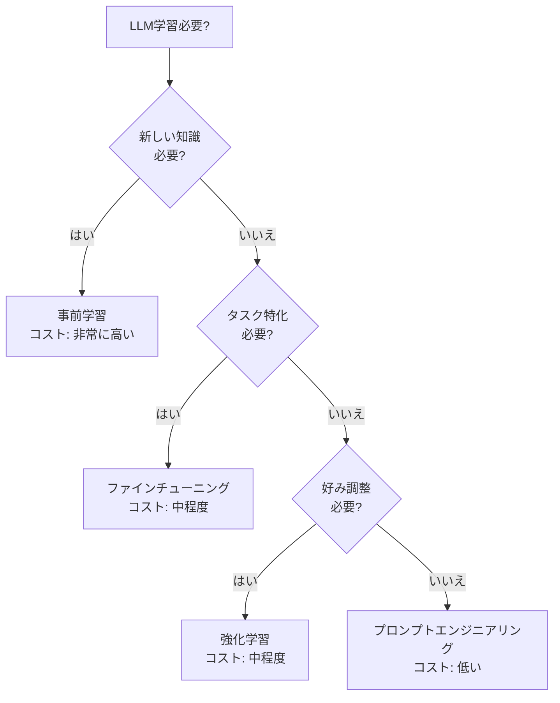
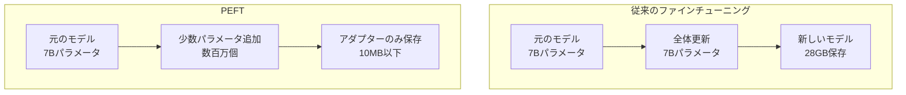
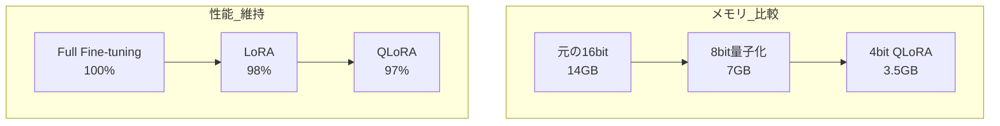
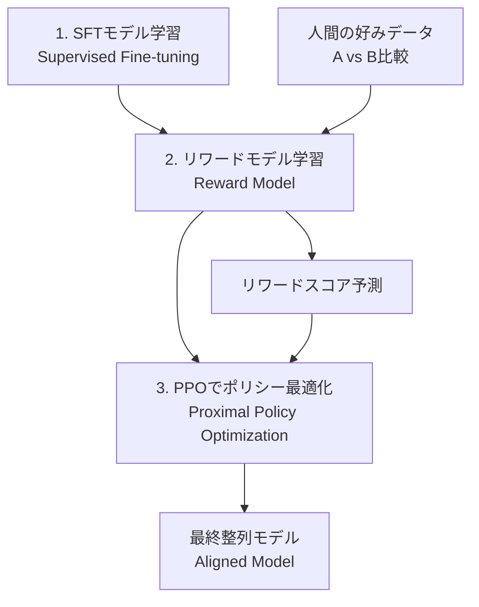
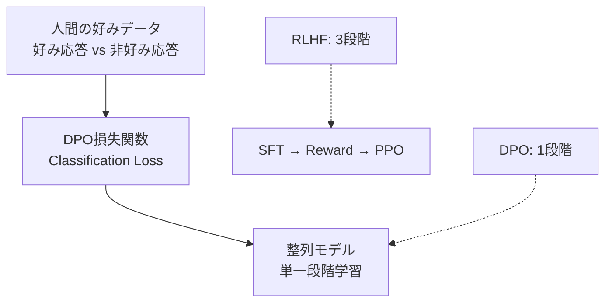
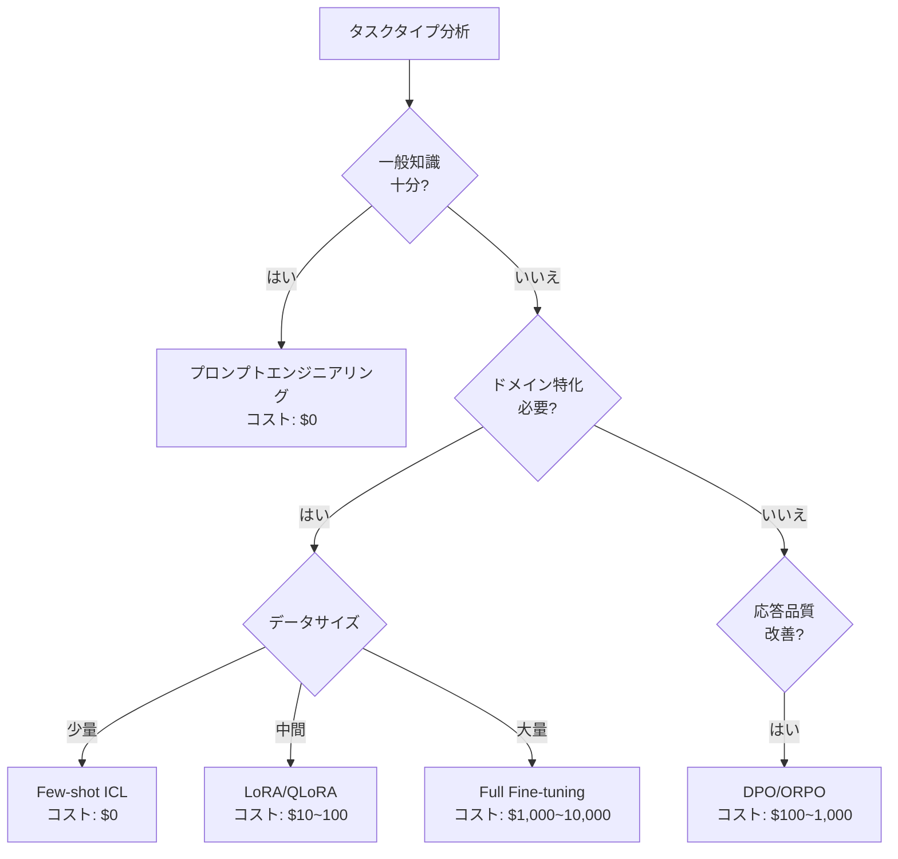

> <strong>シリーズ: DeNA LLMスタディ</strong> (3/5)
>
> 1. [Part 1: LLM基礎と2025年AI現況](/ja/blog/ja/dena-llm-study-part1-fundamentals)
> 2. [Part 2: 構造化出力とマルチLLMパイプライン](/ja/blog/ja/dena-llm-study-part2-structured-output)
> 3. <strong>Part 3: モデル学習方法論</strong> ← 現在の記事
> 4. [Part 4: RAGアーキテクチャと最新トレンド](/ja/blog/ja/dena-llm-study-part4-rag)
> 5. [Part 5: エージェント設計とマルチエージェントオーケストレーション](/ja/blog/ja/dena-llm-study-part5-agent-design)

## はじめに

DeNAのLLMスタディ資料Part 3では、LLMの多様な学習方法論を扱います。事前学習(Pre-training)、ファインチューニング(Fine-tuning)、強化学習(Reinforcement Learning)の違いを理解し、LoRA、QLoRA、DPOのような最新の効率的学習技法の原理と実務適用方法を見ていきます。

本記事はDeNAスタディ資料をベースにしつつ、2025年の最新トレンドと実務経験を追加して執筆しました。

## 事前学習 vs ファインチューニング vs 強化学習

### レストランの比喩で理解する

DeNA資料は3つの学習方式をレストラン運営に例えて説明しています:



**事前学習 (Pre-training)**

- <strong>目的</strong>: 汎用的な言語理解能力の獲得
- <strong>データ</strong>: 数十〜数百TBのWebデータ
- <strong>コスト</strong>: 数億〜数千億円 (GPT-4推定1000億円以上)
- <strong>比喩</strong>: 料理学校ですべての調理技法を学ぶ過程

**ファインチューニング (Fine-tuning)**

- <strong>目的</strong>: 特定タスク/ドメインへの特化
- <strong>データ</strong>: 数千〜数万個のタスク別データ
- <strong>コスト</strong>: 数十万〜数百万円
- <strong>比喩</strong>: イタリアンレストランのパスタ専門家になる過程

**強化学習 (Reinforcement Learning)**

- <strong>目的</strong>: 人間の好みに合わせた応答生成
- <strong>データ</strong>: 数千〜数万個の好みデータ
- <strong>コスト</strong>: 数百万〜数千万円
- <strong>比喩</strong>: 顧客フィードバックを受けて料理の味を調整する過程

### 実務意思決定ガイド



<strong>意思決定チェックリスト</strong>:

1. <strong>プロンプトで解決可能か?</strong> → まずプロンプト最適化を試す
2. <strong>既存モデルがタスクを理解するか?</strong> → はい: 強化学習、いいえ: ファインチューニング
3. <strong>完全に新しいドメインか?</strong> → 事前学習を検討 (ただしコストに注意)

## PEFT: 効率的ファインチューニングの登場

### 従来のファインチューニングの問題点

全パラメータを更新するFull Fine-tuningの限界:

- <strong>メモリ使用量</strong>: 7Bモデルのファインチューニングに80GB+ VRAM必要
- <strong>時間コスト</strong>: 数時間〜数日かかる
- <strong>デプロイ困難</strong>: タスクごとにモデル全体を保存する必要 (数十GB)

### PEFTの核心アイデア

Parameter-Efficient Fine-Tuning (PEFT)は<strong>全パラメータの一部のみを学習</strong>して効率性を最大化します:



<strong>PEFT主要方法論</strong>:

1. <strong>Adapter</strong>: レイヤー間に小さなネットワークを挿入
2. <strong>Prefix Tuning</strong>: 入力に学習可能なprefixを追加
3. <strong>LoRA</strong>: 重み行列を低ランク分解して更新 (最も人気)
4. <strong>Prompt Tuning</strong>: ソフトプロンプトのみを学習

## LoRA: 低ランク適応の原理

### 数学的背景

LoRA(Low-Rank Adaptation)は次のような数学的洞察に基づいています:

```python
# 元の重み更新 (Full Fine-tuning)
W_new = W_original + ΔW  # ΔWは d×d サイズ

# LoRAの低ランク分解
ΔW = B @ A  # Bは d×r、Aは r×d (r << d)

# 実際の適用
output = (W_original + B @ A) @ input
```

<strong>核心アイデア</strong>:

- 事前学習済み重みはすでに多くの情報を含んでいる
- ファインチューニング時に必要な変化量(ΔW)は<strong>低い内在次元(intrinsic dimension)</strong>を持つ
- したがってΔWを2つの小さな行列(B, A)の積で表現可能

### LoRAハイパーパラメータ設定ガイド

```yaml
# LoRA設定例 (HuggingFace PEFT)
lora_config:
  r: 8 # Rank (内在次元)
  lora_alpha: 16 # スケーリングパラメータ
  lora_dropout: 0.1 # Dropout比率
  target_modules: # 適用するレイヤー
    - q_proj # Query projection
    - v_proj # Value projection
  bias: "none" # Bias学習の有無
```

<strong>ハイパーパラメータ選択ガイド</strong>:

| パラメータ                      | 推奨値         | 説明                                                      |
| ------------------------------- | -------------- | --------------------------------------------------------- |
| <strong>r (Rank)</strong>       | 4〜16          | 小さいほどメモリ節約、大きいと表現力増加。ほとんど8が適切 |
| <strong>lora_alpha</strong>     | r〜2r          | 学習率と似た役割。通常rの1〜2倍                           |
| <strong>lora_dropout</strong>   | 0.05〜0.1      | 過学習防止。小さいデータセットは高く設定                  |
| <strong>target_modules</strong> | q_proj, v_proj | AttentionのQuery/Valueが最も効果的                        |

### LoRAの変形

**DoRA (Weight-Decomposed Low-Rank Adaptation, 2024)**

```python
# DoRA: 重みを大きさ(magnitude)と方向(direction)に分解
W = m * (V + B @ A)
# m: 学習可能な大きさ、V: 正規化された重み、B@A: LoRA
```

- <strong>利点</strong>: Full Fine-tuningに近い性能
- <strong>欠点</strong>: LoRAより若干遅い

**GaLore (Gradient Low-Rank Projection, 2024)**

```python
# Gradientを低ランク空間に投影してメモリ節約
gradient_lowrank = project_to_lowrank(gradient)
optimizer.step(gradient_lowrank)
```

- <strong>利点</strong>: オプティマイザの状態も低ランクで圧縮 → メモリ50%追加削減
- <strong>欠点</strong>: 実装の複雑度が高い

**LoRA+ (2024)**

```python
# 学習率を行列A、Bに異なって適用
lr_A = lr * eta  # Aは高い学習率
lr_B = lr        # Bは基本学習率
```

- <strong>利点</strong>: 収束速度1.5〜2倍改善
- <strong>欠点</strong>: ハイパーパラメータチューニング必要

## QLoRA: 量子化とPEFTの結合

### 4bit量子化の革新

QLoRAは<strong>4bit量子化</strong>とLoRAを結合してメモリ使用量を劇的に削減します:



<strong>QLoRA核心技術</strong>:

1. <strong>4bit NormalFloat (NF4)</strong>: 正規分布に最適化された量子化
2. <strong>Double Quantization</strong>: 量子化定数も量子化
3. <strong>Paged Optimizers</strong>: CPU-GPUメモリ自動管理

### QLoRA実務ワークフロー

```python
from transformers import AutoModelForCausalLM, BitsAndBytesConfig
from peft import LoraConfig, get_peft_model

# 1. 4bit量子化設定
bnb_config = BitsAndBytesConfig(
    load_in_4bit=True,
    bnb_4bit_quant_type="nf4",      # NormalFloat 4bit
    bnb_4bit_compute_dtype="float16", # 計算はfloat16
    bnb_4bit_use_double_quant=True,   # Double quantization
)

# 2. モデルロード
model = AutoModelForCausalLM.from_pretrained(
    "meta-llama/Llama-2-7b-hf",
    quantization_config=bnb_config,
    device_map="auto"  # 自動デバイス割り当て
)

# 3. LoRA設定
lora_config = LoraConfig(
    r=8,
    lora_alpha=16,
    target_modules=["q_proj", "v_proj"],
    lora_dropout=0.1,
    bias="none",
    task_type="CAUSAL_LM"
)

# 4. PEFTモデル生成
model = get_peft_model(model, lora_config)

# 5. 学習可能パラメータ確認
trainable_params = sum(p.numel() for p in model.parameters() if p.requires_grad)
print(f"訓練可能パラメータ: {trainable_params:,} ({trainable_params/7e9*100:.2f}%)")
# 出力: 訓練可能パラメータ: 4,194,304 (0.06%)
```

<strong>QLoRA実務ヒント</strong>:

- <strong>GPUメモリ</strong>: 7BモデルをRTX 3090 1枚(24GB)で学習可能
- <strong>バッチサイズ</strong>: Gradient accumulation活用 (例: batch_size=1, gradient_accumulation_steps=16)
- <strong>学習時間</strong>: Full Fine-tuning比1.5〜2倍遅い (量子化オーバーヘッド)

## RLHFとDPO: 人間の好み学習

### RLHFの複雑性

Reinforcement Learning from Human Feedback (RLHF)は強力ですが複雑です:



<strong>RLHFの問題点</strong>:

1. <strong>3段階パイプライン</strong>: SFT → Reward Model → RL最適化
2. <strong>不安定性</strong>: PPOはハイパーパラメータに敏感
3. <strong>高コスト</strong>: リワードモデル学習 + RLサンプリング
4. <strong>デバッグ困難</strong>: RL収束失敗時、原因把握が難解

### DPO: 直接好み最適化

Direct Preference Optimization (DPO)は<strong>リワードモデルなしで</strong>人間の好みを直接学習します:



<strong>DPO損失関数</strong>:

```python
# DPO Loss (数式簡略化)
loss = -log(σ(β * (log π(y_w|x) - log π(y_l|x))))

# y_w: 好み応答 (chosen)
# y_l: 非好み応答 (rejected)
# β: ハイパーパラメータ (一般的に0.1)
# σ: Sigmoid関数
```

<strong>DPOの利点</strong>:

- <strong>シンプルさ</strong>: リワードモデル不要、1回の学習で完了
- <strong>安定性</strong>: Classification lossはPPOより安定
- <strong>効率性</strong>: メモリと時間50%削減
- <strong>性能</strong>: RLHFと同等またはより良い性能

### DPO実務実装

```python
from trl import DPOTrainer

# DPO学習設定
training_args = TrainingArguments(
    output_dir="./dpo_model",
    per_device_train_batch_size=4,
    learning_rate=5e-5,
    num_train_epochs=3,
    gradient_accumulation_steps=4,
)

# DPO Trainer初期化
dpo_trainer = DPOTrainer(
    model=model,
    args=training_args,
    train_dataset=preference_dataset,  # (prompt, chosen, rejected)形式
    tokenizer=tokenizer,
    beta=0.1,  # DPOハイパーパラメータ
)

# 学習実行
dpo_trainer.train()
```

<strong>好みデータ形式</strong>:

```python
preference_dataset = [
    {
        "prompt": "Pythonでリストをソートする方法は?",
        "chosen": "sorted()関数を使えば良いです: sorted([3,1,2])",
        "rejected": "ただsort()を使えばいいよ"
    },
    # ...
]
```

### DPOの変形

**ORPO (Odds Ratio Preference Optimization, 2024)**

- SFTと好み学習を<strong>同時に</strong>実行
- 別途のSFT段階不要
- 学習時間さらに短縮

**IPO (Identity Preference Optimization, 2024)**

- Referenceモデルなしで学習可能
- メモリ使用量さらに削減

**KTO (Kahneman-Tversky Optimization, 2024)**

- ペア比較データの代わりに<strong>個別フィードバック</strong>使用 (良い/悪い)
- データ収集コスト大幅削減

## タスク別学習方法選択ガイド

### コスト-性能トレードオフ



### 実務推奨事項

**1. チャットボット/対話型システム**

```
プロンプト → SFT (LoRA) → DPO
```

- ドメイン知識注入: LoRAで効率的ファインチューニング
- 対話品質改善: DPOで好み整列

**2. 文書分類/タグ付け**

```
プロンプト → LoRA (選択的)
```

- ほとんどプロンプトで十分
- 極限性能必要時LoRA追加

**3. コード生成**

```
プロンプト → SFT (QLoRA) → RLHF/DPO
```

- コードスタイル学習: QLoRAで大量コード学習
- 実行可能性改善: RLHFでコンパイルエラーペナルティ

**4. 要約/翻訳**

```
プロンプト → DPO
```

- 基本モデルで十分な場合が多い
- スタイル調整: DPOで望むトーン/長さ学習

### メモリ要件比較

| 方法                              | 7Bモデル              | 13Bモデル             | 70Bモデル              |
| --------------------------------- | --------------------- | --------------------- | ---------------------- |
| <strong>Full Fine-tuning</strong> | 80GB                  | 160GB                 | 800GB+                 |
| <strong>LoRA</strong>             | 40GB                  | 80GB                  | 400GB                  |
| <strong>QLoRA</strong>            | <strong>24GB</strong> | <strong>40GB</strong> | <strong>200GB</strong> |

<strong>コンシューマーGPU活用可能性</strong>:

- <strong>RTX 4090 (24GB)</strong>: QLoRAで7B、LoRAで3B学習可能
- <strong>RTX 3090 (24GB)</strong>: QLoRAで7B学習可能
- <strong>RTX 4060 Ti (16GB)</strong>: QLoRAで3B学習可能

## 示唆点と所感

### 民主化されるLLMファインチューニング

DeNA資料を通じて最も印象的だった点は、<strong>LLMファインチューニングがもはや大企業の専有物ではない</strong>ということです。QLoRAとDPOの登場により:

- 24GB VRAMで7Bモデルファインチューニング可能
- 数百ドル予算でドメイン特化モデル構築可能
- 複雑なRLHFの代わりに簡単なDPO活用可能

### 効率性のパラダイムシフト

最近、<strong>効率性(Efficiency)</strong>が話題になっています:

- LoRA: パラメータ0.1%学習でFull Fine-tuningの98%性能
- QLoRA: メモリ1/4で同等性能
- DPO: RLHF複雑度1/3で同等性能

これは単純な最適化ではなく<strong>新しい数学的洞察</strong>の結果です。低ランク仮説、量子化理論、暗黙的リワードモデルなど学界の研究が実務に迅速に移転されています。

### 実務者への教訓

1. <strong>プロンプトから始める</strong>: 80%はプロンプトで解決可能
2. <strong>LoRAを基本に</strong>: ファインチューニング必要時まずLoRAを試す
3. <strong>QLoRAでリソース節約</strong>: 性能差わずか、メモリ4倍節約
4. <strong>DPOで整列</strong>: RLHFはレガシー、DPOが新しい標準
5. <strong>測定して改善する</strong>: ベンチマークスコアより実際タスク性能に集中

### 2025年展望

次のようなトレンドが予想されます:

- <strong>より小さく強力なモデル</strong>: Phi-3、Gemma 2のような小型モデルの躍進
- <strong>オンデバイスファインチューニング</strong>: スマートフォンでもファインチューニング可能な時代
- <strong>自動化されたハイパーパラメータチューニング</strong>: AutoML for LLM Fine-tuning
- <strong>マルチモーダルPEFT</strong>: 画像+テキスト同時ファインチューニング

## 参考資料

### 論文

- [LoRA: Low-Rank Adaptation of Large Language Models](https://arxiv.org/abs/2106.09685) (Microsoft, 2021)
- [QLoRA: Efficient Finetuning of Quantized LLMs](https://arxiv.org/abs/2305.14314) (University of Washington, 2023)
- [Direct Preference Optimization](https://arxiv.org/abs/2305.18290) (Stanford, 2023)
- [DoRA: Weight-Decomposed Low-Rank Adaptation](https://arxiv.org/abs/2402.09353) (NVIDIA, 2024)
- [GaLore: Memory-Efficient LLM Training](https://arxiv.org/abs/2403.03507) (CMU, 2024)

### ライブラリ

- [HuggingFace PEFT](https://github.com/huggingface/peft) - LoRA、QLoRA実装
- [HuggingFace TRL](https://github.com/huggingface/trl) - RLHF、DPO実装
- [Unsloth](https://github.com/unslothai/unsloth) - 2倍速いLoRA学習

### 実習資料

- [QLoRA Fine-tuning Tutorial](https://colab.research.google.com/drive/1VoYNfYDKcKRQRor98Zbf2-9VQTtGJ24k)
- [DPO Training Example](https://huggingface.co/docs/trl/dpo_trainer)
- [一冊で完結する実戦LLMファインチューニング](https://product.kyobobook.co.kr/detail/S000214934825) (教保文庫)

---

<strong>次回予告</strong>: "DeNA LLMスタディPart 4: プロダクション展開とモニタリング"では、ファインチューニングしたモデルを実際のサービスに展開する戦略、モニタリング方法、コスト最適化技法を扱う予定です。
