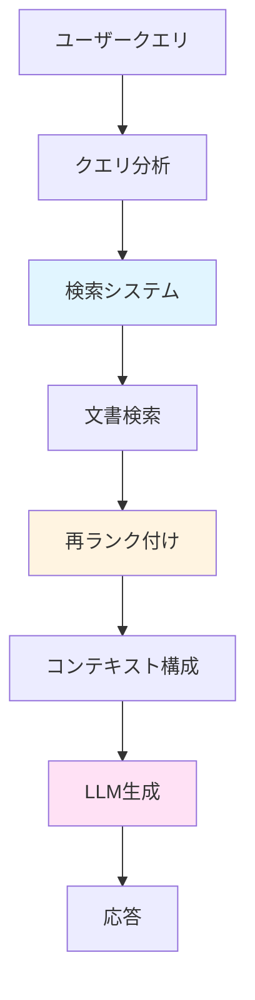
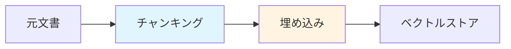
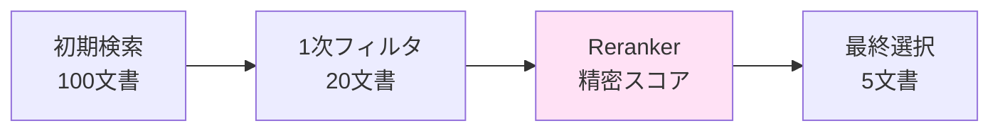
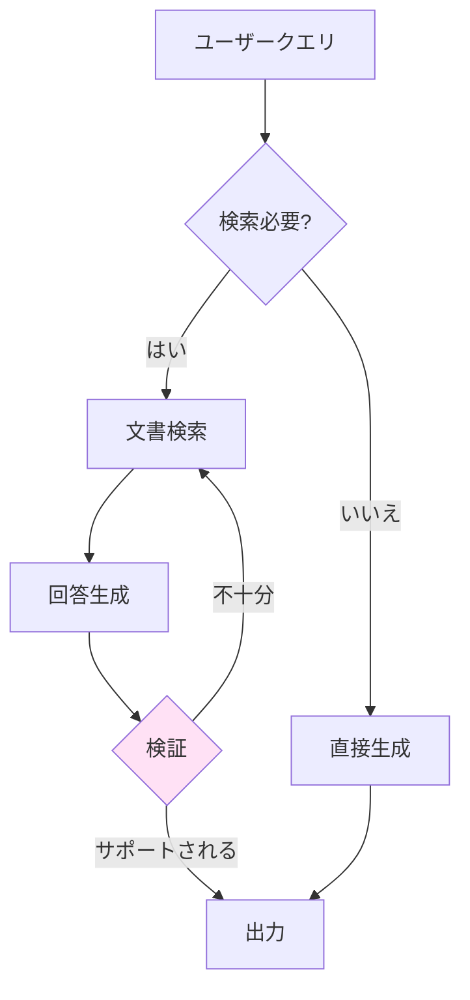
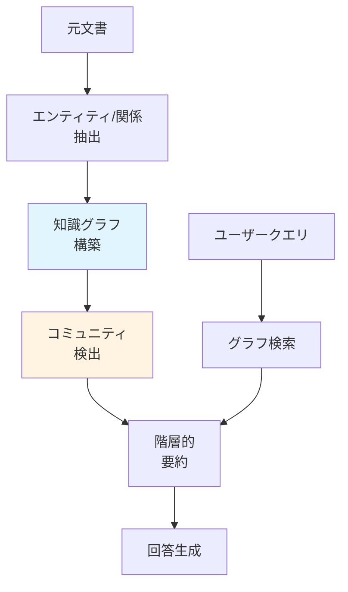
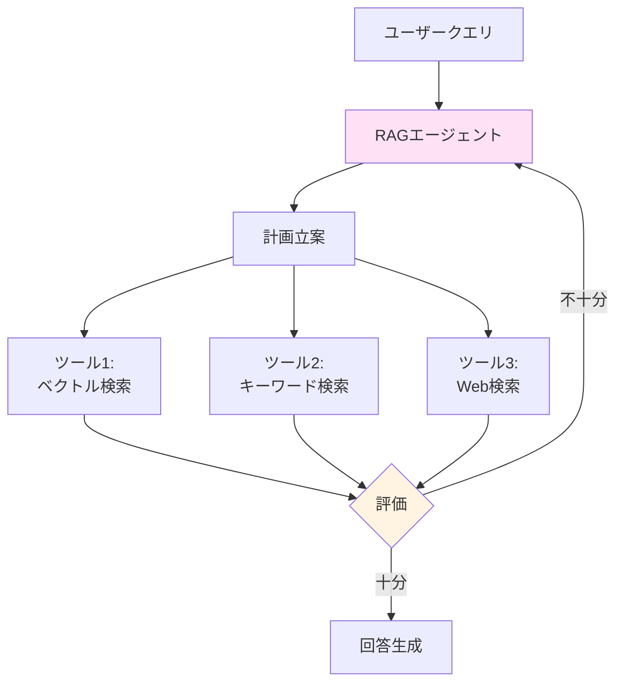
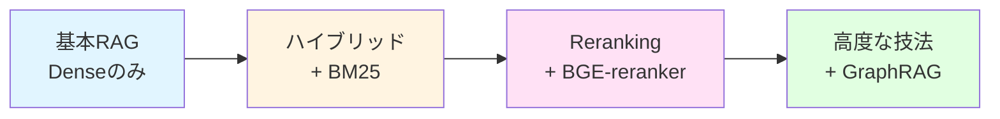
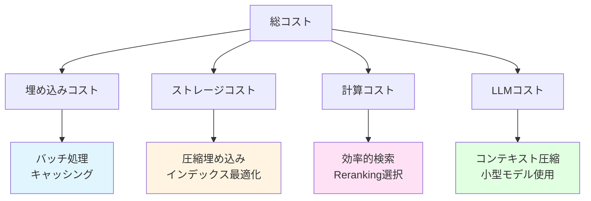

> <strong>シリーズ: DeNA LLMスタディ</strong> (4/5)
>
> 1. [Part 1: LLM基礎と2025年AI現況](/ja/blog/ja/dena-llm-study-part1-fundamentals)
> 2. [Part 2: 構造化出力とマルチLLMパイプライン](/ja/blog/ja/dena-llm-study-part2-structured-output)
> 3. [Part 3: モデル学習方法論](/ja/blog/ja/dena-llm-study-part3-model-training)
> 4. <strong>Part 4: RAGアーキテクチャと最新トレンド</strong> ← 現在の記事
> 5. [Part 5: エージェント設計とマルチエージェントオーケストレーション](/ja/blog/ja/dena-llm-study-part5-agent-design)

## 概要

DeNAのLLMスタディシリーズPart 4では、RAG(Retrieval-Augmented Generation)の核心概念から最新トレンドまでを扱います。単純なプロンプトエンジニアリングを超えて、外部知識を効果的に活用するシステム設計方法を学習しました。

この記事では、DeNAスタディ資料を基にRAGの全体アーキテクチャ、ハイブリッド検索戦略、Reranking技法、そしてGraphRAGやAgentic RAGのような最新の発展方向を整理します。

## コンテキストエンジニアリング: LLMはインターフェース

DeNAスタディで強調する核心概念は、<strong>「LLMはインターフェースに過ぎず、検索システムが本当の核心」</strong>という点です。

### プロンプトエンジニアリングを超えて

従来のプロンプトエンジニアリングは、LLMにより良い指示を出すことに集中していました。しかし、RAGシステムでは:

- <strong>検索品質</strong>が応答品質を決定します
- <strong>コンテキスト選択</strong>が幻覚(hallucination)を防ぎます
- <strong>システム設計</strong>が性能とコストを最適化します



### RAGの核心価値

1. <strong>最新情報活用</strong>: モデル学習後の情報も使用可能
2. <strong>ドメイン知識統合</strong>: 企業内部文書、専門知識の活用
3. <strong>幻覚防止</strong>: 根拠のある応答生成
4. <strong>追跡可能性</strong>: 出典提供により信頼性確保

## RAGアーキテクチャ全体構成

DeNAスタディでは、RAGを次の5段階に区分します。

### 1. 文書インデクシング (Indexing)



<strong>チャンキング戦略</strong>:

- <strong>固定サイズ</strong>: 512トークン単位で分割
- <strong>意味ベース</strong>: 段落、セクション単位で分割
- <strong>オーバーラップ</strong>: 50〜100トークン重複でコンテキスト維持

<strong>埋め込み選択</strong>:

- <strong>OpenAI text-embedding-3</strong>: 汎用性、API利便性
- <strong>Cohere Embed v3</strong>: 多言語サポート、圧縮埋め込み
- <strong>BGEシリーズ</strong>: オープンソース、カスタマイズ可能

### 2. クエリ拡張 (Query Expansion)

ユーザーの短い質問をより豊かにする技法:

```python
# HyDE (Hypothetical Document Embeddings)
query = "RAGの性能改善方法は?"

# 1. LLMが仮想回答を生成
hypothetical_answer = llm.generate(f"""
次の質問に対する詳細な回答を作成してください:
{query}
""")

# 2. 仮想回答を埋め込んで検索
embedding = embed_model.encode(hypothetical_answer)
results = vector_store.search(embedding, top_k=5)
```

<strong>クエリ拡張技法</strong>:

- <strong>HyDE</strong>: 仮想文書生成後検索
- <strong>Multi-Query</strong>: 複数の観点のクエリ生成
- <strong>Query Decomposition</strong>: 複雑なクエリをサブクエリに分解

### 3. ハイブリッド検索 (Hybrid Search)

DeNAスタディの核心強調点: <strong>BM25 + Dense + Sparse組み合わせ</strong>

```python
# ハイブリッド検索実装例
def hybrid_search(query, alpha=0.5):
    # 1. BM25 (キーワードベース)
    bm25_scores = bm25_retriever.search(query, top_k=20)

    # 2. Dense Vector (意味ベース)
    dense_embedding = dense_model.encode(query)
    dense_scores = vector_store.search(dense_embedding, top_k=20)

    # 3. Sparse Vector (重要トークンベース)
    sparse_embedding = splade_model.encode(query)
    sparse_scores = sparse_store.search(sparse_embedding, top_k=20)

    # 4. スコア結合 (加重平均)
    combined_scores = (
        alpha * bm25_scores +
        (1 - alpha) * 0.7 * dense_scores +
        (1 - alpha) * 0.3 * sparse_scores
    )

    return combined_scores.top_k(10)
```

<strong>各方法の特徴</strong>:

| 方法                    | 強み                         | 弱み               |
| ----------------------- | ---------------------------- | ------------------ |
| <strong>BM25</strong>   | 正確なキーワードマッチ、高速 | 意味理解不足       |
| <strong>Dense</strong>  | 意味的類似度捕捉             | キーワード漏れ可能 |
| <strong>Sparse</strong> | 重要トークン強調             | 計算コスト高       |

### 4. Reranking (再ランク付け)

検索された文書をより精緻に再整列する段階:



<strong>Rerankingモデル選択</strong>:

1. <strong>ColBERT (Late Interaction)</strong>
   - クエリと文書のトークン別類似度計算
   - 速度と精度のバランス
   - 利点: 高速で効果的

2. <strong>Cross-Encoder</strong>
   - クエリと文書を一緒にエンコード
   - 最高の精度
   - 欠点: 遅い (すべてのペア計算が必要)

3. <strong>BGE-reranker</strong>
   - オープンソースCross-Encoder
   - 多言語サポート
   - 実務で広く使用

```python
# BGE-reranker使用例
from FlagEmbedding import FlagReranker

reranker = FlagReranker('BAAI/bge-reranker-large', use_fp16=True)

# 検索された文書を再ランク付け
pairs = [[query, doc.text] for doc in retrieved_docs]
scores = reranker.compute_score(pairs)

# スコア基準でソート
reranked_docs = sorted(
    zip(retrieved_docs, scores),
    key=lambda x: x[1],
    reverse=True
)[:5]
```

### 5. 生成 (Generation)

最終的に選択されたコンテキストでLLM応答生成:

```python
def generate_with_citations(query, top_docs):
    # コンテキスト構成
    context = "\n\n".join([
        f"[{i+1}] {doc.text}\n出典: {doc.source}"
        for i, doc in enumerate(top_docs)
    ])

    prompt = f"""
次のコンテキストに基づいて質問に答えてください。
必ず出典番号を明示してください (例: [1], [2])。

コンテキスト:
{context}

質問: {query}

回答:"""

    response = llm.generate(prompt)
    return response
```

## Embeddingモデル比較

DeNAスタディで扱った主要埋め込みモデル:

### OpenAI text-embedding-3

```python
from openai import OpenAI

client = OpenAI()

# Smallモデル (安価、高速)
response = client.embeddings.create(
    model="text-embedding-3-small",
    input="Your text here"
)
embedding_small = response.data[0].embedding  # 1536次元

# Largeモデル (高品質)
response = client.embeddings.create(
    model="text-embedding-3-large",
    input="Your text here",
    dimensions=3072  # 最大3072次元
)
embedding_large = response.data[0].embedding
```

<strong>特徴</strong>:

- APIベースで使用簡便
- 汎用性高い
- コスト効率的 (small: $0.02/1Mトークン)

### Cohere Embed v3

```python
import cohere

co = cohere.Client('your-api-key')

# 多言語埋め込み
response = co.embed(
    texts=["韓国語テキスト", "English text", "日本語テキスト"],
    model="embed-multilingual-v3.0",
    input_type="search_query"  # or "search_document"
)

embeddings = response.embeddings  # 1024次元
```

<strong>特徴</strong>:

- 100以上の言語サポート
- 入力タイプ別最適化 (query vs document)
- 圧縮埋め込みサポート (128〜1024次元)

### BGE (Beijing Academy of AI) シリーズ

```python
from FlagEmbedding import FlagModel

# BGE-M3: 多機能埋め込み
model = FlagModel('BAAI/bge-m3', use_fp16=True)

# Dense埋め込み
dense_vecs = model.encode(
    ["Query text"],
    return_dense=True,
    return_sparse=False,
    return_colbert_vecs=False
)

# Sparse埋め込み (SPLADE-like)
sparse_vecs = model.encode(
    ["Query text"],
    return_dense=False,
    return_sparse=True,
    return_colbert_vecs=False
)

# ColBERTスタイルmulti-vector
colbert_vecs = model.encode(
    ["Query text"],
    return_dense=False,
    return_sparse=False,
    return_colbert_vecs=True
)
```

<strong>特徴</strong>:

- オープンソース (商用利用可能)
- 3つの検索方法すべてサポート (Dense, Sparse, Multi-vector)
- 長いコンテキストサポート (最大8192トークン)
- 100以上の言語サポート

## Grounding: 幻覚防止戦略

RAGの最も重要な目標の一つは<strong>幻覚(hallucination)防止</strong>です。

### 1. 引用強制 (Citation Enforcement)

```python
system_prompt = """
あなたは提供されたコンテキストのみを使用して回答するAIです。
必ず次のルールに従ってください:

1. すべての主張に出典番号を表示 [1], [2] など
2. コンテキストにない情報は「提供された情報にありません」と明示
3. 確実でなければ「不確実です」と表現
4. 推測せず事実のみ伝達
"""
```

### 2. 不確実性表現

```python
def generate_with_confidence(query, context):
    prompt = f"""
コンテキスト: {context}

質問: {query}

次の形式で回答してください:
- 回答: [あなたの回答]
- 確信度: [高/中/低]
- 根拠: [コンテキストの該当部分を引用]
"""
    return llm.generate(prompt)
```

### 3. Self-RAG: 自己検証

Self-RAGは、LLMが自ら検索の必要性を判断し、応答を検証します。



```python
def self_rag(query):
    # 1. 検索必要性判断
    need_retrieval = llm.classify(
        f"次の質問に答えるには外部情報が必要ですか? {query}"
    )

    if need_retrieval:
        # 2. 文書検索
        docs = retriever.search(query)

        # 3. 回答生成
        response = llm.generate_with_context(query, docs)

        # 4. 回答検証
        is_supported = llm.verify(
            f"次の回答がコンテキストで十分に裏付けられていますか? 回答: {response}"
        )

        if not is_supported:
            # 再検索またはより多くの文書が必要
            return self_rag(query)  # 再帰呼び出し
    else:
        response = llm.generate(query)

    return response
```

## 最新RAGトレンド

DeNAスタディで扱った最新RAG発展方向:

### 1. GraphRAG

Microsoftが2024年に公開した知識グラフベースのRAG:



<strong>GraphRAGの利点</strong>:

- <strong>関係ベース推論</strong>: エンティティ間の接続活用
- <strong>多段階推論</strong>: 「AのBを知っているC」のような複雑な質問処理
- <strong>全体的文脈把握</strong>: 文書間の接続理解

<strong>使用事例</strong>:

- 企業組織図ベースの質疑応答
- 法律文書の判例参照
- 学術論文の引用関係分析

### 2. Agentic RAG

最近「エージェントの時代」を迎えて登場した自律的RAG:



<strong>従来のRAG vs Agentic RAG</strong>:

| 従来のRAG                | Agentic RAG      |
| ------------------------ | ---------------- |
| 単一検索段階             | 反復的検索       |
| 固定パイプライン         | 動的ツール選択   |
| ユーザークエリにのみ反応 | 計画立案と実行   |
| 検索失敗時に終了         | 再試行と戦略変更 |

<strong>実装例</strong> (LangGraph):

```python
from langgraph.graph import StateGraph, END
from langchain.tools import Tool

# RAGエージェント定義
class RAGAgent:
    def __init__(self):
        self.tools = [
            Tool(name="vector_search", func=self.vector_search),
            Tool(name="keyword_search", func=self.keyword_search),
            Tool(name="web_search", func=self.web_search)
        ]

    def plan(self, query):
        # LLMが検索戦略を決定
        plan = self.llm.generate(f"""
        次の質問に答えるための検索戦略を立案してください:
        {query}

        使用可能なツール: {[tool.name for tool in self.tools]}
        """)
        return plan

    def execute(self, query):
        max_iterations = 3
        context = []

        for i in range(max_iterations):
            # 計画立案
            plan = self.plan(query)

            # ツール実行
            results = self.execute_tools(plan)
            context.extend(results)

            # 十分な情報か評価
            is_sufficient = self.evaluate(query, context)

            if is_sufficient:
                break

        # 最終回答生成
        return self.generate_response(query, context)
```

### 3. Long RAG

長いコンテキスト処理のためのRAG変形:

<strong>問題</strong>: 既存RAGは制限されたコンテキストウィンドウ(4K〜8Kトークン)内で動作

<strong>解決策</strong>:

1. <strong>階層的検索</strong>: 章 → セクション → 段落の順に絞り込み
2. <strong>ストリーミングコンテキスト</strong>: 必要な部分のみ順次ロード
3. <strong>要約ベース検索</strong>: 長い文書は要約でまず検索

```python
def long_rag(query, long_documents):
    # 1段階: 文書要約で候補選択
    summaries = [doc.summary for doc in long_documents]
    candidate_docs = vector_search(query, summaries, top_k=3)

    # 2段階: 選択された文書内の詳細検索
    detailed_chunks = []
    for doc in candidate_docs:
        chunks = chunk_document(doc, chunk_size=512)
        relevant_chunks = vector_search(query, chunks, top_k=5)
        detailed_chunks.extend(relevant_chunks)

    # 3段階: 最終コンテキストで回答生成
    return generate_response(query, detailed_chunks)
```

### 4. マルチモーダルRAG (ColPali)

テキストだけでなく、画像、表、図を一緒に検索:

<strong>ColPali</strong>: 文書ページ全体を画像として埋め込み

```python
from colpali import ColPali

# 文書ページ画像埋め込み
model = ColPali()
page_embeddings = model.encode_images([
    "doc1_page1.png",
    "doc1_page2.png",
    "doc2_page1.png"
])

# テキストクエリで画像検索
query_embedding = model.encode_text("財務諸表の純利益は?")
similar_pages = vector_search(query_embedding, page_embeddings)

# 検索されたページ画像をVision LLMに渡す
response = vision_llm.generate_with_image(
    query="財務諸表の純利益は?",
    images=similar_pages
)
```

<strong>マルチモーダルRAGの利点</strong>:

- <strong>レイアウト保存</strong>: PDFの表、チャート原本維持
- <strong>OCR不要</strong>: 画像のまま処理
- <strong>視覚的コンテキスト</strong>: 図、グラフ活用

## 実践適用の示唆

DeNAスタディを通じて得た実務適用インサイト:

### 1. 段階的最適化戦略



1. <strong>第1段階: 基本RAG</strong>
   - Denseベクトル検索のみ使用
   - 高速プロトタイプ構築
   - ベースライン性能測定

2. <strong>第2段階: ハイブリッド検索</strong>
   - BM25追加でキーワードマッチ改善
   - 10〜20%性能向上期待

3. <strong>第3段階: Reranking</strong>
   - BGE-rerankerで精度向上
   - 追加15〜25%性能改善

4. <strong>第4段階: 高度な技法</strong>
   - ドメインに応じてGraphRAG、Agentic RAG適用
   - 複雑な質問処理能力強化

### 2. 評価メトリクス設定

RAGシステムの性能を測定する主要指標:

```python
# 検索品質指標
def evaluate_retrieval(queries, ground_truth):
    metrics = {
        'recall@k': [],  # 正解文書k個内包含率
        'mrr': [],       # Mean Reciprocal Rank
        'ndcg': []       # Normalized Discounted Cumulative Gain
    }

    for query, truth in zip(queries, ground_truth):
        retrieved = retriever.search(query, top_k=10)

        # Recall@10
        recall = len(set(retrieved) & set(truth)) / len(truth)
        metrics['recall@k'].append(recall)

        # MRR
        for i, doc in enumerate(retrieved):
            if doc in truth:
                metrics['mrr'].append(1 / (i + 1))
                break

    return {k: sum(v) / len(v) for k, v in metrics.items()}

# 生成品質指標
def evaluate_generation(responses, references):
    from ragas import evaluate

    return evaluate(
        responses=responses,
        references=references,
        metrics=['answer_relevancy', 'faithfulness', 'context_precision']
    )
```

<strong>目標数値</strong> (DeNAスタディ推奨):

- <strong>Recall@10</strong>: 0.8以上 (正解文書の80%以上検索)
- <strong>MRR</strong>: 0.6以上 (平均的に上位2個内に正解)
- <strong>Answer Relevancy</strong>: 0.9以上
- <strong>Faithfulness</strong>: 0.95以上 (幻覚最小化)

### 3. コスト最適化

RAGシステムのコスト構造:



<strong>コスト削減戦略</strong>:

1. <strong>埋め込み最適化</strong>

   ```python
   # バッチ処理でAPI呼び出し削減
   batch_size = 100
   embeddings = []
   for i in range(0, len(texts), batch_size):
       batch = texts[i:i+batch_size]
       embeddings.extend(embed_model.encode(batch))

   # 埋め込みキャッシング
   import pickle
   with open('embeddings_cache.pkl', 'wb') as f:
       pickle.dump(embeddings, f)
   ```

2. <strong>コンテキスト圧縮</strong>

   ```python
   def compress_context(docs, max_tokens=2000):
       # 重要な文のみ抽出
       sentences = extract_sentences(docs)
       scores = compute_relevance(sentences, query)

       # トークン制限内で最も関連性の高い文を選択
       selected = []
       total_tokens = 0
       for sent, score in sorted(zip(sentences, scores),
                                  key=lambda x: x[1],
                                  reverse=True):
           sent_tokens = count_tokens(sent)
           if total_tokens + sent_tokens <= max_tokens:
               selected.append(sent)
               total_tokens += sent_tokens

       return " ".join(selected)
   ```

3. <strong>キャッシング戦略</strong>

   ```python
   from functools import lru_cache

   @lru_cache(maxsize=1000)
   def cached_retrieval(query_hash):
       return retriever.search(query_hash)

   # 使用
   query_hash = hash(query)
   results = cached_retrieval(query_hash)
   ```

### 4. セキュリティとプライバシー

RAGシステムのセキュリティ考慮事項:

<strong>データ分離</strong>:

```python
def secure_rag(query, user_id):
    # ユーザー別文書アクセス権限確認
    allowed_docs = get_user_documents(user_id)

    # フィルタリングされたベクトルストア検索
    results = vector_store.search(
        query,
        filter={"doc_id": {"$in": allowed_docs}}
    )

    return results
```

<strong>機密情報フィルタリング</strong>:

```python
import re

def sanitize_response(response):
    # 個人情報パターン削除
    patterns = {
        'email': r'\b[A-Za-z0-9._%+-]+@[A-Za-z0-9.-]+\.[A-Z|a-z]{2,}\b',
        'phone': r'\b\d{2,4}[-.]?\d{2,4}[-.]?\d{4}\b',
        'mynumber': r'\b\d{4}[-]?\d{4}[-]?\d{4}\b'
    }

    for name, pattern in patterns.items():
        response = re.sub(pattern, f'[{name.upper()}_REDACTED]', response)

    return response
```

## 感想と次のステップ

DeNAのLLMスタディPart 4を通じて、RAGが単純な「検索後生成」ではなく、精密なシステム設計が必要なエンジニアリング領域であることを深く理解するようになりました。

### 核心インサイト

1. <strong>検索が核心</strong>: LLMはインターフェース、本当の価値は正確なコンテキスト検索
2. <strong>ハイブリッドアプローチ</strong>: Dense、Sparse、BM25を組み合わせて最高性能
3. <strong>再ランク付け必須</strong>: 初期検索結果を精密にフィルタリング
4. <strong>幻覚防止</strong>: 引用、検証、Self-RAGで信頼性確保
5. <strong>進化するパラダイム</strong>: GraphRAG、Agentic RAGへ継続的に発展中

### 実務適用計画

今回の学習を基に、次のような改善を計画しています:

1. <strong>ハイブリッド検索導入</strong>
   - 現在Denseベクトルのみ使用 → BM25追加
   - BGE-M3モデルで多機能埋め込み適用

2. <strong>Rerankingパイプライン構築</strong>
   - BGE-reranker-large統合
   - 2段階検索 (100個 → 20個 → 5個)

3. <strong>評価体系確立</strong>
   - Recall@10、MRR、NDCG測定
   - A/Bテストフレームワーク構築

4. <strong>Agentic RAG実験</strong>
   - LangGraphで動的検索戦略
   - 複雑な多段階質問処理

### 次の学習: Part 5 - プロダクション展開とモニタリング

DeNAスタディシリーズの最後のPart 5では:

- LLMシステムのプロダクション展開戦略
- 性能モニタリングとログ記録
- A/Bテストと継続的改善
- コスト最適化と拡張性

を扱う予定です。

## 参考資料

### 論文とサーベイ

- [Retrieval-Augmented Generation for LLMs: A Survey](https://arxiv.org/abs/2312.10997) (2023)
- [RAG and Beyond: A Comprehensive Survey](https://arxiv.org/abs/2409.14924) (2024)
- [Self-RAG: Learning to Retrieve, Generate, and Critique](https://arxiv.org/abs/2310.11511) (2023)

### オープンソースプロジェクト

- [FlagEmbedding (BGEモデル)](https://github.com/FlagOpen/FlagEmbedding)
- [LangChain RAGチュートリアル](https://python.langchain.com/docs/tutorials/rag/)
- [LlamaIndex](https://github.com/run-llama/llama_index)

### ツールとプラットフォーム

- [Weaviate (ハイブリッド検索)](https://weaviate.io/)
- [Qdrant (ベクトルデータベース)](https://qdrant.tech/)
- [Pinecone (マネージドベクトルDB)](https://www.pinecone.io/)

### 追加学習資料

- [RAGFlow Blog: RAG in 2025](https://ragflow.io/blog/rag-at-the-crossroads-mid-2025-reflections-on-ai-evolution)
- [Advanced RAG Variants Explained](https://www.glukhov.org/post/2025/11/advanced-rag-variants-longrag-self-rag-graphrag/)
- [The Ultimate RAG Blueprint 2025/2026](https://langwatch.ai/blog/the-ultimate-rag-blueprint-everything-you-need-to-know-about-rag-in-2025-2026)

---

<strong>シリーズ続き</strong>: [Part 5: エージェント設計とマルチエージェントオーケストレーション](/ja/blog/ja/dena-llm-study-part5-agent-design)
