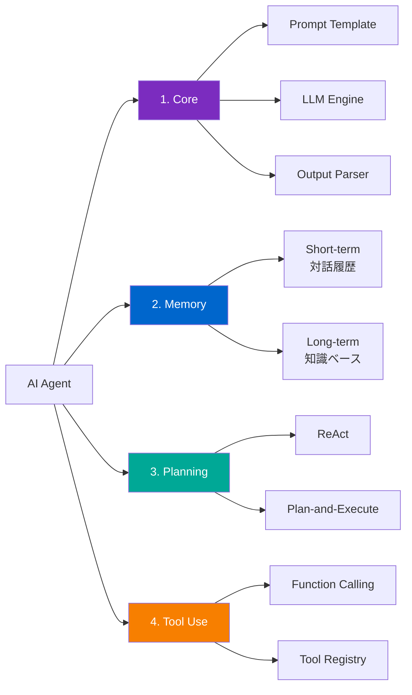
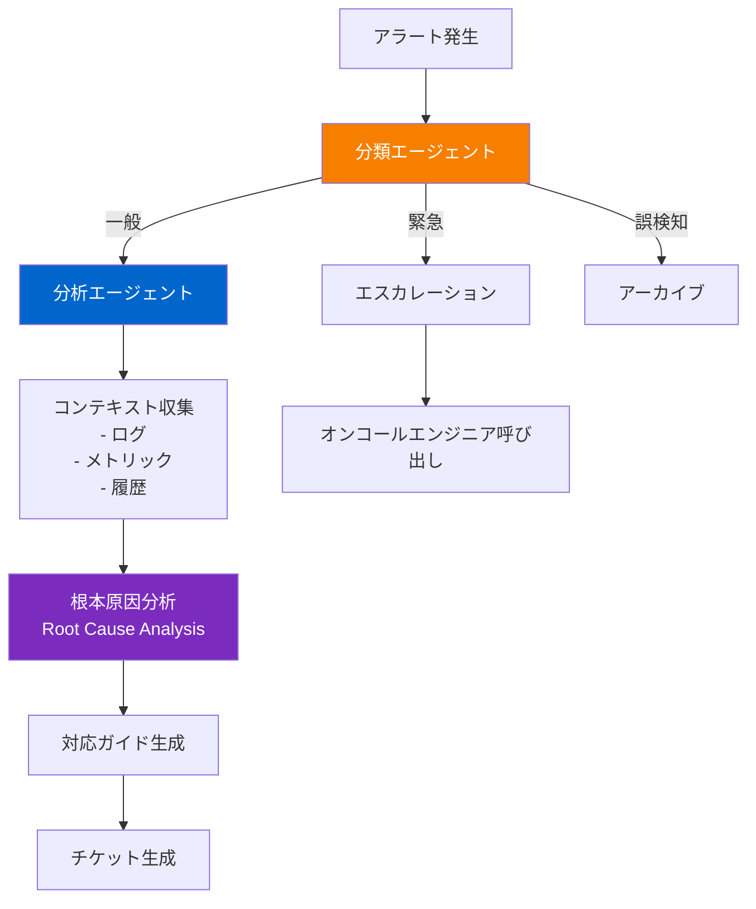

> <strong>シリーズ: DeNA LLMスタディ</strong> (5/5 - 最終回)
>
> 1. [Part 1: LLM基礎と2025年AI現況](/ja/blog/ja/dena-llm-study-part1-fundamentals)
> 2. [Part 2: 構造化出力とマルチLLMパイプライン](/ja/blog/ja/dena-llm-study-part2-structured-output)
> 3. [Part 3: モデル学習方法論](/ja/blog/ja/dena-llm-study-part3-model-training)
> 4. [Part 4: RAGアーキテクチャと最新トレンド](/ja/blog/ja/dena-llm-study-part4-rag)
> 5. <strong>Part 5: エージェント設計とマルチエージェントオーケストレーション</strong> ← 現在の記事

## 概要

DeNA LLMスタディシリーズの最終編です。Part 5では、LLMを活用した<strong>エージェント設計</strong>と<strong>マルチエージェントオーケストレーション</strong>を扱います。単純なプロンプトエンジニアリングを超えて、自律的に動作するエージェントシステムを構築する方法と、実務で考慮すべきコスト、パフォーマンス、信頼性の問題を集中的に見ていきます。

### Part 5 の主要トピック

1. <strong>n8nを活用したLLMワークフロー</strong> - ノーコード/ローコード自動化プラットフォームでエージェント構築
2. <strong>エージェント設計原則</strong> - コアコンポーネントとSelf-Healingパターン
3. <strong>マルチエージェントオーケストレーション</strong> - 6つのパターンとフレームワーク比較（LangGraph、AutoGen、CrewAI）
4. <strong>メモリおよび状態管理</strong> - MemGPT、A-MEM（Zettelkasten基盤）
5. <strong>実務事例</strong> - DeNA NOC Alert Agent
6. <strong>コストおよびパフォーマンス最適化</strong> - セマンティックキャッシング、バッチング、SLM活用

本記事では、DeNAの公式スタディ資料を基に、最新の研究成果と実務事例を追加して包括的にまとめました。

## 1. n8nを活用したLLMワークフロー

### n8nとは？

[n8n](https://n8n.io/)は<strong>ノーコード/ローコードワークフロー自動化プラットフォーム</strong>です。2025年時点で422以上の統合をサポートし、LLMエージェント構築に特化した機能を提供します。

<strong>主な特徴</strong>:

- ビジュアルワークフロービルダー
- LangChain、Ollamaなど主要LLMフレームワーク統合
- ReAct Agentパターンネイティブサポート
- セルフホスト可能（データプライバシー保証）

### ReAct Agent実装

n8nでReAct（Reasoning and Acting）パターンを実装する例です：

```typescript
// n8n ReAct Agentワークフロー例
{
  "nodes": [
    {
      "type": "n8n-nodes-langchain.agent",
      "name": "ReAct Agent",
      "parameters": {
        "agentType": "react",
        "systemMessage": "あなたはデータ分析の専門家です。ユーザーの質問を分析し、適切なツールを選択して回答してください。",
        "tools": ["webSearch", "calculator", "database"]
      }
    }
  ]
}
```

### 2025年トレンド：オーケストレーション > 完全自律

DeNAスタディ資料と最新研究によると、2025年のエージェントシステムの核心トレンドは<strong>「完全自律」から「オーケストレーション」への転換</strong>です。

<strong>理由</strong>:

1. <strong>コスト爆発</strong>：自律エージェントの無制限API呼び出し
2. <strong>予測不可能性</strong>：エージェント行動の制御困難
3. <strong>信頼性不足</strong>：プロダクション環境での不安定性

n8nのようなワークフローツールが注目される理由は、まさに<strong>明示的なオーケストレーション</strong>を提供するためです。

## 2. エージェント設計原則

### コアコンポーネント

LLMエージェントは4つのコアコンポーネントで構成されます：



#### 1. Core（コア）

エージェントの中心エンジンです。

<strong>構成要素</strong>:

- <strong>Prompt Template</strong>：システムメッセージ、ペルソナ定義
- <strong>LLM Engine</strong>：Claude、GPT-4、Geminiなど
- <strong>Output Parser</strong>：LLM出力を構造化データに変換

#### 2. Memory（メモリ）

エージェントの記憶システムです。

<strong>Short-term Memory</strong>:

- 現在の対話セッションの履歴
- 一般的に最後のN個のメッセージ（N=5〜10）
- Context Windowに直接含める

<strong>Long-term Memory</strong>:

- 永続保存知識ベース
- Vector Database（Pinecone、Weaviateなど）
- RAGパターンで必要時に検索

#### 3. Planning（計画）

エージェントが複雑なタスクを実行する戦略です。

<strong>ReActパターン</strong>:

```
Thought: ユーザーが会社の売上データを要求した。
Action: query_db
Action Input: SELECT revenue FROM sales WHERE year=2024
Observation: [結果: $1.5M]
Thought: 昨年との比較が必要だ。
Action: query_db
Action Input: SELECT revenue FROM sales WHERE year=2023
Observation: [結果: $1.2M]
Thought: 増加率を計算する必要がある。
Action: calculate
Action Input: ((1.5 - 1.2) / 1.2) * 100
Observation: 25%
Final Answer: 2024年の売上は$1.5Mで、前年比25%増加しました。
```

#### 4. Tool Use（ツール使用）

LLMが外部ツールと相互作用するメカニズムです。

### 関数呼び出しの信頼性問題

DeNAスタディ資料で指摘された重要な問題：<strong>LLMの関数呼び出しは100%信頼できません</strong>。

<strong>問題事例</strong>:

1. <strong>誤ったパラメータ</strong>：必須フィールドの欠落、型の不一致
2. <strong>ハルシネーション</strong>：存在しないツールの呼び出し
3. <strong>無限ループ</strong>：同じツールの繰り返し呼び出し

### Self-Healingパターン

エージェントがエラーを自動復旧するメカニズムです。

```typescript
class SelfHealingAgent {
  async execute(task: Task): Promise<Result> {
    const maxRetries = 3;
    let attempt = 0;

    while (attempt < maxRetries) {
      try {
        const result = await this.runTask(task);
        return result;
      } catch (error) {
        attempt++;

        // エラー分析
        const analysis = await this.analyzeError(error);

        // 復旧戦略の選択
        if (analysis.recoverable) {
          task = await this.adjustTask(task, analysis);
          console.log(`Retry ${attempt}: ${analysis.suggestion}`);
        } else {
          throw new UnrecoverableError(error);
        }
      }
    }

    throw new Error("Max retries exceeded");
  }
}
```

## 3. マルチエージェントオーケストレーション

### 6つのオーケストレーションパターン

複雑なタスクを複数のエージェントで分散処理するパターンです。

#### 1. Sequential（順次）

1つのエージェントの出力が次のエージェントの入力になる線形構造です。

<strong>使用事例</strong>:

- ブログ投稿作成：リサーチ → 下書き → 編集 → 公開
- データパイプライン：収集 → 精製 → 分析 → 可視化

<strong>利点</strong>:

- 実装が簡単
- デバッグが容易
- コスト予測可能

#### 2. Parallel（並列）

複数のエージェントが同時に独立して作業する構造です。

<strong>使用事例</strong>:

- コンテンツ検査：品質検査 + 法的レビュー + 事実確認を同時実行
- マルチモーダル分析：テキスト + 画像 + オーディオを並列処理

#### 3. Supervisor（監督者）

中央監督者がタスクを分配し、結果を統合する構造です。

<strong>使用事例</strong>:

- 複雑なリサーチ：監督者がサブトピックを複数のワーカーに分配
- コード生成：監督者がモジュール別実装をワーカーに割り当て

#### 4. Hierarchical（階層的）

複数段階の監督者-ワーカー関係がツリー構造を成す方式です。

<strong>使用事例</strong>:

- 大規模プロジェクト管理：PM → チームリーダー → 開発者
- 複雑なシステム設計：アーキテクト → モジュール設計者 → 実装者

#### 5. Network（ネットワーク）

エージェント間がP2P方式で自由に通信する構造です。

<strong>使用事例</strong>:

- 創造的な協働：アイデアブレインストーミング
- 民主的意思決定：投票ベースの合意

#### 6. Custom（カスタム）

特定の問題に最適化された独自パターンです。

### フレームワーク比較：LangGraph vs AutoGen vs CrewAI

3大マルチエージェントフレームワークの特徴を比較します。

| 特徴                        | LangGraph                | AutoGen                | CrewAI           |
| --------------------------- | ------------------------ | ---------------------- | ---------------- |
| <strong>コア概念</strong>   | グラフベースワークフロー | 対話ベースエージェント | 役割ベースチーム |
| <strong>状態管理</strong>   | 明示的状態グラフ         | 対話履歴               | 内蔵メモリ       |
| <strong>学習曲線</strong>   | 中                       | 高                     | 低               |
| <strong>本番準備度</strong> | ⭐⭐⭐⭐⭐               | ⭐⭐⭐⭐               | ⭐⭐⭐           |

#### LangGraph

<strong>哲学</strong>：<strong>グラフですべてを表現</strong>

<strong>利点</strong>:

- <strong>明確な制御フロー</strong>：すべてのパスがグラフに明示
- <strong>デバッグが容易</strong>：状態追跡可能
- <strong>本番安定性</strong>：予測可能な動作

#### AutoGen

<strong>哲学</strong>：<strong>エージェント間の対話で問題解決</strong>

<strong>利点</strong>:

- <strong>自然な協働</strong>：人間チームの対話方式を模倣
- <strong>柔軟性</strong>：動的な対話フロー
- <strong>創発的行動</strong>：予想外の問題解決

<strong>欠点</strong>:

- コスト爆発リスク（無制限対話）
- 予測不可能
- デバッグ困難

#### CrewAI

<strong>哲学</strong>：<strong>役割ベースのチーム構成</strong>

<strong>利点</strong>:

- <strong>直感的</strong>：役割概念が理解しやすい
- <strong>迅速なプロトタイプ</strong>：少ないコードで実装
- <strong>内蔵メモリ</strong>：自動コンテキスト管理

<strong>欠点</strong>:

- ログ不足（デバッグ困難）
- 複雑なワークフローで限界
- 細かい制御が困難

### パターン選択によるコスト差

実際のプロジェクトでパターン選択がコストに与える影響を分析します。

<strong>シナリオ</strong>：ブログ投稿生成（リサーチ + 作成 + 編集）

| パターン           | API呼び出し回数                    | 予想コスト   | 処理時間   |
| ------------------ | ---------------------------------- | ------------ | ---------- |
| Sequential         | 3回                                | $0.15        | 90秒       |
| Parallel           | 3回（同時）                        | $0.15        | 30秒       |
| Supervisor         | 7回（監督者2 + ワーカー3 + 統合2） | $0.35        | 60秒       |
| Network（AutoGen） | 15〜50回（対話）                   | $0.75〜$2.50 | 120〜300秒 |

<strong>実務推奨事項</strong>:

1. <strong>明確なワークフロー</strong>がある場合 → SequentialまたはParallel
2. <strong>動的タスク分配</strong>が必要な場合 → Supervisor
3. <strong>創造的協働</strong>が必要な場合 → Network（ただし、コストリミット設定必須）

## 4. メモリおよび状態管理

### MemGPTパターン

[MemGPT](https://arxiv.org/abs/2310.08560)は、オペレーティングシステムの仮想メモリ概念をLLMに適用した革新的アプローチです。

<strong>核心アイデア</strong>:

- <strong>Main Context（主メモリ）</strong>：LLMのContext Window
- <strong>External Storage（外部ストレージ）</strong>：ベクトルDB、リレーショナルDB
- <strong>Memory Manager（メモリマネージャー）</strong>：重要度によってswap in/out

#### Push vs Pull ハイブリッド

MemGPTは2つのメモリ戦略を結合します。

<strong>Push（能動的）</strong>:

- LLMが重要だと判断した情報を自動保存
- 例：「このユーザーはTypeScriptを好む」 → 保存

<strong>Pull（受動的）</strong>:

- 必要時に外部ストレージから検索
- 例：ユーザーが「私の好みを考慮して」と言えば → 検索

#### 階層的メモリ構造

MemGPTは3段階のメモリ階層を提案します。

```
L1: Working Memory（Context Window）
    ├─ 現在の対話（5〜10メッセージ）
    ├─ アクティブタスク状態
    └─ システムプロンプト

L2: Recent Memory（短期保存）
    ├─ 最近のセッション（1週間）
    ├─ 頻繁に参照される情報
    └─ 一時タスクデータ

L3: Long-term Memory（長期保存）
    ├─ ユーザープロファイル
    ├─ ドメイン知識
    └─ 蓄積された学習データ
```

### A-MEM（Zettelkasten基盤）

[A-MEM](https://arxiv.org/abs/2502.12110)は2025年にRutgers大学で提案された革新的メモリシステムです。Zettelkasten（ドイツ語で「メモボックス」）方法論をLLMエージェントに適用しました。

<strong>Zettelkastenとは？</strong>

- ニクラス・ルーマン（社会学者）が開発したメモ整理法
- 各メモに固有ID付与
- メモ間の接続（リンク）で知識ネットワーク構築
- 創発的洞察生成

#### A-MEMアーキテクチャ

A-MEMの核心は<strong>エージェントが自らメモリを組織化</strong>する点です。

<strong>実装例</strong>:

```typescript
class AMem {
  notes: Map<string, Note>;
  graph: Graph;

  async createNote(content: string, metadata: Metadata): Promise<string> {
    const noteId = generateId();
    const note = new Note(noteId, content, metadata);

    // 自動タグ付け
    const tags = await this.extractTags(content);
    note.tags = tags;

    // 既存ノートとの類似度計算
    const similar = await this.findSimilarNotes(note);

    // 自動接続生成（類似度 > 0.7）
    for (const [relatedNote, similarity] of similar) {
      if (similarity > 0.7) {
        this.linkNotes(noteId, relatedNote.id, {
          type: "related",
          strength: similarity,
        });
      }
    }

    this.notes.set(noteId, note);
    return noteId;
  }
}
```

<strong>A-MEMの利点</strong>:

1. <strong>動的組織化</strong>：手動構造化不要
2. <strong>関連性ベース検索</strong>：直接マッチング + 間接的接続
3. <strong>創発的洞察</strong>：ノート間の新しい接続発見
4. <strong>拡張性</strong>：知識が増えても効率維持

## 5. 実務事例：DeNA NOC Alert Agent

DeNAで実際にプロダクションに適用した<strong>NOC（Network Operations Center）Alert Agent</strong>事例です。

### 問題定義

<strong>背景</strong>:

- 運用チームに1日100〜200件のアラート到着
- アラートの70%は誤検知（false positive）
- エンジニアが手動でアラート分類および対応

<strong>目標</strong>:

- アラート自動分類および優先順位指定
- 誤検知フィルタリング
- 対応ガイド自動生成

### ワークフロー設計



### プロダクション適用時の考慮事項

実際の展開過程で発見した問題と解決策です。

#### 1. ハルシネーション問題

<strong>問題</strong>：LLMが存在しないログやメトリックに言及

<strong>解決</strong>:

```typescript
// ツール呼び出し結果検証
class ToolExecutor {
  async execute(toolName: string, input: any): Promise<any> {
    const tool = this.registry.get(toolName);

    // 入力検証
    if (!this.validateInput(tool, input)) {
      return {
        error: "Invalid input",
        suggestion: "Please check the tool documentation",
      };
    }

    // 実行
    const result = await tool.execute(input);

    // 出力検証
    if (this.isEmpty(result)) {
      return {
        error: "No data found",
        suggestion: "Try different search parameters",
      };
    }

    return result;
  }
}
```

#### 2. レイテンシ問題

<strong>問題</strong>：アラート → 対応まで平均45秒（目標：10秒）

<strong>解決</strong>:

- <strong>並列処理</strong>：ログ/メトリック/履歴を同時収集
- <strong>キャッシング</strong>：頻繁に使用されるクエリ結果をキャッシング
- <strong>ストリーミング</strong>：部分結果を即座に表示

#### 3. コスト問題

<strong>問題</strong>：1日200件 × $0.20 = $40（月$1,200）

<strong>解決</strong>:

- <strong>誤検知プリフィルター</strong>：明確な誤検知はルールベースで先にフィルタリング
- <strong>バッチング</strong>：類似したアラートをまとめて処理
- <strong>SLM活用</strong>：簡単な分類は小さいモデル使用

### 成果

6ヶ月運用結果：

- <strong>誤検知フィルタリング精度</strong>：92%
- <strong>対応時間短縮</strong>：平均15分 → 3分
- <strong>エンジニア負担軽減</strong>：週20時間節約
- <strong>月間運用コスト</strong>：$1,200 → $350（最適化後）

## 6. コストおよびパフォーマンス最適化

LLMエージェントシステムの最大課題は<strong>コスト</strong>と<strong>レイテンシ</strong>です。4つの核心最適化技法を紹介します。

### 1. セマンティックキャッシング（90%コスト削減）

<strong>概念</strong>：意味論的に類似したクエリはキャッシュされた応答を再利用

```typescript
// セマンティックキャッシング実装
class SemanticCache {
  private cache: Map<string, CacheEntry> = new Map();
  private embeddings: EmbeddingModel;

  async get(query: string): Promise<string | null> {
    // クエリ埋め込み
    const queryEmbedding = await this.embeddings.encode(query);

    // 類似度検索
    for (const [cachedQuery, entry] of this.cache) {
      const similarity = cosineSimilarity(queryEmbedding, entry.embedding);

      // 類似度 > 0.95ならキャッシュヒット
      if (similarity > 0.95) {
        console.log(`Cache hit! (similarity: ${similarity})`);
        return entry.response;
      }
    }

    return null;
  }
}
```

<strong>効果</strong>:

- キャッシュヒット率60%達成時 → コスト60%削減
- レイテンシ95%減少（ネットワーク遅延除去）

### 2. バッチング（50%削減）

<strong>概念</strong>：複数のリクエストをまとめて一度に処理

<strong>効果</strong>:

- バッチサイズ10の場合 → コスト約50%削減
- ただし、レイテンシは若干増加（待機時間）

### 3. SLM（Small Language Model、14倍削減）

<strong>概念</strong>：簡単なタスクは小さいモデルを使用

```typescript
// モデルルーティング
class ModelRouter {
  private smallModel: SLM; // Llama 3.2 (8B)
  private largeModel: LLM; // Claude Sonnet 4

  async route(task: Task): Promise<Response> {
    const complexity = this.assessComplexity(task);

    if (complexity < 0.3) {
      // 簡単なタスク：SLM ($0.001)
      return await this.smallModel.execute(task);
    } else {
      // 複雑なタスク：Large Model ($0.014)
      return await this.largeModel.execute(task);
    }
  }
}
```

<strong>効果</strong>:

- タスクの70%がSLMで処理可能な場合
- コスト：70% × $0.001 + 30% × $0.014 = $0.0049（平均）
- Large Modelのみ使用時：$0.014
- <strong>削減率：65%</strong>（約14倍安価、SLM単独使用時）

### 4. 量子化（Quantization）

<strong>概念</strong>：モデルの重みの精度を下げてサイズとコストを削減

| 量子化レベル | モデルサイズ | 精度損失 | 推論速度 | 使用事例                   |
| ------------ | ------------ | -------- | -------- | -------------------------- |
| FP16（元）   | 16GB         | 0%       | 1x       | ベンチマーク基準           |
| 8bit         | 8GB          | 〜1%     | 1.5x     | プロダクション（精度重要） |
| 4bit         | 4GB          | 〜3%     | 2x       | ローカル実行、実験         |
| 2bit         | 2GB          | 〜10%    | 3x       | プロトタイプ、デモ         |

### コスト最適化総合戦略

4つの技法を組み合わせた実際の事例です。

<strong>Before（最適化前）</strong>:

```typescript
// すべてのリクエストをClaude Sonnet 4で処理
const response = await claude.generate(query);
// コスト：$0.014 per request
// レイテンシ：2秒
```

<strong>After（最適化後）</strong>:

```typescript
async function optimizedQuery(query: string): Promise<string> {
  // 1. セマンティックキャッシング（60%ヒット率）
  const cached = await cache.get(query);
  if (cached) return cached; // コスト：$0、レイテンシ：50ms

  // 2. 複雑度評価およびモデルルーティング
  const complexity = assessComplexity(query);

  let response: string;

  if (complexity < 0.3) {
    // 3. SLM使用（70%リクエスト）
    response = await smallModel.generate(query);
    // コスト：$0.001、レイテンシ：500ms
  } else {
    // 4. Large Model（30%リクエスト）
    response = await largeModel.generate(query);
    // コスト：$0.014、レイテンシ：2秒
  }

  // キャッシュ保存
  await cache.set(query, response);

  return response;
}
```

<strong>コスト計算</strong>:

```
キャッシュヒット（60%）：$0 × 0.6 = $0
キャッシュミス中：
  - SLM（28%）：$0.001 × 0.28 = $0.00028
  - Large（12%）：$0.014 × 0.12 = $0.00168

平均コスト：$0.00196 per request
削減率：86%（Before $0.014 → After $0.00196）
```

## 所見および感想

DeNA LLMスタディPart 5をまとめて得た核心インサイトです。

### 1. 「完全自律」より「オーケストレーション」

2025年トレンドの核心です。エージェントがすべてを自ら決定させるよりも、<strong>明確なワークフロー内で自律性を発揮させること</strong>が実務でより効果的です。

### 2. メモリがエージェントの真の知能を作る

MemGPT、A-MEMのような高度なメモリシステムは、エージェントを単純な「プロンプト実行機」から<strong>「学習し進化するシステム」</strong>に変えます。

### 3. マルチエージェントパターンは問題に合わせて選択

6つのパターンの中で「万能」はありません。各パターンは明確な長所と短所があります。

### 4. コスト最適化は必須、選択ではない

実務でLLMエージェントシステムの最大障壁は<strong>コスト</strong>です。

<strong>核心戦略</strong>:

1. <strong>セマンティックキャッシング</strong> - すべてのシステムに適用（60%ヒット率だけでも大きな効果）
2. <strong>SLMルーティング</strong> - 簡単なタスク（70%）は小さいモデルで
3. <strong>バッチング</strong> - リアルタイム不要なタスクはまとめて処理
4. <strong>プリフィルター</strong> - 明確なケースはルールベースでフィルタリング

### 5. プロダクションエージェントは「Self-Healing」必須

LLMは確率的システムです。100%正確な応答は不可能です。

## シリーズ総まとめ

DeNA LLMスタディPart 1〜5をすべて完了しました。全学習過程を振り返ります。

### 全シリーズから得た洞察

1. <strong>LLMはツールだ</strong>：万能ではない。問題に合った正しい使い方が重要だ。
2. <strong>プロンプト > ファインチューニング</strong>：90%の問題はプロンプトで解決可能だ。
3. <strong>RAGは必須</strong>：最新情報、ドメイン知識にはRAGが答えだ。
4. <strong>エージェントはメモリが命</strong>：状態のないLLMにメモリを付与することが真のエージェントだ。
5. <strong>コスト最適化は設計段階から</strong>：後で最適化しようとするとコストが10倍かかる。

## 参考資料

### DeNA公式資料

- [DeNAテックブログ](https://engineering.dena.com/)
- DeNA LLMスタディ発表資料（社内資料、2024）

### n8nおよびワークフロー

- [n8n公式ドキュメント](https://docs.n8n.io/)
- [n8n AI Agentガイド](https://blog.n8n.io/llm-agents/)

### マルチエージェントフレームワーク

- [LangGraph公式ドキュメント](https://langchain-ai.github.io/langgraph/)
- [AutoGen GitHub](https://github.com/microsoft/autogen)
- [CrewAI公式サイト](https://www.crewai.com/)

### メモリシステム

- [MemGPT論文](https://arxiv.org/abs/2310.08560)
- [A-MEM論文](https://arxiv.org/abs/2502.12110)
- [A-MEM GitHub](https://github.com/agiresearch/A-mem)

### コスト最適化

- [Semantic Caching論文](https://arxiv.org/abs/2508.07675)
- [LLM Cost Optimizationガイド](https://ai.koombea.com/blog/llm-cost-optimization)

---

<strong>DeNA LLMスタディシリーズを完了しました！</strong> このシリーズが皆様のLLMエージェント開発の旅に役立つことを願っています。
