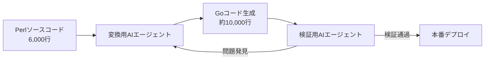
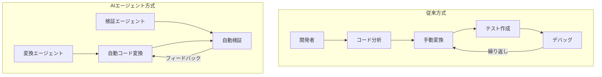

## 概要

大規模レガシーコードをモダン言語に移行する作業は、どの組織でも「重要だが優先順位で後回しになる」課題です。DeNAはこの問題をAIエージェントの活用で劇的に解決しました。Perl 6,000行で記述されたサーバー資産管理APIをGoに移行するにあたり、<strong>変換用エージェント</strong>と<strong>検証用エージェント</strong>の2種類を並行運用し、通常半年かかる作業を<strong>わずか1カ月で完遂</strong>しました。

## 背景：なぜ移行が必要だったのか

DeNAのサーバー資産管理APIは2018年にPerlで構築され、数千台のサーバーの名称・用途・IPアドレスなどの情報を管理する基幹インフラシステムです。

システム自体に大きな不具合はなかったものの、以下の理由からモダン言語への切り替えが必要でした：

- <strong>Perlの将来性</strong>：言語の将来性やコミュニティ縮小への懸念
- <strong>保守性の課題</strong>：新規開発者の採用時にPerl経験者の確保が困難
- <strong>工数問題</strong>：移行の必要性は認識しつつも、既存業務の優先順位に押されて着手できない状況

DeNA IT本部IT基盤部の小池啓輔副部長は「工数がかかるのが目に見えており、優先順位の問題でどうしても対応しきれていなかった」と話します。

## DeNAの「AIオールイン」戦略

2025年2月、DeNA創業者の南場智子会長が<strong>「AIオールイン」宣言</strong>を発表しました。AIを徹底的に駆使して生産性を高め、既存事業を半数の人員で運営できる体制を構築するという方針です。

この戦略の一環として、AIを活用したパイロットプロジェクトの1つにサーバー資産管理APIのモダン化が選ばれました。

## 核心戦略：AIエージェント2種分業体制

本プロジェクトの最も革新的な点は、AIエージェントを<strong>特性に応じて2種類に分けて運用</strong>したことです。

### 1. 変換用AIエージェント

- <strong>役割</strong>：PerlコードをGoコードに変換
- <strong>特性</strong>：コード生成に特化したエージェント
- <strong>成果</strong>：Perl約6,000行 → Go約10,000行に変換

### 2. 検証用AIエージェント

- <strong>役割</strong>：変換されたGoコードの正確性を検証
- <strong>特性</strong>：テストと品質検証に特化したエージェント
- <strong>プロセス</strong>：問題発見時に変換用エージェントへフィードバック

この2種分業体制により、<strong>変換→検証→修正</strong>のサイクルを高速で回すことができ、人手では半年以上かかる作業を1カ月に短縮しました。

## プロジェクトタイムライン

| 期間 | 内容 |
|------|------|
| 2025年10月末〜11月末 | Perl→Go移行実行（1カ月） |
| 2025年12月〜2026年1月 | 開発環境での稼働確認（約2カ月） |
| 2026年1月末 | 本番環境で稼働開始 |

## 示唆：レガシー移行にAIを活用する方法

### エージェント分業の効果

単一のAIに「変換も検証もやって」と任せるのではなく、<strong>役割を明確に分離</strong>して各エージェントの強みを最大化した点が成功の鍵です。

### 適用可能なシナリオ

この事例は以下のような状況で特に参考になります：

1. <strong>レガシー言語からモダン言語への移行</strong>：COBOL→Java、PHP→Go、Ruby→Rustなど
2. <strong>大規模コードベースの変換</strong>：数千〜数万行規模のコード移行
3. <strong>工数問題で着手できなかった技術的負債の解消</strong>：AIでコスト対効果を劇的に改善

### 注意すべき点

- <strong>2カ月間の検証期間</strong>を別途確保した点に注目すべきです。AIが変換したコードでも、本番投入前に十分な検証が不可欠です。
- エージェントの役割分担設計が成功の鍵であるため、プロジェクト特性に合ったエージェント構成を慎重に設計する必要があります。

## 結論

DeNAの事例は、AIエージェントを単なるコーディング補助ツールではなく、<strong>プロジェクトレベルの戦略的リソース</strong>として活用できることを示しています。ポイントは以下の3つです：

1. <strong>エージェントの役割分業</strong>：変換と検証を分離し、それぞれの品質を最大化
2. <strong>反復サイクルの自動化</strong>：変換→検証→修正のループをAIが自動実行
3. <strong>十分な検証期間の確保</strong>：AI変換結果に対する人間の最終検証

「AIでこれだけ効率化できれば、今まで工数の問題で手を付けられなかった案件にも着手できるようになる」という小池副部長の言葉通り、AIエージェントは技術的負債解消の新たなブレークスルーとなり得ます。

## 参考資料

- [DeNAがPerl6000行を1カ月でGo言語へ、特性異なるAIエージェント駆使 - 日経クロステック](https://xtech.nikkei.com/atcl/nxt/column/18/00001/11469/)
