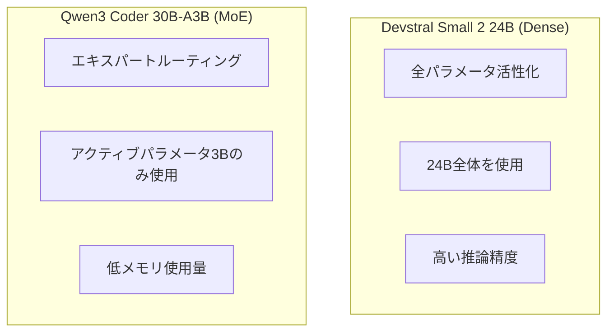
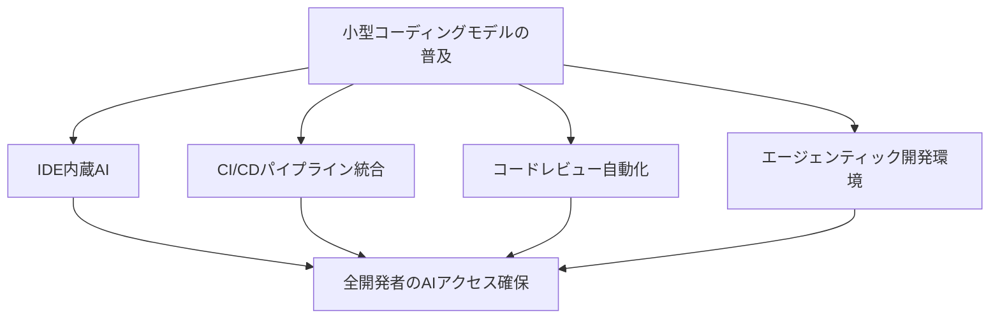

## 概要

2026年初頭、コーディング特化AIモデル市場に注目すべき変化が起きています。Mistral AIの<strong>Devstral Small 2 24B</strong>とAlibabaの<strong>Qwen3 Coder 30B</strong>がほぼ同時期に登場し、「あらゆるハードウェアで動くコーディングモデル」時代の幕を開けました。

この2つのモデルは、単にサイズが小さいだけではありません。RTX 4090一枚、あるいは32GB RAMのMacで実行できるにもかかわらず、数百Bパラメータの大型モデルを上回るコーディング性能を発揮します。本記事では、両モデルのアーキテクチャ、ベンチマーク、そして実践的な活用方法を比較分析します。

## Devstral Small 2 24B — Mistralのエージェンティックコーディングモデル

### 主な特徴

DevstralはMistral AIと[All Hands AI](https://www.all-hands.dev/)のコラボレーションにより誕生した<strong>ソフトウェアエンジニアリング特化モデル</strong>です。

- <strong>パラメータ</strong>: 24B（Denseモデル）
- <strong>ライセンス</strong>: Apache 2.0（完全オープンソース）
- <strong>SWE-Bench Verified</strong>: 46.8%（オープンソースSOTA）
- <strong>最小ハードウェア</strong>: RTX 4090またはMac 32GB RAM
- <strong>特化領域</strong>: 実際のGitHubイシュー解決、エージェンティックコーディング

### なぜ注目されるのか

Devstralの最も驚くべき点は<strong>サイズ対性能比</strong>です。SWE-Bench VerifiedでDeepSeek-V3-0324（671B）やQwen3 232B-A22Bを上回るスコアを記録しました。モデルサイズが20倍以上小さいにもかかわらず、実際のコード問題解決能力はより優れています。

```bash
# OllamaでDevstralを実行
ollama pull devstral
ollama run devstral

# LM Studioでも即座に使用可能
# MLXフォーマットでApple Silicon最適化対応
```

### エージェンティックコーディングとは

Devstralは単純なコード生成ではなく、<strong>エージェンティックコーディング</strong>に焦点を当てています。エージェンティックコーディングとは、モデルがコードベース全体を理解し、コンポーネント間の関係を把握し、複雑なバグを自律的に解決することを意味します。


OpenHandsやSWE-Agentなどのコードエージェントフレームワーク上で動作し、人間の介入なしにGitHubイシューを自動解決します。

## Qwen3 Coder — Alibabaのエージェンティックコーディングモデル

### 主な特徴

Qwen3 CoderはAlibabaがリリースしたコーディング特化モデルシリーズで、フラッグシップの480B-A35Bとともに多様なサイズのバリエーションが提供されています。

- <strong>フラッグシップ</strong>: Qwen3-Coder-480B-A35B（MoE、アクティブパラメータ35B）
- <strong>小型バリアント</strong>: Qwen3-Coder-30B-A3B（MoE、アクティブパラメータ3B）
- <strong>コンテキスト</strong>: 256Kトークン（ネイティブ）、1Mトークン（YaRN拡張）
- <strong>ライセンス</strong>: オープンソース
- <strong>特化領域</strong>: エージェンティックコーディング、ブラウザ操作、ツール呼び出し

### トレーニング技法の革新

Qwen3 Coderのトレーニングプロセスで注目すべきは<strong>強化学習（RL）の大規模適用</strong>です。

1. <strong>Code RL</strong>: 競技プログラミングではなく、実際のコーディングタスクに対する大規模強化学習
2. <strong>Long-Horizon RL（Agent RL）</strong>: マルチターン環境でツールを使いながら問題を解決する長期強化学習
3. <strong>環境スケーリング</strong>: Alibaba Cloudインフラで20,000の独立環境を並列運用

```python
# Qwen3 Coder API使用例
from openai import OpenAI

client = OpenAI(
    api_key="your_api_key",
    base_url="https://dashscope-intl.aliyuncs.com/compatible-mode/v1",
)

# qwen3-coder-plusモデル呼び出し
completion = client.chat.completions.create(
    model="qwen3-coder-plus",
    messages=[
        {"role": "system", "content": "You are a helpful coding assistant."},
        {"role": "user", "content": "この関数のバグを見つけてください。"}
    ],
)
```

### Qwen Code CLI

Qwen3 Coderとともに<strong>Qwen Code</strong>というCLIツールもオープンソースで公開されました。Gemini CLIからフォークし、Qwenモデルに最適化されたプロンプトと関数呼び出しプロトコルを適用しています。

```bash
# Qwen Codeインストール
npm i -g @qwen-code/qwen-code

# 環境設定
export OPENAI_API_KEY="your_api_key"
export OPENAI_BASE_URL="https://dashscope-intl.aliyuncs.com/compatible-mode/v1"
export OPENAI_MODEL="qwen3-coder-plus"

# すぐに使用開始
qwen
```

Claude Codeとの統合もサポートしており、既存の開発ワークフローに自然に組み込めます。

## 両モデルの比較分析

### スペック比較

| 項目 | Devstral Small 2 24B | Qwen3 Coder 30B-A3B |
|------|---------------------|---------------------|
| <strong>パラメータ</strong> | 24B（Dense） | 30B（MoE、アクティブ3B） |
| <strong>アーキテクチャ</strong> | Dense Transformer | Mixture of Experts |
| <strong>ライセンス</strong> | Apache 2.0 | オープンソース |
| <strong>SWE-Bench</strong> | 46.8%（検証済み） | SOTA級（フラッグシップ基準） |
| <strong>コンテキスト</strong> | 標準 | 256K（ネイティブ） |
| <strong>最小VRAM</strong> | 〜16GB（Q4） | 〜4GB（アクティブ3B） |
| <strong>実行環境</strong> | RTX 4090、Mac 32GB | Raspberry Pi級も可能 |
| <strong>エージェントフレームワーク</strong> | OpenHands、SWE-Agent | Qwen Code、Claude Code |

### アーキテクチャの違い

両モデルの最大の違いは<strong>アーキテクチャ</strong>です。



- <strong>Devstral</strong>: Denseモデルとして全24Bパラメータが推論に参加します。より高い精度を示しますが、より多くの計算リソースが必要です。
- <strong>Qwen3 Coder 30B-A3B</strong>: MoE（Mixture of Experts）アーキテクチャで、30Bパラメータのうち毎回の推論で3Bのみが活性化されます。メモリ効率が極めて高く、Raspberry Piのような小型デバイスでも実行可能です。

### ユースケース別の推奨

| ユースケース | 推奨モデル | 理由 |
|------------|-----------|------|
| <strong>ローカル開発（Mac/PC）</strong> | Devstral | 高い精度、十分なハードウェア |
| <strong>エッジデバイス</strong> | Qwen3 Coder | MoEで超低スペック実行 |
| <strong>GitHubイシュー自動化</strong> | Devstral | SWE-Bench検証済みの性能 |
| <strong>CLI統合開発</strong> | Qwen3 Coder | Qwen Code CLIサポート |
| <strong>プライバシー重視の企業</strong> | Devstral | Apache 2.0、ローカル実行 |
| <strong>長文コンテキスト作業</strong> | Qwen3 Coder | 256Kネイティブサポート |

## ローカルAIコーディングの未来

### なぜ小型コーディングモデルが重要なのか

この2つのモデルの登場は、単なる新製品リリース以上の意味を持ちます。

1. <strong>プライバシー保護</strong>: コードを外部サーバーに送らずローカルでAI支援を受けられます
2. <strong>コスト削減</strong>: API費用なしで自前のハードウェアで無制限に使用できます
3. <strong>オフライン作業</strong>: インターネット接続なしでもAIコーディングアシスタントを使えます
4. <strong>カスタマイズ</strong>: 自社コードベースにファインチューニングしてカスタムモデルを構築できます

### 量子化と最適化

コミュニティではすでに多様な量子化バージョンが提供されています。特にコーディングモデルに特化したキャリブレーションデータセットを使用し、ツール呼び出しやコード生成に最適化された量子化が行われています。

```bash
# Q4量子化でVRAM節約
# Devstral: 〜16GB → 〜8GB
# Qwen3 Coder 30B-A3B: アクティブ3Bなので元々〜4GB

# Ollamaで量子化モデルを使用
ollama pull devstral:q4_k_m
```

### 開発者エコシステムの変化

小型コーディングモデルが普及すれば、開発ツールエコシステムにも大きな変化が予想されます。



## 結論

Devstral Small 2 24BとQwen3 Coder 30Bの同時登場は、<strong>コーディングAIの民主化</strong>を象徴しています。大型GPUクラスタや高額なAPIサブスクリプションがなくても、一般開発者のノートPCやRaspberry Piでもプロダクション級のコーディングAIを実行できるようになりました。

特に注目すべきは、両モデルが異なるアーキテクチャ（Dense vs MoE）を採用しながらも、「ローカルで実行可能なエージェンティックコーディング」という同じ目標を目指している点です。これは小型コーディングモデルの多様なアプローチが競争しながら急速に発展することを示唆しています。

ローカルAIコーディングの時代は、すでに始まっています。

## 参考資料

- [Mistral AI - Devstral公式発表](https://mistral.ai/news/devstral)
- [Qwen3-Coder公式ブログ](https://qwenlm.github.io/blog/qwen3-coder/)
- [r/LocalLLAMAコミュニティ議論](https://www.reddit.com/r/LocalLLaMA/comments/1r85o89/devstral_small_2_24b_qwen3_coder_30b_coders_for/)
- [OpenHands - ローカルLLM使用ガイド](https://docs.all-hands.dev/modules/usage/llms/local-llms)
