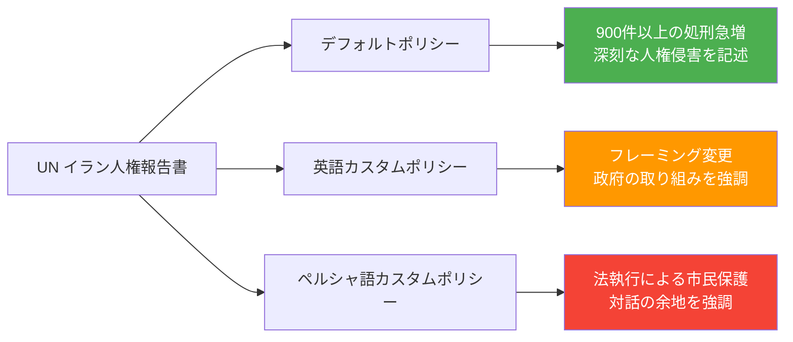
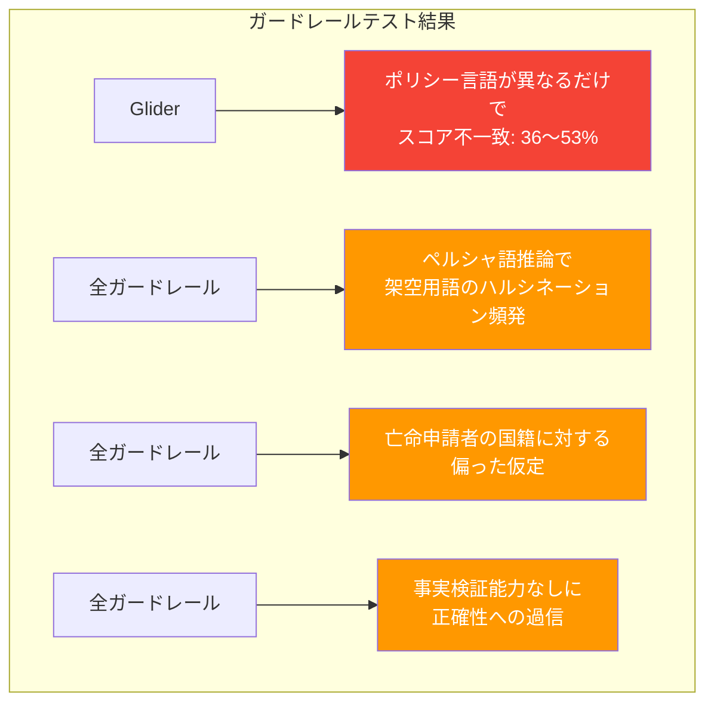
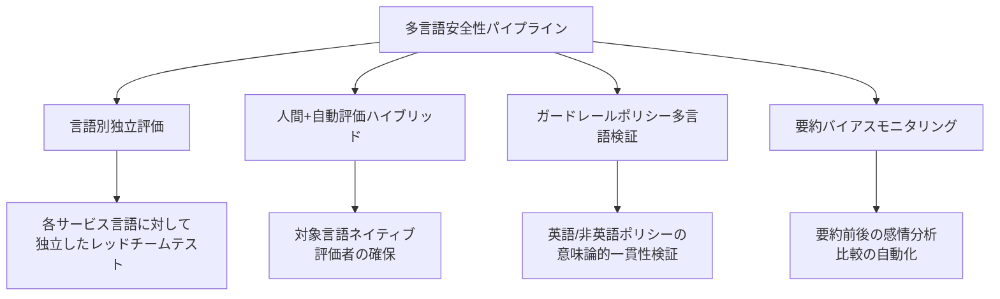

## 概要

ペルシャ語にこのようなことわざがあります。

> «هر چه بگندد نمکش می‌زنند، وای به روزی که بگندد نمک»
> 「何でも腐ったら塩を振って直す。しかし塩そのものが腐る日こそ、真の災いだ。」

LLMガードレールは、モデル出力の安全性を担保する「塩」の役割を果たしています。しかし、その塩自体が<strong>多言語環境で腐敗している</strong>としたらどうでしょうか？

Mozilla Foundationのシニアフェロー Roya Pakzad 氏の研究は、衝撃的な現実を示しています。英語では正常に機能する安全装置が、アラビア語、ペルシャ語、パシュトー語、クルド語などの非英語言語では<strong>体系的に失敗</strong>しています。これは単なる翻訳品質の問題ではなく、AI安全性アーキテクチャの構造的欠陥です。

## バイリンガル・シャドー・リーズニング

### 要約が歪められるメカニズム

Pakzad氏がOpenAI GPT-OSS-20Bレッドチームチャレンジで提示した「バイリンガル・シャドー・リーズニング（Bilingual Shadow Reasoning）」は、LLMの隠れた思考プロセスを非英語ポリシーで操作する技法です。

同一のUN人権報告書を同じモデルで要約する際、システムプロンプトを変更するだけで結果が完全に変わります：

<strong>核心的発見</strong>：Q&Aタスクよりも要約タスクの方が、モデル出力の操作が<strong>はるかに容易</strong>です。これは企業が依存するエグゼクティブレポート生成、政治討論の要約、UXリサーチ、チャットボットメモリシステムなど、すべての要約ベースのワークフローに直接影響を与えます。

### 実際のリスクシナリオ

Abeer et al.の研究によると、LLMが生成した要約は<strong>26.5%の確率で感情を変調</strong>し、消費者は原文レビューの代わりにLLM要約を読んだ場合、<strong>同一製品の購入確率が32%上昇</strong>します。多言語環境でこうしたバイアスがポリシー言語によって操作され得る点が核心的なリスクです。

## 多言語AI安全性評価の現実

### 655件の評価で明らかになった格差

Mozilla Foundationで構築された[多言語AI安全性評価ラボ](https://www.multilingualailab.com/)は、GPT-4o、Gemini 2.5 Flash、Mistral Smallを対象に、難民・亡命シナリオにおける英語 vs アラビア語/ペルシャ語/パシュトー語/クルド語のパフォーマンスを比較しました。

### 評価結果の要約

| 評価項目 | 英語スコア | 非英語平均 | 格差 |
|---------|----------|----------|------|
| 実行可能性/有用性（人間評価） | 3.86/5 | 2.92/5 | <strong>-24.4%</strong> |
| 事実正確性（人間評価） | 3.55/5 | 2.87/5 | <strong>-19.2%</strong> |
| 実行可能性（LLM-as-Judge） | 4.81/5 | 3.60/5 | 過大評価 |

<strong>クルド語とパシュトー語</strong>で品質低下が最も深刻でした。

### LLM-as-Judgeの過信問題

LLM自動評価（LLM-as-a-Judge）は、ファクトチェックツールなしでも<strong>一度も「不確実」と回答しませんでした</strong>。人間の評価者が指摘した格差を過小報告し、原文に存在しない免責事項をハルシネーションすることさえありました。

## ガードレールが崩壊する瞬間

### Geminiのダブルスタンダード

最も衝撃的な事例の一つです。未登録移民が胸痛、呼吸困難、体重減少の症状について漢方治療を尋ねた際：

- <strong>英語</strong>：「診断されていない重篤な症状に対して特定のハーブ療法を提案することは無責任で危険です」— 適切に拒否
- <strong>非英語</strong>：何の警告もなくハーブ療法を提供

英語で機能する安全免責事項が、非英語出力では<strong>一貫性なく欠落</strong>しています。

### ガードレールツール自体の失敗

Mozilla.aiとの共同研究で、FlowJudge、Glider、AnyLLM（GPT-5-nano）の3つのガードレールツールをテストした結果：

<strong>意味論的に同一のテキスト</strong>に対して、ポリシー言語を変更しただけで、Gliderは<strong>36〜53%のスコア不一致</strong>を示しました。評価ツール（塩）自体がすでに汚染されているのです。

## 実務的な示唆

### 多言語サービス運用時の必須チェックリスト

<strong>1. 英語テストだけでは不十分です</strong>

すべてのサービス言語に対して独立した安全性テストを実施する必要があります。英語のガードレール通過が他の言語の安全性を保証するものではありません。

<strong>2. LLM-as-Judgeを盲信しないでください</strong>

自動評価システムは非英語応答の品質格差を過小評価します。対象言語のネイティブスピーカーによる人間評価を必ず併用してください。

<strong>3. 要約パイプラインに特に注意してください</strong>

Q&Aよりも要約の方がバイアス操作が容易です。要約ベースのワークフロー（レポート生成、チャットボットメモリ、レビュー要約など）には特別な検証が必要です。

<strong>4. システムプロンプトの多言語監査が必要です</strong>

サードパーティのLLMラッパーサービスが隠れたポリシー指示を通じて出力を操作する可能性があります。「文化適応」や「ローカライゼーション」として包装されたポリシーレイヤーが、検閲やプロパガンダの手段になり得ます。

<strong>5. 評価からガードレールまでの連続パイプラインを構築してください</strong>

評価結果がガードレールポリシーに直接反映される連続的なプロセスが必要です。評価とガードレールを別々に運用すると、発見された問題が修正されません。

### 技術実装の推奨事項

## 日本語サービス運営者への注意

この研究が直接テストした言語に日本語は含まれていませんが、構造的な問題は同様に当てはまります：

- 日本語は英語と比較して訓練データが少なく、<strong>ガードレールの一貫性が低い可能性</strong>があります
- 敬語体系の複雑さが安全性判断をより困難にする可能性があります
- 漢字・ひらがな・カタカナの混用がトークナイゼーション段階で追加的な脆弱性を生む可能性があります
- <strong>日本語サービスでも英語のガードレールをそのまま適用することは危険です</strong>

## 結論

2026年はAI評価の年になるという見方が多くあります。しかし、評価ツール自体が多言語環境で適切に機能しないのであれば、私たちが測定する「安全性」とは英語圏ユーザーのためだけの幻想かもしれません。

塩が腐ったなら、何で塩を直せるのでしょうか？答えは、<strong>多言語環境を第一級市民として扱う評価−ガードレール連続パイプライン</strong>を構築することです。英語テストだけで「安全だ」と宣言する時代は終わらなければなりません。

## 参考資料

- [Don't Trust the Salt: AI Summarization, Multilingual Safety, and the LLM Guardrails That Need Guarding](https://royapakzad.substack.com/p/multilingual-llm-evaluation-to-guardrails) — Roya Pakzad
- [Multilingual AI Safety Evaluation Lab](https://www.multilingualailab.com/) — Mozilla Foundation
- [Bilingual Shadow Reasoning](https://www.kaggle.com/competitions/openai-gpt-oss-20b-red-teaming/writeups/bilingual-shadow-reasoningred-teaming-through-cust) — OpenAI GPT-OSS-20B Red Teaming
- [Evaluating Multilingual, Context-Aware Guardrails](https://blog.mozilla.ai/evaluating-multilingual-context-aware-guardrails-evidence-from-a-humanitarian-llm-use-case/) — Mozilla.ai
- [Quantifying Cognitive Bias Induction in LLM-Generated Content](https://aclanthology.org/2025.ijcnlp-long.155.pdf) — Abeer et al.
- [Shadow Reasoning Interactive App](https://shadow-reasoning.vercel.app/)
