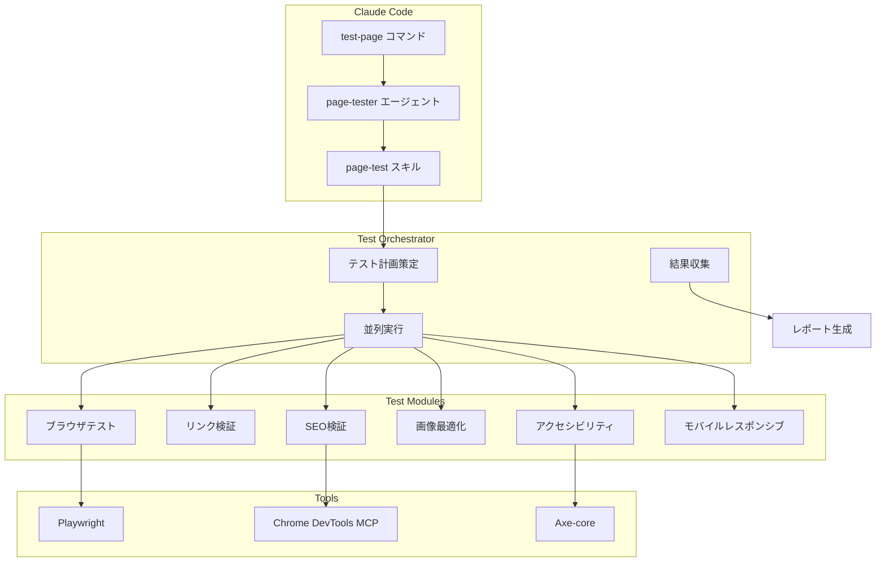
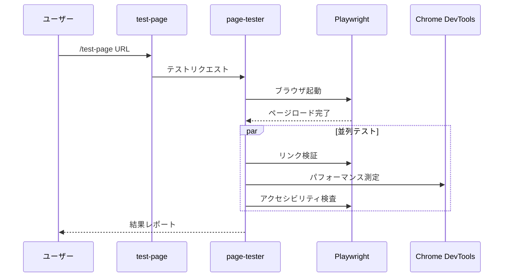
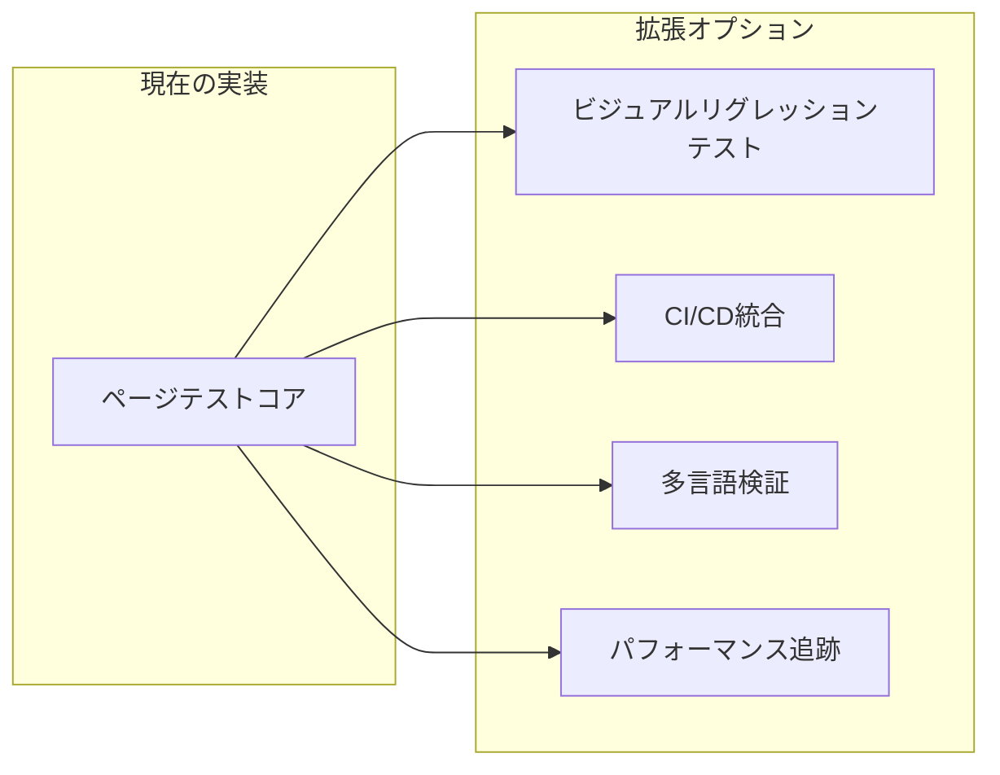

## なぜページテスト自動化が必要か？

Webパブリッシャーがページ開発後、品質検証にどれだけの時間を費やしていますか？クロスブラウザテスト、リンク確認、アクセシビリティ検証、SEOチェック、画像最適化...すべての項目を手動で確認するには、ページあたり<strong>30分以上</strong>かかります。

より大きな問題は<strong>一貫性</strong>です。忙しいスケジュールの中で特定の項目を見落としたり、担当者によって検証基準が異なることがあります。

この問題を解決するために、Claude CodeとPlaywrightを活用した<strong>ページE2Eテスト自動化システム</strong>を構築しました。

## システム概要

```bash
# 単一コマンドで8つの品質項目を自動検証
/test-page https://jangwook.net/en/
```

このコマンド1つで以下の項目が自動的にテストされます：

| 優先度 | テスト項目 | 説明 |
|--------|-----------|------|
| **P0** | クロスブラウザ | Chromium、Firefox、WebKit同時テスト |
| **P0** | リンク整合性 | すべてのリンクのHTTPステータスコード検証 |
| **P0** | アクセシビリティ (a11y) | WCAG 2.1 AAレベル準拠確認 |
| **P0** | モバイルレスポンシブ | 各ビューポートでのレイアウト検証 |
| **P1** | 画像最適化 | レンダリング vs ナチュラルサイズ比較 |
| **P1** | SEO検証 | メタタグ、OG、構造化データ確認 |
| **P1** | UI/UX | フォントサイズ、タッチターゲット検証 |
| **P2** | コンテンツ品質 | 言語設定、見出し構造確認 |

## アーキテクチャ



コア構成要素は3つです：

1. <strong>Commands</strong>（`/test-page`）：ユーザーインターフェース
2. <strong>Agents</strong>（`page-tester`）：テストオーケストレーション
3. <strong>Skills</strong>（`page-test`）：再利用可能なテストロジック

## 実装方法

### 1. スラッシュコマンド定義

`.claude/commands/test-page.md`ファイルを作成します：

````markdown
# ページテストコマンド

Webページの品質を自動で検証します。

## 使用方法

```bash
/test-page <url> [options]
```

## 検証項目

1. **クロスブラウザ互換性** (P0)
2. **リンク整合性** (P0)
3. **アクセシビリティ** (P0)
4. **モバイルレスポンシブ** (P0)
5. **画像最適化** (P1)
6. **SEO検証** (P1)
...
````

### 2. エージェント実装

`page-tester`エージェントは以下のワークフローを実行します：



<details>
<summary><strong>エージェント定義ファイルを見る</strong></summary>

```markdown
# Page Tester エージェント

Webページの品質を総合的にテストする専門エージェントです。

## 役割

- ページの読み込みとレンダリング検証
- クロスブラウザ互換性テスト
- アクセシビリティ（a11y）検査
- SEO最適化状態確認
- パフォーマンスメトリクス収集

## 使用ツール

- **Playwright**: ブラウザ自動化とスクリーンショット
- **Chrome DevTools MCP**: パフォーマンス分析とネットワーク監視
- **Axe-core**: アクセシビリティ検査

## ワークフロー

1. 対象URL受信
2. ブラウザインスタンス起動
3. 各テストモジュールを並列実行
4. 結果収集と分析
5. マークダウンレポート生成

## 出力形式

テスト結果は以下の形式のマークダウンレポートで生成されます：
- 総合スコアと等級
- カテゴリ別詳細結果
- 発見された問題と改善提案
- スクリーンショット添付
```

</details>

### 3. MCPツール活用

Chrome DevTools MCPとPlaywrightを組み合わせて強力なテスト環境を構築します：

```typescript
// Chrome DevTools MCPでパフォーマンス分析
const performanceResults = await mcp_chrome_devtools_performance_start_trace({
  reload: true,
  autoStop: true
});

// Playwrightでスクリーンショットとアクセシビリティ分析
const snapshot = await mcp_chrome_devtools_take_snapshot();
const screenshot = await mcp_chrome_devtools_take_screenshot({
  fullPage: true
});
```

## 実際のテスト結果

`https://jangwook.net/en/`ページの実際のテスト結果です：

### 総合評価：<strong>条件付き合格</strong>（75/100点）

| カテゴリ | 結果 | 詳細 |
|---------|------|------|
| クロスブラウザ | ✅ 合格 | Chromium正常動作 |
| リンク整合性 | ✅ 合格 | 33リンクすべて正常 |
| アクセシビリティ | ⚠️ 要改善 | タッチターゲット20件未達 |
| モバイルレスポンシブ | ✅ 合格 | 横スクロールなし |
| 画像最適化 | ⚠️ 要改善 | 6枚の画像が過大 |
| SEO | ✅ 合格 | 95/100点 |
| UI/UX | ⚠️ 要改善 | 最小フォント12px |

<details>
<summary><strong>完全なテストレポートを見る</strong></summary>

### テスト環境
- **テスト日時**: 2024-11-24 09:56:25
- **対象URL**: https://jangwook.net/en/
- **ブラウザ**: Chromium (Playwright)

### 1. クロスブラウザテスト ✅

Chromium環境でページが正常に読み込まれました。主要な要素が正しくレンダリングされています。

### 2. リンク整合性検査 ✅

合計33リンクを検査完了：
- 内部リンク: 28件（すべて正常）
- 外部リンク: 5件（すべて正常）

### 3. アクセシビリティ（a11y）検査 ⚠️

**タッチターゲットサイズ未達（20件）**

WCAG推奨最小サイズ44×44px未達の要素：
- ナビゲーションリンク（現在の高さ: 36px）
- ソーシャルメディアアイコン
- フッターリンク

### 4. モバイルレスポンシブ検査 ✅

- 横スクロールなし
- ビューポートメタタグ正しく設定
- タッチインタラクション正常

### 5. 画像最適化検査 ⚠️

**過大な画像6枚を発見**

| 画像 | 元サイズ | レンダリングサイズ | 削減可能 |
|------|---------|------------------|---------|
| hero-image.webp | 600×600 | 382×192 | ~75% |
| blog-thumb-1.webp | 800×800 | 400×200 | ~75% |
| blog-thumb-2.webp | 800×800 | 400×200 | ~75% |
| profile.webp | 400×400 | 150×150 | ~86% |
| og-image.png | 1200×630 | 未使用 | 100% |
| favicon-large.png | 512×512 | 32×32 | ~99% |

### 6. SEO検査 ✅（95/100）

- ✅ タイトルタグ存在
- ✅ メタディスクリプション存在
- ✅ OGタグ完備
- ✅ カノニカルURL設定
- ⚠️ 一部画像のalt属性欠落

### 7. UI/UX検査 ⚠️

- 最小フォントサイズ: 12px（推奨: 14px以上）
- カラーコントラスト: 良好
- レイアウト一貫性: 良好

</details>

### 発見された主な問題

**1. 画像最適化の問題**

```
hero-image.webp: 600×600px → 382×192px（約75%削減可能）
```

**改善策：**
```html

```

**2. タッチターゲットサイズ未達**

WCAG推奨最小サイズは44×44pxです。現在のナビゲーションリンクの高さは36pxで不足しています。

```css
/* 改善策 */
a, button {
  min-height: 44px;
  min-width: 44px;
  display: inline-flex;
  align-items: center;
  padding: 10px;
}
```

## 主要なインサイト

この自動化システムを構築して得られたインサイトです：

### 1. 80/20の法則を適用

すべてのテストを完璧に実装しようとしないでください。<strong>P0項目6つだけで80%の品質問題を発見</strong>できます。

### 2. AI分析の価値

単に「画像が大きい」ではなく、<strong>「どう修正すべきか」</strong>まで提案することが真の自動化です。ここでClaudeの分析能力が輝きます。

### 3. 段階的な改善

最初から完璧なシステムを作る必要はありません：

```
Week 1: 基本フレームワーク + P0テスト3つ
Week 2: P0完成 + コンソールレポーター
Week 3: P1テスト + HTMLレポート
Week 4: AI分析 + 改善提案
```

### 4. 成果物の活用性

生成されたマークダウンレポートは：
- チームレビュー資料として活用
- Notionに自動アーカイブ
- Slack通知で共有
- CI/CDパイプラインに統合

## 拡張可能性

このシステムは様々な方向に拡張できます：



- <strong>ビジュアルリグレッションテスト</strong>：スクリーンショット比較でUI変更を検知
- <strong>CI/CD統合</strong>：PRごとに自動テスト実行
- <strong>多言語コンテンツ検証</strong>：翻訳漏れ、言語の一貫性チェック
- <strong>時系列パフォーマンス追跡</strong>：Core Web Vitals履歴監視

## 結論

Claude Codeを活用したページE2Eテスト自動化は、単純な時間節約以上の価値を提供します：

1. <strong>一貫した品質基準</strong>の適用
2. <strong>即時フィードバック</strong>による迅速な改善
3. <strong>AI基盤のインサイト</strong>でより良い意思決定
4. <strong>文書化された品質履歴</strong>の蓄積

次のプロジェクトでこのシステムを適用してみてください。初期設定に時間がかかりますが、長期的にはチームの生産性とWebサイトの品質の両方を向上させることができます。

## 参考資料

- [Playwright公式ドキュメント](https://playwright.dev/)
- [WCAG 2.1ガイドライン](https://www.w3.org/WAI/WCAG21/quickref/)
- [Core Web Vitals](https://web.dev/vitals/)
- [Axe-core アクセシビリティテスト](https://github.com/dequelabs/axe-core)
