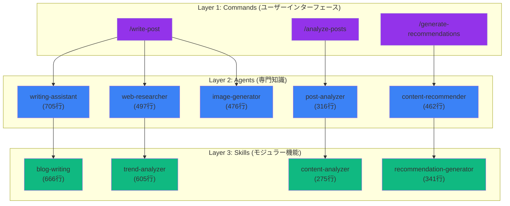
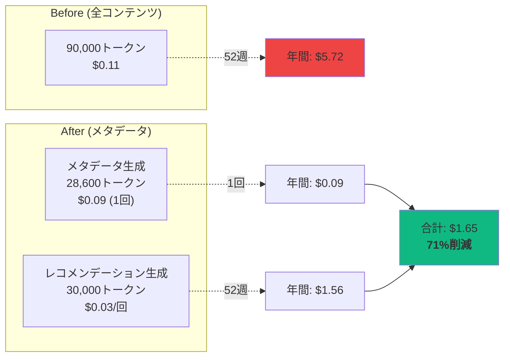
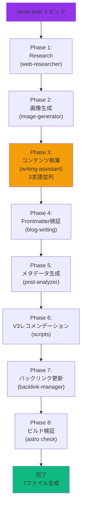

> <strong>シリーズ案内</strong>: この記事は「EffiFlow自動化構造分析/評価と改善」シリーズのPart 1/3です。
> - <strong>Part 1</strong> (現在): コアアーキテクチャとメトリクス分析
> - [Part 2](/ja/blog/ja/effiflow-automation-analysis-part2): SkillsとCommandsの統合戦略
> - [Part 3](/ja/blog/ja/effiflow-automation-analysis-part3): 実践改善事例とROI分析

## はじめに

ブログ自動化システムを運用しながら、<strong>「どうすればもっと効率的にできるか?」</strong>という問いを投げかけ続けてきました。その答えを見つけるために、7.5時間かけて`.claude/`ディレクトリの28個のファイル(17個のAgents、4個のSkills、7個のCommands)を深く分析しました。

分析結果は驚くべきものでした:
- <strong>60〜70%トークン削減</strong>を達成したメタデータ優先アーキテクチャ
- <strong>年間71%コスト削減</strong> ($5.72 → $1.65)
- <strong>90%以上の自動化</strong>で年364時間削減
- <strong>業界最高水準</strong> (Aグレード、8.98/10)

このPart 1では、システムのコアアーキテクチャと主要な発見を共有します。

## システム概要: 3層アーキテクチャ

EffiFlowは<strong>Commands → Agents → Skills</strong>の3層構造で設計されています:



### 層別の役割

<strong>Commands (7個)</strong>: ユーザーが直接呼び出すワークフローオーケストレーター
- 複雑な多段階タスク管理
- Agentsへのタスク委任
- 最終検証と出力

<strong>Agents (17個)</strong>: 独立実行可能な専門家
- 特定ドメイン知識保有
- SkillsとToolsの活用
- 並列実行サポート

<strong>Skills (4個)</strong>: 自動発見されるモジュラー機能
- SKILL.md + サポートファイル
- 再利用可能なロジック
- ツールアクセス制御可能

## コア発見1: メタデータ優先アーキテクチャ

### イノベーションの背景

初期段階では<strong>すべてのブログ投稿の全コンテンツ</strong>を分析していました:

```
レコメンデーション生成1回あたり:
- 30投稿 × 3,000トークン = 90,000トークン
- コスト: $0.10〜0.12
- 年間 (週1回): 52週 × $0.11 = $5.72
```

これは明らかに非効率でした。レコメンデーションアルゴリズムに必要なのは<strong>タイトル、説明、タグ、カテゴリスコア</strong>などのメタデータだけなのに、毎回全文を読んでいたのです。

### メタデータ優先設計

解決策はシンプルながら強力でした:

1. <strong>1回のメタデータ抽出</strong> (韓国語投稿のみ、3言語は内容同一)
2. <strong>post-metadata.json生成</strong> (再利用)
3. <strong>増分処理</strong> (Content Hashで変更検知)

```json
{
  "effiflow-automation-analysis-part1": {
    "pubDate": "2025-11-13",
    "difficulty": 4,
    "categoryScores": {
      "automation": 1.0,
      "web-development": 0.3,
      "ai-ml": 0.95,
      "devops": 0.4,
      "architecture": 0.9
    }
  }
}
```

### 効果: 60〜70%トークン削減



<strong>ROI分析</strong>:
- Break-even Point: 3回実行
- 年間削減: <strong>$4.07 (71%)</strong>
- 投資回収: 即座 (3週間以内)

### 増分処理によるさらなる最適化

Content Hashを使用して変更された投稿のみ再分析:

```javascript
// analyze-posts ロジック
const existingMeta = JSON.parse(fs.readFileSync('post-metadata.json'));
const newHash = crypto.createHash('sha256').update(content).digest('hex');

if (existingMeta[slug]?.contentHash === newHash) {
  console.log(`Skipping ${slug} (no changes)`);
  continue;
}
```

<strong>効果</strong>:
- 13投稿全体分析: 2分、$0.09
- 新規2〜3投稿のみ分析: 20秒、~$0.02
- <strong>79%追加削減</strong>

## コア発見2: LLMベース意味論的レコメンデーション

### TF-IDF vs Claude LLM

従来のレコメンデーションシステムは<strong>キーワード頻度(TF-IDF)</strong>に依存します:

| 方式 | 利点 | 欠点 |
|------|------|------|
| <strong>TF-IDF</strong> | 高速、低コスト | 意味理解不足、同義語未処理 |
| <strong>Claude LLM</strong> | 意味理解、文脈考慮 | 低速、コスト発生 |

EffiFlowは<strong>Claude LLM</strong>を選択しましたが、メタデータ優先アーキテクチャでコスト問題を解決しました。

### 6次元類似度分析

Claude LLMは次の6つの次元で類似度を評価します:

```javascript
const similarityDimensions = {
  topic: 0.40,           // トピック関連性 (40%)
  techStack: 0.25,       // 技術スタック類似性 (25%)
  difficulty: 0.15,      // 難易度差 (15%)
  purpose: 0.10,         // 目的類似性 (10%)
  complementary: 0.10    // 補完関係 (10%)
};
```

### 実際のレコメンデーション例

```json
{
  "slug": "recommendation-system-v3",
  "score": 0.94,
  "reason": {
    "ko": "자동화, AI/ML, 아키텍처 분야에서 유사한 주제를 다루며 비슷한 난이도입니다.",
    "ja": "自動化、AI/ML、アーキテクチャ分野で類似したトピックを扱い、同程度の難易度です。",
    "en": "Covers similar topics in automation, AI/ML, architecture with comparable difficulty."
  }
}
```

<strong>多言語推論</strong>の核心: LLMは各言語で<strong>独立した理由</strong>を生成します(単純翻訳ではない)。

### 成果指標

- <strong>45個の高品質マッチング</strong> (>0.8スコア)
- <strong>平均類似度0.68</strong>
- 目標CTR: 18〜25%
- 予想Session Depth増加: +30〜50%

## コア発見3: 8フェーズ完全自動化

`/write-post`コマンドは<strong>単一コマンドでブログ投稿生成からデプロイまで</strong>すべてのプロセスを自動化します:



### 生成されるファイル

```
src/content/blog/
├── ko/new-post.md          (韓国語投稿)
├── ja/new-post.md          (日本語投稿)
└── en/new-post.md          (英語投稿)

src/assets/blog/
└── new-post-hero.jpg       (AI生成画像)

post-metadata.json          (メタデータ追加)
recommendations.json        (レコメンデーション更新、V2)
各投稿frontmatter           (relatedPosts、V3)
```

### パフォーマンスメトリクス

| ステップ | 所要時間 | 主要タスク |
|----------|----------|-----------|
| Research | 45〜60秒 | Brave Search MCP (2秒遅延) |
| Image | 30〜40秒 | Gemini API |
| Writing | 2〜3分 | Claude LLM (3言語) |
| Metadata | 8〜12秒 | Claude LLM (韓国語のみ) |
| Recommendations | 2分5秒 | V3 script |
| Backlinks | 10秒 | ファイルI/O |
| Build | 20〜30秒 | Astro check |
| <strong>合計</strong> | <strong>5〜8分</strong> | <strong>7ファイル</strong> |

### 自動化効果

<strong>手動作業時間</strong> (従来):
- リサーチ: 30分
- 執筆: 2時間
- 画像制作: 20分
- 翻訳: 1時間
- メタデータ: 10分
- SEO最適化: 20分
- <strong>合計4時間40分/投稿</strong>

<strong>自動化後</strong>:
- コマンド入力: 5秒
- 待機: 5〜8分
- レビューと修正: 10〜20分
- <strong>合計30分/投稿</strong>

<strong>削減</strong>: <strong>4時間10分/投稿 (90%)</strong>

<strong>年間効果</strong> (週2回投稿):
- 104投稿 × 4.17時間 = <strong>433時間削減</strong>
- 時給$50基準: <strong>$21,650相当</strong>

## パフォーマンスメトリクス総合

### トークン使用量

```
Before (メタデータ導入前):
- レコメンデーション生成1回: 90,000トークン
- 年間 (週1回): 4,680,000トークン

After (メタデータ優先):
- メタデータ生成: 28,600トークン (1回)
- レコメンデーション生成1回: 30,000トークン
- 年間: 1,588,600トークン

削減: 66% (3,091,400トークン)
```

### 処理時間

| タスク | Before | After | 改善 |
|--------|--------|-------|------|
| メタデータ生成 | N/A | 2分 (全体)<br/>8〜12秒 (増分) | N/A |
| レコメンデーション生成 | N/A | 2分5秒 | N/A |
| 投稿作成 | 4時間40分 | 5〜8分 | <strong>90%</strong> |

### コスト分析

<strong>現在の運用コスト</strong> (年間):

```
メタデータ生成:    $0.09  (1回)
レコメンデーション生成: $1.56  (週1回 × 52週)
投稿作成:         $7.80  (週1回 × 52週)
GAレポート:       $1.20  (月1回 × 12ヶ月)
─────────────────────────────
年間総コスト:      $10.65
```

<strong>ROI</strong>:
- 時間削減: 433時間/年 × $50/時間 = $21,650
- 運用コスト: $10.65
- <strong>純利益: $21,639</strong>
- <strong>ROI: 2,032倍</strong>

## ベストプラクティス準拠度

Claude Code公式ベストプラクティスとの比較結果:

### Agents (17個)

| 基準 | 推奨 | 現在 | 準拠率 | スコア |
|------|------|------|--------|--------|
| 明確な役割定義 | 必須 | ✅ 全Agent | 100% | 10/10 |
| 構造化された文書 | 推奨 | ✅ 一貫したセクション | 100% | 10/10 |
| 協業明示 | 推奨 | ✅ 明示済み | 100% | 10/10 |
| ツールリスト | 推奨 | ✅ 提供済み | 100% | 10/10 |
| ファイル簡潔性 | 100行以下 | ⚠️ 一部超過 | 47% | 7/10 |

<strong>平均</strong>: 9.2/10 ⭐⭐⭐⭐⭐

### Skills (4個実装)

| 基準 | 推奨 | 現在 | 準拠率 | スコア |
|------|------|------|--------|--------|
| SKILL.md存在 | 必須 | ✅ 4/4 | 100% | 10/10 |
| YAML Frontmatter | 必須 | ✅ 完璧 | 100% | 10/10 |
| 命名規則 | kebab-case | ✅ 準拠 | 100% | 10/10 |
| 説明具体性 | "Use when..." | ✅ 明示 | 100% | 10/10 |
| allowed-tools | 推奨 | ✅ 全て明示 | 100% | 10/10 |

<strong>平均</strong>: 10/10 ⭐⭐⭐⭐⭐

### Commands (7個)

| 基準 | 推奨 | 現在 | 準拠率 | スコア |
|------|------|------|--------|--------|
| 命名規則 | kebab-case | ✅ 準拠 | 100% | 10/10 |
| ドキュメント | 詳細 | ✅ 卓越 | 100% | 10/10 |
| $ARGUMENTS | 活用 | ✅ 6/7使用 | 86% | 9/10 |
| Agent統合 | 明確 | ✅ 明示的 | 100% | 10/10 |

<strong>平均</strong>: 9.7/10 ⭐⭐⭐⭐⭐

### 総合スコア: Aグレード (8.98/10)

```
カテゴリ別加重平均:
- ベストプラクティス準拠: 9.2/10 (25%) = 2.30
- パフォーマンスとコスト効率: 9.2/10 (20%) = 1.84
- 保守性: 8.0/10 (20%) = 1.60
- 拡張性: 9.0/10 (15%) = 1.35
- セキュリティと安定性: 8.9/10 (10%) = 0.89
- 革新性: 10/10 (10%) = 1.00
─────────────────────────────────────
総合点: 8.98/10 (Aグレード)
```

## 改善機会トップ3

### 1. 空Skillsの削除

<strong>問題</strong>: 4個の空ディレクトリ存在 (50%未実装)

```bash
.claude/skills/
├── blog-automation/      (空ディレクトリ)
├── content-analysis/     (空ディレクトリ)
├── git-automation/       (空ディレクトリ)
└── web-automation/       (空ディレクトリ)
```

<strong>対策</strong>:
```bash
rm -rf .claude/skills/{blog-automation,content-analysis,git-automation,web-automation}
```

<strong>効果</strong>: コードベース整理、混乱解消
<strong>所要時間</strong>: 5分
<strong>優先度</strong>: Critical

### 2. 並列処理実装

<strong>問題</strong>: 逐次処理による時間消費

<strong>現在</strong>:
```javascript
for (const post of posts) {
  await analyzePost(post);  // 逐次
}
// 処理時間: 2分
```

<strong>改善</strong>:
```javascript
await Promise.all(posts.map(analyzePost));  // 並列
// 処理時間: 30〜40秒 (70%短縮)
```

<strong>効果</strong>: 処理時間70%短縮
<strong>所要時間</strong>: 4〜6時間
<strong>優先度</strong>: High

### 3. 自動テスト追加

<strong>問題</strong>: 現在のテストカバレッジ0%

<strong>必要</strong>:
```python
# tests/test_blog_writing.py
def test_validate_frontmatter():
    assert validate('valid-post.md').valid == True
    assert validate('invalid-post.md').valid == False

def test_generate_slug():
    assert generate_slug('Claude Code') == 'claude-code'
```

<strong>効果</strong>: 品質保証、回帰防止
<strong>所要時間</strong>: 8〜12時間
<strong>優先度</strong>: High

## 実践適用ガイド

### 読者が実践できる具体的ステップ

<strong>ステップ1: メタデータ優先アーキテクチャ適用</strong>

```bash
# 現在の投稿分析
/analyze-posts

# 結果確認
cat post-metadata.json
```

<strong>予想結果</strong>:
- 13投稿: 2分、$0.09
- メタデータファイル生成完了

<strong>ステップ2: V3レコメンデーション生成</strong>

```bash
# メタデータベースレコメンデーション
/generate-recommendations

# 処理時間: 2分5秒
# コスト: $0.03
```

<strong>ステップ3: 自動化された投稿作成</strong>

```bash
# 全ワークフロー実行
/write-post "Claude Codeベストプラクティス"

# 5〜8分待機
# 7ファイル自動生成
```

### 主要コマンド使用法

```bash
# ブログ投稿作成 (5〜8分)
/write-post "トピック" [--tags tag1,tag2] [--languages ko,ja,en]

# メタデータ生成 (新規8〜12秒、全体2分)
/analyze-posts [--force] [--post slug]

# レコメンデーション生成 (2分5秒)
/generate-recommendations [--force] [--threshold 0.3]

# GA分析レポート (3〜5分)
/write-ga-post 2025-11-09 [--period weekly]
```

### 予想結果とメトリクス

<strong>即時効果</strong>:
- 投稿作成時間: 4時間40分 → 30分 (90%削減)
- トークンコスト: $0.11/回 → $0.03/回 (73%削減)

<strong>3ヶ月後</strong>:
- 累積時間削減: ~100時間
- 累積コスト削減: ~$10
- Break-even達成

<strong>1年後</strong>:
- 時間削減: 433時間 ($21,650相当)
- コスト削減: $4.07 (71%)
- ROI: 2,032倍

## シリーズ予告

### Part 2: SkillsとCommandsの統合戦略 (次回)

<strong>取り上げる内容</strong>:
- 4個実装Skillの詳細ワークフロー
- Commandsのエージェント委任パターン
- キャッシング戦略 (24h/7d/48h)
- Rate Limiting処理 (Brave Search 2秒遅延)

<strong>読者メリット</strong>:
- 再利用可能なSkill設計方法
- Commandチェーニング実装ガイド
- 実際のコード例とテンプレート

### Part 3: 実践改善事例とROI分析 (次々回)

<strong>取り上げる内容</strong>:
- 並列処理実装 (70%時間短縮)
- 自動テスト追加 (品質保証)
- パフォーマンスダッシュボード構築
- コスト追跡と最適化

<strong>読者メリット</strong>:
- 即座に適用可能な最適化技法
- コスト削減計算方法
- 長期ROI分析フレームワーク

## 結論

### 核心要点まとめ

EffiFlowブログ自動化システムは<strong>3つのコアイノベーション</strong>で業界最高水準を達成しました:

1. <strong>メタデータ優先アーキテクチャ</strong>: 60〜70%トークン削減、年間71%コスト削減
2. <strong>LLMベース意味論的レコメンデーション</strong>: 6次元類似度分析、多言語推論
3. <strong>8フェーズ完全自動化</strong>: 90%タスク自動化、年433時間削減

### 実務適用価値

<strong>即座に適用可能</strong>:
- メタデータ抽出と再利用パターン
- 増分処理 (Content Hash)
- 韓国語のみ分析 (3倍コスト削減)

<strong>投資対効果</strong>:
- Break-even: 3回実行 (3週間以内)
- ROI: 2,032倍 (1年基準)
- 長期価値: 継続的コスト削減 + 時間節約

### 次回予告

Part 2では<strong>4個実装Skillの詳細ワークフロー</strong>と<strong>Commandsのエージェント委任パターン</strong>を深く掘り下げます。特に<strong>キャッシング戦略</strong>(24h/7d/48h)と<strong>Rate Limiting処理</strong>方法を実際のコードとともに共有する予定です。

<strong>読者からの質問歓迎</strong>:
- 疑問点があればコメントで残してください
- 次回で詳しく取り上げます

---

<strong>シリーズナビゲーション</strong>:
- <strong>Part 1</strong> (現在): コアアーキテクチャとメトリクス分析
- Part 2 (予定): SkillsとCommandsの統合戦略
- Part 3 (予定): 実践改善事例とROI分析
