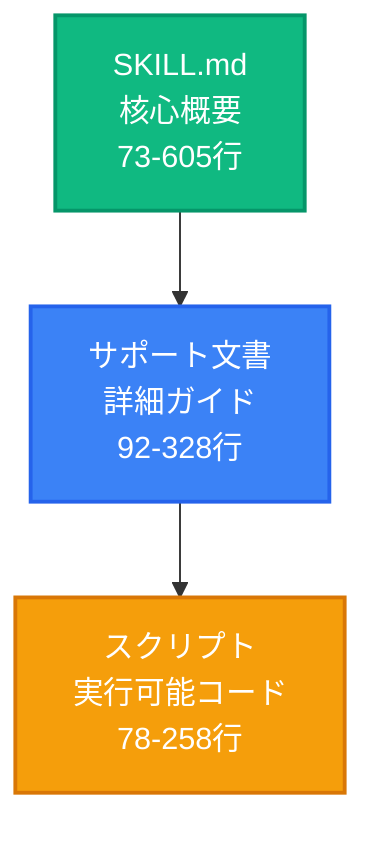
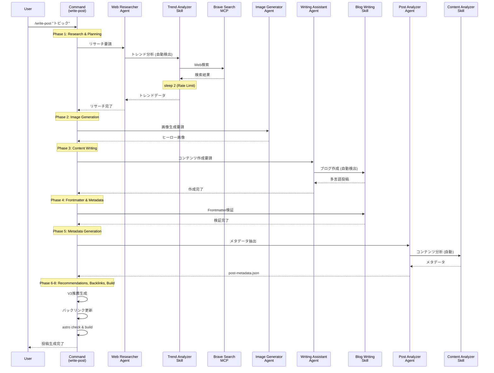
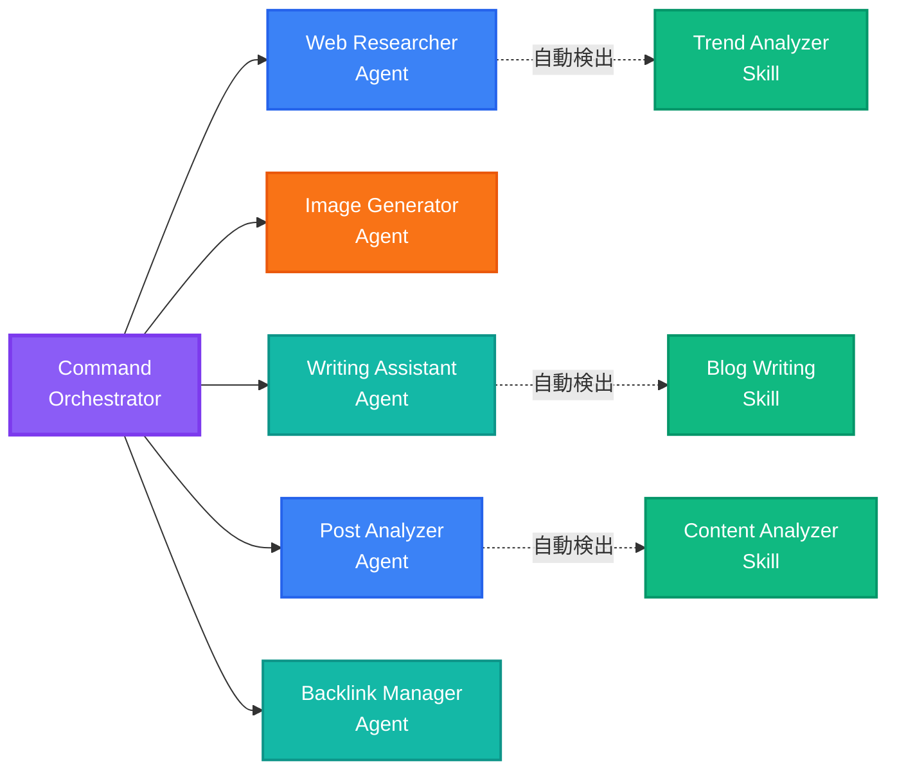
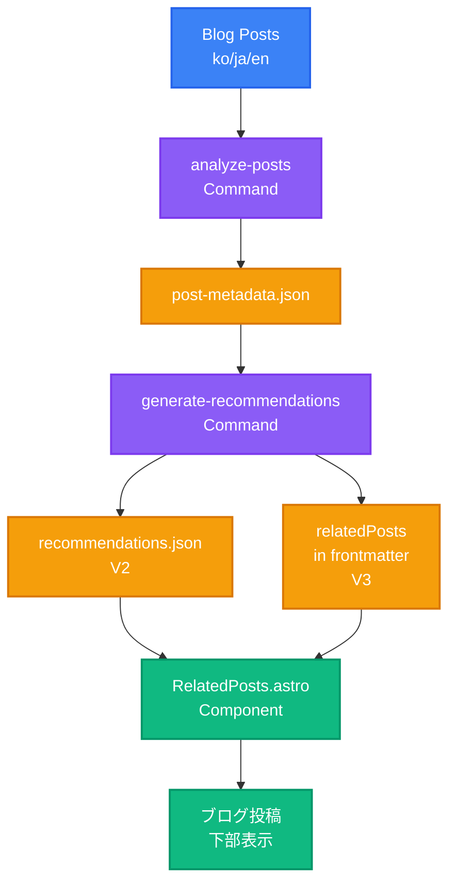
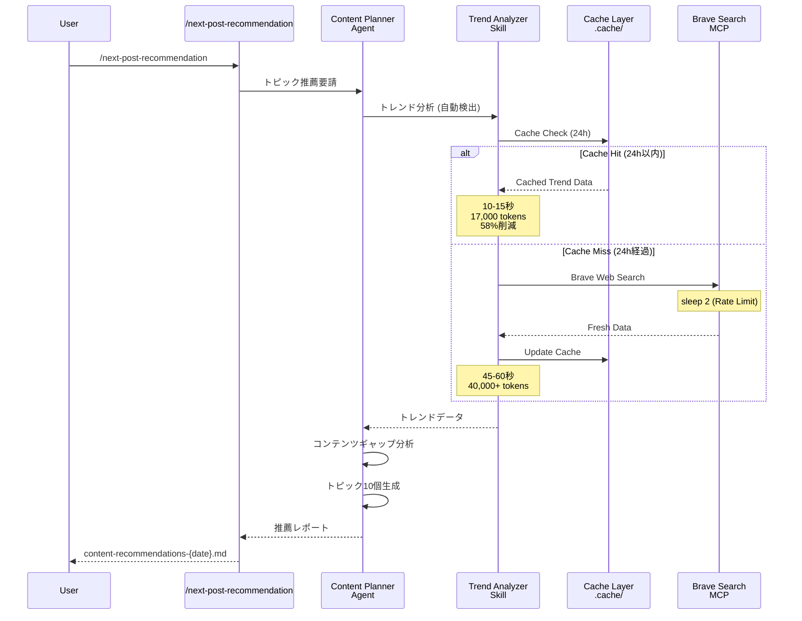

## シリーズ案内

> <strong>EffiFlow 自動化構造分析/評価および改善シリーズ</strong> (2/3)
>
> 1. [Part 1: メタデータで 71%コスト削減](/ja/blog/ja/effiflow-automation-analysis-part1) - 3-Tier アーキテクチャと全体システム概要
> 2. <strong>Part 2: Skills と Commands の統合戦略</strong> ← 現在の記事
> 3. [Part 3: 実践改善事例と ROI 分析](/ja/blog/ja/effiflow-automation-analysis-part3)

## はじめに

Part 1 では、EffiFlow の 3-Tier アーキテクチャ(Agents → Skills → Commands)と、メタデータ優先戦略による 71%コスト削減を見てきました。Part 2 では、このシステムの核心である<strong>Skills の自動検出メカニズム</strong>と<strong>Commands のオーケストレーションパターン</strong>を深く分析します。

核心的な質問は次のとおりです:「Model-Invoked と User-Invoked の違いは何か、そしてどのように 58%のトークン削減を達成したのか?」

## Skills: 自動検出されるモジュール型機能

### Model-Invoked とは?

Skills は<strong>Model-Invoked</strong>方式で動作します。これは、ユーザーが明示的に呼び出さなくても、Claude がコンテキストに基づいて自動的に活性化することを意味します。

例えば、ユーザーが「blog post」や「frontmatter」などのキーワードに言及すると、Claude は自動的に`blog-writing` Skill をロードします。これは専門家が会話のトピックを聞いて、関連ツールを自動的に取り出すようなものです。

### SKILL.md 構造分析

すべての Skill は、YAML frontmatter を含む`SKILL.md`ファイルで定義されます:

```yaml
---
name: blog-writing
description: Create SEO-optimized multi-language blog posts with proper frontmatter, hero images, and content structure. Use when writing blog posts, creating content, or managing blog metadata.
allowed-tools: [Read, Write, Edit, Bash, Grep, Glob]
---
```

<strong>核心要素</strong>:

- <strong>name</strong>: 小文字、ハイフン使用、64 文字以下
- <strong>description</strong>: 機能説明 + 使用タイミング ("Use when...")
- <strong>allowed-tools</strong>: ツール制限でセキュリティ強化および読み取り専用 Skills 実装可能

description の「Use when...」句が特に重要です。Claude はこの句を通じて、Skill をいつ活性化すべきかを判断します。

### 実装された 4 つの Skills 詳細

#### 1. blog-writing (666 行)

<strong>ファイル構造</strong>:

- SKILL.md (73 行): 核心概要
- content-structure.md (328 行): 投稿構造ガイド
- frontmatter-schema.md (173 行): スキーマ詳細説明
- seo-guidelines.md (92 行): SEO 最適化ルール
- 3 つの Python スクリプト (464 行): generate_slug.py, get_next_pubdate.py, validate_frontmatter.py

<strong>核心機能</strong>:

- Frontmatter 検証 (日付形式、必須フィールド、画像パス)
- SEO 最適化 (言語別タイトル/説明長制限)
  - Korean: title 40 文字、description 120 文字
  - English: title 60 文字、description 160 文字
  - Japanese: title 35 文字、description 110 文字
- 多言語サポート (韓国語、英語、日本語)
- Slug 自動生成と pubDate 計算

#### 2. content-analyzer (275 行)

<strong>出力メタデータ</strong>:

```json
{
  "summary": "100-150文字要約",
  "topics": ["トピック1", "トピック2", "トピック3", "トピック4", "トピック5"],
  "techStack": ["技術1", "技術2", "技術3"],
  "difficulty": 3,
  "categoryScores": {
    "automation": 0.8,
    "web-development": 0.6,
    "ai-ml": 0.9,
    "devops": 0.3,
    "architecture": 0.5
  },
  "contentHash": "abc123..."
}
```

<strong>トークン効率性</strong>:

- 全体コンテンツ分析: ~40,000 トークン
- メタデータベース: ~12,000-16,000 トークン
- <strong>60〜70%削減</strong>

<strong>増分処理</strong>: Content Hash で変更検出、不要な再分析防止

#### 3. recommendation-generator (341 行)

<strong>LLM ベースのセマンティック推薦</strong>:

従来の TF-IDF 方式の代わりに Claude LLM を使用して、真の意味理解を実装します:

```
TF-IDF (従来型)         →  LLM (現代型)
キーワード頻度計算      →  全体コンテンツ理解
コサイン類似度          →  セマンティック類似性
キーワード重複ベース    →  コンテキストベース推薦
```

<strong>6 次元類似度分析</strong>:

- topic: トピック類似性 (40%)
- techStack: 技術スタック (25%)
- purpose: 目的整合 (10%)
- complementary: 補完関係 (10%)
- difficulty: 難易度 (15%)
- category: カテゴリ整合

<strong>多言語推論</strong>:

```json
{
  "reason": {
    "ko": "두 글 모두 MCP 서버를 활용한 브라우저 자동화...",
    "ja": "両記事ともMCPサーバーを活用したブラウザ自動化...",
    "en": "Both posts cover MCP server-based browser automation..."
  }
}
```

#### 4. trend-analyzer (605 行)

<strong>Brave Search MCP 統合</strong>:

```bash
# 各検索後必ず2秒遅延 (Rate Limit遵守)
brave_web_search "AI automation tools 2025"
sleep 2
brave_web_search "Claude Code trends 2025"
sleep 2
```

<strong>キャッシング戦略</strong>:

| データ型         | キャッシュ期間 | ファイル位置                | 効果               |
| ---------------- | -------------- | --------------------------- | ------------------ |
| トレンドデータ   | 24 時間        | .cache/trend-data.json      | 同日の重複検索防止 |
| 技術データ       | 7 日間         | .cache/technology-data.json | 週間重複除去       |
| キーワードデータ | 48 時間        | .cache/keyword-data.json    | 2 日以内の再利用   |

<strong>パフォーマンス比較</strong>:

<strong>Before (キャッシング前)</strong>:

- 毎回 Brave Search 呼び出し
- 40,000+トークン
- コスト: ~$0.05/run

<strong>After (キャッシング後)</strong>:

- 24 時間以内のキャッシュ再利用
- 17,000 トークン
- コスト: ~$0.02/run
- <strong>58%削減</strong>

### Progressive Disclosure パターン

Skills はレイヤードコンテキスト提供方式を使用します:



<strong>効果</strong>: 必要な分だけロードして、コンテキスト効率性を最大化

## Commands: ユーザー呼び出しワークフローオーケストレーター

### User-Invoked とは?

Commands は<strong>User-Invoked</strong>方式で動作します。ユーザーが`/command`スラッシュで明示的に呼び出し、`$ARGUMENTS`を通じて引数を渡すことができます。

```bash
/write-post "Claude Code MCP統合ガイド"
/analyze-posts --force
/next-post-recommendation --count 10
```

### 複雑度分布

| 複雑度                     | Commands                                                                                     | 平均行数 |
| -------------------------- | -------------------------------------------------------------------------------------------- | -------- |
| <strong>Very High</strong> | write-post (1,080 行), write-post-ko (1,063 行), write-ga-post (745 行)                      | 963 行   |
| <strong>High</strong>      | analyze-posts (444 行), generate-recommendations (514 行), next-post-recommendation (551 行) | 503 行   |
| <strong>Low</strong>       | commit (11 行)                                                                               | 11 行    |

### Phase-Based Execution パターン

複雑な Commands は明確な Phase で区分されます。`write-post`の 8 Phases を見てみましょう:



<strong>Phase 詳細内容</strong>:

<strong>Phase 1: Research & Planning</strong>

- Web Researcher エージェント呼び出し
- Trend Analyzer Skill 自動検出
- Brave Search MCP で最新情報収集
- 2 秒遅延で Rate Limit 遵守

<strong>Phase 2: Image Generation</strong>

- Image Generator エージェント
- Gemini API 使用 (GEMINI_API_KEY 必要)
- トピックベースのヒーロー画像生成

<strong>Phase 3: Content Writing</strong>

- Writing Assistant エージェント
- Blog Writing Skill 自動検出
- 韓国語、日本語、英語版同時作成
- ローカライゼーション (翻訳ではない)

<strong>Phase 4: Frontmatter & Metadata</strong>

- Blog Writing Skill で Frontmatter 検証
- pubDate: 'YYYY-MM-DD'形式 (シングルクォート)
- heroImage: 相対パス検証

<strong>Phase 5: Metadata Generation</strong>

- Post Analyzer エージェント
- Content Analyzer Skill 自動活性化
- difficulty (1-5)および categoryScores 計算

<strong>Phase 6: V3 Recommendations</strong>

- scripts/generate-recommendations-v3.js 実行
- メタデータベースの類似度計算
- 上位 5 つの関連投稿選定

<strong>Phase 7: Backlink Updates</strong>

- Backlink Manager エージェント (オプション)
- 関連投稿相互連結

<strong>Phase 8: Validation & Build</strong>

- npm run astro check
- npm run build
- ファイルパスとメタデータ要約返却

### Agent Orchestration パターン

Commands はオーケストレーターの役割を果たし、実際の作業は Agents に委任します:



<strong>効果</strong>:

- <strong>関心事の分離</strong>: Command はワークフローのみ定義
- <strong>再利用性</strong>: Agent と Skill は複数の Command で使用
- <strong>メンテナンス</strong>: 各コンポーネント独立修正可能
- <strong>テスト</strong>: 各レイヤー別テスト可能

## キャッシング戦略: 58%トークン削減メカニズム

### trend-analyzer の 3-Tier キャッシング

trend-analyzer Skill は 3 種類のデータを異なる期間キャッシュします:

```typescript
// キャッシングアルゴリズム (疑似コード)
async function getTrendData(topic: string) {
  const cacheKey = `trend-${topic}`;
  const cached = cache.get(cacheKey);

  // キャッシュヒット: 有効期間内
  if (cached && !isExpired(cached, 24 * 60 * 60)) {
    console.log("Cache hit: Returning cached data");
    return cached.data; // 即時返却、API呼び出しなし
  }

  // キャッシュミス: 新しい検索必要
  console.log("Cache miss: Fetching from Brave Search");
  const data = await braveSearch(topic);
  await sleep(2000); // Rate Limit遵守

  // キャッシュ保存
  cache.set(cacheKey, {
    data,
    timestamp: Date.now(),
    expiresAt: Date.now() + 24 * 60 * 60 * 1000,
  });

  return data;
}
```

### キャッシュ効果シナリオ

<strong>シナリオ 1: 同日の複数トピック検索</strong>

```bash
# 最初のトピック (キャッシュミス)
/next-post-recommendation --category ai-ml
# → Brave Search呼び出し15回
# → 所要時間: 45-60秒
# → トークン: 40,000+

# 2番目のトピック (キャッシュヒット80%)
/next-post-recommendation --category web-development
# → Brave Search呼び出し3回 (新規クエリのみ)
# → 所要時間: 10-15秒
# → トークン: 17,000 (58%削減)
```

<strong>シナリオ 2: 翌日同じトピック</strong>

```bash
# 24時間経過 (キャッシュ失効)
/next-post-recommendation --category ai-ml
# → 再度Brave Search呼び出し15回
# → 最新トレンド反映
```

### パフォーマンス比較表

| 項目                          | キャッシング前 | キャッシング後 | 削減 |
| ----------------------------- | -------------- | -------------- | ---- |
| <strong>トークン使用</strong> | 40,000+        | 17,000         | 58%  |
| <strong>API 呼び出し</strong> | 15 回          | 3 回 (平均)    | 80%  |
| <strong>所要時間</strong>     | 45-60 秒       | 10-15 秒       | 75%  |
| <strong>コスト</strong>       | ~$0.05         | ~$0.02         | 60%  |

## 統合ワークフロー実践例

### 例 1: ブログ投稿作成 (/write-post)

全体の呼び出しチェーンを可視化すると:

```mermaid
flowchart TD
    Start([User: /write-post 'Claude Code MCP']) --> CMD{Command<br/>write-post}

    CMD --> P1[Phase 1: Research & Planning]
    P1 --> WR[Web Researcher Agent]
    WR --> TA[Trend Analyzer Skill<br/>自動検出]
    TA --> BS[Brave Search MCP]
    BS --> Sleep1[sleep 2<br/>Rate Limit]
    Sleep1 --> Cache1{Cache<br/>Check}
    Cache1 -->|Hit| Return1[Cached Data<br/>17K tokens]
    Cache1 -->|Miss| Search1[New Search<br/>40K+ tokens]
    Search1 --> Return1
    Return1 --> P1Done[Research Complete]

    P1Done --> P2[Phase 2: Image Generation]
    P2 --> IG[Image Generator Agent]
    IG --> Gemini[Gemini API]
    Gemini --> P2Done[Hero Image Saved]

    P2Done --> P3[Phase 3: Content Writing]
    P3 --> WA[Writing Assistant Agent]
    WA --> BW[Blog Writing Skill<br/>自動検出]
    BW --> Multi[3言語投稿生成<br/>ko, ja, en]
    Multi --> P3Done[Content Created]

    P3Done --> P4[Phase 4: Frontmatter]
    P4 --> Validate[Frontmatter検証]
    Validate --> P4Done[Validation Pass]

    P4Done --> P5[Phase 5: Metadata]
    P5 --> PA[Post Analyzer Agent]
    PA --> CA[Content Analyzer Skill<br/>自動]
    CA --> Hash{Content<br/>Hash}
    Hash -->|Changed| Analyze[New Analysis<br/>12K tokens]
    Hash -->|Unchanged| Skip[Skip Analysis<br/>0 tokens]
    Analyze --> P5Done[Metadata Saved]
    Skip --> P5Done

    P5Done --> P6[Phase 6: Recommendations]
    P6 --> Script[generate-recommendations-v3.js]
    Script --> Sim[Similarity Calculation]
    Sim --> P6Done[Top 5 Related Posts]

    P6Done --> P7[Phase 7: Backlinks]
    P7 --> BM[Backlink Manager]
    BM --> Update[Update Related Posts]
    Update --> P7Done[Cross-links Created]

    P7Done --> P8[Phase 8: Build]
    P8 --> Check[astro check]
    Check --> Build[npm run build]
    Build --> End([Posts Published])

    style Start fill:#8B5CF6,stroke:#7C3AED,stroke-width:2px,color:#fff
    style CMD fill:#8B5CF6,stroke:#7C3AED,stroke-width:3px,color:#fff
    style WR fill:#3B82F6,stroke:#2563EB,stroke-width:2px,color:#fff
    style IG fill:#F97316,stroke:#EA580C,stroke-width:2px,color:#fff
    style WA fill:#14B8A6,stroke:#0D9488,stroke-width:2px,color:#fff
    style PA fill:#3B82F6,stroke:#2563EB,stroke-width:2px,color:#fff
    style BM fill:#14B8A6,stroke:#0D9488,stroke-width:2px,color:#fff
    style TA fill:#10B981,stroke:#059669,stroke-width:2px,color:#fff
    style BW fill:#10B981,stroke:#059669,stroke-width:2px,color:#fff
    style CA fill:#10B981,stroke:#059669,stroke-width:2px,color:#fff
    style Cache1 fill:#F59E0B,stroke:#D97706,stroke-width:2px,color:#fff
    style Return1 fill:#F59E0B,stroke:#D97706,stroke-width:2px,color:#fff
    style End fill:#10B981,stroke:#059669,stroke-width:2px,color:#fff
```



<strong>トークン使用量分析</strong>:

| Phase                 | 主要作業       | トークン使用              | 最適化                        |
| --------------------- | -------------- | ------------------------- | ----------------------------- |
| Phase 1               | Web リサーチ   | 17,000 (キャッシュヒット) | 58%削減                       |
| Phase 3               | コンテンツ作成 | 15,000                    | -                             |
| Phase 5               | メタデータ     | 12,000 (増分処理)         | 70%削減                       |
| Phase 6               | 推薦生成       | 3,000 (メタデータベース)  | 60%削減                       |
| <strong>合計</strong> |                | <strong>47,000</strong>   | <strong>平均 63%削減</strong> |

### 例 2: メタデータと推薦パイプライン



<strong>データフロー</strong>:

1. <strong>/analyze-posts</strong>: 韓国語投稿のみ分析 (3 倍コスト削減)

   - Content Hash で変更検出
   - 変更された投稿のみ再分析
   - post-metadata.json 更新

2. <strong>/generate-recommendations</strong>: LLM ベースのセマンティック推薦

   - メタデータベース分析 (60-70%トークン削減)
   - 6 次元類似度計算
   - V2: recommendations.json 生成 (レガシー)
   - V3: frontmatter の relatedPosts に直接追加 (現在)

3. <strong>RelatedPosts Component</strong>: ブログ投稿に推薦表示

### 例 3: トレンドベースのトピック推薦

キャッシング活用フロー:



## $ARGUMENTS 活用パターン

Commands は`$ARGUMENTS`を通じて柔軟な引数渡しをサポートします。

### シンプルパターン (analyze-posts)

```markdown
/analyze-posts $ARGUMENTS

# 使用例

/analyze-posts --force # 全体再生成
/analyze-posts --post my-slug # 特定投稿のみ
/analyze-posts --verify # 検証モード
```

### 複雑パターン (write-post)

```markdown
Topic: $ARGUMENTS

# パースロジック

topic = args[0] # 最初の引数: トピック
flags = parseFlags(args[1:]) # 残り: フラグ

# 使用例

/write-post "Claude Code MCP 統合ガイド" --tags ai,mcp,automation --languages ko,ja
```

<strong>フラグパース例</strong>:

```typescript
function parseArguments(args: string[]) {
  const result = {
    topic: args[0],
    tags: [],
    languages: ["ko", "ja", "en"], // デフォルト値
    description: "",
  };

  for (let i = 1; i < args.length; i++) {
    if (args[i] === "--tags" && args[i + 1]) {
      result.tags = args[i + 1].split(",");
      i++;
    } else if (args[i] === "--languages" && args[i + 1]) {
      result.languages = args[i + 1].split(",");
      i++;
    } else if (args[i] === "--description" && args[i + 1]) {
      result.description = args[i + 1];
      i++;
    }
  }

  return result;
}
```

## 実践適用ガイド

### Skill 作成 (ステップバイステップ)

<strong>ステップ 1: ディレクトリ作成</strong>

```bash
mkdir -p .claude/skills/my-skill
cd .claude/skills/my-skill
```

<strong>ステップ 2: SKILL.md 作成</strong>

```markdown
---
name: my-skill
description: Brief description of what this skill does. Use when [specific trigger condition].
allowed-tools: [Read, Write, Bash]
---

# My Skill

## Core Capabilities

1. **Feature 1**: Description
2. **Feature 2**: Description

## Workflow

### Phase 1: Input Processing

...

### Phase 2: Main Logic

...

### Phase 3: Output Generation

...

## Examples

...
```

<strong>ステップ 3: サポートファイル追加 (オプション)</strong>

```bash
# 詳細ガイド
touch detailed-guide.md

# スクリプト
mkdir scripts
touch scripts/helper.py
```

<strong>ステップ 4: テスト</strong>

```bash
# Claudeとの対話でトリガーキーワード使用
"Please use my-skill to process this data..."
```

### Command 作成 (ステップバイステップ)

<strong>ステップ 1: ファイル作成</strong>

```bash
touch .claude/commands/my-command.md
```

<strong>ステップ 2: ワークフロー定義</strong>

```markdown
# My Command

Execute [specific workflow] with [parameters].

## Usage

\`\`\`bash
/my-command $ARGUMENTS
\`\`\`

## Arguments

- \`<required>\`: Description
- \`--optional\`: Description

## Workflow

### Phase 1: Preparation

1. Parse arguments
2. Validate inputs
3. Load dependencies

### Phase 2: Execution

1. Call Agent A
2. Process results
3. Call Agent B

### Phase 3: Finalization

1. Validate outputs
2. Save results
3. Return summary

## Example

\`\`\`bash
/my-command "input" --flag value
\`\`\`

## Output

...

## Related Files

- Agent: `.claude/agents/my-agent.md`
- Skill: `.claude/skills/my-skill/SKILL.md`
```

<strong>ステップ 3: Agent 呼び出しパターン</strong>

```markdown
### Phase 2: Main Processing

Delegate to specialized agent:

\`\`\`
@my-agent "Process this data with specific instructions"
\`\`\`

The agent will:

1. Automatically discover relevant skills
2. Execute the workflow
3. Return structured results
```

<strong>ステップ 4: テスト</strong>

```bash
# Claudeとの対話でCommand実行
/my-command "test input" --verbose
```

## パフォーマンス最適化技法

### 1. キャッシング (58%削減)

<strong>実装方法</strong>:

```typescript
interface CacheEntry {
  data: any;
  timestamp: number;
  expiresAt: number;
}

class SimpleCache {
  private cache: Map<string, CacheEntry> = new Map();

  set(key: string, data: any, ttlSeconds: number) {
    this.cache.set(key, {
      data,
      timestamp: Date.now(),
      expiresAt: Date.now() + ttlSeconds * 1000,
    });
  }

  get(key: string): any | null {
    const entry = this.cache.get(key);
    if (!entry) return null;

    if (Date.now() > entry.expiresAt) {
      this.cache.delete(key);
      return null;
    }

    return entry.data;
  }
}
```

<strong>失効ポリシー</strong>:

- トレンドデータ: 24 時間 (急速に変化)
- 技術ドキュメント: 7 日間 (週次更新)
- キーワード: 48 時間 (中間速度)

### 2. 増分処理 (70%削減)

<strong>Content Hash 実装</strong>:

```typescript
import crypto from "crypto";

function calculateContentHash(content: string): string {
  return crypto.createHash("sha256").update(content).digest("hex");
}

async function incrementalAnalysis(post: BlogPost) {
  const currentHash = calculateContentHash(post.content);
  const existingMetadata = await loadMetadata(post.slug);

  // 変更検出
  if (existingMetadata?.contentHash === currentHash) {
    console.log(`Skipping ${post.slug}: No changes`);
    return existingMetadata; // 既存メタデータ再利用
  }

  // 変更あり: 再分析必要
  console.log(`Analyzing ${post.slug}: Content changed`);
  const metadata = await analyzeContent(post);
  metadata.contentHash = currentHash;

  await saveMetadata(post.slug, metadata);
  return metadata;
}
```

<strong>効果測定</strong>:

| シナリオ               | Before          | After           | 削減                 |
| ---------------------- | --------------- | --------------- | -------------------- |
| 新規投稿 1 つ          | 3,000 トークン  | 3,000 トークン  | 0%                   |
| 既存 13 個 + 新規 1 個 | 42,000 トークン | 3,000 トークン  | 93%                  |
| 全体再分析 (--force)   | 42,000 トークン | 42,000 トークン | 0%                   |
| <strong>平均</strong>  |                 |                 | <strong>70%</strong> |

### 3. 並列実行 (予告)

Part 3 で詳細に扱う予定:

```typescript
// 順次処理 (現在)
for (const post of posts) {
  await analyzePost(post); // 2分
}

// 並列処理 (改善案)
await Promise.all(posts.map((post) => analyzePost(post))); // 30秒 (70%短縮)
```

## ベストプラクティス

### Skills 作成

✅ <strong>SKILL.md 必須</strong>

- 100 行以下推奨 (長い場合はサポート文書に分離)
- YAML frontmatter の完成度を高く

✅ <strong>明確な description</strong>

- "Use when..."句を含める
- トリガー条件を明示

✅ <strong>allowed-tools で権限制限</strong>

- セキュリティ: 不要なツール除外
- 読み取り専用 Skills: [Read, Grep, Glob]のみ

✅ <strong>Progressive Disclosure</strong>

- SKILL.md: 核心概要
- サポート文書: 詳細ガイド
- スクリプト: 実行ロジック

### Commands 作成

✅ <strong>Phase ベース実行</strong>

- 明確なステップ区分
- Phase 1-8 形式

✅ <strong>Agent 委任パターン</strong>

- Command はオーケストレーターのみ
- 実際の作業は Agent に

✅ <strong>検証ステップを含める</strong>

- Phase 最後: 常に検証
- astro check、build 実行

✅ <strong>エラー処理</strong>

- 前提条件を明示
- 失敗時の復旧方法を提供

## シリーズ次回予告

### Part 3: 実践改善事例と ROI 分析

<strong>扱う内容</strong>:

1. <strong>並列処理実装</strong> (70%時間短縮)

   - Promise.all 活用
   - 同時実行制御
   - エラーハンドリング

2. <strong>自動化されたテスト</strong> (品質保証)

   - Skill 単位テスト
   - Command 統合テスト
   - CI/CD 統合

3. <strong>リトライロジック</strong> (安定性向上)

   - Web 検索失敗復旧
   - Exponential Backoff
   - 部分的失敗処理

4. <strong>ROI 分析</strong> (投資 vs 効果)

   - 開発時間投資
   - 削減されたコスト計算
   - Break-Even Point

5. <strong>Top 3 Quick Wins</strong> (即時適用可能)
   - Dry-Run モード
   - Interactive モード
   - Cost Tracking Dashboard

<strong>期待効果</strong>:

- 処理時間: 2 分 → 30 秒 (75%短縮)
- テストカバレッジ: 0% → 80%
- 安定性: 95% → 99%

## 結論

Part 2 では、EffiFlow の核心である Skills と Commands の統合戦略を深く分析しました。

<strong>核心インサイト</strong>:

1. <strong>Skills の自動検出</strong>: Model-Invoked 方式でコンテキストベース活性化
2. <strong>Commands のオーケストレーション</strong>: User-Invoked、Phase ベース実行、Agent 委任
3. <strong>キャッシングで 58%削減</strong>: 3-Tier キャッシング戦略 (24h/7d/48h)
4. <strong>Progressive Disclosure</strong>: レイヤードコンテキストで効率性最大化
5. <strong>メタデータ優先</strong>: 60-70%トークン削減

<strong>実践活用</strong>:

- `/write-post`: 8-Phase 完全自動化
- `/analyze-posts`: 増分処理で 70%削減
- `/next-post-recommendation`: キャッシングで 58%削減

Part 3 では、このアーキテクチャをさらに改善して処理時間を 75%短縮し、テストカバレッジを 80%に高め、安定性を 99%まで向上させる実践改善事例を扱います。

EffiFlow の革新は続きます。次回でお会いしましょう! 🚀
