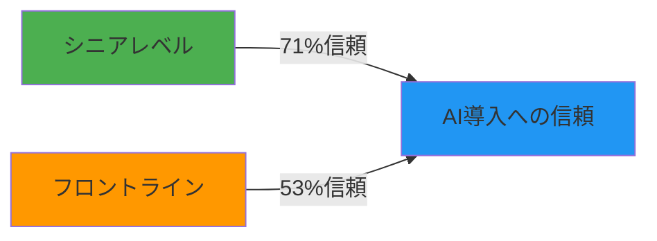
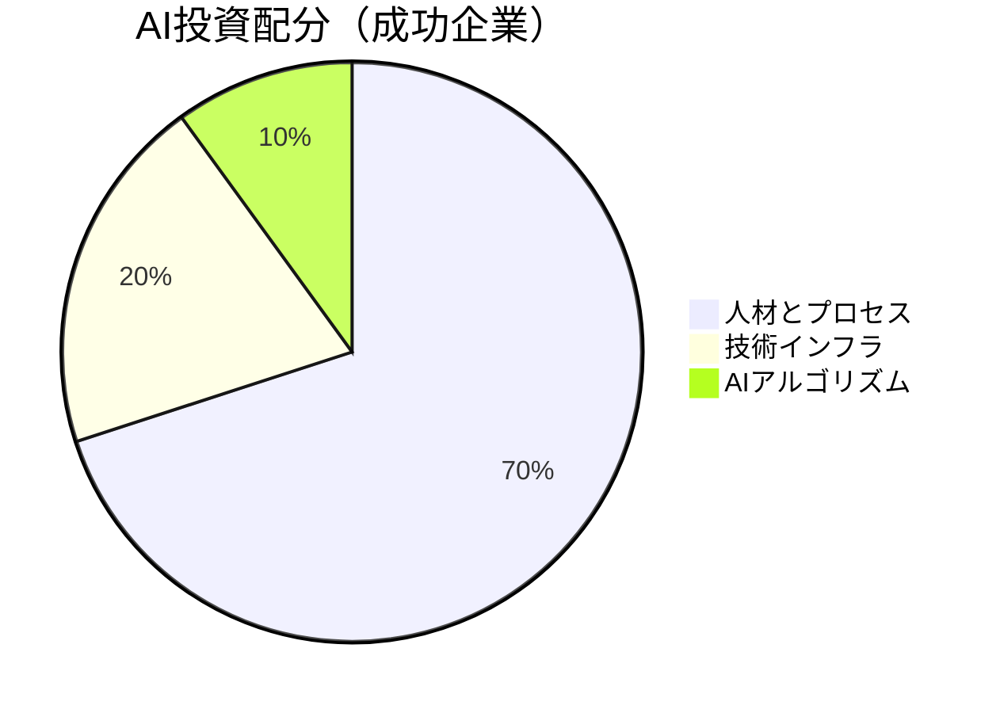
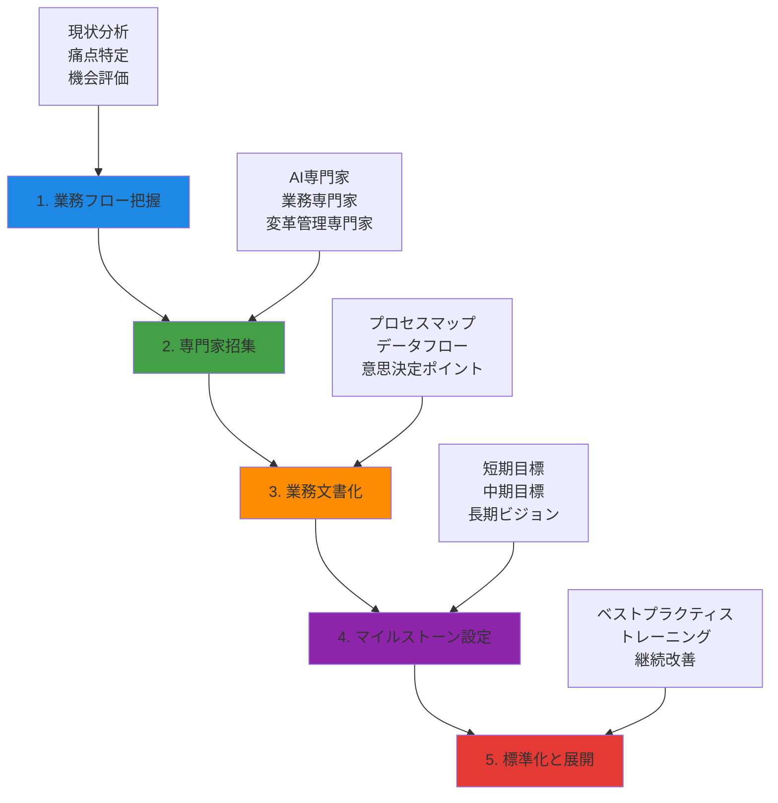
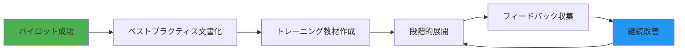

## 概要

生成AI技術の急速な発展により、多くの企業がAI導入を急いでいます。しかし、現実は厳しいものです。<strong>S&P Globalによると、2025年のAIプロジェクト失敗率は42%に達する</strong>と予測されています。MITの調査ではさらに衝撃的な数字が示されており、<strong>95%のAIパイロットプロジェクトが失敗し、わずか5%のみが収益加速化に成功している</strong>と報告されています。

本記事では、なぜこれほど多くのAI導入プロジェクトが失敗するのか、そしてなぜボトムアップではなくトップダウンアプローチが必要なのかを、具体的なデータと組織行動学の観点から解説します。

## AI導入の現実：驚くべき失敗率

### 主要調査結果

複数の権威ある機関が、AI導入の厳しい現実を報告しています：

| 調査機関 | 失敗率/主要発見 | 出典 |
|---------|----------------|------|
| S&P Global | 2025年AIプロジェクト失敗率42% | S&P Global Market Intelligence |
| MIT | 95%のAIパイロットが失敗、5%のみ収益加速化 | MIT Sloan Management Review |
| Gartner | 2025年までに50%の生成AIプロジェクトがパイロット段階で中止 | Gartner Research |
| McKinsey | AI成功の最大の障壁はリーダーシップ | McKinsey Global Survey |
| Writer Report | 内部の権力争い、低いROI、経営陣と従業員間の視点の衝突 | Writer AI Adoption Report 2024 |

これらの数字は、AI技術そのものの問題ではなく、<strong>組織のアプローチと変革管理の問題</strong>を示しています。

### なぜ失敗するのか：3つの主要要因

1. <strong>データ品質の問題</strong>
   - 不完全なデータセット
   - 一貫性のないデータフォーマット
   - レガシーシステムとの統合の難しさ

2. <strong>統合の複雑さ</strong>
   - 既存業務プロセスとの整合性欠如
   - 部門間のサイロ化
   - 技術的負債の蓄積

3. <strong>不明確な価値提案</strong>
   - ROIの測定困難
   - 短期的な成果への期待
   - ビジネス目標との不整合

## シニア vs ジュニア：信頼格差の現実

### 18%pの信頼格差

Writer Reportの調査によると、AI導入に関する企業への信頼度において、<strong>シニアレベルとフロントライン従業員の間に18ポイントの格差</strong>が存在しています：



- <strong>シニアレベル</strong>：71%がAI導入を信頼
- <strong>フロントライン従業員</strong>：53%のみが信頼

この格差は単なる数字ではありません。組織内の視点の違い、情報の非対称性、そして<strong>実務者と意思決定者の間の断絶</strong>を示しています。

### 視点の衝突

| 視点 | シニア/経営陣 | フロントライン/実務者 |
|------|---------------|---------------------|
| <strong>焦点</strong> | 戦略的ROI、市場競争力 | 日常業務への影響、実用性 |
| <strong>時間軸</strong> | 長期的（1〜3年） | 短期的（数週間〜数ヶ月） |
| <strong>リスク認識</strong> | ビジネスリスク、競争劣位 | 業務中断、学習コスト |
| <strong>成功指標</strong> | 売上、効率性、イノベーション | 使いやすさ、信頼性、サポート |

この視点の違いが、ボトムアップアプローチの限界を生み出しています。

## ボトムアップの限界：人間本性と合理性の神話

### 人間は合理的ではない

経済学や組織論の多くは、人間が合理的に行動すると仮定しています。しかし、現実は異なります：

> 「人間は皆、成長や業務改善のために働いているわけではない。多くの人は現状維持を好み、変化に抵抗する。」

これは怠惰や無能力の問題ではありません。むしろ、<strong>認知バイアスと組織文化の自然な結果</strong>です。

### ボトムアップが機能しない理由

1. <strong>現状維持バイアス（Status Quo Bias）</strong>
   - 人間は変化よりも現状を好む傾向がある
   - 新しいツールやプロセスの学習コストを過大評価
   - 既存の方法に慣れている安心感

2. <strong>情報の非対称性</strong>
   - 個々の従業員は全体最適を知らない
   - 部門ごとに異なる優先順位と利害
   - 全社的な視点の欠如

3. <strong>インセンティブの不整合</strong>
   - 個人の評価基準とAI導入目標の不一致
   - 短期的な業績評価が変革を阻害
   - リスクを取ることへの報酬不足

4. <strong>専門知識の欠如</strong>
   - AI技術の理解不足
   - ベストプラクティスの知識不足
   - 業界標準への無知

### BCGの成功パターン分析

BCGの調査によると、AI導入に成功している企業は以下のような投資配分をしています：



注目すべきは、<strong>70%が人材とプロセス</strong>に投資されている点です。技術そのものではなく、<strong>組織変革と能力開発が成功の鍵</strong>だということです。

## トップダウンアプローチ：体系的な導入戦略

### なぜトップダウンが必要か

McKinseyの調査が示すように、<strong>AI成功の最大の障壁はリーダーシップ</strong>です。トップダウンアプローチが必要な理由：

1. <strong>全体最適の視点</strong>
   - 部門を超えた統合的な計画
   - リソースの効率的な配分
   - 優先順位の明確化

2. <strong>強制力と標準化</strong>
   - 組織全体での統一基準
   - 抵抗の克服
   - 変革の推進力

3. <strong>リスク管理</strong>
   - 体系的なリスク評価
   - 段階的な展開
   - 失敗からの学習メカニズム

### 5段階の導入プロセス



#### 1. 業務フロー把握（Business Process Mapping）

<strong>誰が主導すべきか</strong>：業務フローを深く理解している中堅管理職やシニアマネージャー

- 現状の業務プロセスを詳細にマッピング
- ボトルネックと非効率な部分を特定
- AI導入による改善可能性の評価
- データフローと意思決定ポイントの分析

<strong>重要なポイント</strong>：
```
「業務フローを理解していない人が主導すると、
技術のための技術になり、実務で使われないツールが生まれる。」
```

#### 2. 専門家招集（Expert Assembly）

3つのタイプの専門家が必要です：

| 専門家タイプ | 役割 | 重要性 |
|-------------|------|--------|
| <strong>AI技術専門家</strong> | 技術的実現可能性の評価 | ⭐⭐⭐⭐⭐ |
| <strong>業務専門家</strong> | 実務要件の定義 | ⭐⭐⭐⭐⭐ |
| <strong>変革管理専門家</strong> | 組織変革の設計と実行 | ⭐⭐⭐⭐⭐ |

すべてが同等に重要です。一つでも欠けると失敗のリスクが急増します。

#### 3. 業務文書化（Process Documentation）

標準化された文書化が必要です：

```markdown
## 業務プロセス文書テンプレート

### プロセス名
[プロセスの正式名称]

### 目的
[このプロセスが達成すべきビジネス目標]

### ステークホルダー
- 責任者：[役職/名前]
- 実行者：[役職/チーム]
- 承認者：[役職/名前]

### 現状のプロセスフロー
1. [ステップ1]
2. [ステップ2]
...

### データフロー
- 入力データ：[データソース、フォーマット]
- 処理：[データ変換、計算]
- 出力データ：[結果、配信先]

### 痛点とボトルネック
- [特定された問題点1]
- [特定された問題点2]

### AI導入案
- 自動化可能な部分：[具体的な範囲]
- 期待される効果：[定量的な目標]
- 必要なデータ：[データ要件]
- リスク：[潜在的な問題]
```

#### 4. マイルストーン設定（Milestone Planning）

明確な段階的目標が必要です：

<strong>短期目標（1〜3ヶ月）</strong>：
- パイロットプロジェクトの実施
- 初期データ収集と分析
- 基本的な自動化の実装
- フィードバックループの確立

<strong>中期目標（3〜6ヶ月）</strong>：
- パイロット結果の評価と改善
- 段階的な展開開始
- トレーニングプログラムの実施
- KPIの測定と調整

<strong>長期目標（6〜12ヶ月）</strong>：
- 全社展開
- ベストプラクティスの確立
- 継続的改善プロセスの導入
- ROIの実証

#### 5. 標準化と展開（Standardization & Rollout）

最終段階では、学んだことを標準化し、組織全体に展開します：



<strong>標準化の要素</strong>：
- プロセス標準
- データ標準
- ツール標準
- 評価基準

### 成功の鍵：変革管理

技術の導入は容易ですが、<strong>人と組織の変革が最も困難</strong>です。

<strong>変革管理の原則</strong>：

1. <strong>コミュニケーション</strong>
   - なぜ変革が必要か明確に説明
   - 定期的な進捗報告
   - 双方向のフィードバック

2. <strong>トレーニング</strong>
   - 役割別のトレーニングプログラム
   - ハンズオン実習
   - 継続的なサポート

3. <strong>インセンティブ</strong>
   - 変革への参加を評価
   - 成功事例の共有と表彰
   - キャリアパスとの連携

4. <strong>忍耐</strong>
   - 変革には時間がかかる
   - 抵抗は自然な反応
   - 小さな勝利を積み重ねる

## 実践的な推奨事項

### 経営陣へ

1. <strong>リーダーシップのコミットメント</strong>
   - AI導入を戦略的優先事項として位置づける
   - 十分なリソース（予算、人材、時間）を配分
   - 個人的に関与し、進捗を監視

2. <strong>現実的な期待値設定</strong>
   - 短期的な失敗を許容
   - 長期的なビジョンを持つ
   - ROIの測定方法を事前に定義

3. <strong>組織文化の変革</strong>
   - 実験と学習を奨励
   - 失敗から学ぶ文化
   - データ駆動の意思決定

### 中間管理職へ

1. <strong>業務理解の深化</strong>
   - 現状プロセスを詳細にマッピング
   - チームの痛点を特定
   - 改善機会を積極的に提案

2. <strong>橋渡し役</strong>
   - 経営陣のビジョンを実務に翻訳
   - チームの懸念を経営陣に伝達
   - 変革の実行責任者として機能

3. <strong>チームのサポート</strong>
   - トレーニングとリソースを提供
   - 抵抗を理解し対応
   - 小さな成功を祝う

### 実務担当者へ

1. <strong>オープンマインド</strong>
   - 新しいツールを試す意欲
   - フィードバックを積極的に提供
   - 学習機会として捉える

2. <strong>現実的な評価</strong>
   - AIは万能ではない
   - どこで役立ち、どこで役立たないかを識別
   - 実用性に基づく判断

3. <strong>積極的な参加</strong>
   - パイロットプログラムに参加
   - 改善提案を提出
   - 同僚を支援

## 結論：失敗を避けるための必須要件

生成AI導入の高い失敗率（42%〜95%）は、技術の問題ではなく、<strong>アプローチと変革管理の問題</strong>です。

<strong>ボトムアップアプローチの限界</strong>：
- 人間は必ずしも合理的ではない
- 現状維持バイアスが強い
- 全体最適の視点が欠如
- 専門知識と標準化が不足

<strong>トップダウンアプローチの必要性</strong>：
- 業務フローを把握している人が主導
- 専門家チームを組織的に招集
- 体系的な業務文書化
- 明確なマイルストーン設定
- 標準化と段階的展開

<strong>成功の方程式</strong>：

```
AI導入成功 =
  リーダーシップコミットメント (30%) +
  業務理解と文書化 (25%) +
  専門家チームの構成 (20%) +
  変革管理 (15%) +
  技術実装 (10%)
```

技術は全体の10%に過ぎません。<strong>90%は人と組織の問題</strong>です。

### 最後に

AI導入は技術プロジェクトではなく、<strong>組織変革プロジェクト</strong>です。技術を導入することは比較的簡単ですが、人々が実際にそれを使い、価値を生み出すようにすることが本当の挑戦です。

トップダウンアプローチは独裁的であることを意味しません。むしろ、<strong>体系的で責任ある変革管理</strong>を意味します。業務を理解し、専門家を招集し、文書化し、マイルストーンを設定し、標準化する。これらすべてには、組織の上層部からの明確なリーダーシップとコミットメントが必要です。

42%の失敗組織にならないために、今すぐ行動を起こしましょう。

---

## 参考文献

1. S&P Global Market Intelligence - "AI Project Failure Rates in 2025"
2. MIT Sloan Management Review - "Winning With AI"
3. Gartner Research - "Predicts 2025: Generative AI"
4. McKinsey Global Survey - "The State of AI in 2024"
5. Writer AI Adoption Report 2024
6. BCG - "AI Investment Patterns in Successful Organizations"
7. Harvard Business Review - "Why So Many High-Profile Digital Transformations Fail"
