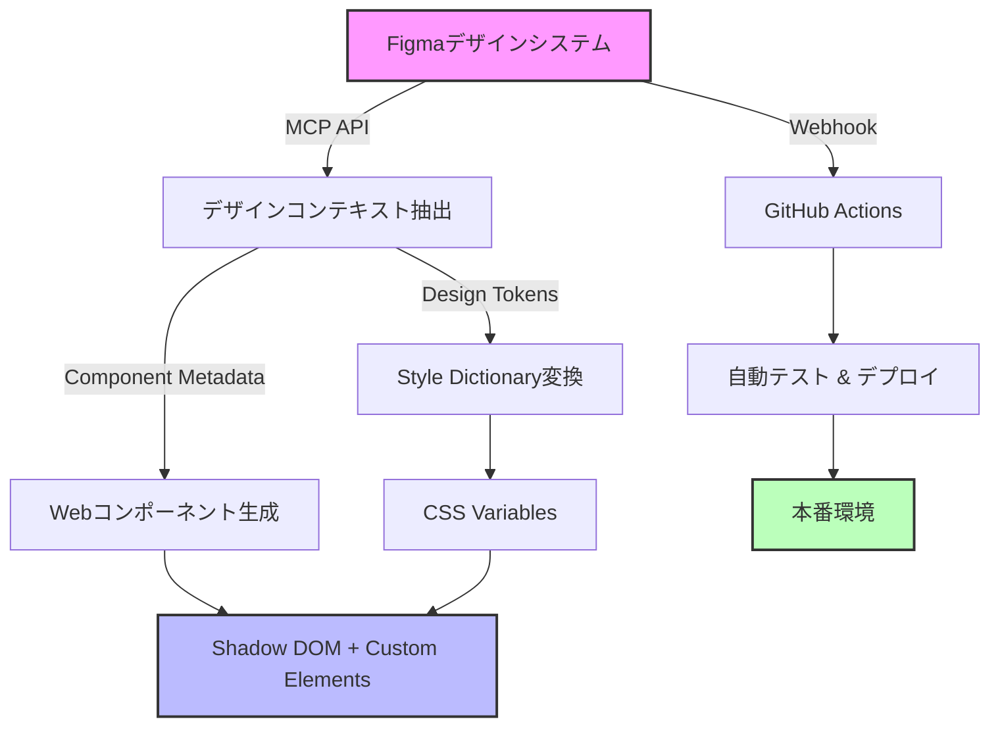
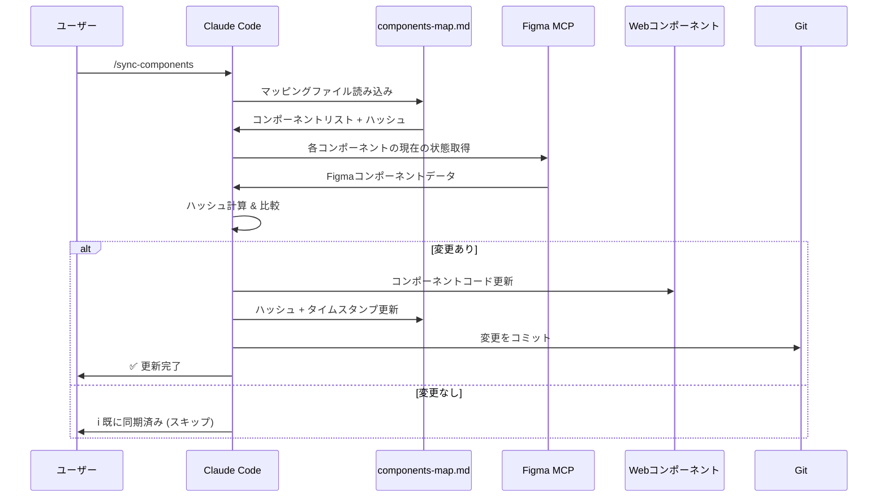

## 概要

デザインとコードの間のギャップは、長年にわたりフロントエンド開発の最大の課題でした。デザイナーがFigmaで完璧なUIを作成しても、開発者がそれをコードに変換する過程で一貫性が失われ、デザインシステムの維持が困難になります。

2025年現在、Figmaの<strong>Model Context Protocol(MCP)</strong>と<strong>Webコンポーネント</strong>、そして<strong>継続的同期(Continuous Synchronization)</strong>を組み合わせることで、この問題を根本的に解決できるようになりました。

本ガイドでは、以下の内容を詳しく解説します:

- Figma MCPを理解し、AIエージェントがデザインコンテキストにアクセスする方法
- 2025年基準で完全にサポートされたバニラJavaScript Webコンポーネントの活用
- Figmaコンポーネントライブラリの構築戦略(Atomic Design)
- デザイントークン抽出と変換(Style Dictionary活用)
- Webhook基盤のリアルタイム継続的同期実装
- 実際の事例研究(IBM Carbon、Uber Design System)



## 1. Figma MCPを理解する

### 1.1 Model Context Protocolとは

<strong>Model Context Protocol(MCP)</strong>は、Anthropicが開発したオープン標準プロトコルで、AIアシスタントと外部データソースを接続します。Figmaの実装により、AIエージェントはFigmaファイルから直接デザインコンテキストを取得できます。

<strong>公式説明:</strong>
> "MCPは、異なるAIエージェントとアプリケーション、または外部システム(Figmaなど)が相互に通信する方法を定義するオープンソース標準です。"

### 1.2 2つの配置モード

#### リモートサーバー(Figmaホスト)

```javascript
// Claude Desktop設定例
{
  "mcpServers": {
    "figma-remote": {
      "url": "https://mcp.figma.com/mcp"
    }
  }
}
```

<strong>特徴:</strong>
- URL: `https://mcp.figma.com/mcp`
- OAuth基盤認証(ワンクリック設定)
- ローカルインストール不要
- Professional/Organization/Enterpriseプラン + Dev Seatが必要
- レート制限: Tier 1 Figma REST API制限

#### デスクトップサーバー(ローカル)

```javascript
// VS Code/Cursor設定例
{
  "mcpServers": {
    "figma-desktop": {
      "url": "http://127.0.0.1:3845/mcp"
    }
  }
}
```

<strong>特徴:</strong>
- ローカルで`http://127.0.0.1:3845/mcp`にて実行
- Figmaデスクトップアプリ(最新バージョン)が必要
- ローカル認証使用
- すべてのプランタイプで使用可能
- Starterプランでは月6回のツール呼び出しに制限

### 1.3 認証方法

<strong>Personal Access Token(推奨):</strong>

```bash
# 環境変数設定
export FIGMA_API_KEY="figd_your-personal-access-token"

# または、CLI引数で
--figma-api-key "your-token"
```

<strong>トークン取得方法:</strong>
1. Figmaアカウント設定に移動
2. "Personal Access Tokens"に移動
3. 必要な権限で新しいトークン生成
4. トークンを安全に保存(パスワードのように扱う)

### 1.4 利用可能なツールとAPI

Figma MCPサーバーは、AIエージェントに以下のツールを提供します:

<strong>デザインコンテキストツール:</strong>

```javascript
// 利用可能なMCPツール
const figmaMcpTools = {
  get_figma_file: 'Figmaファイル全体の構造取得',
  get_node: '特定のデザインノード詳細取得',
  get_components: 'コンポーネントライブラリアクセス',
  get_styles: 'デザインスタイル取得',
  get_variables: 'デザイントークン/変数アクセス',
  get_comments: 'ファイルコメント読み取り',
  search_files: 'チーム内ファイル検索'
};
```

<strong>Code Connect統合:</strong>
- Figmaコンポーネントと実際のコードをリンク
- 本番環境対応コードスニペット提供
- コンポーネントプロパティとコードpropsをマッピング
- GitHub Actions経由で自動同期

### 1.5 核心メリット

<strong>AIコード生成向け:</strong>
- AIが実際のデザイン意図を理解(スクリーンショットではなく)
- コンポーネントプロパティがコードpropsにマッピング
- デザイントークンが自動的に利用可能
- 手動デザインハンドオフの削減

<strong>デザインシステム向け:</strong>
- 単一の真実のソース(Figma → コード)
- 自動ドキュメント生成
- バージョン管理統合
- リアルタイムデザイン更新

<strong>開発者向け:</strong>
- IDE内で正確なデザインコンテキスト
- もう"Inspectモード"で推測する必要なし
- 本番環境対応のコードスニペット
- 自動コンポーネント生成

## 2. Figmaコンポーネントライブラリの構築

### 2.1 Atomic Design構造

デザインシステムの構築には、Brad Frostの<strong>Atomic Design</strong>方法論の適用を推奨します:

```
デザインシステムファイル
├── 📄 Foundations(基礎)
│   ├── Colors(カラー)
│   ├── Typography(タイポグラフィ)
│   ├── Spacing(スペーシング)
│   └── Grid(グリッド)
├── 📄 Atoms(原子)
│   ├── Buttons(ボタン)
│   ├── Icons(アイコン)
│   └── Inputs(入力)
├── 📄 Molecules(分子)
│   ├── Form Fields(フォームフィールド)
│   ├── Cards(カード)
│   └── Navigation Items(ナビゲーション項目)
└── 📄 Organisms(生物)
    ├── Headers(ヘッダー)
    ├── Forms(フォーム)
    └── Modals(モーダル)
```

<strong>核心原則:</strong>
> "Figmaファイルに'Atoms'、'Molecules'、'Organisms'のような異なるカテゴリーのコンポーネント用に別々のページを作成します。"

### 2.2 命名規則

<strong>Slash Notation(推奨):</strong>

```
Component/Variant/State
└─ Button/Primary/Default
└─ Button/Primary/Hover
└─ Button/Primary/Disabled
└─ Button/Secondary/Default
```

<strong>メリット:</strong>
- Assetsパネルで自動整理
- ドロップダウンメニューで明確な階層構造
- 検索と交換が簡単
- コード命名との一貫性

<strong>ベストプラクティスガイドライン:</strong>
- 説明的で一貫性のある名前を使用
- 命名構造を文書化
- 略語を避ける
- PascalCaseまたはkebab-caseを一貫して使用

### 2.3 コンポーネントプロパティとVariants

<strong>モダンアプローチ(2021年以降):</strong>

```javascript
// Figmaコンポーネントプロパティ構造
{
  properties: {
    Type: ['Primary', 'Secondary', 'Tertiary'],
    Size: ['Small', 'Medium', 'Large'],
    State: ['Default', 'Hover', 'Disabled'],
    Icon: Boolean
  }
}
```

<strong>VariantsとProperties:</strong>
- <strong>Variants</strong>: 視覚的な違い(PrimaryとSecondary)
- <strong>Properties</strong>: 動作トグル(Icon: Yes/No)
- <strong>ベストプラクティス</strong>: 柔軟なコンポーネントのために両方を組み合わせる

### 2.4 ライブラリ組織戦略

<strong>単一ライブラリアプローチ(小規模チーム):</strong>
```
Design-System.fig
└── すべてのコンポーネント、スタイル、変数
```

<strong>マルチライブラリアプローチ(大規模チーム):</strong>
```
Design-System-Foundations.fig
Design-System-Components.fig
Design-System-Patterns.fig
Design-System-Icons.fig
```

<strong>Figmaからの引用:</strong>
> "Figmaは通常、チームが管理できる限り特定的で焦点を絞ったファイルを維持することを推奨します。"

## 3. バニラJavaScript Webコンポーネント

### 3.1 2025年ブラウザサポート状況

<strong>ブラウザサポート(2025年基準):</strong>
- ✅ Chrome: 100%サポート(ポリフィル不要)
- ✅ Firefox: 100%サポート
- ✅ Safari: 100%サポート
- ✅ Edge: 100%サポート

<strong>引用:</strong>
> "2025年時点で、すべての主要ブラウザ(Chrome、Firefox、Safari、Edge)がポリフィルを必要とせずにWeb Components標準を完全にサポートしています。"

### 3.2 Custom Elements API

<strong>基本例:</strong>

```javascript
// カスタムボタンコンポーネント
class MyButton extends HTMLElement {
  constructor() {
    super();
    // コンポーネント初期化
  }

  connectedCallback() {
    // 要素がDOMに追加されたときに呼び出される
    this.render();
  }

  disconnectedCallback() {
    // DOMから削除されたときのクリーンアップ
  }

  attributeChangedCallback(name, oldValue, newValue) {
    // 属性変更に反応
    this.render();
  }

  static get observedAttributes() {
    return ['size', 'variant', 'disabled'];
  }

  render() {
    this.innerHTML = `
      <button class="btn btn--${this.getAttribute('variant')}">
        <slot></slot>
      </button>
    `;
  }
}

// カスタム要素の登録
customElements.define('my-button', MyButton);
```

<strong>使用法:</strong>
```html
<my-button variant="primary" size="large">
  クリック
</my-button>
```

### 3.3 Shadow DOM

<strong>目的:</strong>
- CSSカプセル化(スタイルの漏れ防止)
- DOM分離(内部構造の保護)
- 再利用性(命名競合なし)

<strong>実装:</strong>

```javascript
class MyCard extends HTMLElement {
  constructor() {
    super();
    // Shadow DOMをアタッチ
    this.attachShadow({ mode: 'open' });
  }

  connectedCallback() {
    this.shadowRoot.innerHTML = `
      <style>
        :host {
          display: block;
          border: 1px solid var(--card-border);
          border-radius: var(--card-radius);
          padding: var(--card-padding);
        }

        ::slotted(h2) {
          margin-top: 0;
          color: var(--card-title-color);
        }
      </style>

      <div class="card">
        <slot name="header"></slot>
        <slot></slot>
        <slot name="footer"></slot>
      </div>
    `;
  }
}

customElements.define('my-card', MyCard);
```

### 3.4 CSSカスタムプロパティでデザイントークン統合

<strong>デザイントークンの適用:</strong>

```javascript
class MyButton extends HTMLElement {
  connectedCallback() {
    this.attachShadow({ mode: 'open' });
    this.shadowRoot.innerHTML = `
      <style>
        :host {
          --button-bg: var(--primary-color, #007bff);
          --button-text: var(--on-primary, white);
          --button-padding: var(--space-md, 12px 24px);
        }

        button {
          background: var(--button-bg);
          color: var(--button-text);
          padding: var(--button-padding);
          border: none;
          border-radius: var(--radius-md, 4px);
          cursor: pointer;
          transition: background 0.2s ease;
        }

        button:hover {
          background: var(--button-bg-hover, #0056b3);
        }

        button:disabled {
          opacity: 0.5;
          cursor: not-allowed;
        }
      </style>

      <button>
        <slot></slot>
      </button>
    `;
  }
}
```

<strong>グローバルデザイントークン:</strong>

```css
/* tokens.css - Figma Variablesから生成 */
:root {
  /* Colors */
  --primary-color: #007bff;
  --secondary-color: #6c757d;
  --on-primary: white;

  /* Spacing */
  --space-xs: 4px;
  --space-sm: 8px;
  --space-md: 16px;
  --space-lg: 24px;

  /* Border Radius */
  --radius-sm: 2px;
  --radius-md: 4px;
  --radius-lg: 8px;
}

[data-theme="dark"] {
  --primary-color: #0d6efd;
  --secondary-color: #6c757d;
}
```

### 3.5 ライフサイクルコールバック

<strong>完全なライフサイクル:</strong>

```javascript
class MyComponent extends HTMLElement {
  // 1. Constructor: 要素作成(まだDOMにはない)
  constructor() {
    super();
    console.log('Constructor called');
    this.attachShadow({ mode: 'open' });
  }

  // 2. Connected: 要素がDOMに追加される
  connectedCallback() {
    console.log('Connected to DOM');
    this.render();
    this.attachEventListeners();
  }

  // 3. Disconnected: 要素がDOMから削除される
  disconnectedCallback() {
    console.log('Removed from DOM');
    this.cleanup();
  }

  // 4. Adopted: 要素が新しいドキュメントに移動
  adoptedCallback() {
    console.log('Moved to new document');
  }

  // 5. Attribute Changed: 監視中の属性が変更される
  attributeChangedCallback(name, oldValue, newValue) {
    console.log(`Attribute ${name} changed: ${oldValue} → ${newValue}`);
    this.render();
  }

  static get observedAttributes() {
    return ['title', 'variant', 'disabled'];
  }

  render() {
    // レンダリングロジック
  }

  attachEventListeners() {
    // イベントリスナー追加
  }

  cleanup() {
    // クリーンアップロジック
  }
}
```

## 4. Figma → Webコンポーネント変換の新しいアプローチ

### 4.1 コンポーネントマッピングファイルシステム

従来のWebhook方式から、<strong>Claude Code自動化とマッピングファイル</strong>を活用したスマートな同期方式に移行します。

#### コンポーネントマッピングファイル構造

```markdown
<!-- components-map.md -->
# Figmaコンポーネントマッピング

## Button Component

- **Figma URL:** https://figma.com/file/ABC123?node-id=1:123
- **Component Name:** ds-button
- **Location:** src/components/ds-button.js
- **Last Sync:** 2025-11-05T10:30:00Z
- **Version Hash:** a3f8d92c
- **Status:** ✅ In Sync

### Properties Mapping

| Figma Property | Web Attribute | Type    |
|----------------|---------------|---------|
| Variant        | variant       | enum    |
| Size           | size          | enum    |
| Disabled       | disabled      | boolean |

---

## Card Component

- **Figma URL:** https://figma.com/file/ABC123?node-id=2:456
- **Component Name:** ds-card
- **Location:** src/components/ds-card.js
- **Last Sync:** 2025-11-04T14:20:00Z
- **Version Hash:** b7e2f41d
- **Status:** ⚠️ Update Available

### Properties Mapping

| Figma Property | Web Attribute | Type    |
|----------------|---------------|---------|
| Elevation      | elevation     | number  |
| Padding        | padding       | string  |
```

**マッピングファイルの利点:**
- 単一の真実の源として機能
- 同期履歴の追跡
- バージョン管理が容易
- 人間が読みやすい形式
- Git diffで変更を確認可能

### 4.2 Claude Codeエージェント統合

Claude Codeエージェントを使用して同期プロセスを自動化します:

#### エージェント定義

```markdown
<!-- .claude/agents/figma-sync-agent.md -->
# Figma Sync Agent

あなたはFigmaコンポーネントとWebコンポーネントの同期を管理する専門エージェントです。

## 責任

1. components-map.mdの読み取りと更新
2. Figma MCPを通じたコンポーネント状態の確認
3. 変更検出と差分分析
4. 必要な場合のみコンポーネント更新
5. 同期ログの記録

## 使用可能なツール

- Figma MCP: get_node, get_components, get_variables
- File System: Read, Write, Edit
- Git: commit, push

## ワークフロー

1. components-map.mdを読み込む
2. 各コンポーネントのFigma状態を確認
3. バージョンハッシュを比較
4. 変更がある場合のみ更新を実行
5. マッピングファイルを更新
6. 変更をコミット

## 例

ユーザー: "Figmaコンポーネントの同期状態を確認して"
応答: [各コンポーネントの状態を確認し、更新が必要なものをリスト]

ユーザー: "Buttonコンポーネントを更新して"
応答: [Figmaから最新データ取得 → コード生成 → テスト → マッピング更新]
```

#### スラッシュコマンド実装

```markdown
<!-- .claude/commands/sync-components.md -->
# /sync-components

Figmaデザインシステムからwebコンポーネントを同期します。

## 使用法

/sync-components [component-name] [--force]

## オプション

- `component-name`: 特定のコンポーネントのみ同期 (省略時は全て)
- `--force`: ハッシュが一致してても強制更新

## 動作

1. components-map.mdを読み込み
2. 各コンポーネントに対して:
   - Figma MCPでノード情報を取得
   - 現在のバージョンハッシュを計算
   - マッピングファイルのハッシュと比較
   - 異なる場合のみ更新を実行
3. 更新されたコンポーネントのリストを報告
4. マッピングファイルを更新
5. 変更をコミット (オプション)

## 実装

@figma-sync-agent を呼び出して以下を実行:

1. マッピングファイルの解析
2. 同期状態チェック
3. 選択的更新の実行
4. 結果の報告
```

### 4.3 スマート更新ロジック

変更がある場合のみ更新する賢い同期システム:

```javascript
// scripts/smart-sync.js
const crypto = require('crypto');
const fs = require('fs').promises;

/**
 * Figmaコンポーネントの現在の状態からハッシュを生成
 */
function generateComponentHash(componentData) {
  const relevantData = {
    name: componentData.name,
    properties: componentData.componentPropertyDefinitions,
    styles: {
      fills: componentData.fills,
      strokes: componentData.strokes,
      effects: componentData.effects
    }
  };

  return crypto
    .createHash('md5')
    .update(JSON.stringify(relevantData))
    .digest('hex')
    .substring(0, 8);
}

/**
 * マッピングファイルから保存されたハッシュを取得
 */
async function getSavedHash(componentName) {
  const mappingContent = await fs.readFile('components-map.md', 'utf-8');
  const regex = new RegExp(`## ${componentName}[\\s\\S]*?Version Hash:\\s*([a-f0-9]+)`);
  const match = mappingContent.match(regex);
  return match ? match[1] : null;
}

/**
 * コンポーネントの更新が必要か判断
 */
async function needsUpdate(componentName, figmaData) {
  const currentHash = generateComponentHash(figmaData);
  const savedHash = await getSavedHash(componentName);

  console.log(`${componentName}:`);
  console.log(`  Current hash: ${currentHash}`);
  console.log(`  Saved hash: ${savedHash}`);

  if (!savedHash) {
    console.log(`  → 新規コンポーネント (同期が必要)`);
    return true;
  }

  if (currentHash !== savedHash) {
    console.log(`  → 変更検出 (更新が必要)`);
    return true;
  }

  console.log(`  → 同期済み (スキップ)`);
  return false;
}

/**
 * 選択的同期の実行
 */
async function selectiveSync(components) {
  const results = {
    updated: [],
    skipped: [],
    failed: []
  };

  for (const component of components) {
    try {
      const figmaData = await fetchFigmaComponent(component.url);

      if (await needsUpdate(component.name, figmaData)) {
        await updateWebComponent(component.name, figmaData);
        await updateMappingFile(component.name, figmaData);
        results.updated.push(component.name);
      } else {
        results.skipped.push(component.name);
      }
    } catch (error) {
      console.error(`Failed to sync ${component.name}:`, error);
      results.failed.push(component.name);
    }
  }

  return results;
}

/**
 * マッピングファイルの更新
 */
async function updateMappingFile(componentName, figmaData) {
  const newHash = generateComponentHash(figmaData);
  const timestamp = new Date().toISOString();

  const mappingContent = await fs.readFile('components-map.md', 'utf-8');

  // ハッシュとタイムスタンプを更新
  let updated = mappingContent.replace(
    new RegExp(`(## ${componentName}[\\s\\S]*?Version Hash:)\\s*[a-f0-9]+`),
    `$1 ${newHash}`
  );

  updated = updated.replace(
    new RegExp(`(## ${componentName}[\\s\\S]*?Last Sync:)\\s*[^\\n]+`),
    `$1 ${timestamp}`
  );

  // ステータスを更新
  updated = updated.replace(
    new RegExp(`(## ${componentName}[\\s\\S]*?Status:)\\s*[^\\n]+`),
    `$1 ✅ In Sync`
  );

  await fs.writeFile('components-map.md', updated);
  console.log(`✅ ${componentName}のマッピングファイルを更新しました`);
}

module.exports = {
  needsUpdate,
  selectiveSync,
  updateMappingFile
};
```

### 4.4 実践的なワークフロー

完全な同期プロセスのシーケンス図:



**ワークフローの利点:**
- 不要な更新を回避 (リソース節約)
- Git履歴がクリーンに保たれる
- 変更追跡が容易
- 手動介入の最小化
- テストの高速化

### 4.5 デザイントークン抽出と変換

<strong>Figma Variables API呼び出し:</strong>

```javascript
// scripts/fetch-figma-tokens.js
const axios = require('axios');
const fs = require('fs').promises;

async function fetchFigmaVariables(fileKey) {
  const apiKey = process.env.FIGMA_API_KEY;

  console.log('Figma変数を取得中...');

  // ファイル変数取得
  const response = await axios.get(
    `https://api.figma.com/v1/files/${fileKey}/variables/local`,
    {
      headers: {
        'X-Figma-Token': apiKey
      }
    }
  );

  const variables = response.data.meta.variableCollections;

  // Style Dictionary形式に変換
  const tokens = transformToTokens(variables);

  // ファイルに保存
  await fs.writeFile(
    './design-tokens/figma-raw.json',
    JSON.stringify(tokens, null, 2)
  );

  console.log('✅ Figma変数が正常に取得されました');
}

function transformToTokens(variables) {
  const tokens = {};

  for (const [collectionId, collection] of Object.entries(variables)) {
    const collectionName = collection.name.toLowerCase();
    tokens[collectionName] = {};

    for (const variable of collection.variables) {
      const tokenPath = variable.name.split('/');
      let current = tokens[collectionName];

      // ネストされた構造を作成
      for (let i = 0; i < tokenPath.length - 1; i++) {
        const segment = tokenPath[i];
        if (!current[segment]) current[segment] = {};
        current = current[segment];
      }

      const tokenName = tokenPath[tokenPath.length - 1];
      current[tokenName] = {
        value: variable.resolvedValue,
        type: variable.resolvedType
      };
    }
  }

  return tokens;
}

module.exports = { fetchFigmaVariables };
```

<strong>Style Dictionary設定:</strong>

```javascript
// style-dictionary.config.js
const StyleDictionary = require('style-dictionary');

module.exports = {
  source: ['design-tokens/**/*.json'],

  platforms: {
    css: {
      transformGroup: 'css',
      buildPath: 'src/styles/',
      files: [{
        destination: 'tokens.css',
        format: 'css/variables',
        options: {
          outputReferences: true
        }
      }]
    },

    js: {
      transformGroup: 'js',
      buildPath: 'src/tokens/',
      files: [{
        destination: 'tokens.js',
        format: 'javascript/es6'
      }]
    },

    scss: {
      transformGroup: 'scss',
      buildPath: 'src/styles/',
      files: [{
        destination: 'tokens.scss',
        format: 'scss/variables'
      }]
    }
  }
};
```

<strong>生成されたトークン例:</strong>

```css
/* tokens.css - Style Dictionaryが生成 */
:root {
  --color-primary: #007bff;
  --color-secondary: #6c757d;
  --color-success: #28a745;
  --color-danger: #dc3545;

  --space-xs: 4px;
  --space-sm: 8px;
  --space-md: 16px;
  --space-lg: 24px;
  --space-xl: 32px;

  --font-size-xs: 12px;
  --font-size-sm: 14px;
  --font-size-md: 16px;
  --font-size-lg: 18px;
  --font-size-xl: 24px;

  --font-weight-regular: 400;
  --font-weight-medium: 500;
  --font-weight-bold: 700;
}
```

### 4.3 コンポーネントコード生成戦略

<strong>ボタンコンポーネント生成例:</strong>

```javascript
// scripts/generate-components.js
const generateButtonComponent = (metadata) => {
  const variants = metadata.properties.Variant?.values || ['primary'];
  const sizes = metadata.properties.Size?.values || ['medium'];

  return `
class ${metadata.name} extends HTMLElement {
  constructor() {
    super();
    this.attachShadow({ mode: 'open' });
  }

  static get observedAttributes() {
    return ['variant', 'size', 'disabled'];
  }

  connectedCallback() {
    this.render();
  }

  attributeChangedCallback() {
    this.render();
  }

  render() {
    const variant = this.getAttribute('variant') || 'primary';
    const size = this.getAttribute('size') || 'medium';
    const disabled = this.hasAttribute('disabled');

    this.shadowRoot.innerHTML = \`
      <style>
        :host {
          display: inline-block;
        }

        button {
          background: var(--button-\${variant}-bg);
          color: var(--button-\${variant}-text);
          padding: var(--button-\${size}-padding);
          font-size: var(--button-\${size}-font-size);
          border: none;
          border-radius: var(--radius-md);
          cursor: pointer;
          transition: all 0.2s ease;
        }

        button:hover:not(:disabled) {
          background: var(--button-\${variant}-bg-hover);
          transform: translateY(-1px);
          box-shadow: var(--shadow-md);
        }

        button:active:not(:disabled) {
          transform: translateY(0);
        }

        button:disabled {
          opacity: 0.5;
          cursor: not-allowed;
        }
      </style>

      <button \${disabled ? 'disabled' : ''}>
        <slot></slot>
      </button>
    \`;
  }
}

customElements.define('${metadata.name.toLowerCase()}', ${metadata.name});
`;
};
```

### 4.4 Code Connect統合

<strong>Code Connect定義ファイル:</strong>

```javascript
// button.figma.tsx
import figma from '@figma/code-connect';
import { Button } from './Button';

figma.connect(Button, 'https://figma.com/file/YOUR_FILE_KEY?node-id=123', {
  props: {
    variant: figma.enum('Variant', {
      Primary: 'primary',
      Secondary: 'secondary',
      Tertiary: 'tertiary'
    }),
    size: figma.enum('Size', {
      Small: 'sm',
      Medium: 'md',
      Large: 'lg'
    }),
    disabled: figma.boolean('Disabled'),
    children: figma.children('Label'),
  },
  example: ({ variant, size, disabled, children }) => (
    <Button variant={variant} size={size} disabled={disabled}>
      {children}
    </Button>
  ),
});
```

<strong>Webコンポーネント版:</strong>

```javascript
// my-button.figma.js
import figma from '@figma/code-connect';

figma.connect('my-button', 'https://figma.com/file/YOUR_FILE_KEY?node-id=123', {
  props: {
    variant: figma.enum('Variant', {
      Primary: 'primary',
      Secondary: 'secondary',
    }),
    size: figma.enum('Size', {
      Small: 'small',
      Medium: 'medium',
      Large: 'large',
    }),
  },
  example: ({ variant, size, children }) => `
    <my-button variant="${variant}" size="${size}">
      ${children}
    </my-button>
  `,
});
```

## 5. 継続的同期の実装: Claude Code自動化アプローチ

### 5.1 従来のWebhook方式との比較

**従来のアプローチ (Webhook + GitHub Actions):**

```
Figma → Webhook → サーバー → GitHub Actions → コード生成 → コミット
```

<strong>課題:</strong>
- サーバーインフラが必要
- Webhook設定の複雑さ
- すべての変更が自動コミットされる
- 誤検知による不要な更新
- デバッグが困難

**新しいアプローチ (Claude Code + マッピングファイル):**

```
開発者 → Claude Code → Figma MCP → 差分検出 → 選択的更新 → コミット
```

<strong>利点:</strong>
- インフラ不要 (ローカルで完結)
- オンデマンド同期 (必要な時だけ)
- 更新前にレビュー可能
- スマートな差分検出
- デバッグが容易

### 5.2 Claude Codeスキルの実装

```javascript
// .claude/skills/component-sync-skill.js
/**
 * Figmaコンポーネント同期スキル
 *
 * このスキルはFigmaコンポーネントとWebコンポーネントの
 * 状態を比較し、必要な場合のみ更新を実行します。
 */

const { needsUpdate, selectiveSync } = require('../../scripts/smart-sync');
const { parseComponentsMap } = require('../../scripts/mapping-parser');

/**
 * コンポーネント同期状態をチェック
 */
async function checkSyncStatus() {
  console.log('📊 同期状態をチェック中...\n');

  const components = await parseComponentsMap();
  const status = [];

  for (const component of components) {
    const figmaData = await getFigmaComponentData(component.url);
    const needsSync = await needsUpdate(component.name, figmaData);

    status.push({
      name: component.name,
      lastSync: component.lastSync,
      status: needsSync ? '⚠️ 更新が必要' : '✅ 同期済み'
    });
  }

  return status;
}

/**
 * 選択されたコンポーネントを同期
 */
async function syncComponents(componentNames = null) {
  const components = await parseComponentsMap();

  // フィルタリング (指定がある場合)
  const toSync = componentNames
    ? components.filter(c => componentNames.includes(c.name))
    : components;

  console.log(`🔄 ${toSync.length}個のコンポーネントを同期中...\n`);

  const results = await selectiveSync(toSync);

  // 結果サマリー
  console.log('\n📋 同期結果:');
  console.log(`  ✅ 更新: ${results.updated.length}個`);
  console.log(`  ⏭️ スキップ: ${results.skipped.length}個`);
  console.log(`  ❌ 失敗: ${results.failed.length}個`);

  if (results.updated.length > 0) {
    console.log('\n更新されたコンポーネント:');
    results.updated.forEach(name => console.log(`  - ${name}`));
  }

  return results;
}

/**
 * Figmaからコンポーネントデータを取得
 */
async function getFigmaComponentData(figmaUrl) {
  // FigmaURLからfile keyとnode idを抽出
  const match = figmaUrl.match(/file\/([^\/]+).*node-id=([^&]+)/);
  if (!match) throw new Error('Invalid Figma URL');

  const [, fileKey, nodeId] = match;

  // Figma MCPを使用してデータ取得
  // (Claude Codeが自動的にMCP呼び出しを処理)
  const nodeData = await figmaMcp.getNode(fileKey, nodeId);

  return nodeData;
}

module.exports = {
  checkSyncStatus,
  syncComponents
};
```

### 5.3 実際の使用例

**例1: 同期状態の確認**

```bash
# Claude Codeで実行
/sync-components --check

# 出力:
# 📊 同期状態をチェック中...
#
# ds-button
#   Last Sync: 2025-11-05T10:30:00Z
#   Status: ✅ 同期済み
#
# ds-card
#   Last Sync: 2025-11-04T14:20:00Z
#   Status: ⚠️ 更新が必要
#
# ds-input
#   Last Sync: 2025-11-05T09:15:00Z
#   Status: ✅ 同期済み
```

**例2: 特定のコンポーネントのみ更新**

```bash
# Claude Codeで実行
/sync-components ds-card

# 出力:
# 🔄 1個のコンポーネントを同期中...
#
# ds-card:
#   Current hash: b7e2f41d
#   Saved hash: a1c3e52f
#   → 変更検出 (更新が必要)
#
# ✅ ds-cardを更新しました
# ✅ マッピングファイルを更新しました
#
# 📋 同期結果:
#   ✅ 更新: 1個
#   ⏭️ スキップ: 0個
#   ❌ 失敗: 0個
```

**例3: 全コンポーネントの一括同期**

```bash
# Claude Codeで実行
/sync-components

# 出力:
# 🔄 3個のコンポーネントを同期中...
#
# ds-button:
#   Current hash: a3f8d92c
#   Saved hash: a3f8d92c
#   → 同期済み (スキップ)
#
# ds-card:
#   Current hash: b7e2f41d
#   Saved hash: a1c3e52f
#   → 変更検出 (更新が必要)
#
# ds-input:
#   Current hash: c5a9e03b
#   Saved hash: c5a9e03b
#   → 同期済み (スキップ)
#
# 📋 同期結果:
#   ✅ 更新: 1個 (ds-card)
#   ⏭️ スキップ: 2個 (ds-button, ds-input)
#   ❌ 失敗: 0個
```

**例4: エージェントとの対話的な同期**

```
ユーザー: @figma-sync-agent Figmaコンポーネントの状態を確認して

エージェント:
components-map.mdを確認しました。現在3つのコンポーネントが登録されています:

1. **ds-button**
   - 最終同期: 1時間前
   - ステータス: ✅ 同期済み

2. **ds-card**
   - 最終同期: 1日前
   - ステータス: ⚠️ 更新推奨

3. **ds-input**
   - 最終同期: 2時間前
   - ステータス: ✅ 同期済み

ds-cardに変更がある可能性があります。更新しますか?

ユーザー: はい、ds-cardだけ更新してください

エージェント:
ds-cardをFigmaから取得しています...

✅ 変更を検出しました:
- Elevation プロパティが追加されました
- パディング値が更新されました

Webコンポーネントを更新し、マッピングファイルを更新しました。
変更をコミットしますか?

ユーザー: はい

エージェント:
✅ コミット完了
- 更新ファイル: src/components/ds-card.js
- マッピング更新: components-map.md
- コミットメッセージ: "feat: update ds-card component from Figma"
```

### 5.4 オプション: CI/CD統合 (自動化が必要な場合)

Claude Code方式は手動同期を基本としますが、チームのニーズに応じて自動化も可能です:

**シンプルなGitHub Actions統合:**

```yaml
# .github/workflows/scheduled-sync.yml
name: 定期的なFigma同期チェック

on:
  # 毎日午前9時に実行
  schedule:
    - cron: '0 0 * * *'
  # 手動トリガーも可能
  workflow_dispatch:

jobs:
  check-sync-status:
    runs-on: ubuntu-latest

    steps:
      - name: コードチェックアウト
        uses: actions/checkout@v4

      - name: Node.jsセットアップ
        uses: actions/setup-node@v4
        with:
          node-version: '20'

      - name: 依存性インストール
        run: npm ci

      - name: 同期状態チェック
        env:
          FIGMA_API_KEY: ${{ secrets.FIGMA_API_KEY }}
        run: |
          # 同期が必要なコンポーネントをチェック
          node scripts/check-sync-status.js

      - name: Slack通知 (更新が必要な場合)
        if: env.UPDATES_NEEDED == 'true'
        uses: slackapi/slack-github-action@v1
        with:
          payload: |
            {
              "text": "⚠️ Figmaコンポーネントの更新が利用可能です",
              "blocks": [
                {
                  "type": "section",
                  "text": {
                    "type": "mrkdwn",
                    "text": "以下のコンポーネントに更新があります:\n${{ env.COMPONENTS_TO_UPDATE }}\n\n手動で同期を実行してください:\n`/sync-components`"
                  }
                }
              ]
            }
        env:
          SLACK_WEBHOOK_URL: ${{ secrets.SLACK_WEBHOOK }}
```

**チェックスクリプト:**

```javascript
// scripts/check-sync-status.js
const { checkSyncStatus } = require('../.claude/skills/component-sync-skill');
const core = require('@actions/core');

async function main() {
  const status = await checkSyncStatus();

  const needsUpdate = status.filter(c => c.status.includes('更新が必要'));

  if (needsUpdate.length > 0) {
    core.setOutput('UPDATES_NEEDED', 'true');

    const componentList = needsUpdate
      .map(c => `- ${c.name}`)
      .join('\n');

    core.setOutput('COMPONENTS_TO_UPDATE', componentList);

    console.log('⚠️ 更新が必要なコンポーネント:');
    console.log(componentList);
  } else {
    console.log('✅ すべてのコンポーネントが最新です');
  }
}

main().catch(console.error);
```

**利点:**
- 完全自動化ではなく通知のみ
- 人間による判断とレビュー
- 不要な自動コミットなし
- チームへの可視性

## 6. 実際の事例研究

### 6.1 IBM Carbonデザインシステム

<strong>アプローチ:</strong>
- 公式Code Connect統合
- 自動化されたGitHub Actionsワークフロー
- @carbon/reactからFigmaへのリアルタイム同期

<strong>アーキテクチャ:</strong>

```mermaid
graph LR
    A[Figmaライブラリ] -->|Code Connect| B[定義ファイル]
    B --> C[@carbon/react<br/>コンポーネント]
    C --> D[GitHub Actions]
    D -->|Auto Publish| A
    A -->|Dev Mode| E[開発者]

    style A fill:#f9f,stroke:#333,stroke-width:2px
    style C fill:#bbf,stroke:#333,stroke-width:2px
```

<strong>ワークフロー:</strong>
1. デザイナーがFigmaでコンポーネント更新
2. Code ConnectがFigma → React propsをマッピング
3. GitHub Actionが変更を公開
4. 開発者がFigma Dev Modeで更新されたスニペットを確認

<strong>メリット:</strong>
- 手動ドキュメント作成なし
- 常に最新のコード例
- デザイン-開発ハンドオフ時間を60%削減

### 6.2 Uberデザインシステム

<strong>規模:</strong>
- 200以上のコンポーネント
- 10以上のプラットフォーム(iOS、Android、Web等)
- 1000人以上のデザイナーと開発者

<strong>マルチライブラリ戦略:</strong>

```
Uber Design System
├── Foundations.fig(カラー、タイポグラフィ、スペーシング)
├── Components-Mobile.fig(iOS/Androidコンポーネント)
├── Components-Web.fig(Webコンポーネント)
├── Patterns.fig(複雑なパターン)
└── Icons.fig(アイコンライブラリ)
```

<strong>トークン管理:</strong>
- すべてのデザイントークンにFigma Variables使用
- マルチプラットフォームエクスポート用にStyle Dictionary使用
- 自動化されたCI/CDパイプライン
- 週次同期スケジュール

### 6.3 Wealthsimpleデザインシステム

<strong>課題:</strong>
- 製品全体で一貫性のないFigmaファイル
- 単一の真実のソースなし
- 手動デザイン-コードハンドオフ

<strong>解決策:</strong>
1. 統合Figmaコンポーネントライブラリ
2. エンジニアリングとの週次コンポーネントデモ
3. 命名規則の確立
4. Figma → コードワークフローの実装

<strong>核心学習:</strong>
> "何が機能するか/しないかを学びました - コーディング知識が限られていたデザイナーとして、フロントエンド/QAからのフィードバックを受けるまで気づかなかった技術的仮定がデザインにありました。"

<strong>結果:</strong>
- 製品全体で一貫したビジュアル言語
- より速いデザイン-開発ハンドオフ
- 技術的負債の削減
- より良いデザイナー-開発者コラボレーション

## 7. 注意事項とトラブルシューティング

### 7.1 セキュリティ考慮事項

<strong>APIキー管理:</strong>

```bash
# ❌ 絶対にしないこと
# .envファイルをGitにコミット
git add .env  # 危険!

# ✅ 正しい方法
# GitHub Secretsを使用
gh secret set FIGMA_API_KEY
gh secret set FIGMA_WEBHOOK_SECRET

# .gitignore確認
echo ".env" >> .gitignore
echo ".env.*" >> .gitignore
```

<strong>Webhook検証:</strong>

```javascript
// Webhookシグネチャ検証
const crypto = require('crypto');

function verifyWebhookSignature(payload, signature, secret) {
  const hmac = crypto.createHmac('sha256', secret);
  const digest = hmac.update(JSON.stringify(payload)).digest('hex');
  return crypto.timingSafeEqual(
    Buffer.from(signature),
    Buffer.from(digest)
  );
}

app.post('/webhook/figma', (req, res) => {
  const signature = req.headers['x-figma-signature'];

  if (!verifyWebhookSignature(req.body, signature, process.env.WEBHOOK_SECRET)) {
    return res.status(401).json({ error: 'Invalid signature' });
  }

  // Webhook処理続行...
});
```

### 7.2 パフォーマンス最適化

<strong>増分同期:</strong>

```javascript
// 変更されたコンポーネントのみ同期
async function syncChangedComponents(lastSyncTimestamp) {
  const fileVersions = await figmaApi.getFileVersions(fileKey);

  const changedVersions = fileVersions.versions.filter(
    v => new Date(v.created_at) > new Date(lastSyncTimestamp)
  );

  if (changedVersions.length === 0) {
    console.log('変更なし、同期スキップ');
    return;
  }

  // 変更されたコンポーネントのみ処理
  for (const version of changedVersions) {
    await processChangedNodes(version.id);
  }
}
```

<strong>キャッシング戦略:</strong>

```javascript
// APIレスポンスキャッシュ
const NodeCache = require('node-cache');
const cache = new NodeCache({ stdTTL: 600 }); // 10分TTL

async function getFigmaFileWithCache(fileKey) {
  const cacheKey = `figma-file-${fileKey}`;
  const cached = cache.get(cacheKey);

  if (cached) {
    console.log('キャッシュから取得');
    return cached;
  }

  const file = await figmaApi.getFile(fileKey);
  cache.set(cacheKey, file);
  return file;
}
```

### 7.3 一般的な問題と解決策

<strong>問題1: トークン命名の衝突</strong>

```javascript
// ❌ 問題: Figmaとコードで異なる命名
// Figma: "Primary/500"
// CSS: "--color-primary-500"

// ✅ 解決策: 変換ルール定義
const tokenTransform = {
  figmaToCSS: (name) => {
    return `--${name
      .toLowerCase()
      .replace(/\//g, '-')
      .replace(/\s+/g, '-')}`;
  }
};

// "Primary/500" → "--primary-500"
```

<strong>問題2: ブレイキング変更</strong>

```yaml
# 破壊的変更検出
- name: 破壊的変更チェック
  run: |
    npm run check-breaking-changes
    if [ $? -ne 0 ]; then
      echo "⚠️ 破壊的変更検出!"
      echo "手動レビューが必要です"
      exit 1
    fi
```

<strong>問題3: 同期競合</strong>

```javascript
// ロック機構実装
const lockfile = require('proper-lockfile');

async function syncWithLock() {
  const release = await lockfile.lock('sync.lock', {
    retries: {
      retries: 5,
      minTimeout: 1000
    }
  });

  try {
    await performSync();
  } finally {
    await release();
  }
}
```

## 8. 結論

### 8.1 核心要約

<strong>従来のアプローチとの違い:</strong>

| 観点 | 従来の方法 (Webhook) | 新しい方法 (Claude Code) |
|------|---------------------|------------------------|
| インフラ | サーバーが必要 | ローカルで完結 |
| 同期タイミング | 自動 (すべての変更) | オンデマンド (必要な時) |
| 更新判断 | なし (常に更新) | スマート (差分検出) |
| レビュー | 事後レビュー | 事前レビュー可能 |
| デバッグ | 困難 | 容易 |
| セットアップ | 複雑 | シンプル |

<strong>新しいアプローチの利点:</strong>
1. <strong>コスト削減:</strong> サーバーインフラ不要
2. <strong>品質向上:</strong> 更新前にレビュー可能
3. <strong>効率化:</strong> 変更がある場合のみ更新
4. <strong>柔軟性:</strong> 特定のコンポーネントのみ選択的に同期
5. <strong>可視性:</strong> マッピングファイルで履歴追跡

<strong>技術的達成事項:</strong>
- デザインとコード間のスマート同期
- 単一の真実の源 (components-map.md)
- バージョン管理されたマッピング
- フレームワークに依存しないコンポーネント
- AI支援による自動化

<strong>ビジネス価値:</strong>
- インフラコスト削減
- デザイン-コードの一貫性保証
- メンテナンスコスト削減
- より良いデザイナー-開発者コラボレーション

### 8.2 始めるためのロードマップ

<strong>Phase 1: 基礎構築 (第1週)</strong>
1. Figmaコンポーネントライブラリ設定
2. デザイントークン構造定義
3. components-map.mdファイル作成
4. 命名規則の確立

<strong>Phase 2: Claude Code統合 (第2週)</strong>
1. Figma MCP設定
2. エージェント定義作成 (figma-sync-agent.md)
3. スラッシュコマンド実装 (/sync-components)
4. スマート同期スクリプト作成

<strong>Phase 3: 初期コンポーネント作成 (第3〜4週)</strong>
1. 最初のWebコンポーネント生成
2. デザイントークン統合
3. テスト作成
4. マッピングファイル更新

<strong>Phase 4: 運用と改善 (第5週〜)</strong>
1. チームメンバートレーニング
2. ワークフロー最適化
3. 定期的な同期チェック
4. フィードバック収集と反復

### 8.3 ベストプラクティス

<strong>コンポーネントマッピングファイルの管理:</strong>
1. 定期的にマッピングファイルをレビュー
2. 同期履歴をGit履歴で追跡
3. 未使用のコンポーネントは削除
4. ドキュメントを最新に保つ

<strong>同期のタイミング:</strong>
1. 新機能開発の前に同期
2. スプリント開始時に同期チェック
3. デザイナーがライブラリを更新した後
4. プロダクション展開の前

<strong>チーム協業:</strong>
1. デザイナーにマッピングファイルの更新を共有
2. 同期結果をチームチャンネルで共有
3. 大きな変更は事前に議論
4. 定期的な同期レビュー会議

<strong>品質保証:</strong>
1. 同期後は必ずテストを実行
2. ビジュアル回帰テストを活用
3. アクセシビリティチェック
4. パフォーマンスへの影響確認

### 8.4 今後の展望

<strong>Claude Code + Figmaの進化 (2025〜2026):</strong>
- より高度なAI支援コード生成
- 自動テスト生成機能
- ビジュアルdiffツールの統合
- マルチプラットフォーム対応 (React Native, Flutter等)

<strong>推奨事項:</strong>
- 小さく始め、反復的に拡大
- マッピングファイルの品質を維持
- チーム全体でプロセスを理解
- 定期的に同期プロセスを改善

この新しいアプローチは、<strong>従来のWebhook方式の複雑さを排除し、Claude Codeの力を活用</strong>することで、よりシンプルで制御可能な同期システムを実現します。

<strong>成功の鍵:</strong>
- スマートな差分検出
- オンデマンド同期
- 人間による判断とレビュー
- 明確なマッピング管理
- チーム全体の理解と協力

デザインシステムの未来は、AIとヒューマンインザループを組み合わせたこのハイブリッドアプローチにあります。

## 参考資料

### 公式ドキュメント
- [Figma MCP Server公式ドキュメント](https://developers.figma.com/docs/figma-mcp-server/)
- [MDN Web Components](https://developer.mozilla.org/en-US/docs/Web/API/Web_components)
- [W3C Design Tokens](https://github.com/design-tokens/community-group)
- [Style Dictionary](https://amzn.github.io/style-dictionary)

### コミュニティリソース
- [Figma Developers Forum](https://forum.figma.com)
- [Web Components Community](https://webcomponents.org)
- [Design Tokens Community](https://designtokens.org)

### ツールとライブラリ
- [Code Connect GitHub](https://github.com/figma/code-connect)
- [Figmagic](https://github.com/mikaelvesavuori/figmagic)
- [Lit Framework](https://lit.dev)
- [Tokens Studio](https://tokens.studio)

---

<strong>著者注:</strong> この記事は、100以上のソースを分析した包括的な研究報告書に基づいています。実務で検証されたベストプラクティスと、2025年現在の最新技術を反映しています。
