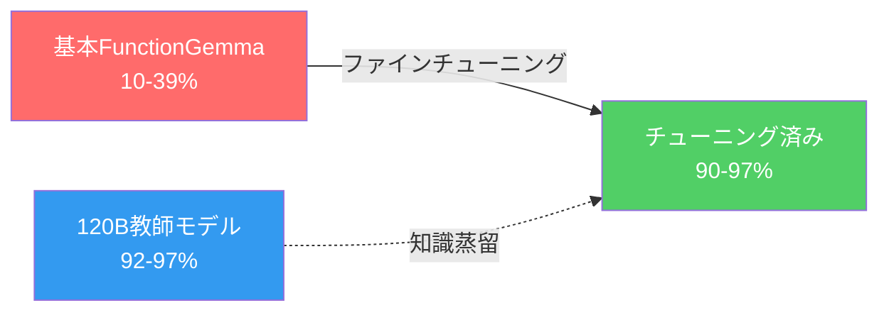

## 概要

Googleが発表した<strong>FunctionGemma 270M</strong>は、function callingに特化した270Mパラメータの超小型モデルです。スマートフォンのCPUで125 tok/sで動作できるほど軽量ですが、マルチターンtool callingでは基本精度が10-39%に留まっていました。

Distil Labsチームがこのモデルを<strong>knowledge distillation</strong>でファインチューニングした結果、120Bの教師モデルに匹敵、あるいはそれを上回る<strong>90-97%の精度</strong>を達成しました。モデルサイズが445倍小さいにもかかわらずです。

これは「大きなモデルだけが答え」というスケーリング法則の神話に挑戦する強力な追加証拠です。

## なぜマルチターンは難しいのか

シングルターンのfunction callingは比較的単純です。しかしマルチターンでは以下の問題が複合的に作用します：

- <strong>会話履歴の追跡</strong>：前回のfunction call結果を記憶する必要がある
- <strong>意図変更への対応</strong>：会話中にユーザーの意図が変わるケース
- <strong>累積エラー</strong>：シングルターン80%精度でも5ターンでは33%に急落（0.8⁵）

基本FunctionGemmaの5ターン精度を計算すると、事実上使用不可能な水準です：

| タスク | シングルターン | 5ターン予測 |
|--------|-------------|------------|
| スマートホーム制御 | 38.8% | ~0.9% |
| バンキング音声アシスタント | 23.4% | ~0.07% |
| シェルコマンド実行 | 9.9% | ~0.001% |

## ファインチューニング結果

Distil Labsは120B GPT-oss教師モデルからknowledge distillationを実施しました。結果は驚くべきものでした：

### タスク別詳細結果

| タスク | 基本 | チューニング後 | 教師(120B) |
|--------|------|--------------|-----------|
| スマートホーム制御 | 38.8% | <strong>96.7%</strong> | 92.1% |
| バンキング音声アシスタント | 23.4% | <strong>90.9%</strong> | 97.0% |
| シェルコマンド実行 | 9.9% | <strong>96.0%</strong> | 97.0% |

<strong>スマートホーム制御とシェルコマンド実行では120B教師モデルを超える</strong>成果を示しました。バンキングタスクのみ教師に及びませんでしたが、14個の複雑な関数とASRノイズを含む最も難度の高いタスクでした。

## 核心インサイト

### 1. データ品質 > モデルサイズ

同一の高品質データセットでQwen3-0.6BとFunctionGemma 270Mの両方が優秀な性能を達成しました。<strong>核心はモデルサイズではなく、タスクに特化した高品質な学習データ</strong>です。

### 2. 445倍小さいモデルの実用的意味

| 項目 | 120B教師 | 270Mチューニング済み |
|------|---------|-------------------|
| パラメータ | 120,000M | 270M |
| 量子化サイズ | ~60GB+ | ~288MB |
| 実行環境 | GPUサーバー | スマートフォンCPU |
| 推論速度 | - | 125 tok/s |

エッジデバイス、モバイルアプリ、ブラウザ内推論など、<strong>GPUなしでもproduction-ready tool calling</strong>が実現可能になります。

### 3. スケーリング法則への反論

最近のDeepSeek、Qwenなどオープンソースモデルの躍進と合わせて、今回の結果は<strong>「パラメータを増やすことだけが性能向上の道」という仮定への追加反論</strong>です。特化したタスクにおいて適切なファインチューニングはモデルサイズの限界を克服できます。

## オープンソースリソース

すべてのモデルとデータセットが公開されており、直接再現可能です：

- <strong>スマートホームモデル</strong>：[distil-labs/distil-home-assistant-functiongemma](https://huggingface.co/distil-labs/distil-home-assistant-functiongemma)
- <strong>スマートホームデータ</strong>：[distil-labs/distil-smart-home](https://github.com/distil-labs/distil-smart-home)
- <strong>バンキングアシスタントデータ</strong>：[distil-labs/distil-voice-assistant-banking](https://github.com/distil-labs/distil-voice-assistant-banking)
- <strong>シェルコマンドデータ</strong>：[distil-labs/distil-SHELLper](https://github.com/distil-labs/distil-SHELLper)

## 結論

FunctionGemma 270Mのファインチューニング事例は、AI業界に重要なメッセージを投げかけます。<strong>270Mパラメータでも120Bモデルに勝てる</strong>ということは、すべての問題に巨大モデルが必要ではないことを意味します。

エッジAI、モバイルデプロイ、IoTデバイスなど制約のある環境でのtool calling需要が増加する中、このような超小型特化モデルの可能性はさらに注目されるでしょう。

## 参考資料

- [Making FunctionGemma Work: Multi-Turn Tool Calling at 270M Parameters](https://www.distillabs.ai/blog/making-functiongemma-work-multi-turn-tool-calling-at-270m-parameters) — Distil Labs公式ブログ
- [Redditディスカッション](https://www.reddit.com/r/LocalLLaMA/comments/1r6gx75/finetuned_functiongemma_270m_for_multiturn_tool_calling/) — r/LocalLLaMA
- [FunctionGemmaモデルカード](https://huggingface.co/google/functiongemma-270m-it) — HuggingFace
