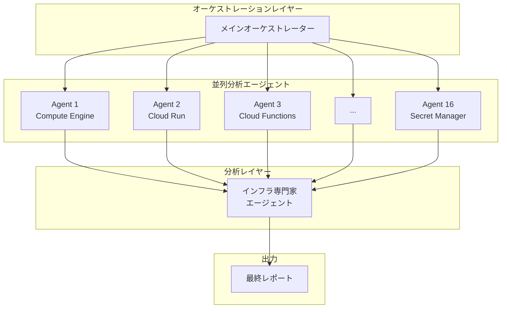
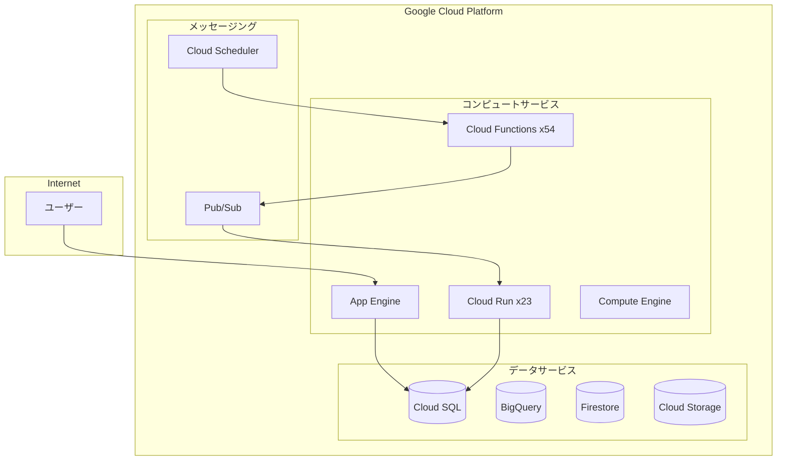

## 概要

クラウドインフラ管理は、時間が経つにつれて複雑化していきます。数十のサービス、数百のリソース、そして絶えず変化する構成。インフラ管理者は毎日、セキュリティ脆弱性、コスト浪費、構成エラーと戦わなければなりません。しかし、手動点検は時間がかかり、重要な問題を見逃しがちです。

この問題を解決するため、<strong>gcloud MCP（Model Context Protocol）</strong>とAIエージェントを活用した自動化インフラ監査システムを構築しました。並列エージェントアーキテクチャにより、16のGCPサービスを同時に分析し、セキュリティリスク、コスト最適化の機会、運用上の問題点を自動的に特定します。

## 問題の背景

### インフラ管理者の課題

一般的な本番環境でインフラ管理者が直面する問題：

- <strong>サービスの拡散</strong>：Cloud Run、Cloud Functions、App Engine、Compute Engineなど多様なコンピュートサービスが混在
- <strong>セキュリティの死角</strong>：環境変数に露出したAPIキー、過度に開放されたファイアウォールルール
- <strong>コスト漏れ</strong>：未使用のリソース、過剰プロビジョニングされたインスタンス
- <strong>技術的負債</strong>：サポート終了したOS、非推奨のランタイムバージョン

従来のアプローチは、各サービスを個別に点検することです。しかし、これには以下の限界があります：

```bash
# 従来の方式：サービスごとの順次点検
gcloud compute instances list
gcloud run services list
gcloud functions list
gcloud sql instances list
# ... 数十のコマンドを手動で実行
```

この方法でインフラ全体を点検するには、数時間、場合によっては数日かかることがあります。

### 既存ツールの限界

Google CloudのSecurity Command CenterやCloud Asset Inventoryも優れたツールです。しかし：

- 静的なルールベースの検出に依存
- サービス間の関連性分析が限定的
- ビジネスコンテキストを考慮した優先順位判断が困難
- 即座の修正措置の提案が不足

## 解決アプローチ

### gcloud MCPの紹介

<strong>MCP（Model Context Protocol）</strong>は、AIモデルが外部ツールと対話できるようにするプロトコルです。gcloud MCPはGoogle Cloud CLIをMCPサーバーとしてラップし、AIエージェントがGCPリソースを直接照会・管理できるようにします。

主な利点：

1. <strong>自然言語インターフェース</strong>：複雑なgcloudコマンドの代わりに自然言語で照会
2. <strong>コンテキスト認識</strong>：AIがリソース間の関係を理解して分析
3. <strong>自動化レポート</strong>：構造化された分析結果と改善推奨事項を生成

### 並列エージェントアーキテクチャ

単一エージェントで全サービスを順次点検する代わりに、並列サブエージェントパターンを適用しました：



各サブエージェントは独立して特定のサービスを分析します：

| エージェント | 担当サービス | 分析項目 |
|------------|------------|---------|
| Agent 1 | Compute Engine | VM状態、OSバージョン、スナップショット |
| Agent 2 | Cloud Run | サービス構成、環境変数、スケーリング |
| Agent 3 | Cloud Functions | ランタイム、トリガー、シークレット |
| Agent 4 | Cloud SQL | DBバージョン、バックアップ、セキュリティ |
| ... | ... | ... |
| Agent 16 | App Engine | バージョン管理、ドメイン、リソース |

## 実装手順

### ステップ1：gcloud MCPのセットアップ

まず、gcloud MCPサーバーを設定します。Claude Desktopやその他のMCP対応クライアントで使用できます：

```json
{
  "mcpServers": {
    "gcloud": {
      "command": "npx",
      "args": ["-y", "@anthropics/gcloud-mcp"],
      "env": {
        "GOOGLE_APPLICATION_CREDENTIALS": "/path/to/credentials.json"
      }
    }
  }
}
```

### ステップ2：サービス別分析エージェントの定義

各GCPサービスに対して専門化された分析プロンプトを作成します：

```markdown
# Compute Engine分析エージェント

## 目標
プロジェクト内の全Compute Engineリソースを分析し、セキュリティと運用上の問題点を特定する。

## 分析項目
1. VMインスタンス一覧と状態
2. マシンタイプとリソース割り当て
3. OSイメージバージョン（サポート終了状況）
4. ディスクとスナップショット構成
5. ネットワークインターフェースとファイアウォールルール
6. メタデータ（SSHキー、起動スクリプトなど）

## 出力形式
- リソース要約テーブル
- 発見された問題のリスト（重大度別）
- 推奨アクション
```

### ステップ3：並列実行オーケストレーション

メインオーケストレーターが全サブエージェントを同時に実行します：

```python
# 概念的なコード例
async def run_infrastructure_audit():
    agents = [
        Agent("compute-engine", compute_prompt),
        Agent("cloud-run", cloud_run_prompt),
        Agent("cloud-functions", functions_prompt),
        # ... 16エージェント
    ]

    # 並列実行
    results = await asyncio.gather(*[
        agent.analyze() for agent in agents
    ])

    # 結果集約
    return aggregate_results(results)
```

### ステップ4：結果集約とレポート生成

インフラ専門家エージェントが全結果を総合し、優先順位付けされたレポートを生成します：

```markdown
# リスク評価基準

## 重大（即時対応必要）
- インターネットに露出した認証情報
- 全開放のファイアウォールルール
- サポート終了したOS

## 高（1週間以内に対応）
- 環境変数のAPIキー
- 削除保護未設定
- バックアップなしのデータベース

## 中（1ヶ月以内に対応）
- 非推奨のランタイムバージョン
- 未使用のリソース
- ラベリング不十分
```

## 実例

### 実際の分析結果サンプル

並列エージェントシステムを実行すると、以下のような形式のレポートが生成されます：

#### インフラ概要

| カテゴリ | サービス | リソース数 | 状態 |
|---------|--------|---------|------|
| コンピュート | Compute Engine VM | 1 | 注意が必要 |
| コンピュート | Cloud Runサービス | 23 | セキュリティ点検必要 |
| コンピュート | Cloud Functions | 54 | ランタイムアップグレード必要 |
| データベース | Cloud SQL | 2 | 1つ非アクティブ |
| ストレージ | Cloud Storage | 27 | 15件セキュリティ設定不足 |
| ネットワーク | VPC | 2 | ファイアウォール点検必要 |

#### 発見された主要な問題点

<strong>セキュリティ脆弱性（重大）</strong>

1. <strong>環境変数に露出したAPIキー</strong>
   - 場所：複数のCloud Run/Functionsサービス
   - リスク：認証情報漏洩時のサービス悪用
   - 対応：Secret Managerへ即座に移行

2. <strong>RDPポート全開放</strong>
   - 場所：default VPCファイアウォールルール
   - リスク：ブルートフォース攻撃への露出
   - 対応：特定IP範囲に制限

3. <strong>サポート終了OS</strong>
   - 場所：cdp-sftp-prod VM（CentOS 7）
   - リスク：セキュリティパッチなし
   - 対応：Rocky LinuxまたはUbuntu LTSへ移行

<strong>コスト最適化の機会</strong>

1. <strong>停止中のMySQLインスタンス</strong>：ストレージコストのみ発生中
2. <strong>80以上のApp Engineバージョン</strong>：未使用バージョンのクリーンアップ必要
3. <strong>空のBigQueryデータセット</strong>：10データセット削除可能

### 自動生成されたMermaidダイアグラム

システムはインフラ構造を視覚化するMermaidダイアグラムも自動生成します：



## 定期スキャンの自動化

### 定期監査の必要性

インフラは毎日変化します。新しいサービスがデプロイされ、構成が変更され、新たな脆弱性が発見されます。一度きりの監査では十分ではありません。

### Cloud Schedulerによる自動化

定期的なインフラ監査を自動化できます：

```yaml
# 週次インフラ監査スケジュール
schedule: "0 9 * * 1"  # 毎週月曜日午前9時
target:
  type: cloud-function
  function: infrastructure-audit-trigger
notification:
  - email: infra-team@company.com
  - slack: #infra-alerts
```

### 変更追跡とトレンド分析

定期スキャン結果を保存することで：

- セキュリティ状態の時系列変化を追跡
- 新たに発生した問題と解決済みの問題を特定
- インフラ成長トレンドを分析
- コンプライアンス監査履歴を維持

## 即座の改善措置

gcloud MCPのもう一つの強みは、発見された問題を即座に修正できることです。

### 例：Secret Manager移行

環境変数に露出したAPIキーをSecret Managerに移行：

```bash
# 1. シークレット作成
gcloud secrets create openai-api-key --replication-policy="automatic"

# 2. シークレット値設定
echo -n "sk-xxx..." | gcloud secrets versions add openai-api-key --data-file=-

# 3. Cloud Runサービス更新
gcloud run services update my-service \
  --update-secrets=OPENAI_API_KEY=openai-api-key:latest
```

AIエージェントはこれらの修正コマンドを自動生成し、承認後に実行できます。

### 例：ファイアウォールルールの強化

```bash
# 危険なRDPルールを削除
gcloud compute firewall-rules delete allow-rdp-all

# 特定IPのみを許可する新しいルールを作成
gcloud compute firewall-rules create allow-rdp-office \
  --allow tcp:3389 \
  --source-ranges="203.0.113.0/24" \
  --target-tags="windows-server"
```

## まとめ

gcloud MCPと並列エージェントアーキテクチャを組み合わせることで：

- <strong>時間節約</strong>：手動で数日かかった監査を数分で完了
- <strong>一貫性</strong>：同じ基準で繰り返し可能な点検
- <strong>包括性</strong>：サービス間の関連性まで分析
- <strong>即座の対応</strong>：発見された問題に対する修正コマンドを自動生成

インフラ管理者は繰り返しの点検作業から解放され、より重要なアーキテクチャ決定や戦略的業務に集中できます。

### 次のステップ

1. <strong>gcloud MCPのインストール</strong>：[GitHubリポジトリ](https://github.com/anthropics/gcloud-mcp)から開始
2. <strong>分析エージェントのカスタマイズ</strong>：組織のセキュリティポリシーとコンプライアンス要件に合わせて調整
3. <strong>定期スキャンの設定</strong>：Cloud Schedulerで週次/月次自動監査を構成
4. <strong>通知の統合</strong>：Slack、Email、PagerDutyと連携して即座に対応

クラウドインフラ管理の新しいパラダイム、AIエージェントと共に始めましょう。
