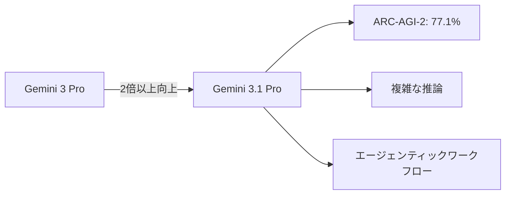
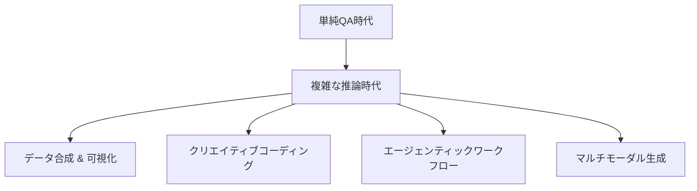

## 概要

2026年2月19日、Googleが<strong>Gemini 3.1 Pro</strong>を公開しました。Hacker Newsで391ポイントを記録し大きな注目を集めているこのモデルは、前世代のGemini 3 Pro比で推論性能が<strong>2倍以上</strong>向上しています。本記事では、Gemini 3.1 Proの核心的な性能指標、Claudeとの比較、そしてマルチモーダル進化について分析します。

## 核心的な性能分析

### ARC-AGI-2ベンチマーク：77.1%達成

Gemini 3.1 Proの最も注目すべき成果は、<strong>ARC-AGI-2</strong>ベンチマークでのスコアです。ARC-AGI-2はモデルが完全に新しい論理パターンを解決する能力を評価するベンチマークで、Gemini 3.1 Proは<strong>検証済みスコア77.1%</strong>を達成しました。

これはGemini 3 Pro比で<strong>2倍以上</strong>の推論性能向上を意味します。単なるスコア向上ではなく、「単純な回答では不十分な」複雑な問題解決能力の根本的な飛躍です。

### 実践的な活用事例

Googleは、Gemini 3.1 Proの向上した推論能力を示す4つの実践的な活用事例を公開しました：

- <strong>コードベースアニメーション</strong>：テキストプロンプトだけでウェブサイト用アニメーションSVGを生成。ピクセルではなくコードベースなのでどのサイズでも鮮明
- <strong>複雑なシステム合成</strong>：ISSの軌道を可視化するリアルタイム航空宇宙ダッシュボードをAPI連携で構築
- <strong>インタラクティブデザイン</strong>：3Dムクドリの群れ（murmuration）をコーディングし、ハンドトラッキングと生成型サウンドスコアを連動
- <strong>クリエイティブコーディング</strong>：文学作品の雰囲気を分析して現代的なウェブインターフェースに変換

## Claudeとの比較

### 現在の競争構図

Gemini 3.1 Proのリリースにより、AIモデル競争がさらに激化しています。Claude 4 Opus/SonnetとGemini 3.1 Proを主要な軸で比較すると：

| 項目 | Gemini 3.1 Pro | Claude 4 Opus |
|------|---------------|---------------|
| ARC-AGI-2 | 77.1%（検証済み） | 未公開 |
| アプローチ | マルチモーダルネイティブ | テキスト中心 + ツール活用 |
| 画像生成 | 内蔵サポート | 外部ツール連携 |
| コード実行 | Antigravityプラットフォーム | Artifacts、MCP |
| エージェント機能 | Google Antigravity | Claude Code、MCP |

### 各モデルの強み

<strong>Gemini 3.1 Proの強み</strong>：
- ネイティブマルチモーダル（テキスト、画像、コードを一つのモデルで）
- Googleエコシステムとの深い統合（Vertex AI、Android Studio、NotebookLM）
- ARC-AGI-2基準での高い推論性能

<strong>Claudeの強み</strong>：
- 長文コンテキストでの精度と安定性
- MCP（Model Context Protocol）による柔軟なツール連携
- コーディング作業での一貫した品質

## マルチモーダル進化の意味

### 「単純な回答では不十分な」時代

Gemini 3.1 Proが強調するメッセージは明確です：<strong>「A simple answer isn't enough.」</strong> これはAIモデルの発展方向が単純なQAから複雑な問題解決へと転換していることを示しています。

### 開発者エコシステムの拡大

Gemini 3.1 Proは様々なプラットフォームからアクセス可能です：

- <strong>開発者</strong>：Google AI Studio、Gemini CLI、Google Antigravity、Android Studio
- <strong>エンタープライズ</strong>：Vertex AI、Gemini Enterprise
- <strong>コンシューマー</strong>：Geminiアプリ、NotebookLM

特に<strong>Google Antigravity</strong>というエージェンティック開発プラットフォームの登場は注目に値します。これはAnthropicのMCPエコシステムと直接競合するポジションです。

## 実践的な示唆

### 開発者のためのポイント

1. <strong>モデル選択戦略の再考</strong>：複雑な推論が必要なタスクではGemini 3.1 Proを積極的に検討する価値があります
2. <strong>マルチモーダルワークフロー設計</strong>：テキスト → コード → 可視化を一つのパイプラインで構成可能
3. <strong>エージェント開発プラットフォーム比較</strong>：Antigravity vs MCP vs LangChainなどのエージェントフレームワーク比較検討が必要

### 注意点

- まだ<strong>プレビュー</strong>段階のため、プロダクション環境への導入には慎重な評価が必要です
- ベンチマークスコアが実戦性能を完全に代表するわけではありません
- Google AI Pro/Ultra有料プランユーザーに優先提供されます

## 結論

Gemini 3.1 ProはGoogleがAI競争で確実な前進を遂げたモデルです。ARC-AGI-2で77.1%という印象的な成績と実践的な活用事例は、「推論能力」という次世代AIの核心競争力で意味のある成果を示しています。

ただし、Claudeとの比較で見る通り、各モデルには固有の強みがあり、実際の業務環境での性能はベンチマークと異なる場合があります。開発者の観点からは、両方のエコシステムを活用する戦略が現時点では最も賢明な選択でしょう。

## 参考資料

- [Google Blog - Gemini 3.1 Pro公式発表](https://blog.google/innovation-and-ai/models-and-research/gemini-models/gemini-3-1-pro/)
- [Google AI Studio](https://aistudio.google.com/)
- [Google Antigravity](https://antigravity.google/)
- [Vertex AI - Gemini 3.1 Pro](https://cloud.google.com/blog/products/ai-machine-learning/gemini-3-1-pro-on-gemini-cli-gemini-enterprise-and-vertex-ai)
