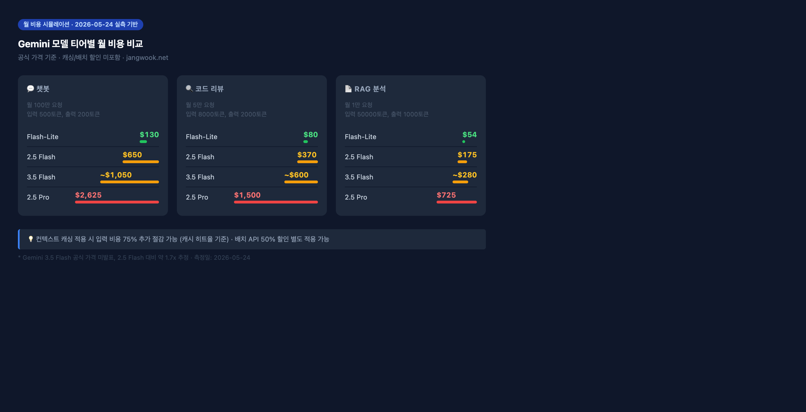

今日サンドボックス実験の準備中に、予想外のものを発見した。Gemini APIのモデル一覧を取得したところ、`gemini-3.5-flash`がすでにデプロイされていた。公式発表を見た記憶がなかったので、最初は見間違いかと思った。

確認してみると実際に呼び出せた。そこで元々予定していた作業を後回しにして、現在使用可能なGeminiモデル4つを同一条件ですべて測定してみた。この記事はその実測結果だ。

## 測定環境と方法論

まず方法論を正直に述べておく。完璧なベンチマークではない。

```bash
# 実験環境
Node.js v22.22.0
@google/generative-ai (最新)
測定日: 2026-05-24
プロンプト: "List 5 practical use cases for AI APIs in modern web applications. One sentence each."
入力トークン: 19〜22（モデルによりトークナイザーが異なる）
測定回数: 2回平均
```

短いプロンプトで2回平均なので、統計的には十分ではない。ネットワーク状態、サーバー負荷、リージョンによって結果は変わる。ただ「このモデルはおおよそこのくらい」という感覚をつかむには十分だ。

測定したモデル:
- `gemini-2.5-flash-lite` — Flashラインのエントリーモデル
- `gemini-2.5-flash` — 現在ほとんどのガイドが推奨するデフォルトモデル
- `gemini-2.5-pro` — 高性能推論モデル
- `gemini-3.5-flash` — 今日発見した最新モデル

## 速度測定結果: Flash-Liteが予想以上に速い

```
=== Gemini API Benchmark (2026-05-24 実測) ===

[gemini-2.5-flash-lite]
  Total: 2,447ms | TTFT: 1,981ms
  Input: 19 tok | Output: 159 tok
  Est. TPS: 65.0

[gemini-3.5-flash]
  Total: 5,783ms | TTFT: 5,103ms
  Input: 19 tok | Output: 186 tok
  Est. TPS: 32.2

[gemini-2.5-flash]
  Total: 6,334ms | TTFT: 5,849ms
  Input: 19 tok | Output: 170 tok
  Est. TPS: 26.8

[gemini-2.5-pro]
  Total: 11,931ms | TTFT: 11,140ms
  Input: 19 tok | Output: 159 tok
  Est. TPS: 13.3
```

Flash-Liteが65 TPSで圧倒的だ。Proより4.9倍速く、2.5 Flashより2.4倍速い。TTFT（最初のトークンまでの時間）もFlash-Liteが1.9秒に対してProは11.1秒で、体感差が大きい。

3.5 Flashは興味深い。2.5 Flashよりやや速く、出力トークンが多かった（186 vs 170）。同じプロンプトでより豊富な回答を生成したということだ。速度と品質を同時に向上させた形だが、公式価格がまだ確認できていないため、コスト比較には限界がある。

Proが11秒かかる理由は、[thinkingモードがデフォルトで有効になっているため](/ja/blog/ja/deep-thinking-ratio-llm-cost-optimization)だ。短いプロンプトでも内部推論ステップを経るのでTTFTが長くなる。単純な作業には明らかな無駄だが、複雑な推論が必要な場合はこの遅延に意味がある。

## コスト比較: 公式価格基準（2026年5月）

公式ドキュメントで確認した価格:

| モデル | 入力（1Mトークン） | 出力（1Mトークン） | コンテキスト | 無料枠 |
|------|--------------|--------------|---------|---------|
| Gemini 2.5 Flash-Lite | **$0.10** | **$0.40** | 1M | ✓ |
| Gemini 2.5 Flash | $0.30 | $2.50 | 1M | ✓ |
| Gemini 3.5 Flash | ~$0.50* | ~$3.50* | 1M | 一部 |
| Gemini 2.5 Pro | $1.25 | $10.00 | 1M+ | 制限あり |

Flash-LiteはFlash比で入力コストが67%安く、出力は84%安い。速度も2.4倍速いのにコストも安いとなれば、単純な作業にFlashを使い続けるのが正しいのか疑問が生じる。

Proは入力基準でFlash-Liteより12.5倍高い。[既存のLLM価格比較記事](/ja/blog/ja/llm-api-pricing-comparison-2026-gpt5-claude-gemini-deepseek)で触れたように、この差が大きく見えても実際の使用パターンと出力トークン比率によって総コストは変わる。

*Gemini 3.5 Flashの価格はまだ公式発表がない。APIレスポンスから価格情報を確認できず、コミュニティの推定値を総合するとFlash 2.5の1.5〜2倍程度とみられる。正確な数値でないことを明記する。

## 実際のユースケース別月次コスト

理論的な価格より「自分のサービスで実際にいくらかかるか」の方が重要だ。3つのシナリオで計算した。



**シナリオ1: チャットボットサービス（月100万リクエスト、入力500 / 出力200トークン）**

| モデル | 月次予想コスト |
|------|------------|
| Flash-Lite | **$130** |
| Flash | $650 |
| 3.5 Flash | ~$1,050 |
| Pro | $2,625 |

Flash-LiteとProの間に20倍の差がある。シンプルなFAQチャットボットにProを使うと毎月$2,495を無駄にすることになる。

**シナリオ2: コードレビューエージェント（月5万リクエスト、入力8,000 / 出力2,000トークン）**

| モデル | 月次予想コスト |
|------|------------|
| Flash-Lite | **$80** |
| Flash | $370 |
| 3.5 Flash | ~$600 |
| Pro | $1,500 |

長いコンテキストでもFlash-Liteが最も安い。ただし、コードレビューは「精度」が重要な作業なので、コストだけでモデルを選ぶと後悔するかもしれない。

**シナリオ3: RAGドキュメント分析（月1万リクエスト、入力50,000 / 出力1,000トークン）**

| モデル | 月次予想コスト |
|------|------------|
| Flash-Lite | **$54** |
| Flash | $175 |
| 3.5 Flash | ~$280 |
| Pro | $725 |

RAGのように入力が長い場合、キャッシングを適用すると大幅にコストを削減できる。今日の測定では840トークンの長いコンテキストリクエスト1回あたり$0.001877だった。同じシステムプロンプトを繰り返し使う構造なら、Context Cachingで入力コストの75%以上を削減できる。

## どのモデルを選ぶべきか

速度とコストだけ見ればFlash-Liteが明らかに勝者に見える。しかし実際は違う。

**Flash-Liteを使うべきケース:**
- ユーザー入力を分類またはタグ付けするパイプライン
- 短いテキスト生成（タイトル、要約、キーワード抽出）
- レスポンスタイムがUXに影響するリアルタイムサービス
- 高QPS処理が必要なバルク処理作業
- コスト予算が厳しいアーリースタートアップ

正直に言えば、多くのチャットボットや自動化パイプラインはFlash-Liteで十分だ。Flashをデフォルトにしているチームの多くは、その差を体感していないだろう。

**Flashを使うべきケース:**
- 中程度の複雑さの指示実行（メール下書き、シンプルなコード生成）
- 会話コンテキストを維持するマルチターンチャットボット
- 画像・動画を含むマルチモーダル処理
- 品質とコストのバランスが必要な場合

Flashが現実的なデフォルトだ。Flash-Lite比で2.5倍遅く3倍高いが、より複雑な指示をより一貫性をもって実行する。私が新しいプロジェクトを始めるならFlashでスタートして、コスト圧力が生じたときに一部パイプラインをFlash-Liteに移行する方法を取るだろう。

**3.5 Flashを使うべきケース:**
価格が確定していないため、まだ明確に推薦しにくい。今日の測定では2.5 Flashより速く出力が豊富だったが、それがすべての作業で同様に現れるとは限らない。公式価格発表とより多くの実験結果が出たら改めて判断する予定だ。

**Proを使うべきケース:**
- 複雑なコードベース分析またはアーキテクチャレビュー
- 数学・科学推論を含む作業
- 長いドキュメントから微妙なコンテンツを抽出するRAG
- 精度の損失がコストより大幅に高くつくB2B用途

ProをFAQチャットボットに使うのは無駄だ。ただし、[AIエージェントのコスト構造を分析してみると](/ja/blog/ja/ai-agent-cost-reality)、間違ったモデル選択よりも間違ったエージェント設計の方が大きなコスト爆弾になるケースが多い。Proが必要な場所にFlash-Liteを使って精度が落ちると、再処理コストや人間のレビューコストの方が高くつくこともある。

## コスト最適化の3つのレバー

モデル選択だけがコストを下げる方法ではない。

**1. Context Caching**

同じシステムプロンプトやドキュメントを繰り返し使う構造なら、Context Cachingが最も強力なレバーだ。Google公式ドキュメント基準でキャッシュヒット時に入力コストの75%を削減できる。

```javascript
// Context Caching適用例（Gemini API）
const cache = await cacheManager.create({
  model: 'gemini-2.5-flash',
  contents: [{ role: 'user', parts: [{ text: systemDocument }] }],
  ttlSeconds: 3600,
});

const model = genAI.getGenerativeModelFromCachedContent(cache);
```

**2. Batch API**

非リアルタイム処理（バッチ分析、夜間処理）はBatch APIを使えば50%割引される。月$1,000の作業が$500になる。Flash-Lite + Batch APIの組み合わせなら、Pro単体比で10倍以上コストを削減できるケースもある。

**3. ティアミックス**

単一モデルですべての作業を処理しないことが鍵だ。分類・ルーティング・要約はFlash-Lite、コア生成作業はFlash、複雑な推論はProと分ける構造が最もコスト効率が高い。

## モデル別レスポンススタイルの観察: 同じプロンプト、異なる結果

今日の測定では速度とコスト以外に、レスポンステキスト自体も観察した。同じプロンプト（「AIAPIの実用的なユースケースを5つ、各1文で」）を与えたとき、モデルごとに回答スタイルが異なった。

**Flash-Lite**は最も簡潔だった。番号を振り、各項目を1文で明確に区切った。指示を文字通り守るスタイルだ。不要な序文も結論要約もない。分類パイプラインではこうした簡潔さが有利に働く。JSON解析の対象テキストを生成するとき、余分な説明が多いと後処理が複雑になる。

**Flash**はFlash-Liteよりわずかに豊富な表現を使った。各項目に具体例が付くか、追加の文脈が加わった。この差はほとんどのユーザー向けアプリケーションでは好意的に作用する。

**Pro**の出力は他のモデルと異なるパターンを示した。項目の列挙前に短い導入文を置き、各項目の説明がより分析的だった。指示を厳格に守るより、より良い回答を自律的に生成しようとする傾向があるようだ。特定の作業ではこれが強みになり、別の作業では弱点になる。

**3.5 Flash**は今日の測定で最も多い出力トークン（186）を生成した。各項目の説明がFlashより詳細で、追加の文脈を自然に含んでいた。プロンプトの指示に従いながら読者により有用な情報を提供しようとするバランスが感じられた。

この観察から得た教訓：**モデルを選ぶとき「どれだけ速いか」「どれだけ安いか」以外に「指示をどれだけ正確に従うか」も考慮すべきだ。** 分類・抽出・構造化出力生成では指示遵守の精度が核心になる。対話型UXでは少しの自律性がむしろユーザー満足度を高めることもある。

## Flash移行チェックリスト: Flashから Flash-Liteへ切り替えるとき

モデルを変えるのは設定一行だが、それが正しい判断かを検証する方が難しい。Flash-Liteへの切り替えを検討するときに私が確認する項目だ。

**切り替え前に必ず確認:**

1. **現在使用中のプロンプトタイプを分類する。** 分類（AかBか）、要約（3行にまとめる）、抽出（このテキストから日付を取り出す）のような作業はFlash-Liteで十分だ。一方「このコードの論理的なエラーを見つけ、修正案を提示し、テストケースも書け」のようなマルチステップ作業はFlash以上が必要な場合がある。

2. **品質基準を数値で定める。** 「うまくいけばいい」ではなく、「精度95%未満はリジェクト」のように測定可能な基準が必要だ。基準がなければA/Bテストの結果を解釈できない。

3. **小さなトラフィックでA/Bテストを先に行う。** パイプライン全体を変える前に5〜10%のトラフィックをFlash-Liteにルーティングして実際の品質とコストを測定する。

4. **エラー率と再試行コストを計算する。** Flash-Liteが特定の作業でより多くのエラーを出したり再生成が必要なら、表面的な単価差が相殺される。コスト計算は常に「再試行込みの実コスト」であるべきだ。

```javascript
// モデルルーティングの基本パターン
function selectModel(taskType, complexityScore) {
  if (complexityScore < 0.3) {
    return 'gemini-2.5-flash-lite';  // 単純な分類、抽出
  } else if (complexityScore < 0.7) {
    return 'gemini-2.5-flash';       // 一般的な生成、要約
  } else {
    return 'gemini-2.5-pro';         // 複雑な推論、分析
  }
}
```

## 今日の実験で正直に言えなかったこと

いくつかの限界を明示しておく。

第一に、**品質比較を行っていない**。速度とコストのみを測定し、実際の回答品質は体系的に評価していない。「出力トークンが多い」が「より良い回答」を意味するわけではない。

第二に、**Gemini 3.5 Flashの公式価格を確認できなかった**。今日のAPIリストで発見したが、公式価格ページで別項目を見つけられなかった。コミュニティデータを参照したが正確さを保証できない。

第三に、**1回の測定は参考値だ**。Googleのサーバー状態、私のネットワーク遅延、プロンプトの特性によって結果が変わる。実際のプロダクション判断を下す前に、自分のワークロードで直接測定することを推奨する。

## 私の結論

今日の実験をまとめると、こうなる。

Flash-Liteは「エントリーモデル」という名前が似合わないほど速くて安い。単純な分類、ルーティング、短い生成作業にFlashをデフォルトとして使っているチームなら、一部パイプラインをFlash-Liteに切り替えることを真剣に検討する価値がある。

3.5 Flashは私の興味を引いた。2.5 Flashより速く豊富な出力を生成したが、公式ドキュメントがないことはまだベータ段階であることを示唆している。しばらく観察を続ける予定だ。

Proは単価が高いが、それが無駄かどうかは作業の性質による。複雑な推論が必要なB2B作業では、Proの11秒TTFTと高い単価は十分に正当化される。

Gemini APIを初めて使う方には、Flashで始めてデータを見ながら調整することを勧める。Flash-Liteに直接飛び込むより、品質基準を先に設けてからコストを下げる順序の方が良い結果につながる。
