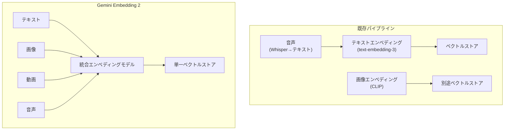
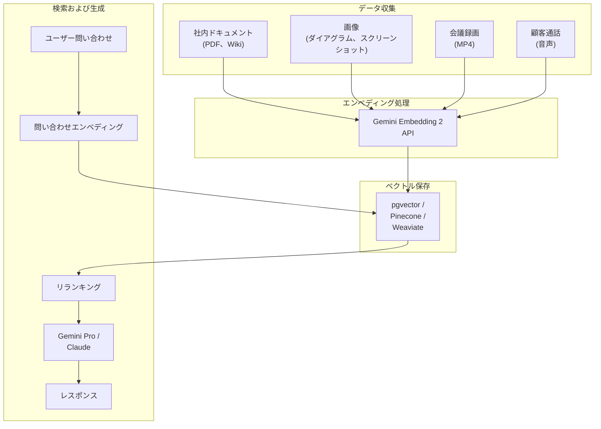

## なぜマルチモーダルエンベディングなのか

2026年3月10日、Googleが<strong>Gemini Embedding 2</strong>を発表しました。「私たちの初のネイティブマルチモーダルエンベディングモデル」という説明が添えられています。テキスト、画像、動画、音声、ドキュメントを<strong>一つのベクトル空間</strong>にマッピングするモデルです。

既存のRAGパイプラインの最大の制約は、テキストしか扱えない点でした。社内Wikiにダイアグラムがあっても、製品マニュアルにスクリーンショットが含まれていても、エンベディング段階ですべて無視されていました。結果として、ユーザーの質問のコンテキストに合った情報があるにもかかわらず検索されない状況が繰り返されていました。

Gemini Embedding 2はこの問題を根本的に解決します。

---

## Gemini Embedding 2 コアスペック

### 入力モダリティ

| モダリティ | サポート範囲 | 制限事項 |
|-----------|------------|---------|
| テキスト | 最大8,192トークン | 100以上の言語サポート |
| 画像 | リクエストあたり最大6枚 | PNG、JPEG |
| 動画 | 最大120秒 | MP4、MOV |
| 音声 | ネイティブ処理 | 中間テキスト変換不要 |
| ドキュメント | PDFなど複合ドキュメント | テキスト+画像混合処理 |

### 出力次元

デフォルト出力は3,072次元のベクトルです。ここでの核心は<strong>Matryoshka Representation Learning（MRL）</strong>を適用している点です。マトリョーシカ人形のように情報が入れ子構造で配置されており、次元を削減しても上位次元に核心情報が保持されます。

```
3072次元（最高精度）
 └── 1536次元（高精度）
      └── 768次元（汎用）
           └── 256次元（軽量、モバイル/エッジ）
```

これが実務において重要な理由は、<strong>コストと精度のトレードオフ</strong>を柔軟に調整できるためです。数百万のドキュメントをインデックスする際は256次元で一次フィルタリングを行い、上位候補に対して3,072次元でリランキングする2段階戦略が可能です。

### APIアクセス経路

2つのゲートウェイを提供しています。

- <strong>Gemini API（AI Studio）</strong>：プロトタイピングと個人開発者向け。無料ティアを含む。
- <strong>Vertex AI（Google Cloud）</strong>：エンタープライズスケール。VPC-SC、CMEK、IAM統合。

---

## 既存エンベディングモデルとの比較

### シングルモーダル vs マルチモーダル



既存アプローチの3つの問題点：

1. <strong>パイプラインの複雑度</strong>：モダリティごとに別々のモデル、別々のストア、別々の検索ロジックが必要でした
2. <strong>クロスモーダル検索の不可</strong>：「このダイアグラムに関連するコードを探して」という問い合わせが不可能でした
3. <strong>中間変換によるロス</strong>：音声→テキスト変換時にニュアンスとコンテキストが失われていました

### 主要エンベディングモデルスペック比較

| モデル | モダリティ | 最大次元 | MRL | 価格（100万トークン） |
|--------|-----------|---------|-----|-------------------|
| OpenAI text-embedding-3-large | テキストのみ | 3,072 | O | $0.13 |
| Cohere embed-v4 | テキスト+画像 | 1,024 | O | $0.10 |
| <strong>Gemini Embedding 2</strong> | <strong>テキスト+画像+動画+音声</strong> | <strong>3,072</strong> | <strong>O</strong> | <strong>無料（プレビュー中）</strong> |
| Voyage AI voyage-3 | テキストのみ | 1,024 | X | $0.06 |

Gemini Embedding 2の差別化点は明確です。<strong>唯一4種類のモダリティをネイティブでサポート</strong>しながら、出力次元も最上位クラスで、現在プレビュー期間中は無料です。

---

## 実践適用：マルチモーダルRAGパイプライン構築

### アーキテクチャ設計



### コード例：Python SDKの活用

```python
from google import genai

# クライアントの初期化
client = genai.Client(api_key="YOUR_API_KEY")

# テキストエンベディング
text_result = client.models.embed_content(
    model="gemini-embedding-exp-03-07",
    contents=["社内セキュリティポリシー文書の核心条項"],
    config={
        "output_dimensionality": 768,  # MRLで次元を削減
        "task_type": "RETRIEVAL_DOCUMENT"
    }
)
print(f"テキストベクトル次元: {len(text_result.embeddings[0].values)}")
# 出力: テキストベクトル次元: 768

# 画像エンベディング（同一ベクトル空間）
from google.genai import types

image = types.Part.from_uri(
    file_uri="gs://my-bucket/architecture-diagram.png",
    mime_type="image/png"
)
image_result = client.models.embed_content(
    model="gemini-embedding-exp-03-07",
    contents=[image]
)

# テキストと画像ベクトル間のコサイン類似度計算が可能
import numpy as np

def cosine_similarity(a, b):
    return np.dot(a, b) / (np.linalg.norm(a) * np.linalg.norm(b))

similarity = cosine_similarity(
    text_result.embeddings[0].values,
    image_result.embeddings[0].values
)
print(f"テキスト-画像類似度: {similarity:.4f}")
```

### Task Type活用戦略

Gemini Embedding 2は`task_type`パラメータでエンベディングの目的を指定できます。

| Task Type | 用途 | 適用シナリオ |
|-----------|------|------------|
| `RETRIEVAL_DOCUMENT` | ドキュメントのインデックス化 | RAGドキュメント保存時 |
| `RETRIEVAL_QUERY` | 問い合わせのエンコード | ユーザー検索クエリ処理時 |
| `SEMANTIC_SIMILARITY` | 類似度比較 | 重複ドキュメント検出、クラスタリング |
| `CLASSIFICATION` | 分類 | ドキュメント自動分類、ラベリング |
| `CLUSTERING` | クラスタリング | トピックモデリング、グループ化 |

<strong>実務のヒント</strong>：インデックス化と検索時には必ず異なるtask_typeを使用する必要があります。ドキュメント保存時に`RETRIEVAL_DOCUMENT`、問い合わせ時に`RETRIEVAL_QUERY`を使用すると、非対称検索のパフォーマンスが大きく向上します。

---

## EM/CTO視点：導入時の考慮事項

### 1. パイプラインの単純化 = 運用コスト削減

マルチモーダルエンベディング導入の最も直接的な効果は<strong>パイプラインの複雑度の低下</strong>です。

既存でモダリティごとに分離されたエンベディングパイプラインを運用していた場合：
- モデル3〜4個 → 1個
- ベクトルストア2〜3個 → 1個
- 同期ロジックの削除
- 監視対象の縮小

Google公式ブログによると、一部の顧客は<strong>レイテンシ70%削減</strong>を達成しています。

### 2. ベンダー依存性の評価

現在Gemini Embedding 2はGoogle専用です。マルチクラウド戦略を運用している企業であれば：

- <strong>エンベディングレイヤーの抽象化</strong>：エンベディングモデルを交換可能なインターフェースとして設計
- <strong>ベクトルフォーマットの互換性</strong>：3,072次元ベクトルは大部分のベクトルDBで互換
- <strong>MRLの活用</strong>：次元削減を通じて他のモデルとの次元マッチングが可能

### 3. データガバナンス

マルチモーダルデータを外部APIに送信することはガバナンス上の問題を伴います。

- Vertex AIでは<strong>VPC Service Controls</strong>でデータ境界の設定が可能
- <strong>CMEK（Customer-Managed Encryption Keys）</strong>サポート
- 会議録画や顧客通話音声はPIIマスキング後にエンベディング処理することを推奨
- Data Residency要件がある場合はリージョン選択の確認が必須

### 4. コストモデルの予測

現在はプレビュー期間中のため無料ですが、GA（正式リリース）後は課金が予想されます。コスト最適化戦略：

```
インデックス化時: 256次元（MRL）→ 保存コスト87%削減（3072比）
一次検索: 256次元ANN検索 → 高速で低コスト
二次リランキング: 3072次元精密比較 → 上位50件のみ
```

この2段階戦略は数百万ドキュメント規模でコストと精度を同時に最適化できます。

---

## 実践マイグレーションチェックリスト

既存のテキスト専用RAGからマルチモーダルRAGへ移行する際：

1. <strong>データインベントリ</strong>：組織内の非テキストデータ（画像、動画、音声）の現状把握
2. <strong>優先順位の設定</strong>：検索失敗率の高いドキュメントタイプからマルチモーダルインデックスを適用
3. <strong>ベクトルDBの互換性</strong>：既存ベクトルストアが3,072次元をサポートしているか確認（pgvector、Pinecone、Weaviateはすべてサポート）
4. <strong>A/Bテスト</strong>：既存テキスト専用エンベディングとマルチモーダルエンベディングの検索精度を定量的に比較
5. <strong>モニタリング</strong>：クロスモーダル検索比率、レイテンシ、エンベディングAPI呼び出し数の追跡
6. <strong>セキュリティレビュー</strong>：マルチモーダルデータの外部送信に関するセキュリティ/コンプライアンス承認

---

## まとめ

Gemini Embedding 2は単なる「新しいエンベディングモデル」ではありません。<strong>RAGパイプラインのアーキテクチャパラダイムを変える転換点</strong>です。

これまでテキストしか扱えなかった検索システムが、画像、動画、音声まで同じベクトル空間で統合検索できるようになりました。これは技術的な進歩であるだけでなく、企業の非構造化データの活用方法を根本的に変えうる変化です。

Engineering Manager視点でのコアアクションアイテム：

1. <strong>今すぐ</strong>：プレビュー期間中にGemini APIでPoC実施（無料）
2. <strong>1〜2週間以内</strong>：社内の非テキストデータインベントリを作成
3. <strong>1ヶ月以内</strong>：既存RAGパイプライン対比マルチモーダルRAGのA/Bテスト設計

---

## 参考資料

- [Gemini Embedding 2 公式発表ブログ](https://blog.google/innovation-and-ai/models-and-research/gemini-models/gemini-embedding-2/)
- [Gemini API 開発者ドキュメント](https://ai.google.dev/gemini-api/docs/models/gemini-embedding-2-preview)
- [Vertex AI Gemini Embedding 2 ドキュメント](https://docs.cloud.google.com/vertex-ai/generative-ai/docs/models/gemini/embedding-2)
- [VentureBeat: Gemini Embedding 2 解説記事](https://venturebeat.com/data/googles-gemini-embedding-2-arrives-with-native-multimodal-support-to-cut)
