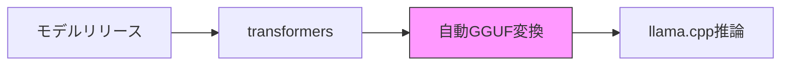
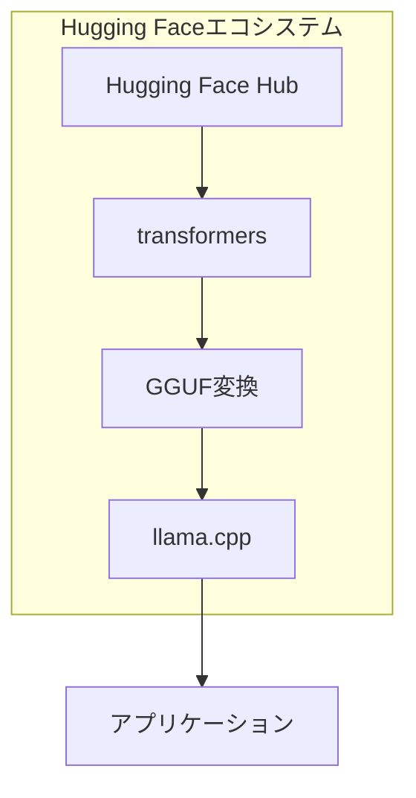

## 概要

2026年2月、<strong>ggml.aiの創立チームがHugging Faceに合流</strong>するという発表がありました。llama.cppの創始者Georgi Gerganovと中核チームがHugging Face所属に移行することで、ローカルAI推論エコシステムに構造的転換点が訪れました。

今回の合流は単純なM&Aではありません。<strong>オープンソースプロジェクトの持続可能性</strong>と<strong>ローカルAIインフラの未来</strong>に関する戦略的決定です。Hacker Newsで616ポイント、Reddit r/LocalLLaMAで314ポイント+166ポイントを記録し、コミュニティの熱い関心を集めました。

## 何が発表されたのか

[公式発表](https://github.com/ggml-org/llama.cpp/discussions/19759)の要点を整理すると以下の通りです：

- <strong>ggml-orgプロジェクトはオープンソースでありコミュニティ主導で維持</strong>されます
- ggmlチームは引き続きggmlとllama.cppをフルタイムでリード・メンテナンス・サポートします
- 新しいパートナーシップはプロジェクトの長期的持続可能性を保証します
- Hugging Face [transformers](https://github.com/huggingface/transformers)ライブラリとの統合改善に追加の注力を行います

## なぜこの合流が重要なのか

### 1. オープンソース持続可能性問題の解決

llama.cppは2023年の登場以来、ローカルAI推論の事実上の標準となりました。しかし少人数のチームがこの巨大なプロジェクトを維持するのは、持続可能性の面で大きな課題でした。Hugging Faceのリソースが後ろ盾となることで、この問題が構造的に解決されます。

### 2. transformers-ggmlエコシステム統合

現在、新しいモデルがリリースされると、transformers形式からGGUF形式への変換過程で遅延や互換性の問題が発生します。公式発表で言及された<strong>「single-click」統合</strong>が実現すれば：

- モデルリリースからローカル推論までの時間が大幅に短縮されます
- GGUFファイル形式とHugging Face Hubの統合がより緊密になります
- 量子化品質管理がtransformersレベルで行えるようになります

### 3. ユーザーエクスペリエンスの改善

発表で特に注目すべきは<strong>「casual users」向けのデプロイ簡素化</strong>です。これはllama.cppが開発者ツールから一般ユーザーインフラへと進化していることを意味します。

## 既存の協業成果

Hugging Faceのエンジニアたちはすでにllama.cppに多大な貢献をしてきました：

| 貢献領域 | 内容 |
|----------|------|
| コア機能 | ggmlとllama.cppの中核機能実装 |
| 推論サーバー | UIを備えた堅牢な推論サーバー構築 |
| マルチモーダル | llama.cppにマルチモーダルサポート導入 |
| インフラ統合 | HF Inference Endpointsにllama.cpp統合 |
| GGUF互換性 | HFプラットフォームとGGUF形式の互換性改善 |
| モデルアーキテクチャ | 多数のモデルアーキテクチャ実装 |

特に[@ngxson](https://github.com/ngxson)と[@allozaur](https://github.com/allozaur)の貢献が大きく言及されました。

## コミュニティの反応と懸念

### 肯定的な反応

- プロジェクトの長期的安定性確保に対する安堵
- transformers統合による新モデルサポート速度向上への期待
- Hugging Faceのオープンソース親和的なトラックレコードへの信頼

### 懸念事項

- 企業合流後のオープンソースプロジェクトの独立性維持の可否
- 商業的利害関係が技術的意思決定に及ぼす影響
- コミュニティガバナンスの変化の可能性

## ローカルAIエコシステムへの影響

今回の合流はローカルAI推論スタックの垂直統合を意味します：

<strong>モデルリポジトリ → モデル定義 → 量子化 → 推論エンジン</strong>まで一つのエコシステムで管理される構造になります。これは開発者体験の大幅な改善をもたらす可能性がありますが、同時にエコシステムの多様性に関する議論も必要です。

## 技術的展望

公式発表で示された今後の技術目標は明確です：

1. <strong>transformersとのワンクリック統合</strong>：transformersフレームワークがモデル定義の「source of truth」として確立されているため、ggmlエコシステムとの互換性改善が鍵となります
2. <strong>ユーザーエクスペリエンス改善</strong>：クラウド推論の代替としてローカル推論が意味のあるレベルに達した今、一般ユーザーのアクセシビリティ向上が重要です
3. <strong>オープンソース超知能</strong>：長期ビジョンとして「open-source superintelligence accessible to the world」を提示しました

## 結論

ggml.aiのHugging Face合流は、ローカルAI推論エコシステムの<strong>成熟期への突入</strong>を象徴しています。個人プロジェクトレベルのオープンソースが産業インフラレベルに昇格する過程で、持続可能なリソース確保は必須のステップです。

llama.cppユーザーの立場からは、より迅速なモデルサポート、より優れたユーザーエクスペリエンス、そしてプロジェクトの長期的安定性という実質的な恩恵が期待されます。同時にオープンソースガバナンスの独立性が維持されるかどうか、コミュニティレベルでの継続的な関心が必要です。

## 参考資料

- [公式発表：ggml.ai joins Hugging Face](https://github.com/ggml-org/llama.cpp/discussions/19759)
- [llama.cpp GitHub](https://github.com/ggml-org/llama.cpp)
- [Hugging Face transformers](https://github.com/huggingface/transformers)
- [ggml GitHub](https://github.com/ggml-org/ggml)
