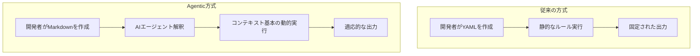
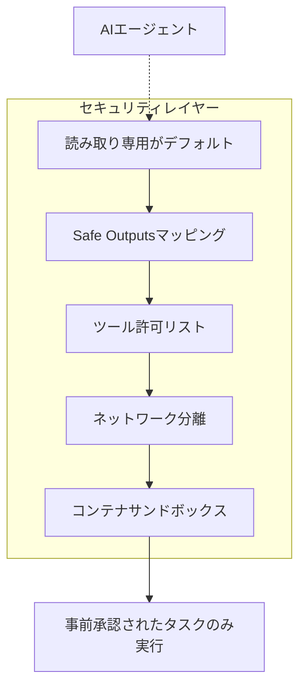
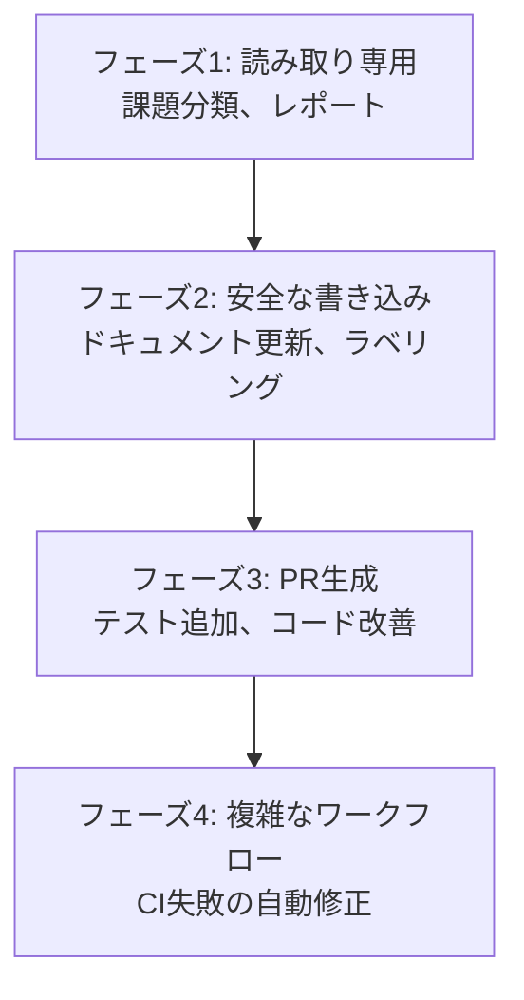

## 概要

2026年2月13日、GitHubは<strong>Agentic Workflows</strong>を技術プレビューとして公開しました。CI/CDパイプラインの中核であるGitHub Actionsに、AIエージェントをネイティブに統合することで、従来のYAML基本の自動化では対応できなかった領域までも自動化できるようになったのです。

このポストでは、Agentic Workflowsのアーキテクチャ、セキュリティモデル、6つのコア使用パターンを分析し、エンジニアリングマネージャーの観点からチーム導入戦略を提示します。

## Agentic Workflowsとは

Agentic Workflowsは<strong>自然言語で定義した意図をAIエージェントが実行するGitHub Actionsワークフロー</strong>です。YAMLの代わりにMarkdownで自動化を記述し、Copilot、Claude Code、Codexのようなコーディングエージェントが実際の作業を実行します。



コアとなる違いは、<strong>ルールベース</strong>から<strong>意図ベース</strong>への転換です。従来は「ラベルがbugであればassigneeをAに設定」というように全ての条件を明示する必要がありましたが、今では「課題を分析して適切な担当者に割り当てよ」という意図だけを伝えれば十分です。

## アーキテクチャ分析

### ワークフローファイル構造

Agentic Workflowsは2つのファイルで構成されます。

<strong>1. Markdownファイル (.md)</strong> — 開発者が作成する意図の定義:

````markdown
---
on:
  schedule: daily
permissions: read-only
safe-outputs:
  - type: issue-comment
    params:
      title-prefix: "[Auto]"
  - type: label
    params:
      allowed: ["bug", "feature", "docs"]
tools:
  - github-api
---

# 課題の自動分類

新しく作成された課題を分析して:
1. 内容に応じて適切なラベルを付与してください
2. 関連するコード領域を把握し、CODEOWNERSベースで担当者を推奨してください
3. 分類結果をコメントとして残してください
````

<strong>2. ロックファイル (.lock.yml)</strong> — CLIがコンパイルした実行可能なActionsワークフロー:

このファイルは`gh aw compile`コマンドで自動生成され、直接編集することはありません。

### サポートされるエージェント

現在の技術プレビューでサポートされているエージェントは以下の通りです:

| エージェント | 特徴 | コスト |
|---------|------|------|
| GitHub Copilot CLI | GitHubネイティブ、デフォルト設定 | 実行あたり約2プレミアムリクエスト |
| Claude Code | Anthropicモデル、複雑な推論に強み | API キー別途 |
| OpenAI Codex | OpenAIモデル、コード生成に特化 | API キー別途 |

### セキュリティモデル: Defense-in-Depth

セキュリティはAgentic Workflowsのコア設計原則です。



<strong>コア セキュリティ原則</strong>:

- <strong>読み取り専用デフォルト</strong>: エージェントはリポジトリへの読み取り専用アクセスのみが可能です
- <strong>Safe Outputs</strong>: 書き込み操作は事前定義されたパターンのみが許可されます (コメント、ラベルなど)
- <strong>ツール許可リスト</strong>: エージェントが使用できるツールを明示的に制限します
- <strong>PR自動マージ不可</strong>: 人間のレビュー権限を維持します

このモデルは、従来のYAMLワークフロー内でエージェントを実行する場合よりもはるかに制限的ですが、その分安全です。

## 6つのContinuous AIパターン

GitHubはこの機能を<strong>「Continuous AI」</strong>という新しい概念として位置付けます。CI/CDにAIが常時参加するパラダイムです。

### 1. Continuous Triage — 課題の自動分類

新しく作成された課題をAIが分析してラベルを付与し、CODEOWNERSに基づいて適切な担当者にルーティングします。

<strong>EM観点</strong>: 週間課題分類に平均2〜3時間を費やしていたチームであれば、このパターンだけでも相当な時間を節約できます。

### 2. Continuous Documentation — ドキュメント自動同期

コード変更が発生すると、AIがREADMEと関連するドキュメントを自動的に更新します。

<strong>EM観点</strong>: 「ドキュメント更新を忘れました」というPRコメントが消えます。

### 3. Continuous Simplification — コード改善提案

AIがコードベースを定期的にスキャンしてリファクタリング機会を発見し、改善PRを生成します。

### 4. Continuous Testing — テストカバレッジの拡大

カバレッジを分析し、不足している領域に対するテストを自動生成します。

### 5. Continuous Quality — CI失敗の自動調査

CIが失敗するとエージェントがログを分析し、原因を診断して修正PRを提案します。

<strong>EM観点</strong>: 深夜のビルド失敗時に、翌朝までに修正PRがすでに待機している状況を実現できます。

### 6. Continuous Reporting — リポジトリ健全性レポート

リポジトリの活動状況、技術負債、テスト健全度を定期的にレポートします。

## スタートガイド: 5分セットアップガイド

### ステップ1: CLI拡張をインストール

```bash
gh extension install github/gh-aw
```

### ステップ2: ワークフロー Markdownを作成

`.github/workflows/triage.md` ファイルを作成します:

````markdown
---
on:
  issues:
    types: [opened]
permissions: read-only
safe-outputs:
  - type: issue-comment
  - type: label
    params:
      allowed: ["bug", "feature", "enhancement", "docs", "question"]
---

# 課題の自動分類

新しい課題が開かれたら:
1. 課題のタイトルと本文を分析してください
2. 適切なラベルを1つ以上付与してください
3. 分類の根拠をコメントとして残してください
````

### ステップ3: コンパイルとコミット

```bash
gh aw compile
git add .github/workflows/triage.md .github/workflows/triage.lock.yml
git commit -m "feat: add agentic workflow for issue triage"
git push
```

### ステップ4: シークレット設定

使用するエージェントに応じて、APIキーをリポジトリシークレットに追加します。

## EM/VPoE観点: チーム導入戦略

### 段階的導入ロードマップ



### フェーズ1 (1〜2週): 読み取り専用タスクから

課題分類とリポジトリレポートのように副作用のないタスクから導入します。チームがAIエージェントの判断品質を評価する時間を確保してください。

### フェーズ2 (3〜4週): 安全な書き込みタスク

ドキュメント自動更新とラベリングのようにSafe Outputsで制限された書き込みタスクを追加します。

### フェーズ3 (1〜2ヶ月): PR生成

テスト生成とコード改善PR生成まで展開します。このステージでは<strong>必ず人間のレビューを維持</strong>してください。

### フェーズ4 (3ヶ月以降): 複雑なワークフロー

CI失敗の自動修正のように複数のステップが連結される複雑なワークフローを構成します。

### コスト考慮事項

| 項目 | 予想コスト |
|------|----------|
| Copilot (基本) | 実行あたり約2プレミアムリクエスト |
| Claude Code | APIトークン使用量ベース |
| OpenAI Codex | APIトークン使用量ベース |
| Actions実行時間 | 従来のActions課金ベース |

小規模チーム(5〜10名)であれば、月$50〜200レベルの追加コストで始められます。

## 既存CI/CDとの比較

| 項目 | 従来のYAMLワークフロー | Agentic Workflows |
|------|-------------------|-------------------|
| 定義方法 | 宣言的YAML | 意図ベースMarkdown |
| 柔軟性 | 固定ルール | コンテキスト適応型 |
| 複雑な判断 | 不可能 | AI推論可能 |
| セキュリティモデル | トークンベース権限 | 読み取り専用 + Safe Outputs |
| デバッグ | ログ確認 | エージェント推論プロセス追跡 |
| コスト | Actions分単位 | Actions + AI API コスト |

## 注意事項と制限事項

<strong>現在の制限事項</strong>:

- 技術プレビューステージであり、本番使用には注意が必要です
- エージェントの判断が常に正確とは限らないため、人間のレビューを並行する必要があります
- コストが予測しづらい可能性があります (入力トークン数により変動)
- プライベートリポジトリではコードコンテキストがエージェント提供者に送信されます

<strong>オープンソース</strong>:

MITライセンスで公開されており、カスタマイズが可能です。GitHub Next、Microsoft Research、Azure Core Upstreamの共同プロジェクトです。

## 結論

GitHub Agentic Workflowsは、CI/CDの次の進化段階を示しています。「コードをビルドしてテストする」から「コードを理解して改善する」への転換です。

EMとして注目すべきコア要素は3つです:

1. <strong>段階的な導入が可能</strong>です — 読み取り専用から始めてリスクを最小化できます
2. <strong>セキュリティ設計が堅牢</strong>です — Safe OutputsとReadOnlyデフォルトで事故を防止します
3. <strong>エージェント選択が柔軟</strong>です — Copilot、Claude、Codexの中からチームに合ったものを選択できます

YAMLをMarkdownに、ルールを意図に変える この変化が、2026年DevOpsチームのスタンダードになる可能性は高いです。

## 参考資料

- [GitHub Blog: Automate repository tasks with GitHub Agentic Workflows](https://github.blog/ai-and-ml/automate-repository-tasks-with-github-agentic-workflows/)
- [GitHub Changelog: Agentic Workflows Technical Preview](https://github.blog/changelog/2026-02-13-github-agentic-workflows-are-now-in-technical-preview/)
- [The New Stack: GitHub Agentic Workflows Overview](https://thenewstack.io/github-agentic-workflows-overview/)
- [InfoQ: GitHub Agentic Workflows Unleash AI-Driven Repository Automation](https://www.infoq.com/news/2026/02/github-agentic-workflows/)
