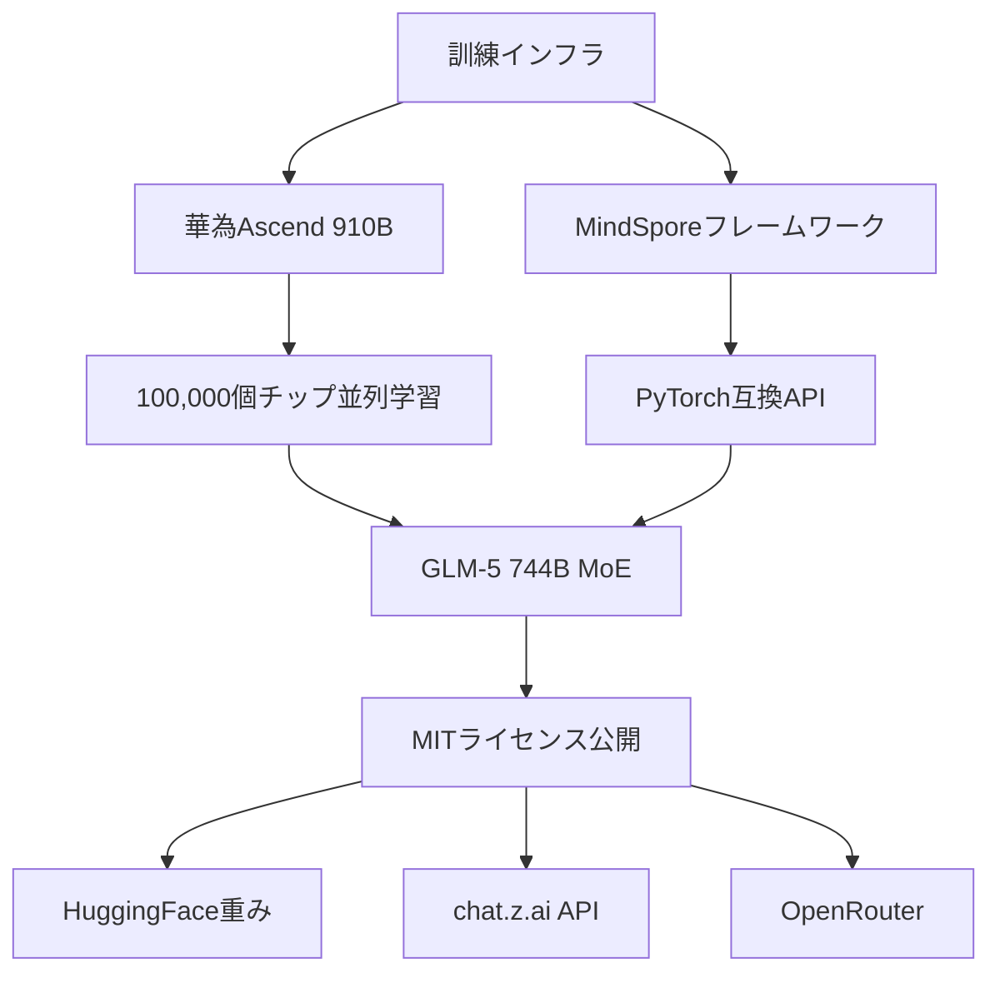
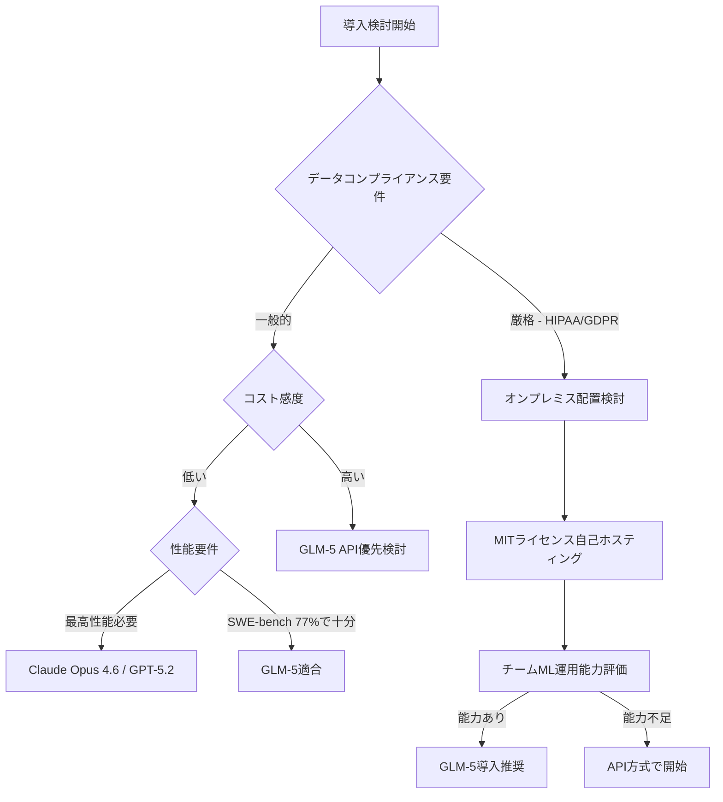

2026年2月13日、智谱AI(Zhipu AI)が744Bパラメータの<strong>GLM-5</strong>をMITライセンスで公開しました。単なるモデルローンチではなく、この発表はエンタープライズAI戦略の根本的な見直しを要求する重大事件です。NVIDIA GPUなしに華為Ascendチップのみで訓練された最前線級モデルが、完全な商用自由性(MITライセンス)とともに登場したということは、何を意味するのでしょうか。

Engineering Manager、VPoE、CTO観点からGLM-5を分析し、実質的なエンタープライズ導入戦略を導き出してみます。

## GLM-5の核心仕様

### 技術アーキテクチャ

GLM-5は<strong>MoE(Mixture of Experts)アーキテクチャ</strong>を採用しました。総744Bパラメータのうち、実際の推論時には40Bのみが活性化されます。これはGPT-4級の性能をはるかに低い推論コストで提供できる核心的な設計です。

| 項目 | 数値 |
|------|------|
| 総パラメータ数 | 744B |
| アクティブパラメータ数 | 40B (推論時) |
| コンテキストウィンドウ | 200K トークン |
| 訓練トークン数 | 28.5T |
| 訓練ハードウェア | 華為Ascend 910B (100,000個) |
| 訓練フレームワーク | MindSpore |
| ライセンス | MIT |

### ベンチマーク性能

```
SWE-bench Verified:   77.8%  (Claude Opus 4.6: 80.9%)
BrowseComp:           75.9
Humanity's Last Exam: 50.4%
Vending-Bench 2:      オープンソース1位
MCP-Atlas:            オープンソース1位
```

SWE-benchではClaude Opus 4.6(80.9%)の96%レベルを達成しました。これがオープンソース、MITライセンスモデルであるという点において、業界の勢力図が変わります。

## 「NVIDIA なしフロンティアAI」— 何が特別なのか

GLM-5は、たった1つのNVIDIA GPUも使用していません。100,000個の華為Ascend 910Bチップとプレゼンスピア フレームワークで訓練されました。



この事実の意味:

1. <strong>米国輸出規制の回避</strong>: BIS(産業安全保障局)のAIチップ輸出規制が中国のAI開発を阻止できなかったことを実証
2. <strong>NVIDIA依存脱却</strong>: フロンティア級AIをCUDA生態系なしで実装可能
3. <strong>代替ハードウェア生態系</strong>: Ascend + MindSporeが実質的な競争スタックとして浮上

EM/CTO観点からすると、これは単なる地政学的な話ではありません。将来のAIインフラベンダー多様化戦略の実質的な根拠となります。

## エンタープライズ観点: コスト分析

### API価格比較 (2026年3月基準)

| モデル | 入力 (1M トークン) | 出力 (1M トークン) | 相対コスト |
|------|-------------------|-------------------|---------|
| Claude Opus 4.6 | $5.00 | $25.00 | 基準 (1.0x) |
| GPT-5.2 | $6.00 | $24.00 | 約 1.0x |
| GLM-5 (API) | $1.00 | $3.20 | <strong>約 0.15x</strong> |

GLM-5 APIはClaude Opus 4.6と比べ、入力コストが5分の1、出力コストが約8分の1です。同等の性能でこのコスト差は、規模が大きくなるほど意思決定に決定的な影響を及ぼします。

### 自己ホスティング(Self-Hosting)シナリオ

MITライセンスであるため、企業がモデル重みを直接ダウンロードしてオンプレミスまたはプライベートクラウドに配置できます。データコンプライアンス(個人情報保護法、HIPAA、GDPR等)要件が厳格な業界では、これはゲームチェンジャーです。

```python
# HuggingFaceからGLM-5重みをダウンロード例
from huggingface_hub import snapshot_download

# MITライセンス — 商用利用、修正、再配布すべて許可
model_path = snapshot_download(
    repo_id="zai-org/GLM-5",
    local_dir="./glm5-weights"
)

# OpenAI互換APIインターフェース (既存コード移行が容易)
import openai

client = openai.OpenAI(
    base_url="https://open.bigmodel.cn/api/paas/v4/",
    api_key="YOUR_API_KEY"
)

response = client.chat.completions.create(
    model="glm-5",
    messages=[
        {"role": "user", "content": "PythonでREST API を作成してください"}
    ]
)
print(response.choices[0].message.content)
```

## EM/CTOの導入判断基準

すべてのワークロードに対してGLM-5が正解ではありません。以下の基準で導入可能性を評価してください。



### 適合するケース

<strong>GLM-5が有利な状況:</strong>

- コーディングアシスタント、コードレビュー、テスト自動化 (SWE-bench 77.8%)
- 大規模ドキュメント処理 (200K コンテキスト)
- データ規定が厳格な金融・医療・法律分野 (MIT 自己ホスティング)
- スタートアップ・SMBのコスト最適化 (Claude Opus 比 85% 削減)
- AIエージェント・MCPワークフロー (MCP-Atlas オープンソース1位)

<strong>既存商用モデルがより適している状況:</strong>

- マルチモーダル能力が核心的なタスク (Gemini 3.1 Pro 優位)
- 最新情報検索が重要な実時間RAG
- 複雑な推論の極限性能が必要 (Claude Opus 4.6 引き続き優位)
- 華為Ascendベースのモデルに対する組織的拒否感

## 実践導入ロードマップ

### 1段階: パイロット評価 (2〜4週)

```bash
# OpenRouterを通じた高速テスト
curl https://openrouter.ai/api/v1/chat/completions \
  -H "Authorization: Bearer $OPENROUTER_API_KEY" \
  -H "Content-Type: application/json" \
  -d '{
    "model": "zhipuai/glm-5",
    "messages": [{"role": "user", "content": "現在のコードベースレビュータスク"}]
  }'
```

現在Claude OpusまたはGPT-5.2を使用しているワークロードの10〜20%をGLM-5でテストし、品質とコストを比較します。

### 2段階: ワークロード分類 (4〜8週)

| ワークロードタイプ | 推奨モデル | 理由 |
|----------------|---------|------|
| コード生成・レビュー | <strong>GLM-5</strong> | SWE-bench 77.8%、コスト効率 |
| 複雑な推論 | Claude Opus 4.6 | 上位性能 |
| 大容量ドキュメント処理 | <strong>GLM-5</strong> | 200K コンテキスト、低コスト |
| 実時間検索RAG | Gemini 3.1 Pro | 最新情報統合 |
| AIエージェント | <strong>GLM-5</strong> | MCP-Atlas 1位 |

### 3段階: コスト最適化 (継続)

```python
# モデルルーターパターン: タスク複雑度に応じて自動ルーティング
def route_to_model(task_complexity: str, data_sensitivity: str) -> str:
    if data_sensitivity == "high":
        return "glm-5-local"  # オンプレミスGLM-5
    elif task_complexity == "simple":
        return "glm-5-api"    # API コスト最小化
    else:
        return "claude-opus-4-6"  # 複雑な推論維持

# 期待コスト削減
monthly_tokens = 100_000_000  # 月1億トークン
claude_cost = monthly_tokens / 1_000_000 * 15  # 平均 $15/1M
glm5_cost = monthly_tokens / 1_000_000 * 2.1   # 平均 $2.1/1M
print(f"月間削減額: ${claude_cost - glm5_cost:.0f}")  # 約 $1,290 削減
```

## 地政学的リスク考慮

GLM-5導入時は、以下のリスクも合わせて検討する必要があります。

<strong>主要なリスク:</strong>
- 将来米国政府が中国AIモデル使用を制限する規定を導入する可能性
- Zhipu AIが上場企業(上海A株)であり、中国法律の影響を受ける
- MITライセンスですが、華為インフラベースであるという供給チェーン透明性の問題

<strong>リスク緩和戦略:</strong>
- ビジネスクリティカル機能にはグローバルベンダー(Anthropic、OpenAI)とGLM-5を並行実施
- 核心的な意思決定AIには監査可能性(Auditability)が確保されたモデルを維持
- 定期的に規制環境をモニタリング

## 結論: EM/CTOにとってGLM-5が意味すること

GLM-5の登場は、3つのメッセージを伝えます。

1. <strong>オープンソースフロンティアモデル時代</strong>: 商用モデルとオープンソースの性能格差が事実上消滅
2. <strong>NVIDIA独占の亀裂</strong>: 華為Ascendで744B訓練が可能であることを証明
3. <strong>コスト圧迫の解消</strong>: Claude Opus比85% コスト削減が可能なMITモデルの存在

今すぐすべてのワークロードをGLM-5に転換する必要はありません。しかし、コーディングアシスタント、AIエージェント、大容量ドキュメント処理のような領域では、即座にパイロットを開始する十分な根拠が生まれました。

AI導入で「最高性能モデルを使う」ことが正解ではない時代が来ました。今はワークロード別に最適なモデルをインテリジェントにルーティングすることが、エンジニアリングリーダーの核心的能力になります。

## 参考資料

- [GLM-5 HuggingFace モデルカード](https://huggingface.co/zai-org/GLM-5)
- [GLM-5 公式APIガイド (Apiyi)](https://help.apiyi.com/en/glm-5-api-guide-744b-moe-agent-tutorial-en.html)
- [China's GLM-5 Rivals GPT-5.2 on Zero Nvidia Silicon (Awesome Agents)](https://awesomeagents.ai/news/glm-5-china-frontier-model-huawei-chips/)
- [GLM-5: China's First Public AI Company Ships a Frontier Model (Medium)](https://medium.com/@mlabonne/glm-5-chinas-first-public-ai-company-ships-a-frontier-model-a068cecb74e3)
- [Zhipu AI 公式サイト](https://www.zhipuai.cn/en)
