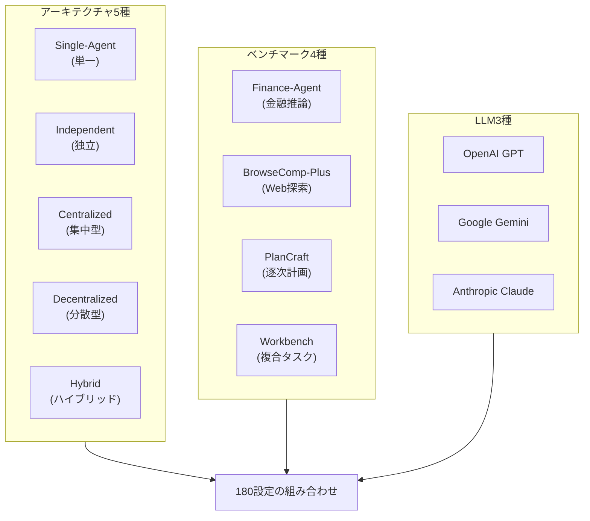
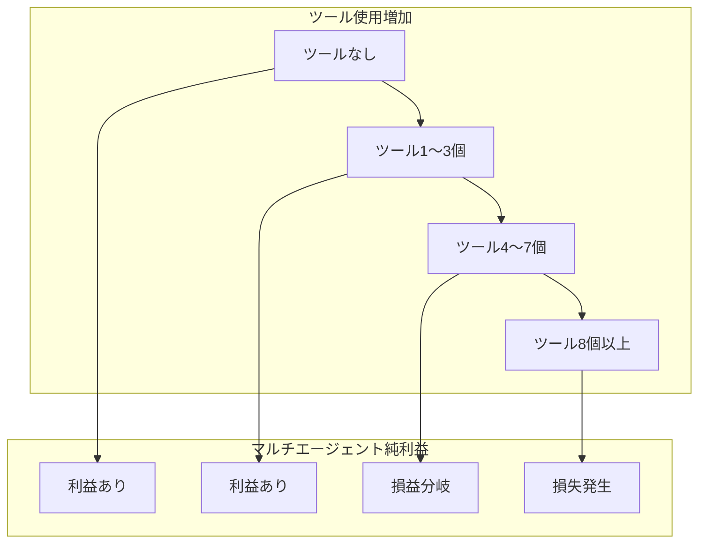

## 「エージェントを増やすほど性能が上がる」— この信念は間違っていた

2026年のAIエージェント分野には、ほぼドグマのように固まった信念があります。<strong>「より多くのエージェントを並列投入すれば性能が上がる。」</strong> LangGraph、CrewAI、AutoGenといったマルチエージェントフレームワークが爆発的に成長し、企業がエージェントチーム構成への投資を増やしているのも、この前提の上に成り立っています。

Google Researchはこの前提を正面から覆す研究を発表しました。<strong>「Towards a Science of Scaling Agent Systems」</strong>論文は、180のエージェント設定を定量評価した結果、<strong>マルチエージェントシステムが特定条件下で単一エージェントと比較して最大70%性能を低下させる</strong>という事実を発見しました。

Engineering Managerの立場から、この研究は単なる学術的興味ではありません。エージェントアーキテクチャ設計の意思決定の根拠が変わる話です。

---

## 実験設計：180設定、5つのアーキテクチャ、4つのベンチマーク

研究チームは系統的な対照実験を設計しました。既存のエージェント研究が特定タスクで特定アーキテクチャの性能を報告するに留まっていたのに対し、この研究は<strong>タスクタイプ × アーキテクチャ × LLMの組み合わせ</strong>をすべて交差検証しました。



**5つのアーキテクチャ分類：**

- <strong>Single-Agent</strong>：単一モデルがすべての作業を実行（ベースライン）
- <strong>Independent</strong>：複数エージェントが相互通信なしに独立実行
- <strong>Centralized</strong>：オーケストレーターエージェントがサブエージェントを指揮（Hub-and-Spoke）
- <strong>Decentralized</strong>：エージェント同士がP2P方式で相互通信
- <strong>Hybrid</strong>：集中型と分散型の混合構造

評価にはOpenAI GPT、Google Gemini、Anthropic Claudeの3つのLLMファミリーが使用され、特定モデルに偏らない結果を導き出しました。

---

## 核心的発見1：並列化可能 vs 逐次 — 結果が正反対になる

研究で最も衝撃的な発見は、<strong>タスクタイプによってマルチエージェントの効果が完全に逆転する</strong>ということです。

### 並列化可能タスク：+81%向上

金融推論（Finance-Agent）ベンチマークのように<strong>独立して分解可能なタスク</strong>では、集中型マルチエージェントが単一エージェント比81%の性能向上を示しました。複数エージェントがそれぞれ異なる金融データセグメントを並列分析して結果を統合する構造が実際に効果的でした。

### 逐次タスク：-39%〜-70%低下

しかしPlanCraftのように<strong>厳格な順序依存性のある作業</strong>では、すべてのマルチエージェント変形が例外なく性能を低下させました。

```
単一エージェントベースライン：100%（基準）

Independent マルチエージェント：-39%
Centralized マルチエージェント：-52%
Decentralized マルチエージェント：-61%
Hybrid マルチエージェント：-70%
```

研究チームはこの現象を<strong>「認知予算の断片化（Cognitive Budget Fragmentation）」</strong>と命名しました。逐次推論には全体のコンテキストを維持しながら段階的に考える連続的な認知リソースが必要なのですが、マルチエージェント調整オーバーヘッドがこのリソースを消費してしまうというわけです。

---

## 核心的発見2：エラー増幅 — 独立エージェントは17.2倍危険

マルチエージェントシステムのもう一つの危険は<strong>エラー伝播</strong>です。研究結果によると、エージェントアーキテクチャのタイプによってエラー増幅率が大きく異なりました。

| アーキテクチャ | エラー増幅倍率 |
|-------------|------------|
| Single-Agent | 1.0×（基準） |
| Independent マルチエージェント | <strong>17.2×</strong> |
| Centralized マルチエージェント | <strong>4.4×</strong> |

Independentアーキテクチャでエラーが17.2倍増幅する理由は明確です。あるエージェントの誤った出力が別のエージェントの入力となり、そのエラーが次の段階に伝播する<strong>エラーカスケード</strong>が発生するためです。集中型構造ではオーケストレーターがある程度フィルタリング役を果たし、4.4倍に増幅を抑制しました。

これはプロダクションエージェントシステム設計において重要な示唆です。<strong>独立並列実行が性能面で有利に見える場面でも、エラー耐性面で深刻なリスクを伴う</strong>ことを意味します。

---

## 核心的発見3：ツール依存度が高いほどマルチエージェントのオーバーヘッドが増加

3番目の原則は<strong>「ツール-コーディネーション トレードオフ」</strong>です。API呼び出し、Webアクション、外部データ照会などツール使用が多いタスクほど、マルチエージェントの調整コストがメリットを超えるポイントが早く訪れます。



その理由は、各エージェントが独立してツールを呼び出す際に発生する<strong>コンテキスト同期コスト</strong>によるものです。エージェントAがAPIを呼び出した結果をエージェントBが知る必要がある場合、この情報を共有するプロセスでLLMコンテキストウィンドウと推論コストが急増します。

---

## 予測フレームワーク：87%の精度で最適アーキテクチャを決定する

この研究の実用的な核心は<strong>最適エージェントアーキテクチャを事前予測するモデル（R² = 0.513）</strong>です。9つの予測変数を入力すると、未知のタスクに対して87%の精度で最適アーキテクチャを推薦します。

**9つの予測変数：**

1. LLMベースの性能水準（単一エージェントベースライン）
2. タスク分解可能性スコア
3. 逐次依存性の程度
4. 必要なツール数
5. ツール呼び出し頻度
6. エージェント数
7. コーディネーション複雑度指数
8. エラー耐性要求水準
9. コンテキスト共有の必要性

実務でこのフレームワークを完全実装することは難しいですが、核心変数だけでも意思決定を大きく改善できます。

---

## Engineering Managerのための実践的判断基準

この研究をもとに、エージェントアーキテクチャ選択のための実用的なチェックリストを整理しました。

### 単一エージェントを使用すべき場合

```
✅ タスクが厳格な順序を要求するか？
   （例：コード分析 → リファクタリング → テスト → デプロイの順のみ可能）

✅ 全体のコンテキストを一貫して維持する必要があるか？
   （例：長文書の要約、複雑な推論チェーン）

✅ 各ステップの結果が次のステップの入力に強く依存するか？
   （例：前ステップの結果なしに次のステップは不可能）

✅ エラー耐性が重要でエラー伝播リスクを最小化すべきか？

→ 単一の強力なモデルを使用
```

### マルチエージェント（集中型）を使用すべき場合

```
✅ タスクが独立したサブタスクに分解可能か？
   （例：複数文書をそれぞれ分析後に統合）

✅ 並列処理による速度向上が必要か？

✅ 各サブタスクに特化した処理が必要か？
   （例：コードエージェント + ドキュメントエージェント + テストエージェント）

✅ エラー伝播を制御するオーケストレーターを設計できるか？

→ 集中型マルチエージェントを使用、Independentは避ける
```

### マルチエージェントを避けるべき場合

```
❌ 単一エージェントベースラインが既に〜45%以上の性能か？
   （性能飽和現象 — マルチエージェントの追加メリットなし）

❌ タスクに必要なツールが8個以上か？
   （ツール-コーディネーション トレードオフ超過）

❌ 逐次推論が必須のタスクか？
   （認知予算断片化のリスク）

→ 単一エージェントまたはシンプルな逐次パイプラインに置き換える
```

---

## 2026年エージェントエンジニアリングの新原則

この研究が提示する最も重要なメッセージは<strong>「エージェント数を増やすことは戦略ではない」</strong>ということです。マルチエージェントシステムは正しい条件では強力ですが、間違った条件では単一エージェントよりも著しく悪い結果をもたらす可能性があります。

LangChainのState of Agent Engineering 2026報告によると、すでに57%の組織がエージェントをプロダクションにデプロイしています。しかしデプロイの速さと同じくらい重要なのは、<strong>なぜ特定のアーキテクチャを選んだのか</strong>という定量的な根拠です。

Google Researchが提供した予測フレームワークは完璧ではありません（R² = 0.513）。しかし、これまで「感覚」や「トレンド」に依存していたエージェントアーキテクチャの決定に<strong>測定可能な変数と予測可能なロジック</strong>を導入したこと自体が大きな前進です。

Engineering Managerとして次のエージェントシステムを設計する際には、マルチエージェントを選ぶ前にこの問いを先に立てることをお勧めします：<strong>「このタスクは並列化可能か、それとも逐次的か？」</strong> その答えがアーキテクチャ決定の出発点となるべきです。

---

## 参考資料

- [Towards a Science of Scaling Agent Systems — Google Research Blog](https://research.google/blog/towards-a-science-of-scaling-agent-systems-when-and-why-agent-systems-work/)
- [arXiv論文：2512.08296](https://arxiv.org/abs/2512.08296)
- [Google Publishes Scaling Principles for Agentic Architectures — InfoQ (2026.03)](https://www.infoq.com/news/2026/03/google-multi-agent/)
- [State of Agent Engineering 2026 — LangChain](https://www.langchain.com/state-of-agent-engineering)
- [Stop Blindly Scaling Agents: A Reality Check from Google & MIT — Medium](https://evoailabs.medium.com/stop-blindly-scaling-agents-a-reality-check-from-google-mit-0cebc5127b1e)
