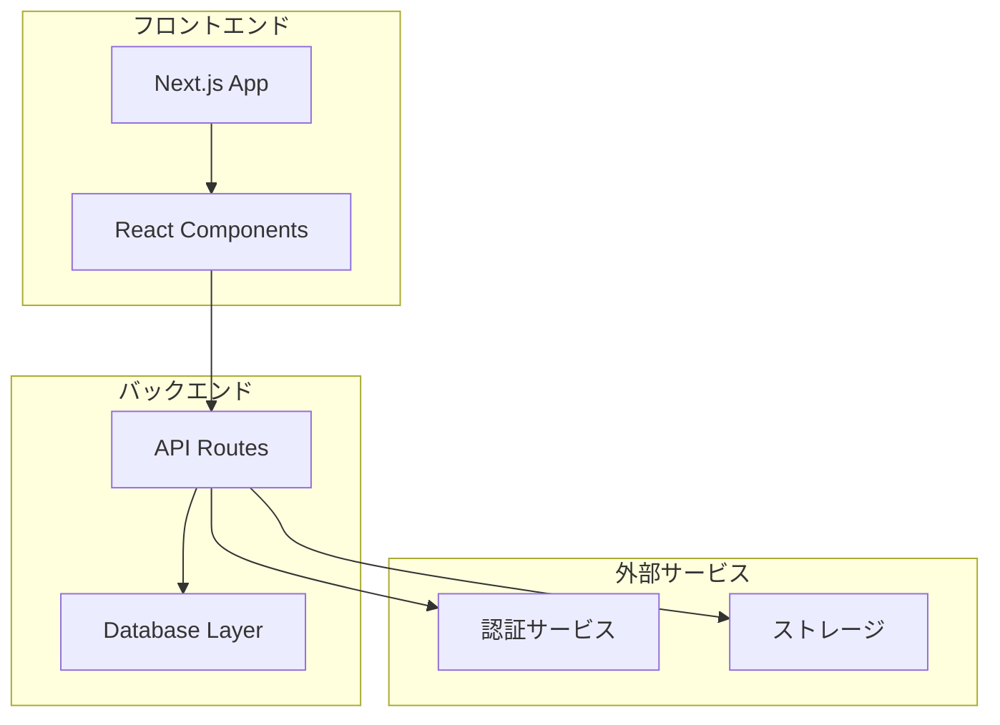
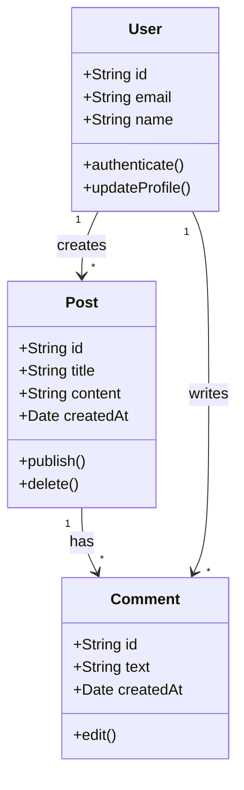
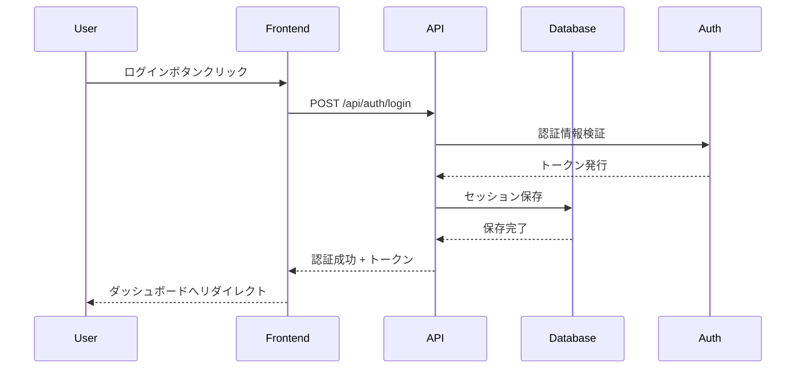

## はじめに

2025年11月13日、Googleは開発者向けの新しいツール<strong>Code Wiki</strong>をパブリックプレビューとして発表しました。Code Wikiは、AIを活用してコードベースを自動的にドキュメント化し、開発者がプロジェクトを素早く理解できるようにするプラットフォームです。

従来、大規模なコードベースを理解するには膨大な時間がかかりました。READMEを読み、コードを追いかけ、同僚に質問する必要がありました。Code Wikiは、このプロセスを劇的に効率化することを目指しています。

## Code Wikiとは

Code Wikiは、GitHubのパブリックリポジトリを自動的に分析し、構造化されたドキュメントを生成するサービスです。Googleの大規模言語モデル<strong>Gemini</strong>を基盤としており、コードの理解、説明、可視化をAIが自動で行います。

### 主な特徴

Code Wikiには以下の4つの主要機能があります：

1. <strong>自動更新される構造化Wiki</strong>
2. <strong>Geminiベースのチャットエージェント</strong>
3. <strong>ハイパーリンク付きコード参照</strong>
4. <strong>自動生成ダイアグラム</strong>

## 主要機能の詳細

### 1. 自動更新される構造化Wiki

Code Wikiは、リポジトリのコードを分析して、以下のような構造化されたドキュメントを自動生成します：

- プロジェクト概要
- アーキテクチャ説明
- 主要コンポーネントの解説
- APIリファレンス
- 依存関係の一覧

これらのドキュメントは、コードの変更に応じて自動的に更新されるため、常に最新の状態を維持できます。

### 2. Geminiベースのチャットエージェント

Code Wikiの最も強力な機能の一つが、AIチャットエージェントです。自然言語でコードについて質問でき、Geminiが適切な回答を生成します。

<strong>質問例：</strong>

- 「このプロジェクトの認証フローはどのように動作しますか？」
- 「データベース接続はどこで設定されていますか？」
- 「このAPIエンドポイントの入力バリデーションロジックを説明してください」
- 「テストカバレッジが低いファイルはどれですか？」

チャットエージェントは単なる検索ではなく、コードの文脈を理解した上で回答を生成するため、複雑な質問にも対応できます。

### 3. ハイパーリンク付きコード参照

生成されたドキュメント内のすべてのコード参照には、実際のソースコードへのハイパーリンクが付与されます。これにより：

- ドキュメントから直接コードにジャンプ可能
- 関連するファイル間のナビゲーションが容易
- コードの文脈を素早く把握

### 4. 自動生成ダイアグラム

Code Wikiは、コードから自動的に以下のダイアグラムを生成します：

#### アーキテクチャダイアグラム

システム全体の構造を可視化します：



#### クラスダイアグラム

オブジェクト指向設計の構造を表示します：



#### シーケンスダイアグラム

処理フローを時系列で表示します：



これらのダイアグラムは、コードの変更に応じて自動的に更新されます。

## Code Wikiの使い方

### ステップ1: Code Wikiにアクセス

ブラウザで [codewiki.google](https://codewiki.google) にアクセスします。

### ステップ2: リポジトリを検索

検索バーにGitHubリポジトリ名またはURLを入力します。例えば：

- `vercel/next.js`
- `facebook/react`
- `microsoft/vscode`

### ステップ3: Wikiを探索

リポジトリが選択されると、自動生成されたWikiページが表示されます。左側のナビゲーションから以下を確認できます：

- <strong>Overview</strong>: プロジェクト概要
- <strong>Architecture</strong>: アーキテクチャ説明
- <strong>Components</strong>: 主要コンポーネント
- <strong>APIs</strong>: API リファレンス
- <strong>Diagrams</strong>: 自動生成ダイアグラム

### ステップ4: チャットエージェントを使用

画面右下のチャットアイコンをクリックすると、AIエージェントとの対話が開始できます。質問は日本語でも英語でも可能です。

### ステップ5: ダイアグラムを確認

「Diagrams」セクションでは、自動生成された各種ダイアグラムを確認できます。ダイアグラムはインタラクティブで、ズームやパンが可能です。

## Gemini CLI拡張機能

Googleは、Code Wikiの機能を<strong>Gemini CLI</strong>にも拡張する予定です。これにより、ローカル環境からCode Wikiの機能を利用できるようになります。

### プライベートリポジトリサポート

現在、Code Wikiはパブリックリポジトリのみをサポートしていますが、<strong>プライベートリポジトリのサポートが近日公開予定</strong>です。

この機能を早期に利用したい場合は、[ウェイトリスト](https://codewiki.google/waitlist)に登録できます。プライベートリポジトリサポートが利用可能になった際に通知を受け取ることができます。

### 予定されている機能

- ローカルリポジトリの分析
- カスタムドキュメントテンプレート
- チーム向けコラボレーション機能
- CI/CDパイプラインとの統合

## 実践例: Next.jsプロジェクトの分析

実際にCode Wikiを使って、Next.jsの公式リポジトリを分析してみましょう。

### プロジェクト概要の確認

Code Wikiが生成したNext.jsの概要には以下が含まれます：

- Next.jsの主要機能（SSR、SSG、ISR）
- ファイルシステムベースのルーティング
- APIルートの仕組み
- 画像最適化コンポーネント

### アーキテクチャの理解

自動生成されたアーキテクチャダイアグラムを見ると、Next.jsの内部構造が一目でわかります：

- `packages/next`: コアパッケージ
- `packages/next-swc`: Rust製コンパイラ
- `packages/create-next-app`: CLIツール

### チャットでの質問例

```
Q: Next.jsのApp Routerでサーバーコンポーネントはどのように動作しますか？

A: サーバーコンポーネントは、サーバー上でのみレンダリングされるReactコンポーネントです。
   デフォルトでは、`app`ディレクトリ内のすべてのコンポーネントはサーバーコンポーネント
   として扱われます。クライアントコンポーネントにするには、ファイルの先頭に'use client'
   ディレクティブを追加します。

   関連コード: packages/next/src/server/app-render/create-server-components-renderer.tsx
```

## Code Wikiのメリットとデメリット

### メリット

<strong>1. オンボーディング時間の短縮</strong>

新しいプロジェクトに参加する開発者が、コードベースを理解するまでの時間を大幅に短縮できます。従来は数日〜数週間かかっていた作業が、数時間で完了する可能性があります。

<strong>2. ドキュメントの自動更新</strong>

手動でドキュメントを更新する必要がないため、コードとドキュメントの乖離を防げます。「ドキュメントが古い」という問題が解消されます。

<strong>3. インタラクティブな学習</strong>

チャットエージェントを使えば、疑問点をすぐに解消できます。従来の静的なドキュメントでは得られない、対話的な学習体験が可能です。

<strong>4. 視覚的な理解</strong>

自動生成されるダイアグラムにより、コードの構造を視覚的に把握できます。特に大規模プロジェクトでは、この機能が非常に役立ちます。

<strong>5. 無料で利用可能</strong>

パブリックプレビュー期間中は無料で利用できます。

### デメリット

<strong>1. パブリックリポジトリ限定（現時点）</strong>

プライベートリポジトリはまだサポートされていないため、企業の内部プロジェクトでは使用できません。ウェイトリストに登録して待つ必要があります。

<strong>2. 言語サポートの制限</strong>

すべてのプログラミング言語が均等にサポートされているわけではありません。JavaScript、TypeScript、Pythonなどの主要言語は良好ですが、マイナーな言語ではドキュメントの品質が低下する可能性があります。

<strong>3. AIの限界</strong>

AIが生成するドキュメントは常に正確とは限りません。特に複雑なビジネスロジックや、コードからは読み取れない設計意図については、誤った説明が生成される可能性があります。

<strong>4. プライバシーの懸念</strong>

コードをGoogleのサーバーに送信する必要があるため、機密性の高いプロジェクトでは使用しづらい場合があります。

<strong>5. カスタマイズの制限</strong>

現時点では、生成されるドキュメントのフォーマットやスタイルをカスタマイズする機能は限られています。

## 他のツールとの比較

Code Wikiは、既存のドキュメント生成ツールとどう違うのでしょうか？

| 機能 | Code Wiki | JSDoc/TSDoc | Swagger | GitHub Copilot |
|------|-----------|-------------|---------|----------------|
| 自動生成 | ○ | △ | △ | × |
| AIチャット | ○ | × | × | ○ |
| ダイアグラム | ○ | × | △ | × |
| リアルタイム更新 | ○ | × | × | - |
| プライベートリポ | 近日対応 | ○ | ○ | ○ |

Code Wikiの最大の差別化ポイントは、<strong>コードベース全体を理解した上でのAIチャット機能</strong>と<strong>自動ダイアグラム生成</strong>です。

## ベストプラクティス

Code Wikiを最大限に活用するためのヒントをご紹介します：

### 1. 明確な質問をする

チャットエージェントには、具体的で明確な質問をしましょう。

<strong>良い例：</strong>
- 「UserServiceクラスのauthenticateメソッドの戻り値は何ですか？」
- 「データベース接続のエラーハンドリングはどのファイルで行われていますか？」

<strong>悪い例：</strong>
- 「このコードについて教えて」
- 「バグはありますか？」

### 2. ダイアグラムを活用する

コードを読む前に、まずダイアグラムで全体像を把握しましょう。特にアーキテクチャダイアグラムは、システムの構造を理解するのに役立ちます。

### 3. ハイパーリンクを使う

ドキュメント内のハイパーリンクを積極的に活用して、関連するコードを確認しましょう。文脈を理解するのに役立ちます。

### 4. 定期的に確認する

Code Wikiは自動更新されますが、重要な変更後は内容を確認することをお勧めします。AIの解釈が正確かどうかをチェックしましょう。

## 今後の展望

Code Wikiはまだパブリックプレビュー段階ですが、Googleは以下の機能強化を予定しています：

- <strong>プライベートリポジトリサポート</strong>: 企業向けの重要機能
- <strong>より多くの言語サポート</strong>: Rust、Go、Kotlinなど
- <strong>カスタムダイアグラムタイプ</strong>: ERダイアグラム、フローチャートなど
- <strong>チームコラボレーション</strong>: 注釈、コメント、共有機能
- <strong>IDE統合</strong>: VS Code、IntelliJなどとの連携

## まとめ

Google Code Wikiは、AIを活用したコードドキュメント化の新しいアプローチを提供します。主な特徴をまとめると：

- <strong>自動ドキュメント生成</strong>: 手動更新の手間を削減
- <strong>AIチャットエージェント</strong>: 自然言語でコードについて質問
- <strong>自動ダイアグラム</strong>: アーキテクチャ、クラス、シーケンス図を自動生成
- <strong>ハイパーリンク</strong>: ドキュメントとコードをシームレスに接続

現時点ではパブリックリポジトリ限定ですが、プライベートリポジトリサポートが追加されれば、企業での活用も期待できます。

大規模なオープンソースプロジェクトに参加する際や、新しいフレームワークを学ぶ際に、Code Wikiは非常に有用なツールとなるでしょう。ぜひ [codewiki.google](https://codewiki.google) で試してみてください。

## 参考リンク

- [Code Wiki 公式サイト](https://codewiki.google)
- [プライベートリポジトリ ウェイトリスト](https://codewiki.google/waitlist)
- [Google Developer Blog](https://developers.googleblog.com)
