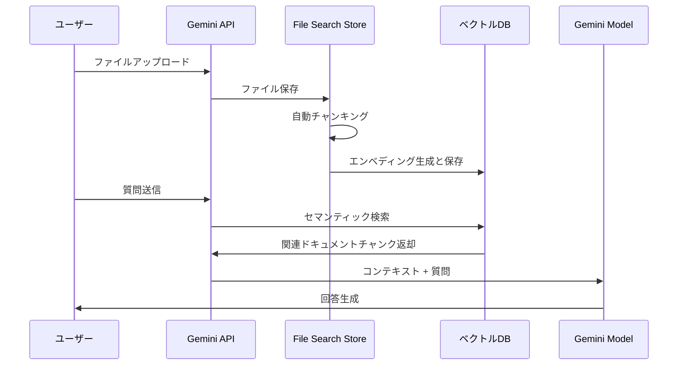

## 概要

2025年11月7日、Googleは開発者が長く待ち望んでいた革新的な機能を発表しました。それが<strong>Gemini API File Search Tool</strong>です。これは単なるファイル検索機能ではありません。フルマネージドRAG (Retrieval Augmented Generation) システムとして、ドキュメントベースのQ&Aシステム構築の常識を完全に変えるゲームチェンジャーです。

### なぜ革新的なのか？

従来、RAGシステムを構築するには次のような複雑な作業が必要でした:

- 📄 <strong>ドキュメントチャンキング</strong>: ドキュメントを適切なサイズに分割
- 🔢 <strong>エンベディング生成</strong>: 各チャンクをベクトルに変換
- 🗄️ <strong>ベクトルデータベース管理</strong>: Pinecone、Weaviate、Chromaなどの設定と運用
- 🔍 <strong>検索パイプライン最適化</strong>: 類似度検索アルゴリズムのチューニング
- 🔄 <strong>継続的なメンテナンス</strong>: インフラのスケーリング、コスト管理

<strong>File Search Toolはこのすべてのプロセスを自動化</strong>し、開発者がファイルをアップロードしてすぐに質問できるようにしました。OpenAIのAssistants APIが行ったように、しかしGoogleの強力なGeminiモデルと共にです。

## File Search Toolとは？

### RAGの基本概念

RAG (Retrieval Augmented Generation) は、LLMの限界を克服するための技術です。LLMは学習データまでしか知らず、最新情報や特定企業の内部ドキュメントは知りません。RAGは次のようにこの問題を解決します:


### 従来の方法 vs File Search Tool

<strong>従来の方法</strong> (自前構築):
```python
# 1. ドキュメント読み込み
documents = load_documents("./docs")

# 2. チャンキング
chunks = text_splitter.split(documents)

# 3. エンベディング生成
embeddings = openai_embeddings.embed(chunks)

# 4. ベクトルDB保存
vector_db = Pinecone.from_documents(chunks, embeddings)

# 5. 検索と生成
relevant_docs = vector_db.similarity_search(query)
answer = llm.generate(query + relevant_docs)
```

<strong>File Search Tool</strong> (フルマネージド):
```python
# 1. Store作成
store = client.file_search_stores.create(
    config={'display_name': 'My Knowledge Base'}
)

# 2. ファイルアップロード (チャンキング、エンベディング自動)
operation = client.file_search_stores.upload_to_file_search_store(
    file='document.pdf',
    file_search_store_name=store.name
)

# 3. 質問 (検索、生成自動)
response = client.models.generate_content(
    model="gemini-2.5-flash",
    contents="ドキュメントの主な内容は何ですか？",
    config=types.GenerateContentConfig(
        tools=[
            types.Tool(
                file_search=types.FileSearch(
                    file_search_store_names=[store.name]
                )
            )
        ]
    )
)
```

違いが分かりますか？<strong>コードの量が60%以上削減され、複雑な設定が完全になくなりました。</strong>

## 動作原理

File Search Toolは3つの主要ステップで動作します:



### ステップ1: インデックス化

ファイルをアップロードすると、次が自動実行されます:

- <strong>自動チャンキング</strong>: ドキュメントを意味単位で分割 (デフォルト400トークン)
- <strong>エンベディング生成</strong>: 各チャンクを768次元ベクトルに変換
- <strong>ベクトル保存</strong>: Googleのマネージドベクトルデータベースに保存

### ステップ2: 検索

ユーザーが質問すると:

- 質問をエンベディングに変換 (無料!)
- コサイン類似度で最も関連性の高いチャンクを検索
- Top-K個のドキュメント断片を選択

### ステップ3: 生成

Geminiモデルが回答を生成:

- 検索されたドキュメントをコンテキストとして使用
- 元の質問と組み合わせてプロンプト構成
- 正確で根拠のある回答を生成
- 引用元情報を含む

## 主要機能

### 1. 広範なファイル形式サポート

File Search Toolは300種類以上のファイル形式をサポートします:

<strong>アプリケーションファイル (100+ 種類)</strong>:
- PDF、DOCX、XLSX、PPTX
- JSON、XML、YAML
- SQL、SQLiteデータベース

<strong>テキストファイル (200+ 種類)</strong>:
- Markdown、HTML、CSV
- Python、JavaScript、Java、Goなど全ての主要プログラミング言語
- ログファイル、設定ファイル

### 2. カスタムチャンキング設定

ドキュメント特性に合わせてチャンキング戦略を調整できます:

```python
config={
    'chunking_config': {
        'white_space_config': {
            'max_tokens_per_chunk': 400,  # チャンクあたりの最大トークン数
            'max_overlap_tokens': 40       # チャンク間のオーバーラップ
        }
    }
}
```

<strong>推奨設定</strong>:
- <strong>FAQドキュメント</strong>: 200トークン (短く簡潔な情報)
- <strong>技術マニュアル</strong>: 400トークン (デフォルト設定、バランス)
- <strong>研究論文</strong>: 600トークン (長いコンテキストが必要)

### 3. メタデータフィルタリング

ファイルアップロード時にメタデータを追加して検索を精緻化できます:

```python
custom_metadata=[
    {"key": "author", "string_value": "Robert Graves"},
    {"key": "department", "string_value": "Engineering"},
    {"key": "year", "numeric_value": 2025},
    {"key": "is_public", "boolean_value": True}
]
```

### 4. 引用元追跡

回答の信頼性を高めるために出典を確認できます:

```python
response = client.models.generate_content(...)

if hasattr(response, 'grounding_metadata'):
    for citation in response.grounding_metadata.citations:
        print(f"出典: {citation.source}")
        print(f"引用テキスト: {citation.text}")
```

### 5. 無料クエリエンベディング

通常、エンベディング生成にはコストがかかりますが、File Search Toolは<strong>クエリエンベディングを無料で提供</strong>します。インデックス化時のみコストが発生します ($0.15 / 1M トークン)。

## 実践: Pythonで始める

実際にFile Search Toolを使ってみましょう。このチュートリアルは私が直接テストしたコードです。

### 環境設定

<strong>uvを使用 (推奨)</strong>:

```bash
# uvインストール (まだの場合)
curl -LsSf https://astral.sh/uv/install.sh | sh

# プロジェクトディレクトリ作成
mkdir gemini-file-search-demo
cd gemini-file-search-demo

# Python仮想環境作成
uv venv
source .venv/bin/activate  # Unix/macOS
# .venv\Scripts\activate  # Windows

# 必要なパッケージインストール
uv pip install google-genai streamlit python-dotenv
```

<strong>従来のpipを使用</strong>:

```bash
# Python 3.9+ 必要
python --version

# パッケージインストール
pip install google-genai streamlit python-dotenv
```

### API キー取得

1. [Google AI Studio](https://aistudio.google.com) にアクセス
2. 左メニューから "Get API key" を選択
3. "Create API key" ボタンをクリック
4. API キーをコピー

<strong>.envファイル作成</strong>:

```bash
GEMINI_API_KEY=your-api-key-here
```

### 基本サンプルコード

完全に動作する例です:

```python
import os
import time
from google import genai
from google.genai import types
from dotenv import load_dotenv

# 環境変数読み込み
load_dotenv()

# クライアント初期化
client = genai.Client()

# 1. File Search Store作成
print("Store作成中...")
store = client.file_search_stores.create(
    config={'display_name': 'My First Knowledge Base'}
)
print(f"✓ Store作成完了: {store.name}")

# 2. ファイルアップロード
print("\nファイルアップロード中...")
operation = client.file_search_stores.upload_to_file_search_store(
    file='document.pdf',  # 実際のファイルパスに変更
    file_search_store_name=store.name,
    config={
        'display_name': 'Sample Document',
        'chunking_config': {
            'white_space_config': {
                'max_tokens_per_chunk': 400,
                'max_overlap_tokens': 40
            }
        }
    }
)

# 3. アップロード完了待ち
while not operation.done:
    print("インデックス化中...")
    time.sleep(5)
    operation = client.operations.get(operation)

print("✓ ファイルアップロード完了")

# 4. 質問
print("\n質問処理中...")
response = client.models.generate_content(
    model="gemini-2.5-flash",
    contents="このドキュメントの主な内容を3つにまとめてください。",
    config=types.GenerateContentConfig(
        tools=[
            types.Tool(
                file_search=types.FileSearch(
                    file_search_store_names=[store.name]
                )
            )
        ],
        temperature=0.2
    )
)

print("\n=== 回答 ===")
print(response.text)

# 5. 引用元確認
if hasattr(response, 'grounding_metadata'):
    print("\n=== 出典 ===")
    for idx, citation in enumerate(response.grounding_metadata.citations, 1):
        print(f"{idx}. {citation.source}")
```

## Streamlit Webアプリデモ

私が実際に実装してテストしたWebインターフェースです。`uv run python -m streamlit run web_app.py` コマンドで実行できます。

### Webアプリ構造

完全な実装コードは長いため、主要部分を抜粋します:

```python
import streamlit as st
from google import genai
from google.genai import types
import time
import os
import uuid

# ページ設定
st.set_page_config(
    page_title="Gemini File Search",
    page_icon="🔍",
    layout="wide"
)

# セッション状態初期化
if "client" not in st.session_state:
    st.session_state.client = None
if "store" not in st.session_state:
    st.session_state.store = None
if "chat_history" not in st.session_state:
    st.session_state.chat_history = []

# クライアント初期化関数
def initialize_client(api_key):
    try:
        os.environ["GEMINI_API_KEY"] = api_key
        client = genai.Client()
        return client, None
    except Exception as e:
        return None, str(e)

# ファイルアップロード関数
def upload_file(client, file, store_name):
    try:
        # 一時ファイル作成
        file_ext = os.path.splitext(file.name)[1]
        temp_file = f"temp_{uuid.uuid4().hex}{file_ext}"

        with open(temp_file, "wb") as f:
            f.write(file.getbuffer())

        # アップロード
        operation = client.file_search_stores.upload_to_file_search_store(
            file=temp_file,
            file_search_store_name=store_name,
            config={
                "display_name": file.name,
                "chunking_config": {
                    "white_space_config": {
                        "max_tokens_per_chunk": 400,
                        "max_overlap_tokens": 40
                    }
                }
            }
        )

        # 完了待ち
        while not operation.done:
            time.sleep(2)
            operation = client.operations.get(operation)

        # 一時ファイル削除
        if os.path.exists(temp_file):
            os.remove(temp_file)

        return True, None

    except Exception as e:
        return False, str(e)

# クエリ関数
def query_store(client, question, store_name):
    try:
        response = client.models.generate_content(
            model="gemini-2.5-flash",
            contents=question,
            config=types.GenerateContentConfig(
                tools=[
                    types.Tool(
                        file_search=types.FileSearch(
                            file_search_store_names=[store_name]
                        )
                    )
                ],
                temperature=0.2
            )
        )

        # 引用情報抽出
        citations = []
        if hasattr(response, "grounding_metadata") and response.grounding_metadata:
            if hasattr(response.grounding_metadata, "citations"):
                for citation in response.grounding_metadata.citations:
                    citations.append({
                        "source": getattr(citation, "source", "N/A"),
                        "text": getattr(citation, "text", "")[:100]
                    })

        return response.text, citations, None

    except Exception as e:
        return None, None, str(e)

# UI構成
st.title("🔍 Gemini File Search")
st.markdown("Google Gemini APIのFile Search Toolを使用したドキュメント検索とQ&Aシステム")

# サイドバー - 設定
with st.sidebar:
    st.header("⚙️ 設定")

    api_key = st.text_input(
        "Gemini API Key",
        type="password",
        value=os.getenv("GEMINI_API_KEY", ""),
        help="Google AI Studioで発行されたAPIキー"
    )

    if api_key and not st.session_state.client:
        client, error = initialize_client(api_key)
        if client:
            st.session_state.client = client
            st.success("✓ クライアント初期化完了")
        else:
            st.error(f"初期化失敗: {error}")

    # Store管理
    if st.session_state.client:
        st.header("📁 Store管理")

        new_store_name = st.text_input("Store名", value="My Knowledge Base")
        if st.button("作成"):
            store = client.file_search_stores.create(
                config={"display_name": new_store_name}
            )
            st.session_state.store = store
            st.success(f"✓ Store作成: {store.name}")
            st.rerun()

# タブで機能分離
tab1, tab2 = st.tabs(["💬 Q&A", "📤 ファイルアップロード"])

# Q&Aタブ
with tab1:
    st.header("質疑応答")

    # チャット履歴表示
    for chat in st.session_state.chat_history:
        with st.chat_message("user"):
            st.write(chat["question"])

        with st.chat_message("assistant"):
            st.write(chat["answer"])

            if chat.get("citations"):
                with st.expander("📚 引用元"):
                    for i, citation in enumerate(chat["citations"], 1):
                        st.markdown(f"**{i}. {citation['source']}**")
                        st.text(f"   {citation['text']}...")

    # 質問入力
    question = st.chat_input("質問を入力してください...")

    if question:
        with st.chat_message("user"):
            st.write(question)

        with st.chat_message("assistant"):
            with st.spinner("回答生成中..."):
                answer, citations, error = query_store(
                    st.session_state.client,
                    question,
                    st.session_state.store.name
                )

                if answer:
                    st.write(answer)

                    if citations:
                        with st.expander("📚 引用元"):
                            for i, citation in enumerate(citations, 1):
                                st.markdown(f"**{i}. {citation['source']}**")
                                st.text(f"   {citation['text']}...")

                    # 履歴に追加
                    st.session_state.chat_history.append({
                        "question": question,
                        "answer": answer,
                        "citations": citations
                    })
                else:
                    st.error(f"エラー: {error}")

# ファイルアップロードタブ
with tab2:
    st.header("ファイルアップロード")

    uploaded_files = st.file_uploader(
        "ファイルを選択",
        accept_multiple_files=True,
        type=["pdf", "txt", "docx", "md", "csv"],
        help="PDF、TXT、DOCX、Markdown、CSVファイルをアップロード可能"
    )

    if uploaded_files and st.button("アップロード開始", type="primary"):
        progress_bar = st.progress(0)

        for i, file in enumerate(uploaded_files):
            success, error = upload_file(
                st.session_state.client,
                file,
                st.session_state.store.name
            )

            if success:
                st.success(f"✓ {file.name}")
            else:
                st.error(f"✗ {file.name}: {error}")

            progress_bar.progress((i + 1) / len(uploaded_files))

        st.rerun()
```

### 実行方法

```bash
# Streamlit実行
uv run python -m streamlit run web_app.py

# または従来の方式
streamlit run web_app.py
```

ブラウザで`http://localhost:8501`にアクセスすると、次のインターフェースが表示されます:

### 実際の実装画面

<strong>1. メイン画面とStore作成</strong>


左サイドバーでGemini API キーを入力し、Storeを作成できます。Store名を入力して「generation」ボタンをクリックすると、新しいFile Search Storeが作成されます。

<strong>2. ファイルアップロードインターフェース</strong>


「File Upload」タブで複数のファイルを同時に選択してアップロードできます。PDF、TXT、DOCX、Markdown、CSVなど、さまざまな形式に対応しています。

<strong>3. Q&Aインターフェース</strong>


「Q&A」タブでアップロードした文書について自然言語で質問できます。チャット形式で会話が進み、引用元も一緒に表示されます。

<strong>4. Store管理とファイルリスト</strong>


現在選択されているStoreの情報とアップロードされたファイルリストを確認できます。

<strong>5. Q&A結果の例</strong>


実際の質問に対する回答が表示され、回答の根拠となった文書の出所を確認できます。

### 主要機能
- ✅ APIキー設定とクライアント初期化
- ✅ File Search Storeの作成と管理
- ✅ ファイルアップロード (複数ファイル同時対応)
- ✅ 対話型Q&A (チャットインターフェース)
- ✅ 引用元表示
- ✅ アップロード進捗表示

## 既存ソリューションとの比較

### OpenAI Assistants File Search vs Gemini File Search

| 特徴 | OpenAI Assistants | Gemini File Search |
|------|-------------------|-------------------|
| <strong>サポートファイル形式</strong> | 20+ 種類 | 300+ 種類 |
| <strong>最大ファイルサイズ</strong> | 512MB | 100MB |
| <strong>無料クエリエンベディング</strong> | ✗ | ✓ |
| <strong>チャンキングカスタマイズ</strong> | 限定的 | 詳細な制御 |
| <strong>メタデータフィルタリング</strong> | ✓ | ✓ (今後強化予定) |
| <strong>価格 (インデックス化)</strong> | $0.10 / GB/日 | $0.15 / 1M トークン |
| <strong>モデル性能</strong> | GPT-4 Turbo | Gemini 2.5 Pro/Flash |

### LangChain + Vector DB vs マネージドRAG

| 側面 | 自前構築 (LangChain) | Gemini File Search |
|------|---------------------|-------------------|
| <strong>設定の複雑さ</strong> | 高い (チャンキング、エンベディング、ベクトルDB設定) | 低い (ファイルアップロードのみ) |
| <strong>開発時間</strong> | 数日〜数週間 | 数分 |
| <strong>メンテナンス</strong> | 継続的な管理が必要 | Googleが管理 |
| <strong>スケーリング</strong> | 手動スケーリング | 自動スケーリング |
| <strong>コスト予測</strong> | 複雑 (インフラ + 運用) | 明確 (使用量ベース) |
| <strong>カスタマイズ</strong> | 完全な制御 | 限定的な制御 |
| <strong>初期コスト</strong> | 高い (学習曲線) | 低い (即座に開始) |

### いつ何を使うべきか？

<strong>Gemini File Searchを選択</strong>:
- ✅ 迅速なプロトタイピングとMVP開発
- ✅ 小規模〜中規模のドキュメント検索システム
- ✅ 開発リソースが限られている場合
- ✅ インフラ管理を最小化したい場合

<strong>自前構築を検討</strong>:
- ✅ 完全な制御とカスタマイズが必要な場合
- ✅ 特殊なエンベディングモデルが必要な場合
- ✅ オンプレミス展開が必須の場合
- ✅ 極めて大規模なドキュメント (数百GB以上)

## 実践活用事例

### 1. カスタマーサポートシステム

<strong>シナリオ</strong>: SaaS製品のFAQと技術ドキュメントを基に24/7自動応答システム構築

```python
# Store作成
support_store = client.file_search_stores.create(
    config={'display_name': 'Customer Support KB'}
)

# FAQドキュメントアップロード (短いチャンク使用)
faq_files = ['general_faq.pdf', 'technical_faq.pdf', 'billing_faq.pdf']

for faq in faq_files:
    operation = client.file_search_stores.upload_to_file_search_store(
        file=faq,
        file_search_store_name=support_store.name,
        config={
            'chunking_config': {
                'white_space_config': {
                    'max_tokens_per_chunk': 200,  # FAQは短い回答
                    'max_overlap_tokens': 20
                }
            }
        }
    )
    # 完了待ち...

# 顧客質問処理
def answer_customer(question):
    response = client.models.generate_content(
        model="gemini-2.5-flash",
        contents=f"""顧客の質問: {question}

        上記の質問について、FAQドキュメントを参照して次の形式で回答してください:
        1. 簡潔で明確な回答
        2. 関連ドキュメントリンク (あれば)
        3. 追加サポートが必要な場合の案内
        """,
        config=types.GenerateContentConfig(
            tools=[
                types.Tool(
                    file_search=types.FileSearch(
                        file_search_store_names=[support_store.name]
                    )
                )
            ],
            temperature=0.2  # 一貫した回答
        )
    )
    return response.text
```

<strong>期待される効果</strong>:
- 📉 カスタマーサポートチケット30〜50%削減
- ⚡ 平均応答時間 数時間 → 数秒
- 💰 年間数百万円の人件費削減

### 2. 研究論文分析

<strong>シナリオ</strong>: 特定のトピックについて数十編の論文をアップロードし総合分析

```python
# 研究Store作成
research_store = client.file_search_stores.create(
    config={'display_name': 'AI Research Papers 2024-2025'}
)

# 論文フォルダからPDF一括アップロード
import os
papers_dir = './papers'
pdf_files = [f for f in os.listdir(papers_dir) if f.endswith('.pdf')]

for pdf in pdf_files:
    operation = client.file_search_stores.upload_to_file_search_store(
        file=os.path.join(papers_dir, pdf),
        file_search_store_name=research_store.name,
        config={
            'display_name': pdf,
            'chunking_config': {
                'white_space_config': {
                    'max_tokens_per_chunk': 600,  # 論文は長いコンテキスト
                    'max_overlap_tokens': 60
                }
            },
            'custom_metadata': [
                {'key': 'type', 'string_value': 'research_paper'},
                {'key': 'year', 'numeric_value': 2025}
            ]
        }
    )
    # 完了待ち...

# 文献レビュークエリ
def literature_review(topic):
    prompt = f"""
    トピック: {topic}

    アップロードされた研究論文を分析して以下を提供してください:

    1. <strong>研究動向</strong>: このトピックの最近の研究の流れ
    2. <strong>主要な方法論</strong>: 各論文で使用されたアプローチ
    3. <strong>共通点と相違点</strong>: 研究間の比較分析
    4. <strong>研究ギャップ</strong>: まだ扱われていない領域
    5. <strong>今後の方向性</strong>: 提案される研究トピック

    各項目について関連論文を引用してください。
    """

    response = client.models.generate_content(
        model="gemini-2.5-pro",  # 複雑な分析はProモデル
        contents=prompt,
        config=types.GenerateContentConfig(
            tools=[
                types.Tool(
                    file_search=types.FileSearch(
                        file_search_store_names=[research_store.name]
                    )
                )
            ],
            temperature=0.3
        )
    )
    return response.text

# 使用
review = literature_review("Transformerアーキテクチャの効率性改善")
print(review)
```

<strong>期待される効果</strong>:
- 📚 数十編の論文を数分で分析
- 🔍 隠れたパターンとトレンドの発見
- 📝 文献レビュー作成時間80%短縮

### 3. 企業知識管理

<strong>シナリオ</strong>: 部門別ドキュメントを統合管理し全社検索システム構築

```python
# 部門別Store作成
departments = ['Engineering', 'Marketing', 'Sales', 'HR']
stores = {}

for dept in departments:
    store = client.file_search_stores.create(
        config={'display_name': f'{dept} Knowledge Base'}
    )
    stores[dept] = store

# 統合検索関数
def search_company_knowledge(question, departments=None):
    """全社または特定部門検索"""
    if departments is None:
        departments = list(stores.keys())

    store_names = [stores[dept].name for dept in departments]

    response = client.models.generate_content(
        model="gemini-2.5-flash",
        contents=question,
        config=types.GenerateContentConfig(
            tools=[
                types.Tool(
                    file_search=types.FileSearch(
                        file_search_store_names=store_names
                    )
                )
            ]
        )
    )
    return response.text

# 使用例
# 全社検索
answer = search_company_knowledge("新入社員のオンボーディング手順は?")

# 特定部門のみ検索
answer = search_company_knowledge(
    "API認証方法は?",
    departments=['Engineering']
)
```

<strong>期待される効果</strong>:
- 🚀 情報検索時間90%短縮
- 🤝 部門間の知識共有活性化
- 💡 隠れた情報資産の活用

## 制限事項と考慮事項

### 現在の制限

| 項目 | 制限 | 備考 |
|------|------|------|
| <strong>最大ファイルサイズ</strong> | 100 MB/ファイル | 大容量ファイルは分割が必要 |
| <strong>ストレージサイズ (Free)</strong> | 1 GB | プロダクションは有料プラン推奨 |
| <strong>ストレージサイズ (Tier 1)</strong> | 10 GB | 中小企業に適合 |
| <strong>ストレージサイズ (Tier 2)</strong> | 100 GB | 大企業に適合 |
| <strong>ストレージサイズ (Tier 3)</strong> | 1 TB | 大規模システム |
| <strong>推奨Store サイズ</strong> | < 20 GB | 検索性能最適化 |
| <strong>元ファイル保存</strong> | 48時間 | 以降自動削除 |

### 注意事項

<strong>1. データセキュリティ</strong>

- ファイルはGoogleサーバーに保存されます
- 機密データは暗号化またはマスキング後にアップロード
- データ主権の問題 (特定国の法的要件) の確認が必要

<strong>2. コスト管理</strong>

```python
# インデックス化コスト予測
ドキュメントサイズ = 10 MB
トークン数 ≈ 10 MB × 1,000,000 bytes × 0.3 tokens/byte ≈ 3M トークン
コスト = 3M × $0.15 / 1M = $0.45
```

- 重複インデックス化の防止 (同じファイルの再アップロードに注意)
- 定期的なStoreクリーンアップ (不要なファイル削除)
- キャッシング戦略の検討 (よくある質問はキャッシュ)

<strong>3. レート制限</strong>

API呼び出しには速度制限があります:
- 分あたりのリクエスト数制限
- 同時アップロード制限
- 指数バックオフリトライの実装を推奨

```python
import time
from google.api_core.exceptions import ResourceExhausted

def upload_with_retry(file, store_name, max_retries=3):
    for attempt in range(max_retries):
        try:
            operation = client.file_search_stores.upload_to_file_search_store(
                file=file,
                file_search_store_name=store_name
            )
            return operation

        except ResourceExhausted:
            if attempt < max_retries - 1:
                wait_time = 2 ** attempt  # 指数バックオフ: 1s, 2s, 4s
                print(f"レート制限。{wait_time}秒後に再試行...")
                time.sleep(wait_time)
            else:
                raise
```

### 価格ポリシー

| 項目 | 価格 | 説明 |
|------|------|------|
| <strong>インデックス化 (エンベディング生成)</strong> | $0.15 / 1M トークン | ファイルアップロード時に1回 |
| <strong>ストレージ</strong> | 無料 | 現在無料 (将来変更の可能性) |
| <strong>クエリエンベディング</strong> | 無料 | 質問時のエンベディング生成無料 |
| <strong>検索されたトークン</strong> | 標準料金 | コンテキストとして使用されたトークン |
| <strong>生成トークン</strong> | 標準料金 | Geminiモデル出力 |

<strong>コスト削減のヒント</strong>:
- 同じファイルの再インデックス化を防ぐ
- 不要なドキュメントの整理
- 適切なチャンクサイズ設定 (小さすぎるとコスト増加)
- クエリ結果のキャッシング

## まとめ

Google Gemini File Search Toolは、RAGシステム構築の<strong>パラダイムシフト</strong>です。複雑なベクトルデータベース設定、エンベディング管理、インフラスケーリングなどの悩みなしに、ファイルをアップロードしてすぐに質問できるようになりました。

### 主要な利点まとめ

✅ <strong>参入障壁の撤廃</strong>: 数日かかっていた設定が数分に短縮
✅ <strong>コスト効率性</strong>: インフラコストなしで使用量ベース課金
✅ <strong>自動スケーリング</strong>: Googleがインフラ管理
✅ <strong>広範なサポート</strong>: 300+ ファイル形式
✅ <strong>高品質</strong>: Geminiモデルの強力な理解力

### 今後の展望

Googleは次のような改善をロードマップに含めています:

- 🔍 高度なメタデータフィルタリングクエリ
- 📊 マルチモーダル検索 (画像、表認識)
- ⚡ リアルタイムドキュメント更新 (増分インデックス化)
- 🌐 より多くのファイル形式サポート

### 今すぐ始めよう！

RAGシステムが必要なら、もう複雑な構築プロセスを経る必要はありません。Google AI StudioでAPIキーを取得し、5分で最初のドキュメント検索システムを作成してみましょう。

```bash
# 今すぐ始める
pip install google-genai
export GEMINI_API_KEY="your-key"
python your_first_rag.py
```

<strong>ドキュメント検索の未来は、すでにここにあります。🚀</strong>

## 参考資料

### 公式ドキュメント
- [File Search 公式ドキュメント](https://ai.google.dev/gemini-api/docs/file-search)
- [File Search API リファレンス](https://ai.google.dev/api/file-search/file-search-stores)
- [Google AI Studio](https://aistudio.google.com)
- [公式発表ブログ](https://blog.google/technology/developers/file-search-gemini-api/)

### 関連技術
- [RAG 概念論文](https://arxiv.org/abs/2005.11401)
- [Semantic Search 理解](https://en.wikipedia.org/wiki/Semantic_search)
- [Vector Databases ガイド](https://www.pinecone.io/learn/vector-database/)

### GitHub リポジトリ
- [Gemini API Python SDK](https://github.com/google-gemini/generative-ai-python)
- [サンプルコード集](https://github.com/google-gemini/cookbook)
