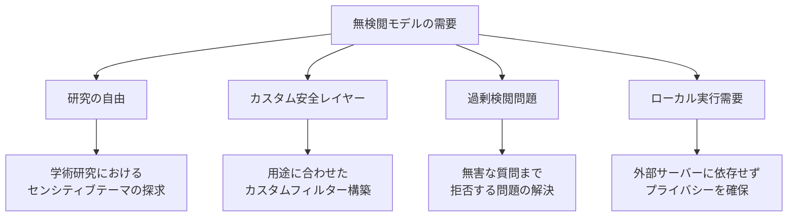
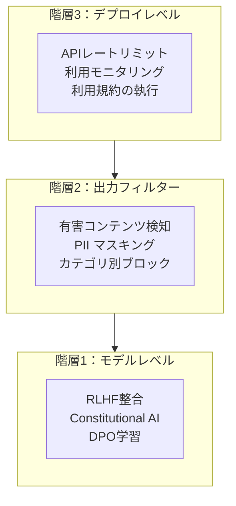
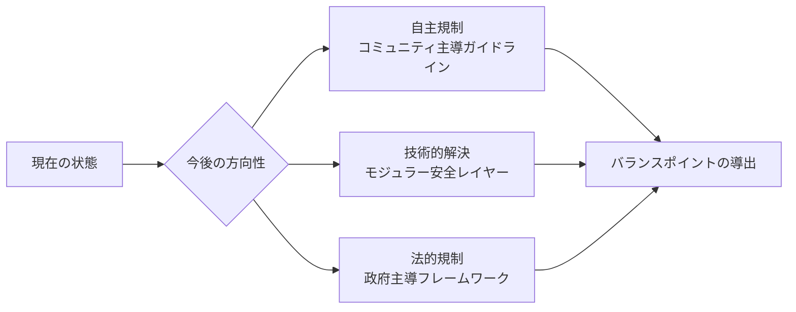

## 概要

2026年初頭、オープンソースLLMコミュニティに大きな波紋が広がりました。<strong>GPT-OSS 120B Uncensored</strong>という1,170億パラメータ規模の無検閲モデルが公開され、Reddit r/LocalLLaMAを中心に「AIの検閲撤廃」に関する激しい議論が繰り広げられています。

この記事では、GPT-OSS 120B Uncensoredの技術的背景、無検閲モデルが注目される理由、そしてセーフティガードレールをめぐる技術・倫理的な争点を総合的に考察します。

## GPT-OSS 120B Uncensoredとは？

### モデル概要

GPT-OSS 120B Uncensoredは、既存の大規模言語モデルから<strong>安全性フィルター（safety filter）</strong>と<strong>RLHFベースの検閲レイヤー</strong>を除去したオープンソースモデルです。

- <strong>パラメータ数</strong>：約1,170億（117B）
- <strong>公開プラットフォーム</strong>：Hugging Face
- <strong>派生モデル</strong>：Aggressive版など、多様なコミュニティファインチューニング版が存在
- <strong>フォーマット</strong>：bf16、GGUFなど、各種量子化バージョンを提供

### 「Uncensored」の意味

ここでの「Uncensored」とは、単に暴言やアダルトコンテンツを許可するという意味ではありません。技術的には以下の変更を含みます：

```
既存モデルの安全性パイプライン：
[ユーザー入力] → [入力フィルター] → [モデル推論] → [出力フィルター] → [RLHF整合] → [応答]

Uncensoredモデル：
[ユーザー入力] → [モデル推論] → [応答]
```

- <strong>RLHF整合の除去</strong>：「有用だが有害でない」方向への強制調整を解除
- <strong>拒否パターンの除去</strong>：「申し訳ございませんが、そのリクエストにはお応えできません」系の拒否応答学習データを除去
- <strong>トピック制限の解除</strong>：医療、法律、化学など機密領域での応答制限を緩和

## なぜ無検閲モデルが注目されるのか？

### 研究者・開発者の視点



r/LocalLLaMAコミュニティで無検閲モデルが支持される主な理由は以下の通りです：

1. <strong>過剰検閲（Over-censorship）問題</strong>：商用モデルが無害なリクエストまで拒否するケースが頻発
2. <strong>研究目的</strong>：バイアス研究、レッドチームテストなどで制限のないモデルが必須
3. <strong>カスタム安全レイヤー</strong>：ベースモデル上に独自の安全装置を構築したい需要
4. <strong>プライバシー</strong>：機密データを外部APIに送らずローカルで処理

### コミュニティの反応

Reddit r/LocalLLaMAで224ポイント以上を記録し、オープンソースAIコミュニティの強い関心を示しました。主な意見は大きく二つに分かれています：

- <strong>支持派</strong>：「AIモデルは道具に過ぎず、ユーザーが責任を取るべきだ」
- <strong>懸念派</strong>：「無制限のアクセスは悪用リスクを高める」

## セーフティガードレール論争

### 技術的観点：ガードレールの実装方式

現在のLLMにおける安全性確保方法は、大きく3つの階層に分かれます：



無検閲モデルは<strong>階層1（モデルレベル）</strong>の制約を除去したものです。研究者にとっては「原材料」にアクセスするようなものですが、同時にすべての安全装置が取り払われた状態でもあります。

### 倫理的観点：オープンソースAIのジレンマ

無検閲モデルの公開は、オープンソースAIの根本的なジレンマを露呈しています：

| 争点 | オープンソース自由擁護 | 安全性優先主張 |
|------|----------------------|---------------|
| <strong>アクセス性</strong> | すべての人に平等なAIアクセス権 | 悪意あるユーザーにも武器を提供 |
| <strong>透明性</strong> | 検閲基準の不透明性を解消 | 透明性と無制限は別の問題 |
| <strong>イノベーション</strong> | 制限のない実験がイノベーションを促進 | イノベーションの代償が社会的害悪であってはならない |
| <strong>責任</strong> | ツール製作者ではなくユーザーの責任 | 予見可能な害悪に対する提供者の責任 |

### 規制動向

主要国のAI規制の動きもこの議論に影響を与えています：

- <strong>EU AI Act</strong>：高リスクAIシステムへの義務付け、オープンソース例外条項を議論中
- <strong>米国</strong>：行政命令ベースの自主規制を強調、オープンソースモデル規制には消極的
- <strong>日本</strong>：AI事業者ガイドラインによるソフト規制アプローチ
- <strong>中国</strong>：生成AI管理規定による強力な事前規制

## 技術的考慮事項

### ローカル実行環境

120B規模のモデルをローカルで実行するための最小要件：

```bash
# bf16フル精度：約240GB VRAM必要
# GGUF Q4量子化：約60-70GB VRAM/RAM
# GGUF Q2量子化：約35-40GB VRAM/RAM

# 一般的な実行環境例（llama.cpp）
./llama-server \
  --model gpt-oss-120b-uncensored-Q4_K_M.gguf \
  --ctx-size 4096 \
  --n-gpu-layers 80 \
  --host 0.0.0.0 \
  --port 8080
```

### 独自の安全レイヤー構築

無検閲モデルを活用しながら安全性を確保するアプローチ：

```python
# 無検閲モデル上にカスタム安全レイヤーを構築するパターン
class CustomSafetyLayer:
    def __init__(self, base_model, safety_config):
        self.model = base_model
        self.config = safety_config
        self.classifier = self._load_safety_classifier()
    
    def generate(self, prompt: str) -> str:
        # 入力検証（ドメイン別カスタムルール）
        if self._check_input(prompt):
            response = self.model.generate(prompt)
            # 出力フィルタリング（用途別カスタムルール）
            return self._filter_output(response)
        return self._get_rejection_message(prompt)
    
    def _check_input(self, prompt: str) -> bool:
        # 組織/用途に合わせたカスタム入力検証
        risk_score = self.classifier.evaluate(prompt)
        return risk_score < self.config.threshold
```

このアプローチの利点は、<strong>用途に最適化された安全装置</strong>を構築できることです。医療用チャットボットには医療関連ルールを、教育用には教育関連ルールを適用できます。

## オープンソースAIの将来の方向性

無検閲モデルの論争は、単純な「検閲 vs 自由」を超えて、オープンソースAIエコシステムのガバナンス問題へと拡大しています。



最も有力な方向性は<strong>モジュラー安全アーキテクチャ</strong>です：
- ベースモデルは制限なく公開
- 安全レイヤーを別モジュールとして提供
- 用途に応じて適切な安全レベルを選択
- デプロイ環境での責任を明確化

## 結論

GPT-OSS 120B Uncensoredの登場は、オープンソースAIコミュニティが直面する根本的な問いを突きつけています：<strong>「技術の自由と安全は両立できるのか？」</strong>

主な示唆をまとめると：

1. <strong>無検閲モデル自体は中立的なツール</strong>：研究、カスタム安全レイヤー構築などの正当な用途が存在
2. <strong>過剰検閲は実在する問題</strong>：商用モデルの過度な拒否が無検閲需要を促進
3. <strong>モジュラー安全アプローチが解答</strong>：ベースモデルと安全レイヤーの分離が最も現実的
4. <strong>コミュニティガバナンスが必要</strong>：法規制だけではオープンソースエコシステムの制御は困難
5. <strong>継続的な議論が不可欠</strong>：技術の進化速度に合わせた倫理フレームワークのアップデート

オープンソースLLMが進化し続ける限り、この議論はAI開発の中核的なアジェンダとして残り続けるでしょう。

## 参考資料

- [Reddit r/LocalLLaMA — GPT-OSS 120B Uncensored関連ディスカッション](https://www.reddit.com/r/LocalLLaMA/)
- [Hugging Face — GPT-OSS 120B Uncensoredモデルページ](https://huggingface.co/models?search=uncensored+120b)
- [EU AI Act公式ドキュメント](https://artificialintelligenceact.eu/)
- [NIST AI Risk Management Framework](https://www.nist.gov/artificial-intelligence/ai-risk-management-framework)
